# Booking Management Page

<cite>
**Referenced Files in This Document**
- [backend/app/models/booking.py](file://backend/app/models/booking.py)
- [backend/app/schemas/booking.py](file://backend/app/schemas/booking.py)
- [backend/app/services/booking_service.py](file://backend/app/services/booking_service.py)
- [backend/app/api/v1/routes/bookings.py](file://backend/app/api/v1/routes/bookings.py)
- [frontend/src/views/TenantBookings.vue](file://frontend/src/views/TenantBookings.vue)
- [frontend/src/views/LandlordBookings.vue](file://frontend/src/views/LandlordBookings.vue)
- [frontend/src/components/BookingDateDialog.vue](file://frontend/src/components/BookingDateDialog.vue)
- [frontend/src/services/booking.ts](file://frontend/src/services/booking.ts)
- [frontend/src/types/booking.ts](file://frontend/src/types/booking.ts)
- [backend/app/models/payment.py](file://backend/app/models/payment.py)
- [backend/app/schemas/payment.py](file://backend/app/schemas/payment.py)
- [backend/app/api/v1/routes/payments.py](file://backend/app/api/v1/routes/payments.py)
- [backend/app/services/payment_service.py](file://backend/app/services/payment_service.py)
- [backend/app/models/contract.py](file://backend/app/models/contract.py)
- [backend/app/services/notification_service.py](file://backend/app/services/notification_service.py)
</cite>

## Table of Contents
1. Introduction
2. Project Structure
3. Core Components
4. Architecture Overview
5. Detailed Component Analysis
6. Dependency Analysis
7. Performance Considerations
8. Troubleshooting Guide
9. Conclusion

## Introduction
This document explains the Booking Management system, covering both the main booking list pages and individual booking detail flows. It documents the booking lifecycle, status tracking, workflow transitions, creation process, landlord approval workflows, tenant management interfaces, payment integration, contract generation triggers, notification systems, calendar/date selection UI, conflict handling, and administrative functions for managing rental agreements.

## Project Structure
The booking feature spans backend models, schemas, services, API routes, and frontend views/components:
- Backend:
  - Models define entities (Booking, Payment, Contract).
  - Schemas validate inputs/outputs.
  - Services encapsulate business logic (booking operations, notifications, payments).
  - API routes expose endpoints with role-based access control.
- Frontend:
  - Tenant and Landlord booking list pages.
  - Date selection dialog for scheduling viewings.
  - Service layer to call backend APIs.
  - TypeScript types mirroring backend schemas.

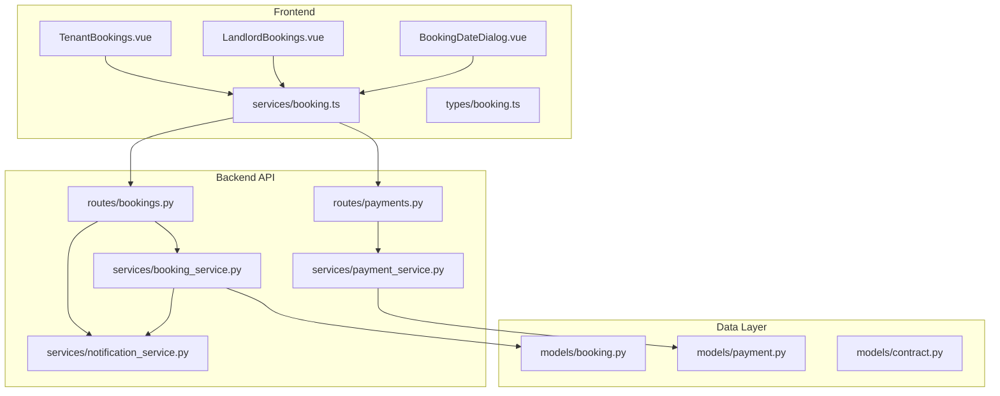

**Diagram sources**
- [frontend/src/views/TenantBookings.vue:1-200](file://frontend/src/views/TenantBookings.vue#L1-L200)
- [frontend/src/views/LandlordBookings.vue:1-164](file://frontend/src/views/LandlordBookings.vue#L1-L164)
- [frontend/src/components/BookingDateDialog.vue:1-305](file://frontend/src/components/BookingDateDialog.vue#L1-L305)
- [frontend/src/services/booking.ts:1-25](file://frontend/src/services/booking.ts#L1-L25)
- [frontend/src/types/booking.ts:1-42](file://frontend/src/types/booking.ts#L1-L42)
- [backend/app/api/v1/routes/bookings.py:1-112](file://backend/app/api/v1/routes/bookings.py#L1-L112)
- [backend/app/api/v1/routes/payments.py:1-85](file://backend/app/api/v1/routes/payments.py#L1-L85)
- [backend/app/services/booking_service.py:1-164](file://backend/app/services/booking_service.py#L1-L164)
- [backend/app/services/notification_service.py:1-164](file://backend/app/services/notification_service.py#L1-L164)
- [backend/app/services/payment_service.py:1-445](file://backend/app/services/payment_service.py#L1-L445)
- [backend/app/models/booking.py:1-47](file://backend/app/models/booking.py#L1-L47)
- [backend/app/models/payment.py:1-34](file://backend/app/models/payment.py#L1-L34)
- [backend/app/models/contract.py:1-37](file://backend/app/models/contract.py#L1-L37)

**Section sources**
- [backend/app/models/booking.py:1-47](file://backend/app/models/booking.py#L1-L47)
- [backend/app/schemas/booking.py:1-35](file://backend/app/schemas/booking.py#L1-L35)
- [backend/app/services/booking_service.py:1-164](file://backend/app/services/booking_service.py#L1-L164)
- [backend/app/api/v1/routes/bookings.py:1-112](file://backend/app/api/v1/routes/bookings.py#L1-L112)
- [frontend/src/views/TenantBookings.vue:1-200](file://frontend/src/views/TenantBookings.vue#L1-L200)
- [frontend/src/views/LandlordBookings.vue:1-164](file://frontend/src/views/LandlordBookings.vue#L1-L164)
- [frontend/src/components/BookingDateDialog.vue:1-305](file://frontend/src/components/BookingDateDialog.vue#L1-L305)
- [frontend/src/services/booking.ts:1-25](file://frontend/src/services/booking.ts#L1-L25)
- [frontend/src/types/booking.ts:1-42](file://frontend/src/types/booking.ts#L1-L42)
- [backend/app/models/payment.py:1-34](file://backend/app/models/payment.py#L1-L34)
- [backend/app/schemas/payment.py:1-23](file://backend/app/schemas/payment.py#L1-L23)
- [backend/app/api/v1/routes/payments.py:1-85](file://backend/app/api/v1/routes/payments.py#L1-L85)
- [backend/app/services/payment_service.py:1-445](file://backend/app/services/payment_service.py#L1-L445)
- [backend/app/models/contract.py:1-37](file://backend/app/models/contract.py#L1-L37)
- [backend/app/services/notification_service.py:1-164](file://backend/app/services/notification_service.py#L1-L164)

## Core Components
- Booking model and schema:
  - Defines statuses: pending, approved, rejected, cancelled, completed.
  - Tracks deposit/service fee fields and payment transaction linkage.
- Booking service:
  - Creates bookings with duplicate pending check.
  - Updates status and dispatches notifications per transition.
  - Lists bookings by tenant or landlord.
- API routes:
  - Create booking (tenant only), list bookings (role-aware), get booking (authorization), update status (landlord/admin), cancel (tenant/admin).
- Payment integration:
  - Payment model and schema.
  - Payment creation endpoint updates booking deposit status.
  - Callback endpoint simulates success and confirms deposit.
  - WeChat Pay V3 service provides order creation, callback parsing, query, close, refund.
- Notifications:
  - Notification service persists notifications and dispatches via channels (WeChat, SMS, Email).
- Contracts:
  - Contract model linked to booking; content/status tracked.

**Section sources**
- [backend/app/models/booking.py:1-47](file://backend/app/models/booking.py#L1-L47)
- [backend/app/schemas/booking.py:1-35](file://backend/app/schemas/booking.py#L1-L35)
- [backend/app/services/booking_service.py:1-164](file://backend/app/services/booking_service.py#L1-L164)
- [backend/app/api/v1/routes/bookings.py:1-112](file://backend/app/api/v1/routes/bookings.py#L1-L112)
- [backend/app/models/payment.py:1-34](file://backend/app/models/payment.py#L1-L34)
- [backend/app/schemas/payment.py:1-23](file://backend/app/schemas/payment.py#L1-L23)
- [backend/app/api/v1/routes/payments.py:1-85](file://backend/app/api/v1/routes/payments.py#L1-L85)
- [backend/app/services/payment_service.py:1-445](file://backend/app/services/payment_service.py#L1-L445)
- [backend/app/services/notification_service.py:1-164](file://backend/app/services/notification_service.py#L1-L164)
- [backend/app/models/contract.py:1-37](file://backend/app/models/contract.py#L1-L37)

## Architecture Overview
End-to-end flow from tenant initiation to landlord approval, payment, and notifications.

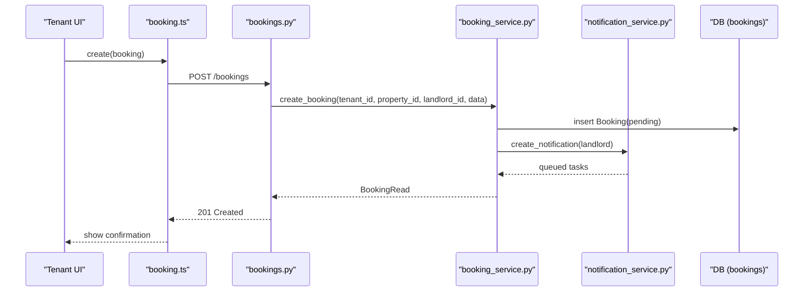

**Diagram sources**
- [frontend/src/services/booking.ts:1-25](file://frontend/src/services/booking.ts#L1-L25)
- [backend/app/api/v1/routes/bookings.py:14-41](file://backend/app/api/v1/routes/bookings.py#L14-L41)
- [backend/app/services/booking_service.py:15-79](file://backend/app/services/booking_service.py#L15-L79)
- [backend/app/services/notification_service.py:43-69](file://backend/app/services/notification_service.py#L43-L69)
- [backend/app/models/booking.py:18-47](file://backend/app/models/booking.py#L18-L47)

## Detailed Component Analysis

### Booking Lifecycle and Status Transitions
- States: pending → approved/rejected/cancelled → completed.
- Creation:
  - Duplicate pending check prevents multiple pending requests for same property.
  - Deposit and service fee computed from property details.
  - Landlord notified upon creation.
- Approval/Rejection:
  - Landlord-only endpoint updates status; tenant notified accordingly.
- Cancellation:
  - Tenant-only endpoint marks cancelled; landlord notified.
- Completion:
  - Triggered after payment confirmation and subsequent steps; notifies both parties.

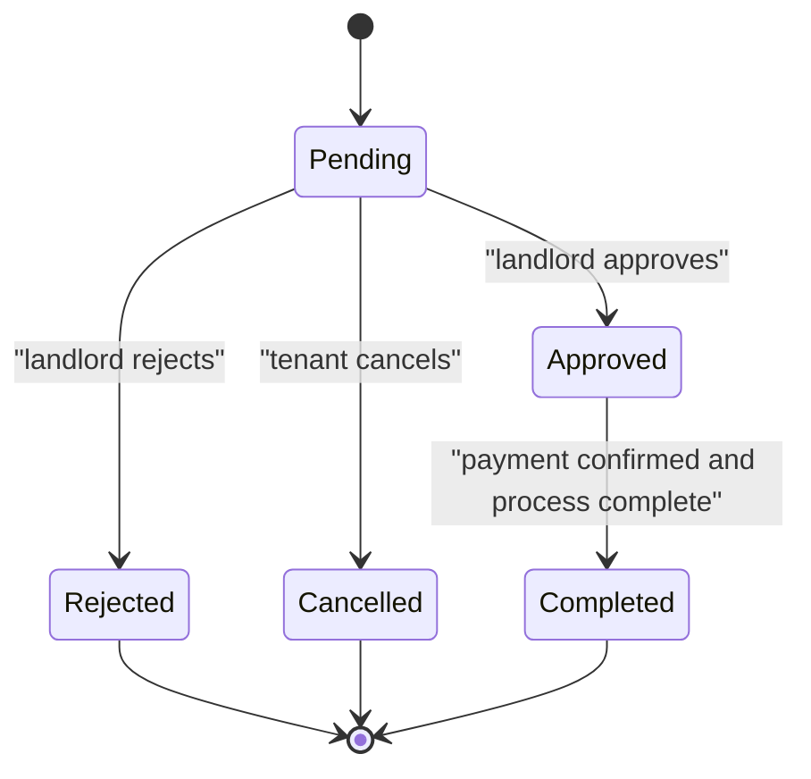

**Diagram sources**
- [backend/app/models/booking.py:10-16](file://backend/app/models/booking.py#L10-L16)
- [backend/app/services/booking_service.py:81-142](file://backend/app/services/booking_service.py#L81-L142)
- [backend/app/api/v1/routes/bookings.py:71-111](file://backend/app/api/v1/routes/bookings.py#L71-L111)

**Section sources**
- [backend/app/services/booking_service.py:15-142](file://backend/app/services/booking_service.py#L15-L142)
- [backend/app/api/v1/routes/bookings.py:14-111](file://backend/app/api/v1/routes/bookings.py#L14-L111)
- [backend/app/models/booking.py:10-47](file://backend/app/models/booking.py#L10-L47)

### Booking Creation Process
- Tenant initiates a booking request with optional message and scheduled date.
- Server validates property existence and enforces at least one of message or scheduled_date.
- Prevents duplicate pending bookings for the same property.
- Computes deposit amount and service fee based on property configuration.
- Persists booking and sends notifications to landlord and tenant.

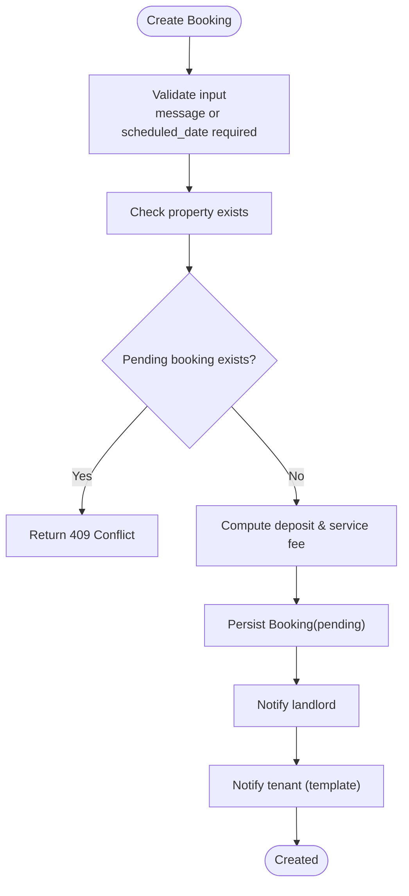

**Diagram sources**
- [backend/app/api/v1/routes/bookings.py:14-41](file://backend/app/api/v1/routes/bookings.py#L14-L41)
- [backend/app/services/booking_service.py:15-79](file://backend/app/services/booking_service.py#L15-L79)
- [backend/app/services/notification_service.py:43-69](file://backend/app/services/notification_service.py#L43-L69)

**Section sources**
- [backend/app/api/v1/routes/bookings.py:14-41](file://backend/app/api/v1/routes/bookings.py#L14-L41)
- [backend/app/services/booking_service.py:15-79](file://backend/app/services/booking_service.py#L15-L79)

### Landlord Approval Workflow
- Landlord lists their bookings and can approve or reject pending ones.
- Approving triggers tenant notification; rejecting also notifies tenant.
- Admin can perform actions across bookings.

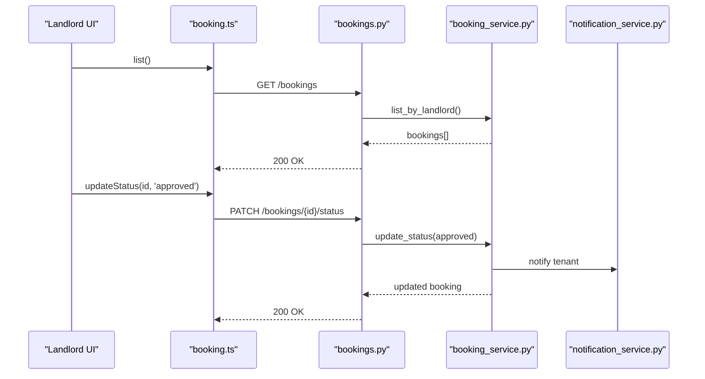

**Diagram sources**
- [frontend/src/views/LandlordBookings.vue:1-164](file://frontend/src/views/LandlordBookings.vue#L1-L164)
- [frontend/src/services/booking.ts:17-19](file://frontend/src/services/booking.ts#L17-L19)
- [backend/app/api/v1/routes/bookings.py:71-93](file://backend/app/api/v1/routes/bookings.py#L71-L93)
- [backend/app/services/booking_service.py:81-142](file://backend/app/services/booking_service.py#L81-L142)
- [backend/app/services/notification_service.py:43-69](file://backend/app/services/notification_service.py#L43-L69)

**Section sources**
- [frontend/src/views/LandlordBookings.vue:1-164](file://frontend/src/views/LandlordBookings.vue#L1-L164)
- [backend/app/api/v1/routes/bookings.py:71-93](file://backend/app/api/v1/routes/bookings.py#L71-L93)
- [backend/app/services/booking_service.py:81-142](file://backend/app/services/booking_service.py#L81-L142)

### Tenant Booking Management Interface
- Tenant view shows all bookings with status tags and actions.
- Actions:
  - Cancel pending bookings.
  - Proceed to confirm rent (payment) when pending or approved.
  - View property when completed.
- Filters out paid/confirmed deposits from this list.

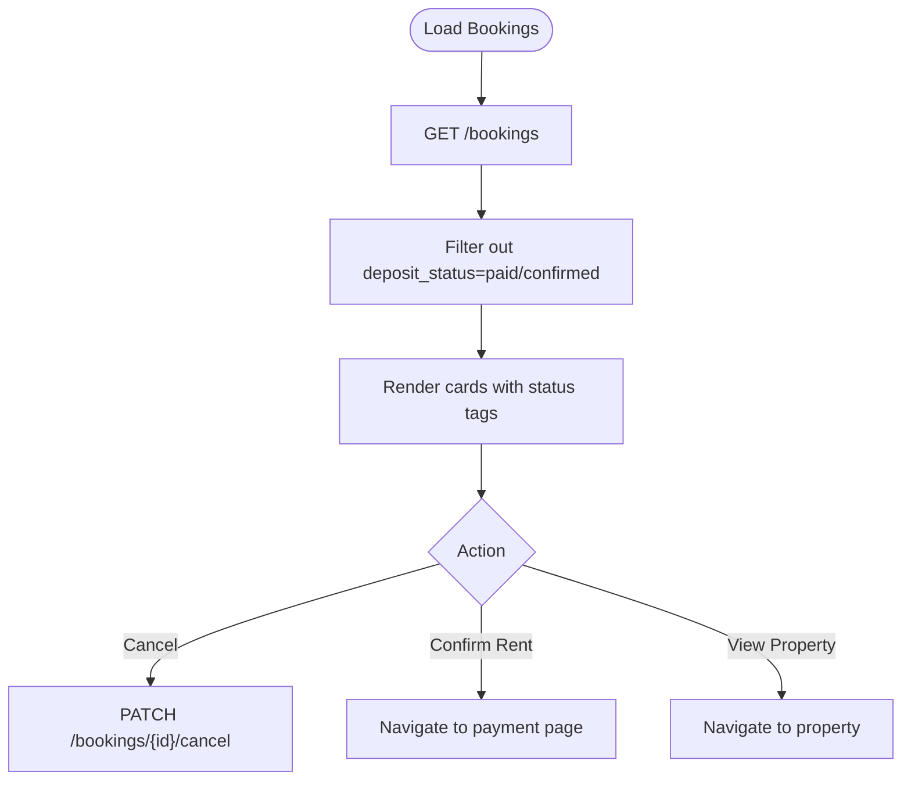

**Diagram sources**
- [frontend/src/views/TenantBookings.vue:84-109](file://frontend/src/views/TenantBookings.vue#L84-L109)
- [frontend/src/services/booking.ts:9-23](file://frontend/src/services/booking.ts#L9-L23)
- [backend/app/api/v1/routes/bookings.py:44-68](file://backend/app/api/v1/routes/bookings.py#L44-L68)

**Section sources**
- [frontend/src/views/TenantBookings.vue:1-200](file://frontend/src/views/TenantBookings.vue#L1-L200)
- [frontend/src/services/booking.ts:1-25](file://frontend/src/services/booking.ts#L1-L25)

### Payment Integration and Triggers
- Payment creation:
  - Tenant creates a payment record for an approved/pending booking.
  - Booking deposit_status set to "paid" and transaction ID recorded.
- Callback simulation:
  - Marks payment as success and sets deposit_status to "confirmed".
- WeChat Pay V3 service:
  - Provides JSAPI order creation, signature building, callback parsing, order queries, closing orders, and refunds.

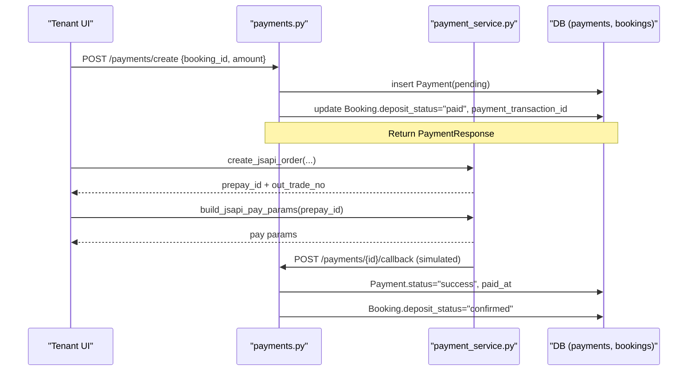

**Diagram sources**
- [backend/app/api/v1/routes/payments.py:15-69](file://backend/app/api/v1/routes/payments.py#L15-L69)
- [backend/app/services/payment_service.py:245-323](file://backend/app/services/payment_service.py#L245-L323)
- [backend/app/models/payment.py:11-34](file://backend/app/models/payment.py#L11-L34)

**Section sources**
- [backend/app/api/v1/routes/payments.py:15-85](file://backend/app/api/v1/routes/payments.py#L15-L85)
- [backend/app/services/payment_service.py:245-445](file://backend/app/services/payment_service.py#L245-L445)
- [backend/app/models/payment.py:11-34](file://backend/app/models/payment.py#L11-L34)

### Contract Generation Triggers
- Contract model is linked to booking and tracks content, status, signed timestamp, and file path.
- Typical trigger: after payment confirmation and landlord approval, generate contract content and persist draft; later sign and finalize.

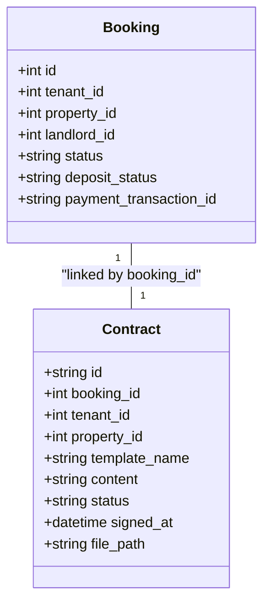

**Diagram sources**
- [backend/app/models/booking.py:18-47](file://backend/app/models/booking.py#L18-L47)
- [backend/app/models/contract.py:12-37](file://backend/app/models/contract.py#L12-L37)

**Section sources**
- [backend/app/models/contract.py:12-37](file://backend/app/models/contract.py#L12-L37)

### Notification Systems
- Unified notification service persists notifications and dispatches via channels (WeChat, SMS, Email).
- Booking events trigger specific notification types and channel templates.

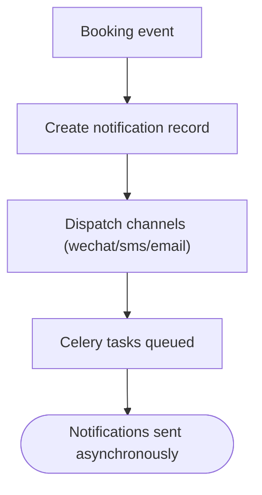

**Diagram sources**
- [backend/app/services/notification_service.py:43-69](file://backend/app/services/notification_service.py#L43-L69)
- [backend/app/services/booking_service.py:55-78](file://backend/app/services/booking_service.py#L55-L78)

**Section sources**
- [backend/app/services/notification_service.py:1-164](file://backend/app/services/notification_service.py#L1-L164)
- [backend/app/services/booking_service.py:55-78](file://backend/app/services/booking_service.py#L55-L78)

### Booking Calendar View and Date Selection Interfaces
- The date selection dialog allows tenants to pick a viewing date and time slot.
- Past dates are disabled; month navigation is allowed without selecting past days.
- Selected date and slot are emitted to parent components for booking creation.

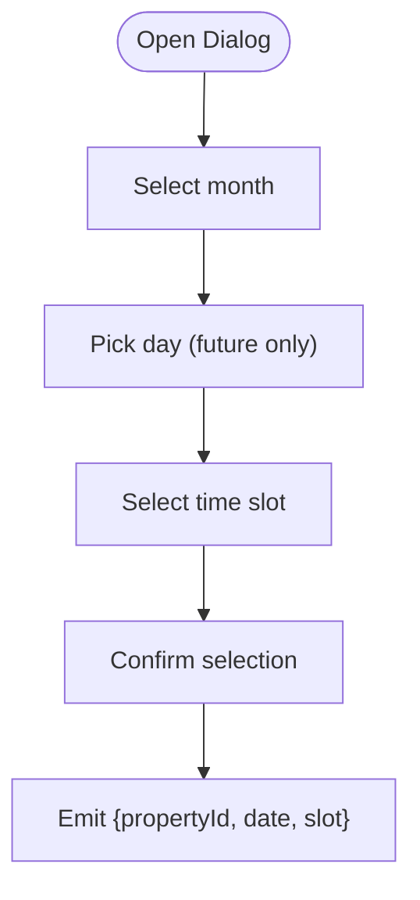

**Diagram sources**
- [frontend/src/components/BookingDateDialog.vue:91-177](file://frontend/src/components/BookingDateDialog.vue#L91-L177)

**Section sources**
- [frontend/src/components/BookingDateDialog.vue:1-305](file://frontend/src/components/BookingDateDialog.vue#L1-L305)

### Conflict Resolution
- Duplicate pending booking prevention:
  - If a tenant already has a pending booking for the same property, creation fails with conflict.
- Date conflicts:
  - Current implementation does not enforce landlord-side scheduling conflicts; future enhancement could add availability checks.

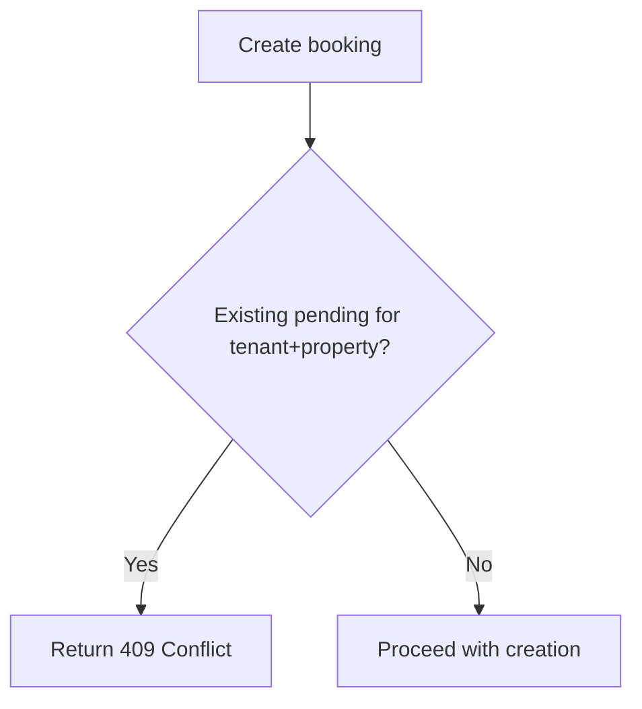

**Diagram sources**
- [backend/app/services/booking_service.py:23-33](file://backend/app/services/booking_service.py#L23-L33)

**Section sources**
- [backend/app/services/booking_service.py:23-33](file://backend/app/services/booking_service.py#L23-L33)

### Administrative Functions
- Admin role can:
  - Access any booking detail.
  - Update booking status (approve/reject).
  - Cancel bookings.
  - View payments.
- Role checks are enforced in API routes.

**Section sources**
- [backend/app/api/v1/routes/bookings.py:55-93](file://backend/app/api/v1/routes/bookings.py#L55-L93)
- [backend/app/api/v1/routes/payments.py:72-85](file://backend/app/api/v1/routes/payments.py#L72-L85)

## Dependency Analysis
High-level dependencies between components:

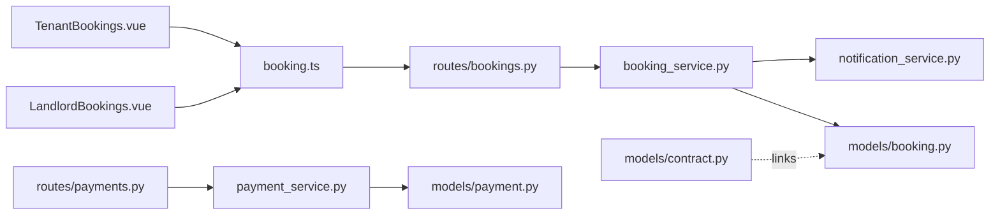

**Diagram sources**
- [frontend/src/views/TenantBookings.vue:1-200](file://frontend/src/views/TenantBookings.vue#L1-L200)
- [frontend/src/views/LandlordBookings.vue:1-164](file://frontend/src/views/LandlordBookings.vue#L1-L164)
- [frontend/src/services/booking.ts:1-25](file://frontend/src/services/booking.ts#L1-L25)
- [backend/app/api/v1/routes/bookings.py:1-112](file://backend/app/api/v1/routes/bookings.py#L1-L112)
- [backend/app/api/v1/routes/payments.py:1-85](file://backend/app/api/v1/routes/payments.py#L1-L85)
- [backend/app/services/booking_service.py:1-164](file://backend/app/services/booking_service.py#L1-L164)
- [backend/app/services/notification_service.py:1-164](file://backend/app/services/notification_service.py#L1-L164)
- [backend/app/services/payment_service.py:1-445](file://backend/app/services/payment_service.py#L1-L445)
- [backend/app/models/booking.py:1-47](file://backend/app/models/booking.py#L1-L47)
- [backend/app/models/payment.py:1-34](file://backend/app/models/payment.py#L1-L34)
- [backend/app/models/contract.py:1-37](file://backend/app/models/contract.py#L1-L37)

**Section sources**
- [frontend/src/services/booking.ts:1-25](file://frontend/src/services/booking.ts#L1-L25)
- [backend/app/api/v1/routes/bookings.py:1-112](file://backend/app/api/v1/routes/bookings.py#L1-L112)
- [backend/app/api/v1/routes/payments.py:1-85](file://backend/app/api/v1/routes/payments.py#L1-L85)
- [backend/app/services/booking_service.py:1-164](file://backend/app/services/booking_service.py#L1-L164)
- [backend/app/services/notification_service.py:1-164](file://backend/app/services/notification_service.py#L1-L164)
- [backend/app/services/payment_service.py:1-445](file://backend/app/services/payment_service.py#L1-L445)
- [backend/app/models/booking.py:1-47](file://backend/app/models/booking.py#L1-L47)
- [backend/app/models/payment.py:1-34](file://backend/app/models/payment.py#L1-L34)
- [backend/app/models/contract.py:1-37](file://backend/app/models/contract.py#L1-L37)

## Performance Considerations
- Avoid redundant queries by batching listing operations where possible.
- Use indexes on frequently filtered columns (e.g., tenant_id, landlord_id, status).
- Asynchronous notifications reduce request latency.
- Payment callbacks should be idempotent and handle retries safely.
- Consider caching property metadata used during booking creation to reduce repeated reads.

[No sources needed since this section provides general guidance]

## Troubleshooting Guide
Common issues and resolutions:
- Duplicate pending booking error:
  - Occurs when a tenant attempts to create another pending booking for the same property.
  - Resolve by waiting for landlord decision or cancelling existing pending booking.
- Unauthorized access:
  - Only landlords can approve/reject; only tenants can cancel.
  - Ensure correct user roles and ownership checks.
- Payment callback not updating status:
  - Verify callback endpoint receives valid payload and updates deposit_status to "confirmed".
  - Check logging for signature verification and decryption errors.
- Notifications not delivered:
  - Celery task import failures are logged; ensure worker processes are running and configured.

**Section sources**
- [backend/app/services/booking_service.py:23-33](file://backend/app/services/booking_service.py#L23-L33)
- [backend/app/api/v1/routes/bookings.py:71-111](file://backend/app/api/v1/routes/bookings.py#L71-L111)
- [backend/app/api/v1/routes/payments.py:48-69](file://backend/app/api/v1/routes/payments.py#L48-L69)
- [backend/app/services/notification_service.py:122-163](file://backend/app/services/notification_service.py#L122-L163)

## Conclusion
The Booking Management system provides a robust workflow from tenant-initiated booking requests through landlord approvals, payment processing, and notifications. It includes clear role-based access controls, comprehensive status tracking, and extensible integrations for payments and contracts. Future enhancements may include advanced scheduling conflict resolution and richer contract signing workflows.