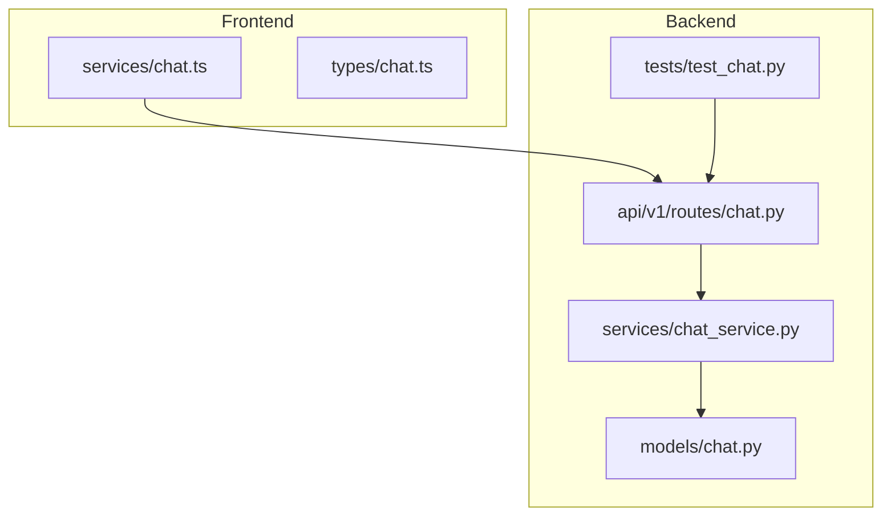
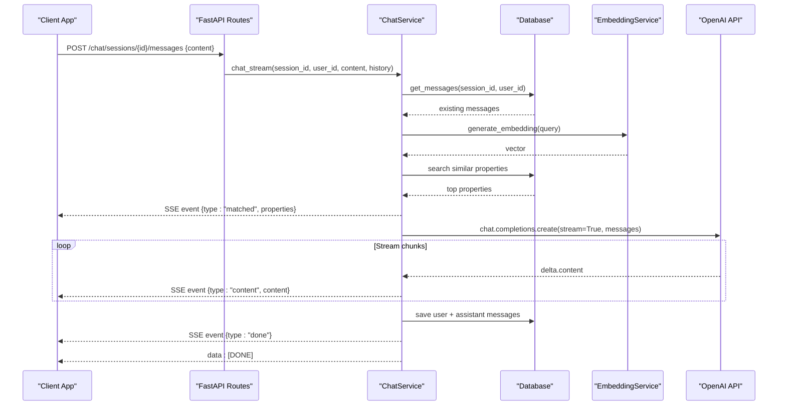
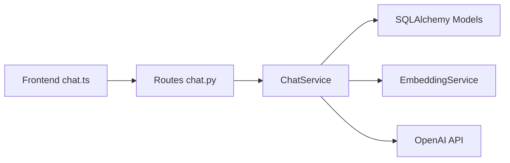

# Chat Assistant Page

<cite>
**Referenced Files in This Document**
- [chat.py](file://backend/app/api/v1/routes/chat.py)
- [chat_service.py](file://backend/app/services/chat_service.py)
- [chat.py (models)](file://backend/app/models/chat.py)
- [chat.ts (frontend service)](file://frontend/src/services/chat.ts)
- [chat.ts (types)](file://frontend/src/types/chat.ts)
- [test_chat.py](file://backend/tests/test_chat.py)
</cite>

## Table of Contents
1. [Introduction](#introduction)
2. [Project Structure](#project-structure)
3. [Core Components](#core-components)
4. [Architecture Overview](#architecture-overview)
5. [Detailed Component Analysis](#detailed-component-analysis)
6. [Dependency Analysis](#dependency-analysis)
7. [Performance Considerations](#performance-considerations)
8. [Troubleshooting Guide](#troubleshooting-guide)
9. [Conclusion](#conclusion)

## Introduction
This document describes the AI Chat Assistant feature that enables real-time, streaming conversations with a rental housing assistant. It covers:
- Real-time chat interface and message flow
- Message sending and receiving via Server-Sent Events (SSE)
- Streaming response handling on both backend and client sides
- Integration with the backend chat API
- Conversation context management and persistence
- Property recommendation suggestions embedded in responses
- Message formatting, typing indicators, and error handling for network failures
- Conversation clearing functionality
- Quick action patterns and examples for different response types

Note: The frontend Vue application includes a chat service and type definitions but does not currently expose a dedicated chat view route. A WeChat mini-program chat page is present and demonstrates a working chat UI pattern.

## Project Structure
The chat feature spans backend routes, services, models, tests, and frontend services/types.

**Diagram sources**
- [chat.py:1-143](file://backend/app/api/v1/routes/chat.py#L1-L143)
- [chat_service.py:1-302](file://backend/app/services/chat_service.py#L1-L302)
- [chat.py (models):1-62](file://backend/app/models/chat.py#L1-L62)
- [chat.ts (frontend service):1-24](file://frontend/src/services/chat.ts#L1-L24)
- [chat.ts (types):1-41](file://frontend/src/types/chat.ts#L1-L41)
- [test_chat.py:1-175](file://backend/tests/test_chat.py#L1-L175)

**Section sources**
- [chat.py:1-143](file://backend/app/api/v1/routes/chat.py#L1-L143)
- [chat_service.py:1-302](file://backend/app/services/chat_service.py#L1-L302)
- [chat.py (models):1-62](file://backend/app/models/chat.py#L1-L62)
- [chat.ts (frontend service):1-24](file://frontend/src/services/chat.ts#L1-L24)
- [chat.ts (types):1-41](file://frontend/src/types/chat.ts#L1-L41)
- [test_chat.py:1-175](file://backend/tests/test_chat.py#L1-L175)

## Core Components
- Backend API routes define endpoints for session lifecycle, message retrieval, streaming chat, and deletion.
- ChatService orchestrates RAG-based property matching, OpenAI streaming calls, and persistence of messages.
- Data models define sessions and messages with roles and metadata.
- Frontend chat service provides methods to create/list/delete sessions and fetch messages.
- Types define structures for sessions, messages, matched properties, and SSE events.

Key responsibilities:
- Session management: create, list, delete
- Message history: load per session
- Streaming chat: send user message, receive chunks, persist full reply
- Context building: embed query, search properties by similarity, attach recommendations
- Error handling: stream error events and finalization markers

**Section sources**
- [chat.py:45-143](file://backend/app/api/v1/routes/chat.py#L45-L143)
- [chat_service.py:17-302](file://backend/app/services/chat_service.py#L17-L302)
- [chat.py (models):23-62](file://backend/app/models/chat.py#L23-L62)
- [chat.ts (frontend service):4-23](file://frontend/src/services/chat.ts#L4-L23)
- [chat.ts (types):1-41](file://frontend/src/types/chat.ts#L1-L41)

## Architecture Overview
End-to-end flow from client to OpenAI and back, including RAG context and persistence.

**Diagram sources**
- [chat.py:106-130](file://backend/app/api/v1/routes/chat.py#L106-L130)
- [chat_service.py:227-302](file://backend/app/services/chat_service.py#L227-L302)

## Detailed Component Analysis

### Backend API: Chat Routes
- Endpoints:
  - Create session: POST /chat/sessions
  - List sessions: GET /chat/sessions
  - Get messages: GET /chat/sessions/{session_id}/messages
  - Send message (streaming): POST /chat/sessions/{session_id}/messages
  - Delete session: DELETE /chat/sessions/{session_id}
- Authentication: All endpoints require current user context.
- Streaming: Returns text/event-stream with SSE frames; sets appropriate headers.

Implementation highlights:
- Request/response schemas enforce constraints (e.g., message length).
- On send_message, existing history is fetched and passed into streaming pipeline.
- Response headers include no-cache and keep-alive for reliable streaming.

**Section sources**
- [chat.py:15-43](file://backend/app/api/v1/routes/chat.py#L15-L43)
- [chat.py:47-143](file://backend/app/api/v1/routes/chat.py#L47-L143)

### Backend Service: ChatService
Responsibilities:
- Session CRUD: create, list, close, delete
- Message retrieval: ordered by creation time
- RAG context builder:
  - Generate embedding for user query
  - Search properties using vector similarity
  - Build human-readable context and structured matched properties
- Chat orchestration:
  - Non-streaming chat returns full reply and matched properties
  - Streaming chat yields SSE events: matched properties first, then content chunks, then done marker
- Persistence:
  - Saves user and assistant messages with metadata (search params, matched properties)
  - Auto-titles session on first message if title is null

Error handling:
- Streams an error event when session not found or exceptions occur
- Always terminates stream with [DONE]

Complexity considerations:
- Vector search limits top matches to a fixed number to bound latency and payload size
- Streaming avoids large intermediate payloads by emitting deltas

**Section sources**
- [chat_service.py:17-84](file://backend/app/services/chat_service.py#L17-L84)
- [chat_service.py:87-143](file://backend/app/services/chat_service.py#L87-L143)
- [chat_service.py:171-226](file://backend/app/services/chat_service.py#L171-L226)
- [chat_service.py:227-302](file://backend/app/services/chat_service.py#L227-L302)

### Data Models: Sessions and Messages
- ChatSession:
  - Fields: id, user_id, session_id (unique), title, status (active/closed), timestamps
  - Relationship to messages with cascade delete
- ChatMessage:
  - Fields: id, session_id, role (user/assistant/system), content, metadata (JSON), timestamps
  - Role enum supports system prompts and conversation turns

Design notes:
- JSON metadata stores search parameters and matched properties for rich UI rendering
- Status allows future lifecycle control (e.g., closing old sessions)

**Section sources**
- [chat.py (models):12-21](file://backend/app/models/chat.py#L12-L21)
- [chat.py (models):23-62](file://backend/app/models/chat.py#L23-L62)

### Frontend Chat Service and Types
- chatService methods:
  - createSession(title?)
  - listSessions()
  - getMessages(sessionId)
  - deleteSession(sessionId)
- Types:
  - ChatSession, ChatMessage, MatchedProperty, SSEEvent
  - SSEEvent supports types: matched, content, done, error

Integration guidance:
- Use createSession to start a new conversation
- Load messages on mount to restore history
- For streaming, open a fetch/SSE connection to POST /chat/sessions/{id}/messages and handle events
- Persist local state for UI updates and scroll-to-bottom behavior

**Section sources**
- [chat.ts (frontend service):4-23](file://frontend/src/services/chat.ts#L4-L23)
- [chat.ts (types):1-41](file://frontend/src/types/chat.ts#L1-L41)

### Streaming Response Handling (SSE)
Flow:
- Client sends user message
- Server emits:
  - {type:"matched", properties} for quick property cards
  - Multiple {type:"content", content} chunks for streaming text
  - {type:"done"} to signal completion
  - data: [DONE] to terminate stream
- Client should:
  - Render matched properties immediately
  - Append content chunks progressively
  - Show typing indicator while waiting for first chunk
  - Handle error events and display friendly messages
  - Stop listening after [DONE]

Robustness tips:
- Implement reconnection logic for transient network issues
- Debounce auto-scroll to avoid jank during rapid chunks
- Sanitize and render markdown safely if supported

**Section sources**
- [chat_service.py:227-302](file://backend/app/services/chat_service.py#L227-L302)
- [chat.ts (types):35-41](file://frontend/src/types/chat.ts#L35-L41)

### Conversation Context Management
- History is built from persisted messages before each request
- System prompt instructs the model to use provided property context
- First message can auto-title the session
- Metadata preserves search parameters and matched properties for replay and analytics

**Section sources**
- [chat_service.py:155-169](file://backend/app/services/chat_service.py#L155-L169)
- [chat_service.py:171-226](file://backend/app/services/chat_service.py#L171-L226)
- [chat_service.py:227-302](file://backend/app/services/chat_service.py#L227-L302)

### Property Recommendation Suggestions
- RAG context is constructed from top similar properties based on embeddings
- Matched properties are sent as a separate SSE event so UI can render cards early
- Assistant replies reference titles, prices, and districts from context

**Section sources**
- [chat_service.py:87-143](file://backend/app/services/chat_service.py#L87-L143)
- [chat_service.py:250-255](file://backend/app/services/chat_service.py#L250-L255)

### Message Formatting and Markdown Rendering
- Content is plain text in the model response; clients may choose to render markdown if desired
- Ensure safe rendering to prevent XSS
- Preserve line breaks and lists for readability

[No sources needed since this section provides general guidance]

### Typing Indicators and User Interaction Patterns
- Show a loading bubble immediately after sending
- Replace with streamed content as chunks arrive
- Provide quick actions such as “Rephrase”, “Show more details”, or “Book now” via buttons appended to assistant messages

[No sources needed since this section provides general guidance]

### Error Handling for Network Failures
- Backend streams error events and always ends with [DONE]
- Frontend should catch SSE errors, show user-friendly messages, and allow retry
- Validate tokens and redirect to login if unauthorized

**Section sources**
- [chat_service.py:298-302](file://backend/app/services/chat_service.py#L298-L302)
- [test_chat.py:161-175](file://backend/tests/test_chat.py#L161-L175)

### Chat History Persistence and Clearing
- History is loaded per session and appended to the conversation
- Deleting a session removes it and its messages from the database
- Clients should clear local state and UI when a session is deleted

**Section sources**
- [chat.py:133-143](file://backend/app/api/v1/routes/chat.py#L133-L143)
- [chat_service.py:63-69](file://backend/app/services/chat_service.py#L63-L69)
- [chat.ts (frontend service):20-23](file://frontend/src/services/chat.ts#L20-L23)

### Quick Action Buttons for Common Queries
- Examples: “Find apartments near subway”, “Budget under 3000”, “Two bedrooms in Suzhou”
- These can be implemented as tags that prefill the input and trigger send

[No sources needed since this section provides general guidance]

### Example Handling of Different Response Types
- matched: Render property cards with title, district, price, and similarity
- content: Append incremental text to the last assistant message
- done: Finalize UI state, hide typing indicator
- error: Display error message and enable retry

**Section sources**
- [chat.ts (types):35-41](file://frontend/src/types/chat.ts#L35-L41)
- [chat_service.py:250-296](file://backend/app/services/chat_service.py#L250-L296)

## Dependency Analysis
Component relationships and coupling:
- Routes depend on ChatService for business logic
- ChatService depends on SQLAlchemy session, OpenAI client, and EmbeddingService
- Models define schema used by service and routes
- Frontend chat service consumes backend REST endpoints

**Diagram sources**
- [chat.py:1-143](file://backend/app/api/v1/routes/chat.py#L1-L143)
- [chat_service.py:1-302](file://backend/app/services/chat_service.py#L1-L302)
- [chat.py (models):1-62](file://backend/app/models/chat.py#L1-L62)
- [chat.ts (frontend service):1-24](file://frontend/src/services/chat.ts#L1-L24)

**Section sources**
- [chat.py:1-143](file://backend/app/api/v1/routes/chat.py#L1-L143)
- [chat_service.py:1-302](file://backend/app/services/chat_service.py#L1-L302)
- [chat.py (models):1-62](file://backend/app/models/chat.py#L1-L62)
- [chat.ts (frontend service):1-24](file://frontend/src/services/chat.ts#L1-L24)

## Performance Considerations
- Limit matched properties to a small set to reduce payload and improve responsiveness
- Stream content to minimize perceived latency
- Avoid unnecessary re-renders by batching DOM updates during streaming
- Cache session listings where appropriate
- Ensure proper indexing on foreign keys and unique identifiers

[No sources needed since this section provides general guidance]

## Troubleshooting Guide
Common issues and resolutions:
- Unauthorized access: Ensure valid token is attached to requests
- Empty history: Verify session exists and messages were saved
- Streaming stalls: Check server logs for exceptions; ensure [DONE] is emitted
- No property matches: Confirm embeddings exist and vector search is enabled
- Frontend not updating: Validate SSE event parsing and state updates

Validation references:
- Auth enforcement across endpoints
- Session creation and listing behaviors
- Deletion semantics

**Section sources**
- [test_chat.py:1-175](file://backend/tests/test_chat.py#L1-L175)
- [chat_service.py:298-302](file://backend/app/services/chat_service.py#L298-L302)

## Conclusion
The AI Chat Assistant integrates a robust backend with streaming SSE, RAG-driven property recommendations, and persistent conversation history. The frontend service and types provide a solid foundation for implementing a responsive chat UI with typing indicators, early property suggestions, and resilient error handling. With the documented flows and patterns, teams can build a polished chat experience that guides users to relevant rentals efficiently.