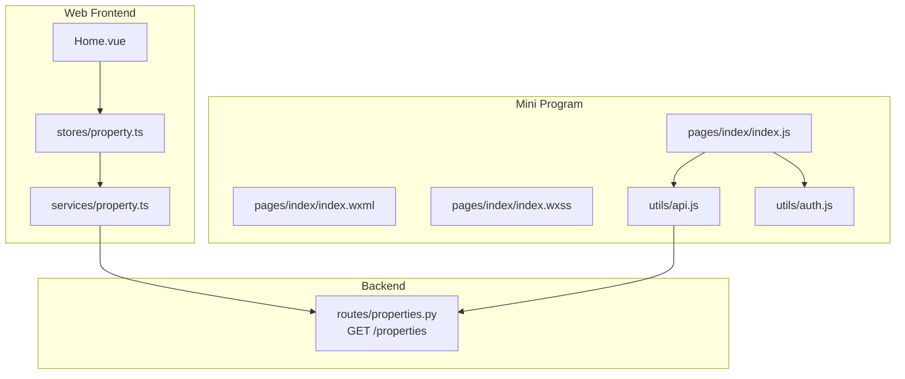
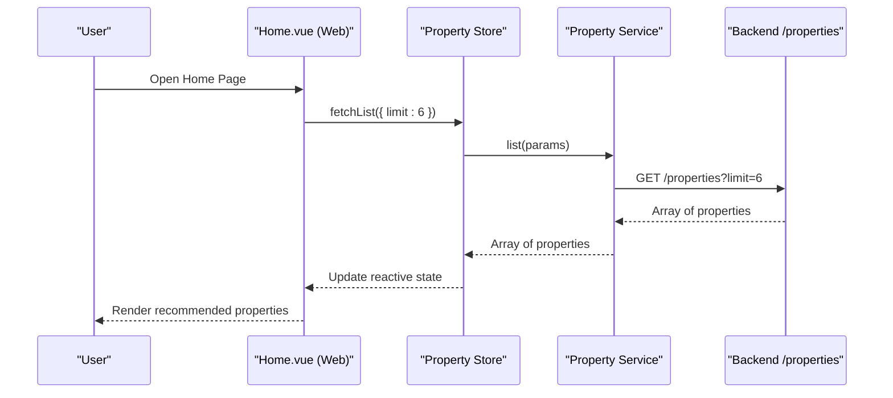
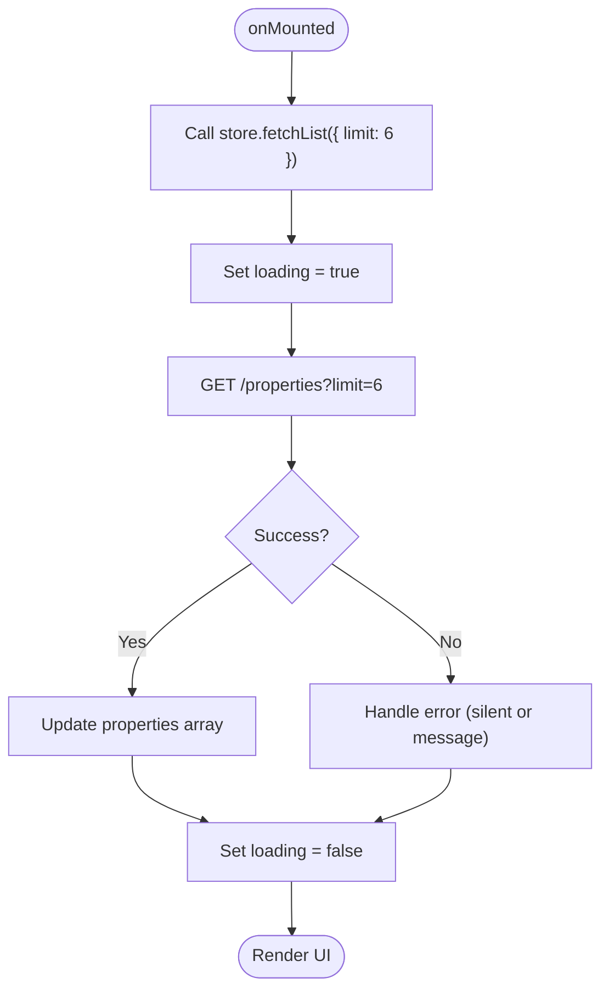
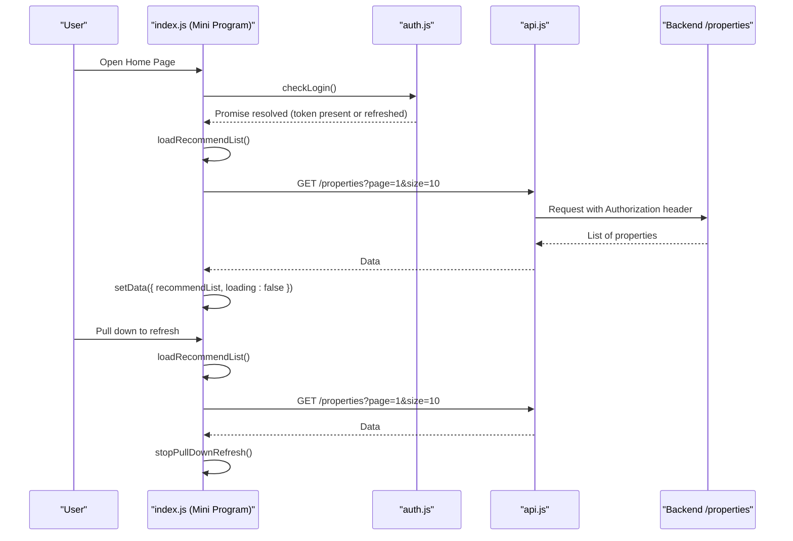
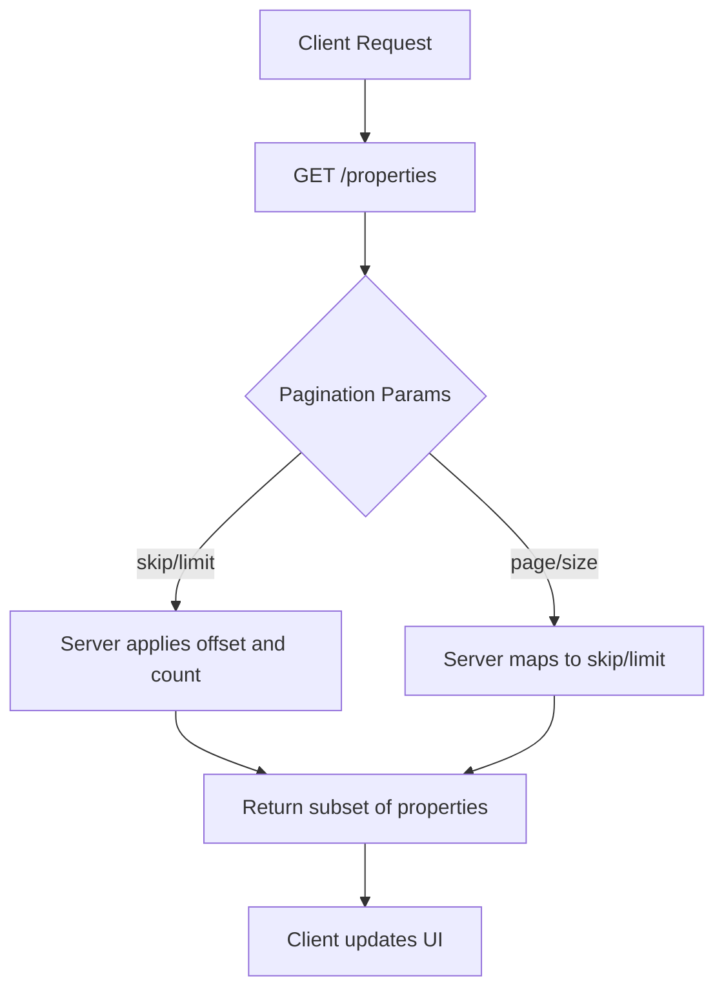
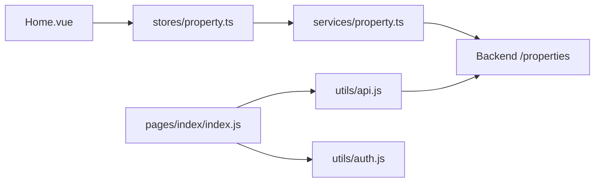

# Home Page (Index)

<cite>
**Referenced Files in This Document**
- [Home.vue](file://frontend/src/views/Home.vue)
- [property.ts](file://frontend/src/stores/property.ts)
- [property_service.ts](file://frontend/src/services/property.ts)
- [property_types.ts](file://frontend/src/types/property.ts)
- [index.js](file://wechat-miniprogram/pages/index/index.js)
- [index.wxml](file://wechat-miniprogram/pages/index/index.wxml)
- [index.wxss](file://wechat-miniprogram/pages/index/index.wxss)
- [api.js](file://wechat-miniprogram/utils/api.js)
- [auth.js](file://wechat-miniprogram/utils/auth.js)
- [properties.py](file://backend/app/api/v1/routes/properties.py)
</cite>

## Table of Contents
1. [Introduction](#introduction)
2. [Project Structure](#project-structure)
3. [Core Components](#core-components)
4. [Architecture Overview](#architecture-overview)
5. [Detailed Component Analysis](#detailed-component-analysis)
6. [Dependency Analysis](#dependency-analysis)
7. [Performance Considerations](#performance-considerations)
8. [Troubleshooting Guide](#troubleshooting-guide)
9. [Conclusion](#conclusion)

## Introduction
This document explains the Home Page implementation across two frontends:
- Vue 3 web app (frontend/src/views/Home.vue)
- WeChat Mini Program (wechat-miniprogram/pages/index/*)

It covers page lifecycle methods, authentication checks, recommended property loading, data structures for searchKeyword/recommendList/banners/loading states, the recommendation system with pagination support, user interactions (search input, navigation to search with keyword parameters, property detail navigation, map mode switching), and pull-to-refresh behavior. It also includes error handling and loading state management examples.

## Project Structure
The Home Page exists in both the web and mini program frontends. The backend exposes a properties list endpoint used by both clients.

**Diagram sources**
- [Home.vue:164-313](file://frontend/src/views/Home.vue#L164-L313)
- [property.ts:1-136](file://frontend/src/stores/property.ts#L1-L136)
- [property_service.ts:1-86](file://frontend/src/services/property.ts#L1-L86)
- [index.js:1-74](file://wechat-miniprogram/pages/index/index.js#L1-L74)
- [index.wxml:1-49](file://wechat-miniprogram/pages/index/index.wxml#L1-L49)
- [index.wxss:1-73](file://wechat-miniprogram/pages/index/index.wxss#L1-L73)
- [api.js:1-52](file://wechat-miniprogram/utils/api.js#L1-L52)
- [auth.js:1-81](file://wechat-miniprogram/utils/auth.js#L1-L81)
- [properties.py:94-107](file://backend/app/api/v1/routes/properties.py#L94-L107)

**Section sources**
- [Home.vue:164-313](file://frontend/src/views/Home.vue#L164-L313)
- [index.js:1-74](file://wechat-miniprogram/pages/index/index.js#L1-L74)
- [properties.py:94-107](file://backend/app/api/v1/routes/properties.py#L94-L107)

## Core Components
- Web Home Page (Vue): Uses Pinia store to fetch recommended properties via service layer; renders AI search bar, region cards, and featured listings.
- Mini Program Home Page: Manages local data (searchKeyword, recommendList, banners, loading), performs auth check, loads recommendations, handles search/map/navigation, and supports pull-to-refresh.

Key responsibilities:
- Lifecycle-driven data loading
- Authentication gating
- User interaction routing
- Loading and empty-state UI feedback

**Section sources**
- [Home.vue:164-313](file://frontend/src/views/Home.vue#L164-L313)
- [index.js:1-74](file://wechat-miniprogram/pages/index/index.js#L1-L74)

## Architecture Overview
The Home Page follows a client-service-backend pattern:
- Web: Home.vue -> Pinia store -> Property service -> Backend GET /properties
- Mini Program: index.js -> api.js wrapper -> Backend GET /properties

**Diagram sources**
- [Home.vue:310-312](file://frontend/src/views/Home.vue#L310-L312)
- [property.ts:17-24](file://frontend/src/stores/property.ts#L17-L24)
- [property_service.ts:28-31](file://frontend/src/services/property.ts#L28-L31)
- [properties.py:94-107](file://backend/app/api/v1/routes/properties.py#L94-L107)

## Detailed Component Analysis

### Web Home Page (Vue)
Lifecycle and data flow:
- onMounted triggers initial load of recommended properties with a small limit for the hero section.
- The store manages loading state and updates the reactive properties array.
- Navigation to search and property details is handled via router.

Data structures:
- properties: Array of Property objects from the backend.
- loading: Boolean indicating network request status.
- query: String bound to the AI search input.
- regions: Static region options for quick filters.
- typeLabels: Mapping of property types to display labels.

Interactions:
- AI search: Navigates to Search page with query parameter q.
- Quick hints: Navigate to Search with preset queries.
- Region selection: Navigate to Search with country filter.
- Property detail: Navigate to /property/:id.
- Booking dialog: Opens confirmation dialog and navigates to booking confirm with query params.

Error handling and loading:
- Store sets loading true before requests and false after completion.
- Empty state shown when no properties are available.

**Diagram sources**
- [Home.vue:310-312](file://frontend/src/views/Home.vue#L310-L312)
- [property.ts:17-24](file://frontend/src/stores/property.ts#L17-L24)
- [property_service.ts:28-31](file://frontend/src/services/property.ts#L28-L31)
- [properties.py:94-107](file://backend/app/api/v1/routes/properties.py#L94-L107)

**Section sources**
- [Home.vue:164-313](file://frontend/src/views/Home.vue#L164-L313)
- [property.ts:1-136](file://frontend/src/stores/property.ts#L1-L136)
- [property_service.ts:1-86](file://frontend/src/services/property.ts#L1-L86)
- [property_types.ts:1-95](file://frontend/src/types/property.ts#L1-L95)

### Mini Program Home Page
Lifecycle methods:
- onLoad: Checks login via auth.checkLogin(), then loads recommended properties.
- onShow: If already logged in, reloads recommendations.

Data structure:
- searchKeyword: String for current search input.
- recommendList: Array of recommended properties.
- banners: Array of banner items (rendered but not loaded in this file).
- loading: Boolean for loading indicator.

Authentication:
- checkLogin ensures a valid token is present; if missing, performs WeChat login flow and stores token/user info.

Recommendation loading:
- loadRecommendList sets loading true, calls GET /properties with page and size parameters, updates recommendList and resets loading.

User interactions:
- Search input: Updates searchKeyword on input events.
- Search submit: Validates non-empty keyword, navigates to Search page with keyword parameter.
- Map mode: Navigates to Search page with mapMode flag.
- Property tap: Navigates to Property detail with id parameter.
- Pull-to-refresh: Calls loadRecommendList and stops refresh animation.

Error handling and loading:
- On success: Sets recommendList and loading false.
- On failure: Ensures loading false is set.
- API wrapper shows toast messages for errors and handles 401 by clearing tokens.

**Diagram sources**
- [index.js:13-23](file://wechat-miniprogram/pages/index/index.js#L13-L23)
- [index.js:26-37](file://wechat-miniprogram/pages/index/index.js#L26-L37)
- [index.js:67-72](file://wechat-miniprogram/pages/index/index.js#L67-L72)
- [auth.js:38-53](file://wechat-miniprogram/utils/auth.js#L38-L53)
- [api.js:4-41](file://wechat-miniprogram/utils/api.js#L4-L41)
- [properties.py:94-107](file://backend/app/api/v1/routes/properties.py#L94-L107)

**Section sources**
- [index.js:1-74](file://wechat-miniprogram/pages/index/index.js#L1-L74)
- [index.wxml:1-49](file://wechat-miniprogram/pages/index/index.wxml#L1-L49)
- [index.wxss:1-73](file://wechat-miniprogram/pages/index/index.wxss#L1-L73)
- [api.js:1-52](file://wechat-miniprogram/utils/api.js#L1-L52)
- [auth.js:1-81](file://wechat-miniprogram/utils/auth.js#L1-L81)

### Recommendation System and Pagination
- Backend list endpoint supports skip and limit for pagination.
- Web Home Page uses limit to fetch a small initial set for the hero section.
- Mini Program Home Page passes page and size parameters to the same endpoint; the server interprets these as pagination inputs.

**Diagram sources**
- [properties.py:94-107](file://backend/app/api/v1/routes/properties.py#L94-L107)
- [property_service.ts:28-31](file://frontend/src/services/property.ts#L28-L31)
- [index.js:26-37](file://wechat-miniprogram/pages/index/index.js#L26-L37)

**Section sources**
- [properties.py:94-107](file://backend/app/api/v1/routes/properties.py#L94-L107)
- [property_service.ts:28-31](file://frontend/src/services/property.ts#L28-L31)
- [index.js:26-37](file://wechat-miniprogram/pages/index/index.js#L26-L37)

### Data Structures
- searchKeyword (Mini Program): String representing the current search input value.
- recommendList (Mini Program): Array of property objects returned from the backend.
- banners (Mini Program): Array of banner items (defined in data but not populated in this file).
- loading (Mini Program): Boolean controlling loading UI visibility.
- properties (Web): Array of Property objects managed by Pinia store.
- loading (Web): Boolean controlled by the store during requests.

Property object fields include identifiers, title, description, address, district, price_monthly, area_sqm, bedrooms, bathrooms, property_type, status, coordinates, timestamps, images, and optional similarity field for search results.

**Section sources**
- [index.js:6-11](file://wechat-miniprogram/pages/index/index.js#L6-L11)
- [property_types.ts:6-28](file://frontend/src/types/property.ts#L6-L28)
- [property.ts:7-10](file://frontend/src/stores/property.ts#L7-L10)

### User Interactions
- Search input handling:
  - Mini Program: Updates searchKeyword on input; validates non-empty before navigating to Search with keyword parameter.
  - Web: Binds query to AI search input; Enter key triggers navigation to Search with q parameter.
- Navigation to Search:
  - Mini Program: Uses navigateTo with keyword query string.
  - Web: Uses router.push with name 'search' and query { q }.
- Property detail navigation:
  - Mini Program: Navigates to property page with id parameter.
  - Web: Navigates to /property/:id.
- Map mode switching:
  - Mini Program: Navigates to Search page with mapMode flag.
- Pull-to-refresh:
  - Mini Program: Triggers loadRecommendList and stops refresh animation upon completion.

**Section sources**
- [index.js:39-65](file://wechat-miniprogram/pages/index/index.js#L39-L65)
- [index.js:67-72](file://wechat-miniprogram/pages/index/index.js#L67-L72)
- [Home.vue:282-301](file://frontend/src/views/Home.vue#L282-L301)

### Error Handling and Loading State Management
- Mini Program:
  - API wrapper shows toast for general errors and clears tokens on 401.
  - Home Page sets loading true before request and ensures it is reset to false on both success and error paths.
- Web:
  - Store toggles loading around requests; Home Page displays v-loading overlay and empty state when no data.

Examples:
- Mini Program error path: catch block in loadRecommendList sets loading false.
- Web error path: store finally blocks ensure loading false even on exceptions.

**Section sources**
- [index.js:26-37](file://wechat-miniprogram/pages/index/index.js#L26-L37)
- [api.js:19-38](file://wechat-miniprogram/utils/api.js#L19-L38)
- [property.ts:17-24](file://frontend/src/stores/property.ts#L17-L24)
- [Home.vue:91-94](file://frontend/src/views/Home.vue#L91-L94)

## Dependency Analysis
- Web dependencies:
  - Home.vue depends on Pinia store and Element Plus components.
  - Store depends on property service which wraps HTTP calls.
  - Types define Property schema used across layers.
- Mini Program dependencies:
  - index.js depends on utils/api.js and utils/auth.js.
  - api.js wraps wx.request and injects Authorization headers.
  - auth.js manages WeChat login and token persistence.
- Backend dependency:
  - Both clients call GET /properties with pagination parameters.

**Diagram sources**
- [Home.vue:164-313](file://frontend/src/views/Home.vue#L164-L313)
- [property.ts:1-136](file://frontend/src/stores/property.ts#L1-L136)
- [property_service.ts:1-86](file://frontend/src/services/property.ts#L1-L86)
- [index.js:1-74](file://wechat-miniprogram/pages/index/index.js#L1-L74)
- [api.js:1-52](file://wechat-miniprogram/utils/api.js#L1-L52)
- [auth.js:1-81](file://wechat-miniprogram/utils/auth.js#L1-L81)
- [properties.py:94-107](file://backend/app/api/v1/routes/properties.py#L94-L107)

**Section sources**
- [Home.vue:164-313](file://frontend/src/views/Home.vue#L164-L313)
- [index.js:1-74](file://wechat-miniprogram/pages/index/index.js#L1-L74)
- [api.js:1-52](file://wechat-miniprogram/utils/api.js#L1-L52)
- [auth.js:1-81](file://wechat-miniprogram/utils/auth.js#L1-L81)
- [property.ts:1-136](file://frontend/src/stores/property.ts#L1-L136)
- [property_service.ts:1-86](file://frontend/src/services/property.ts#L1-L86)
- [properties.py:94-107](file://backend/app/api/v1/routes/properties.py#L94-L107)

## Performance Considerations
- Use minimal limits for initial hero sections to reduce payload size.
- Implement infinite scroll or “load more” for large lists to avoid heavy initial downloads.
- Cache repeated searches in the store to avoid redundant network calls.
- Debounce search input to reduce unnecessary navigation or API calls.
- Ensure images are lazy-loaded and use primary image URLs only when necessary.

[No sources needed since this section provides general guidance]

## Troubleshooting Guide
Common issues and resolutions:
- Token expired (401):
  - Mini Program API wrapper clears stored tokens and rejects with a message; re-login required.
- Network failures:
  - API wrapper shows toast and rejects; ensure connectivity and correct baseUrl.
- Empty state:
  - Verify backend returns data; handle empty arrays gracefully in UI.
- Loading stuck:
  - Confirm loading flags are reset in both success and error branches.

**Section sources**
- [api.js:22-38](file://wechat-miniprogram/utils/api.js#L22-L38)
- [index.js:26-37](file://wechat-miniprogram/pages/index/index.js#L26-L37)
- [property.ts:17-24](file://frontend/src/stores/property.ts#L17-L24)

## Conclusion
The Home Page implementations provide robust entry points for browsing and searching rental properties. Both frontends follow clear lifecycle patterns, manage authentication, and handle loading and error states effectively. The backend’s paginated properties endpoint supports flexible client-side pagination strategies. Users can quickly search, navigate to details, switch to map mode, and refresh content seamlessly.

[No sources needed since this section summarizes without analyzing specific files]