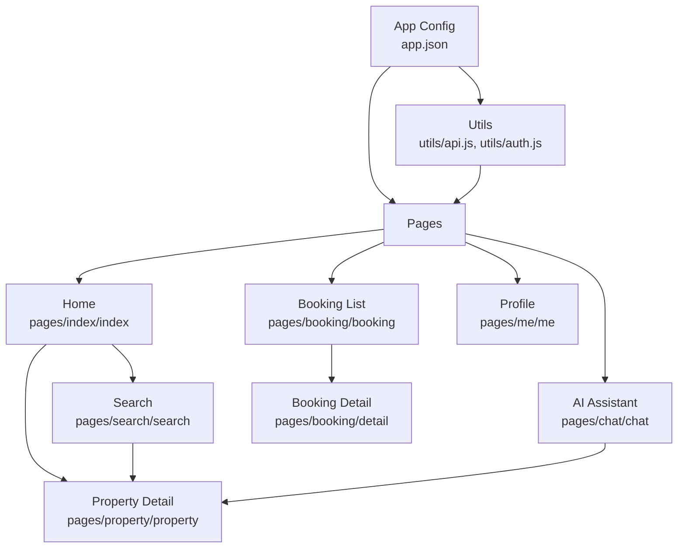
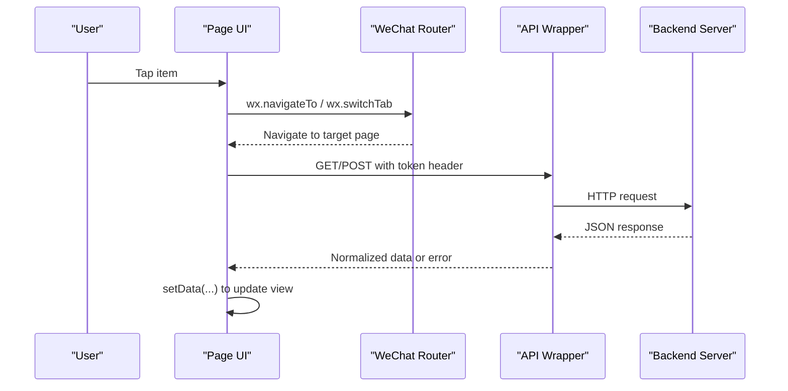
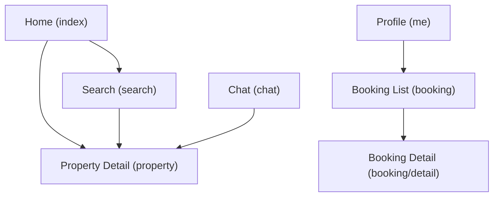

# Page Structure & Navigation

<cite>
**Referenced Files in This Document**
- [app.json](file://wechat-miniprogram/app.json)
- [app.js](file://wechat-miniprogram/app.js)
- [index.js](file://wechat-miniprogram/pages/index/index.js)
- [index.json](file://wechat-miniprogram/pages/index/index.json)
- [search.js](file://wechat-miniprogram/pages/search/search.js)
- [search.json](file://wechat-miniprogram/pages/search/search.json)
- [property.js](file://wechat-miniprogram/pages/property/property.js)
- [property.json](file://wechat-miniprogram/pages/property/property.json)
- [chat.js](file://wechat-miniprogram/pages/chat/chat.js)
- [chat.json](file://wechat-miniprogram/pages/chat/chat.json)
- [booking.js](file://wechat-miniprogram/pages/booking/booking.js)
- [detail.js](file://wechat-miniprogram/pages/booking/detail.js)
- [me.js](file://wechat-miniprogram/pages/me/me.js)
- [api.js](file://wechat-miniprogram/utils/api.js)
- [auth.js](file://wechat-miniprogram/utils/auth.js)
</cite>

## Table of Contents
1. Introduction
2. Project Structure
3. Core Components
4. Architecture Overview
5. Detailed Component Analysis
6. Dependency Analysis
7. Performance Considerations
8. Troubleshooting Guide
9. Conclusion

## Introduction
This document explains the WeChat Mini Program’s page architecture and navigation system. It covers the core pages (home, search, property detail, chat assistant, booking management, and user profile), their lifecycle methods, data binding patterns, routing behavior using wx.navigateTo and other APIs, tab bar configuration, parameter passing, event handling, and state management across pages.

## Project Structure
The mini program is organized by feature-based pages under wechat-miniprogram/pages, with shared utilities in utils and global app configuration in app.json and app.js. The tab bar defines four primary sections: Home, AI Assistant, Booking, and Profile. Search and Property Detail are non-tab pages navigated via standard routing.

**Diagram sources**
- [app.json:1-57](file://wechat-miniprogram/app.json#L1-L57)
- [index.js:1-74](file://wechat-miniprogram/pages/index/index.js#L1-L74)
- [search.js:1-100](file://wechat-miniprogram/pages/search/search.js#L1-L100)
- [property.js:1-90](file://wechat-miniprogram/pages/property/property.js#L1-L90)
- [chat.js:1-108](file://wechat-miniprogram/pages/chat/chat.js#L1-L108)
- [booking.js:1-57](file://wechat-miniprogram/pages/booking/booking.js#L1-L57)
- [detail.js](file://wechat-miniprogram/pages/booking/detail.js)
- [api.js:1-52](file://wechat-miniprogram/utils/api.js#L1-L52)
- [auth.js:1-81](file://wechat-miniprogram/utils/auth.js#L1-L81)

**Section sources**
- [app.json:1-57](file://wechat-miniprogram/app.json#L1-L57)
- [app.js:1-21](file://wechat-miniprogram/app.js#L1-L21)

## Core Components
- Global app state and initialization:
  - On launch, the app checks login status and initializes global flags and base URL.
- Shared utilities:
  - API wrapper adds Authorization headers and handles 401 token expiration.
  - Auth module manages WeChat login flow, token storage, and user info.

Key responsibilities:
- Centralized error handling for network and auth errors.
- Consistent request/response normalization across pages.
- Reusable authentication checks before sensitive actions.

**Section sources**
- [app.js:1-21](file://wechat-miniprogram/app.js#L1-L21)
- [api.js:1-52](file://wechat-miniprogram/utils/api.js#L1-L52)
- [auth.js:1-81](file://wechat-miniprogram/utils/auth.js#L1-L81)

## Architecture Overview
The application uses a hybrid navigation model:
- Tab bar pages: Home, AI Assistant, Booking, Profile.
- Non-tab pages: Search, Property Detail, Booking Detail.
- Routing:
  - wx.switchTab for tab bar destinations.
  - wx.navigateTo for non-tab pages with query parameters.
- Data flow:
  - Pages call api.get/post to fetch or submit data.
  - Auth checks gate protected routes and actions.
  - Global state holds login status and user info.

**Diagram sources**
- [index.js:44-65](file://wechat-miniprogram/pages/index/index.js#L44-L65)
- [search.js:20-62](file://wechat-miniprogram/pages/search/search.js#L20-L62)
- [property.js:16-38](file://wechat-miniprogram/pages/property/property.js#L16-L38)
- [chat.js:36-88](file://wechat-miniprogram/pages/chat/chat.js#L36-L88)
- [booking.js:12-29](file://wechat-miniprogram/pages/booking/booking.js#L12-L29)
- [api.js:4-41](file://wechat-miniprogram/utils/api.js#L4-L41)
- [auth.js:38-53](file://wechat-miniprogram/utils/auth.js#L38-L53)

## Detailed Component Analysis

### Home Page (Index)
Responsibilities:
- Load recommended properties on load/show.
- Provide search input and navigate to Search page with keyword.
- Open map mode entry to Search page.
- Pull-to-refresh to reload recommendations.

Lifecycle and events:
- onLoad/onShow: trigger data loading after login check.
- onPullDownRefresh: refresh list and stop refresh indicator.
- Event handlers: onSearchInput, onSearch, onTapProperty, onMapMode.

Navigation:
- wx.navigateTo to Search with encoded keyword and optional mapMode flag.
- wx.navigateTo to Property Detail with id.

Data binding:
- Uses this.setData to manage searchKeyword, recommendList, banners, loading.

Configuration:
- Enables pull-down refresh and sets navigation title.
- Registers reusable components like property-card.

**Section sources**
- [index.js:1-74](file://wechat-miniprogram/pages/index/index.js#L1-L74)
- [index.json:1-8](file://wechat-miniprogram/pages/index/index.json#L1-L8)

### Search Page
Responsibilities:
- Accept initial keyword and mapMode from route options.
- Perform paginated search with filters (district, price range, property type).
- Support infinite scroll via onReachBottom and pull-to-refresh.

Lifecycle and events:
- onLoad(options): initialize keyword and mapMode, then doSearch.
- doSearch(reset): builds params, calls API, updates results and pagination state.
- onKeywordInput, onSearchConfirm, onFilterChange: update filters and trigger search.
- onReachBottom: load more items.
- onPullDownRefresh: reset and reload.

Navigation:
- wx.navigateTo to Property Detail with id.

Data binding:
- Manages keyword, filters object, results array, page, hasMore, loading, mapMode.

Configuration:
- Enables pull-down refresh and registers search-bar and property-card components.

**Section sources**
- [search.js:1-100](file://wechat-miniprogram/pages/search/search.js#L1-L100)
- [search.json:1-9](file://wechat-miniprogram/pages/search/search.json#L1-L9)

### Property Detail Page
Responsibilities:
- Load property details by id from route options.
- Build image URLs using global baseUrl and upload path pattern.
- Preview images, show booking modal, submit booking, call landlord phone.

Lifecycle and events:
- onLoad(options): validate id, load property.
- onPreviewImage: open image preview.
- onBookViewing: require login before showing booking modal.
- onCancelBooking, onRemarkInput, onSubmitBooking: manage modal state and submission.
- onCallLandlord: initiate phone call if available.

Navigation:
- Navigates here from Home, Search, and Chat with id parameter.

Data binding:
- Manages property object, images array, loading, bookingVisible, bookingRemark, submitting.

Configuration:
- Sets navigation title and registers map-view component.

**Section sources**
- [property.js:1-90](file://wechat-miniprogram/pages/property/property.js#L1-L90)
- [property.json:1-7](file://wechat-miniprogram/pages/property/property.json#L1-L7)

### Chat Assistant Page
Responsibilities:
- Initialize a chat session on load.
- Send messages and handle streaming responses via enableChunked requests.
- Scroll to latest message automatically.
- Navigate to Property Detail when clicking a property card embedded in chat.

Lifecycle and events:
- onLoad: ensure login, create session.
- onInput: update inputValue.
- onSend: append user message, insert placeholder assistant message, send request, update content on success/fail.
- onReady: scroll to bottom initially.
- scrollToBottom: set scrollToView to last message id.

Navigation:
- wx.navigateTo to Property Detail with id.

Data binding:
- Manages messages array, inputValue, sessionId, loading, sending, scrollToView, streamingContent.

Configuration:
- Sets navigation title.

**Section sources**
- [chat.js:1-108](file://wechat-miniprogram/pages/chat/chat.js#L1-L108)
- [chat.json:1-4](file://wechat-miniprogram/pages/chat/chat.json#L1-L4)

### Booking Management Page
Responsibilities:
- Load bookings on show after login check.
- Filter bookings by status tabs (all, pending, approved, cancelled).
- Navigate to Booking Detail with id.
- Pull-to-refresh to reload bookings.

Lifecycle and events:
- onShow: load bookings after login.
- loadBookings: fetch and normalize data.
- onTabChange: update active status tab.
- filteredBookings: computed getter to filter current list.
- onTapBooking: navigate to detail.
- onPullDownRefresh: refresh and stop indicator.

Navigation:
- wx.navigateTo to Booking Detail with id.

Data binding:
- Manages bookings array, loading, statusTab.

Configuration:
- No special config beyond default; relies on tab bar for top-level access.

**Section sources**
- [booking.js:1-57](file://wechat-miniprogram/pages/booking/booking.js#L1-L57)
- [detail.js](file://wechat-miniprogram/pages/booking/detail.js)

### User Profile Page
Responsibilities:
- Display user info and login status.
- Handle WeChat login, bind phone number, switch role, logout.
- Navigate to Booking tab using switchTab.

Lifecycle and events:
- onShow: load user info from auth.
- onLogin: perform login flow and update UI.
- onBindPhone: post code to bind phone and refresh info.
- onRoleSwitch: confirm and patch user role, refresh state.
- onLogout: clear auth state and UI.
- onGoBookings: switch to Booking tab.

Navigation:
- wx.switchTab to Booking page.

Data binding:
- Manages userInfo, isLoggedIn, roleLabels mapping.

Configuration:
- No special config beyond default; part of tab bar.

**Section sources**
- [me.js:1-104](file://wechat-miniprogram/pages/me/me.js#L1-L104)

## Dependency Analysis
Routing relationships and navigation flows:

**Diagram sources**
- [index.js:44-65](file://wechat-miniprogram/pages/index/index.js#L44-L65)
- [search.js:84-93](file://wechat-miniprogram/pages/search/search.js#L84-L93)
- [property.js:16-38](file://wechat-miniprogram/pages/property/property.js#L16-L38)
- [chat.js:102-106](file://wechat-miniprogram/pages/chat/chat.js#L102-L106)
- [booking.js:46-55](file://wechat-miniprogram/pages/booking/booking.js#L46-L55)
- [me.js:99-103](file://wechat-miniprogram/pages/me/me.js#L99-L103)

Component dependencies:
- All pages depend on utils/api.js for HTTP requests.
- Pages requiring authentication use utils/auth.js to check/login.
- Some pages register custom components via their .json configs.

Global configuration:
- app.json declares pages, window settings, tabBar entries, permissions, and style version.
- app.js initializes global login state and base URL.

**Section sources**
- [app.json:1-57](file://wechat-miniprogram/app.json#L1-L57)
- [app.js:1-21](file://wechat-miniprogram/app.js#L1-L21)
- [api.js:1-52](file://wechat-miniprogram/utils/api.js#L1-L52)
- [auth.js:1-81](file://wechat-miniprogram/utils/auth.js#L1-L81)
- [index.json:1-8](file://wechat-miniprogram/pages/index/index.json#L1-L8)
- [search.json:1-9](file://wechat-miniprogram/pages/search/search.json#L1-L9)
- [property.json:1-7](file://wechat-miniprogram/pages/property/property.json#L1-L7)
- [chat.json:1-4](file://wechat-miniprogram/pages/chat/chat.json#L1-L4)

## Performance Considerations
- Pagination and lazy loading:
  - Search page implements page-based fetching and hasMore gating to avoid redundant requests.
- Debouncing inputs:
  - Consider debouncing onKeywordInput to reduce frequent searches during typing.
- Image handling:
  - Property Detail constructs image URLs efficiently; consider caching or preloading large galleries.
- Streaming chat:
  - Chat uses enableChunked for streaming; ensure fallbacks for full responses and robust error handling.
- Refresh UX:
  - Use onPullDownRefresh consistently and always stop refresh indicators after completion.

[No sources needed since this section provides general guidance]

## Troubleshooting Guide
Common issues and resolutions:
- 401 Unauthorized:
  - API wrapper clears tokens and resets global state; prompt users to re-login.
- Missing parameters:
  - Property Detail validates id and shows an error toast if absent.
- Network failures:
  - API wrapper displays generic “network request failed” toast; verify backend connectivity and baseUrl.
- Login state inconsistencies:
  - Ensure pages call auth.checkLogin before protected actions; profile page refreshes UI after login/logout.

**Section sources**
- [api.js:19-38](file://wechat-miniprogram/utils/api.js#L19-L38)
- [property.js:16-23](file://wechat-miniprogram/pages/property/property.js#L16-L23)
- [auth.js:38-53](file://wechat-miniprogram/utils/auth.js#L38-L53)

## Conclusion
The mini program employs a clear separation between tab bar pages and non-tab pages, with consistent navigation patterns and centralized utilities for API and authentication. Each page follows predictable lifecycle hooks and data binding practices, enabling maintainable and scalable interactions. The tab bar organizes core sections while supporting deep linking through query parameters for search and detail views.