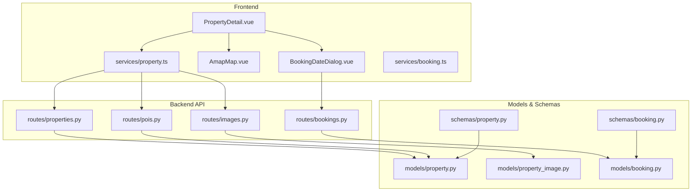
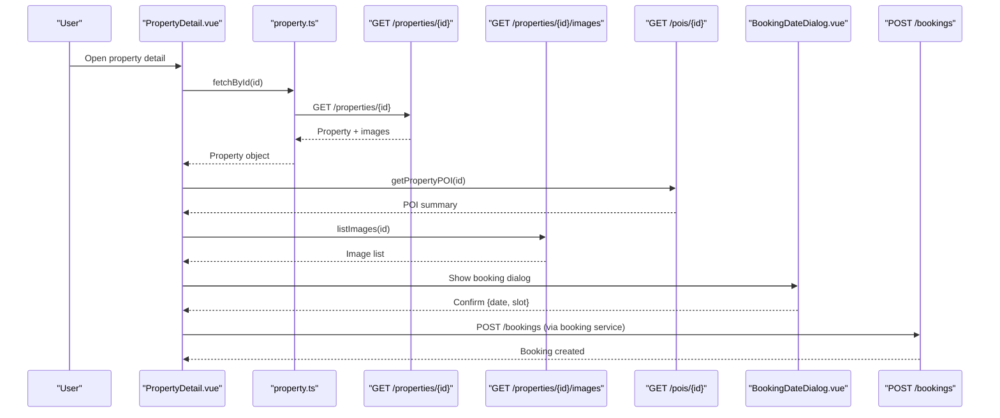
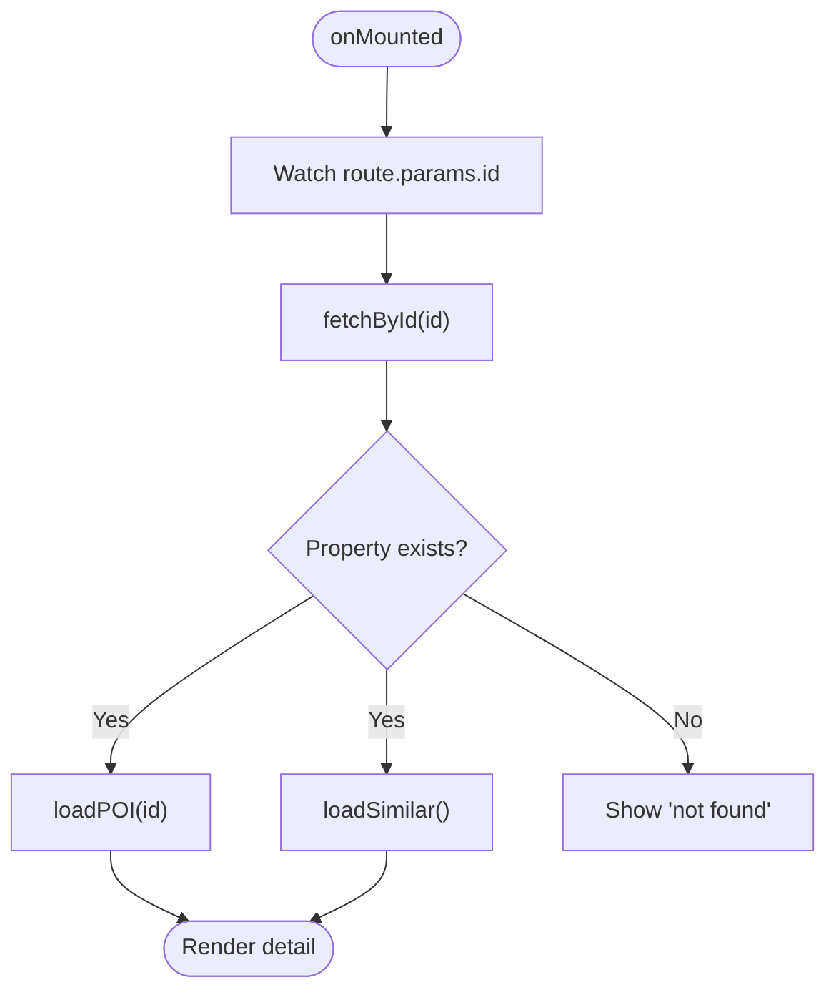
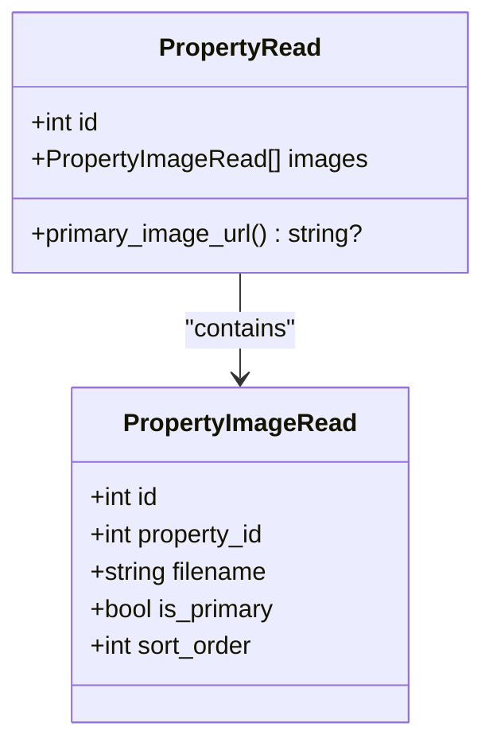
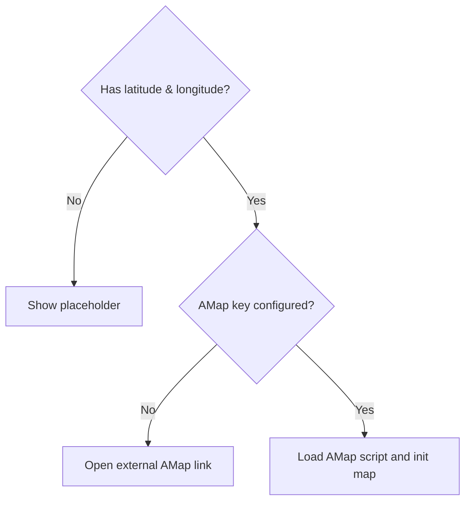
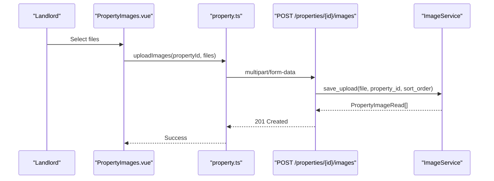
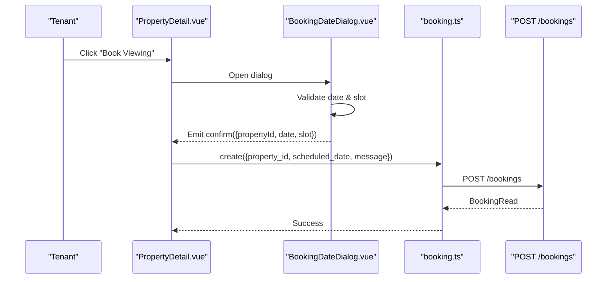
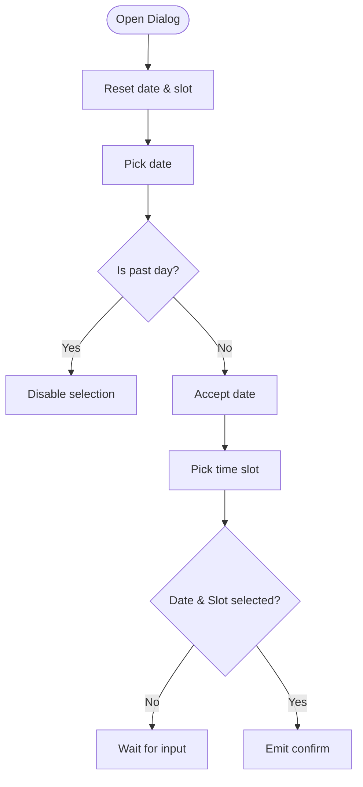
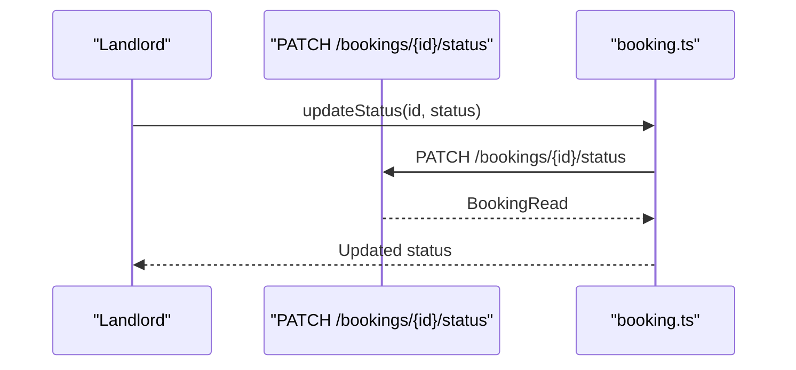
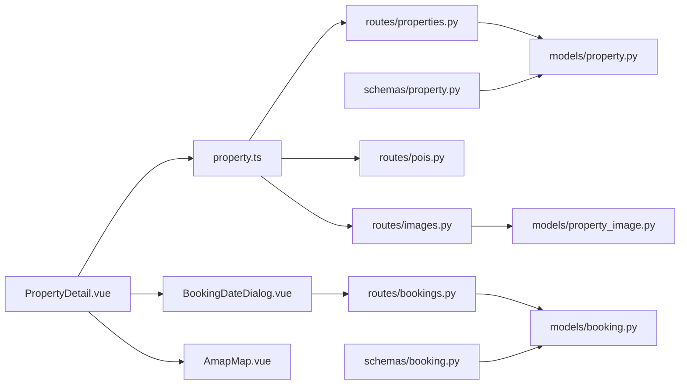

# Property Detail Page

<cite>
**Referenced Files in This Document**
- [PropertyDetail.vue](file://frontend/src/views/PropertyDetail.vue)
- [BookingDateDialog.vue](file://frontend/src/components/BookingDateDialog.vue)
- [property.ts](file://frontend/src/services/property.ts)
- [booking.ts](file://frontend/src/services/booking.ts)
- [properties.py](file://backend/app/api/v1/routes/properties.py)
- [images.py](file://backend/app/api/v1/routes/images.py)
- [pois.py](file://backend/app/api/v1/routes/pois.py)
- [bookings.py](file://backend/app/api/v1/routes/bookings.py)
- [property.py](file://backend/app/models/property.py)
- [property_image.py](file://backend/app/models/property_image.py)
- [booking.py](file://backend/app/models/booking.py)
- [property_schema.py](file://backend/app/schemas/property.py)
- [booking_schema.py](file://backend/app/schemas/booking.py)
- [AmapMap.vue](file://frontend/src/components/AmapMap.vue)
</cite>

## Table of Contents
1. Introduction
2. Project Structure
3. Core Components
4. Architecture Overview
5. Detailed Component Analysis
6. Dependency Analysis
7. Performance Considerations
8. Troubleshooting Guide
9. Conclusion

## Introduction
This document explains the Property Detail Page implementation across frontend and backend layers. It covers property data loading, image gallery and carousel, detailed information display, booking initiation flow, landlord contact features, status indicators, interactive map integration, image upload capabilities for landlords, booking form validation, availability calendar integration, real-time booking status updates, error handling for unavailable properties, and user feedback mechanisms.

## Project Structure
The Property Detail Page is implemented as a Vue 3 component with supporting services and dialogs. The backend exposes REST APIs for properties, images, POI analysis, and bookings.

**Diagram sources**
- [PropertyDetail.vue:1-800](file://frontend/src/views/PropertyDetail.vue#L1-L800)
- [BookingDateDialog.vue:1-305](file://frontend/src/components/BookingDateDialog.vue#L1-L305)
- [AmapMap.vue:1-198](file://frontend/src/components/AmapMap.vue#L1-L198)
- [property.ts:1-86](file://frontend/src/services/property.ts#L1-L86)
- [booking.ts:1-25](file://frontend/src/services/booking.ts#L1-L25)
- [properties.py:1-162](file://backend/app/api/v1/routes/properties.py#L1-L162)
- [images.py:1-151](file://backend/app/api/v1/routes/images.py#L1-L151)
- [pois.py:1-32](file://backend/app/api/v1/routes/pois.py#L1-L32)
- [bookings.py:1-112](file://backend/app/api/v1/routes/bookings.py#L1-L112)
- [property.py:1-86](file://backend/app/models/property.py#L1-L86)
- [property_image.py:1-23](file://backend/app/models/property_image.py#L1-L23)
- [booking.py:1-47](file://backend/app/models/booking.py#L1-L47)
- [property_schema.py:1-79](file://backend/app/schemas/property.py#L1-L79)
- [booking_schema.py:1-35](file://backend/app/schemas/booking.py#L1-L35)

**Section sources**
- [PropertyDetail.vue:1-800](file://frontend/src/views/PropertyDetail.vue#L1-L800)
- [property.ts:1-86](file://frontend/src/services/property.ts#L1-L86)
- [properties.py:1-162](file://backend/app/api/v1/routes/properties.py#L1-L162)

## Core Components
- PropertyDetail.vue: Main page rendering property details, gallery, specs, description, facilities, map, AI POI, reviews, similar properties, and booking dialog trigger.
- BookingDateDialog.vue: Calendar and time slot selection with validation; emits confirmation to proceed to booking confirmation.
- AmapMap.vue: Interactive map component using AMap with fallback to external link if coordinates or key are missing.
- Services:
  - property.ts: Fetches property by ID, lists/searches, geocoding, image management (list/upload/delete/set primary), and POI retrieval.
  - booking.ts: Creates bookings, lists, retrieves by ID, updates status, cancels.
- Backend routes:
  - properties.py: CRUD endpoints for properties including search and detail retrieval.
  - images.py: Upload, list, delete, set primary image with landlord authorization and size/type checks.
  - pois.py: Get or generate POI analysis for a property.
  - bookings.py: Create, list, get, update status, cancel bookings with tenant/landlord permissions.

**Section sources**
- [PropertyDetail.vue:1-800](file://frontend/src/views/PropertyDetail.vue#L1-L800)
- [BookingDateDialog.vue:1-305](file://frontend/src/components/BookingDateDialog.vue#L1-L305)
- [AmapMap.vue:1-198](file://frontend/src/components/AmapMap.vue#L1-L198)
- [property.ts:1-86](file://frontend/src/services/property.ts#L1-L86)
- [booking.ts:1-25](file://frontend/src/services/booking.ts#L1-L25)
- [properties.py:1-162](file://backend/app/api/v1/routes/properties.py#L1-L162)
- [images.py:1-151](file://backend/app/api/v1/routes/images.py#L1-L151)
- [pois.py:1-32](file://backend/app/api/v1/routes/pois.py#L1-L32)
- [bookings.py:1-112](file://backend/app/api/v1/routes/bookings.py#L1-L112)

## Architecture Overview
End-to-end flow from UI to backend for loading a property detail and initiating a booking:

**Diagram sources**
- [PropertyDetail.vue:389-426](file://frontend/src/views/PropertyDetail.vue#L389-L426)
- [property.ts:37-85](file://frontend/src/services/property.ts#L37-L85)
- [properties.py:110-118](file://backend/app/api/v1/routes/properties.py#L110-L118)
- [images.py:136-151](file://backend/app/api/v1/routes/images.py#L136-L151)
- [pois.py:23-32](file://backend/app/api/v1/routes/pois.py#L23-L32)
- [BookingDateDialog.vue:153-177](file://frontend/src/components/BookingDateDialog.vue#L153-L177)
- [booking.ts:4-7](file://frontend/src/services/booking.ts#L4-L7)
- [bookings.py:14-41](file://backend/app/api/v1/routes/bookings.py#L14-L41)

## Detailed Component Analysis

### Property Data Loading Mechanism
- The detail page watches route params and loads the property via store method that calls the backend GET endpoint. On success, it also loads POI and similar properties.
- Error handling: If the property is not found, the backend returns 404; the frontend shows an empty state.

**Diagram sources**
- [PropertyDetail.vue:419-426](file://frontend/src/views/PropertyDetail.vue#L419-L426)
- [PropertyDetail.vue:389-398](file://frontend/src/views/PropertyDetail.vue#L389-L398)
- [properties.py:110-118](file://backend/app/api/v1/routes/properties.py#L110-L118)

**Section sources**
- [PropertyDetail.vue:389-426](file://frontend/src/views/PropertyDetail.vue#L389-L426)
- [properties.py:110-118](file://backend/app/api/v1/routes/properties.py#L110-L118)

### Image Gallery and Carousel
- Images are sorted with primary first, then by sort_order. The carousel uses Element Plus carousel with preview functionality. Thumbnails allow quick navigation.
- Primary image URL helper is provided in schema for convenience.

**Diagram sources**
- [property_schema.py:46-79](file://backend/app/schemas/property.py#L46-L79)
- [property_image.py:8-23](file://backend/app/models/property_image.py#L8-L23)

**Section sources**
- [PropertyDetail.vue:361-373](file://frontend/src/views/PropertyDetail.vue#L361-L373)
- [property_schema.py:46-79](file://backend/app/schemas/property.py#L46-L79)

### Detailed Property Information Display
- Displays title, tags for status and type, location, price, deposit, service fee rate, specs grid, description, dynamic facilities based on property attributes, and reviews section.
- Status and type labels are mapped to localized strings and tag types.

**Section sources**
- [PropertyDetail.vue:40-132](file://frontend/src/views/PropertyDetail.vue#L40-L132)
- [PropertyDetail.vue:343-359](file://frontend/src/views/PropertyDetail.vue#L343-L359)
- [property.py:24-36](file://backend/app/models/property.py#L24-L36)

### Landlord Contact Features
- The current implementation does not include explicit landlord contact actions on the detail page. Future enhancement could add a “Contact Landlord” button that opens a chat or message flow.

[No sources needed since this section proposes enhancements without analyzing specific files]

### Property Status Indicators
- Status enum values: available, rented, maintenance, offline. Mapped to friendly labels and tag colors.

**Section sources**
- [PropertyDetail.vue:343-359](file://frontend/src/views/PropertyDetail.vue#L343-L359)
- [property.py:31-36](file://backend/app/models/property.py#L31-L36)

### Interactive Map Integration
- Two approaches are present:
  - OpenStreetMap iframe embedded with marker and bounding box computed from coordinates.
  - AmapMap.vue component dynamically loads AMap script when configured and renders a marker with controls; falls back to external AMap link if key or coordinates are missing.

**Diagram sources**
- [PropertyDetail.vue:280-286](file://frontend/src/views/PropertyDetail.vue#L280-L286)
- [AmapMap.vue:66-139](file://frontend/src/components/AmapMap.vue#L66-L139)

**Section sources**
- [PropertyDetail.vue:134-169](file://frontend/src/views/PropertyDetail.vue#L134-L169)
- [AmapMap.vue:1-198](file://frontend/src/components/AmapMap.vue#L1-L198)

### Photo Upload Capabilities for Landlords
- Landlord-only endpoints enforce ownership and validate file types and sizes. Supports multiple uploads, setting primary image, and deletion.
- Frontend image management page provides drag-and-drop upload, limit enforcement, and actions overlay.

**Diagram sources**
- [PropertyImages.vue:265-293](file://frontend/src/views/PropertyImages.vue#L265-L293)
- [property.ts:66-72](file://frontend/src/services/property.ts#L66-L72)
- [images.py:26-80](file://backend/app/api/v1/routes/images.py#L26-L80)

**Section sources**
- [images.py:26-80](file://backend/app/api/v1/routes/images.py#L26-L80)
- [images.py:109-133](file://backend/app/api/v1/routes/images.py#L109-L133)
- [images.py:83-107](file://backend/app/api/v1/routes/images.py#L83-L107)
- [PropertyImages.vue:179-350](file://frontend/src/views/PropertyImages.vue#L179-L350)
- [property.ts:62-80](file://frontend/src/services/property.ts#L62-L80)

### Booking Initiation Flow and Availability Calendar Integration
- User clicks “Book Viewing” to open BookingDateDialog. The dialog enforces date selection (future only) and time slot selection. On confirm, navigates to booking confirmation with query parameters.
- Backend creates a booking with validation and conflict checks.

**Diagram sources**
- [PropertyDetail.vue:381-387](file://frontend/src/views/PropertyDetail.vue#L381-L387)
- [BookingDateDialog.vue:153-177](file://frontend/src/components/BookingDateDialog.vue#L153-L177)
- [booking.ts:4-7](file://frontend/src/services/booking.ts#L4-L7)
- [bookings.py:14-41](file://backend/app/api/v1/routes/bookings.py#L14-L41)

**Section sources**
- [PropertyDetail.vue:248-256](file://frontend/src/views/PropertyDetail.vue#L248-L256)
- [BookingDateDialog.vue:119-177](file://frontend/src/components/BookingDateDialog.vue#L119-L177)
- [booking.ts:4-7](file://frontend/src/services/booking.ts#L4-L7)
- [bookings.py:14-41](file://backend/app/api/v1/routes/bookings.py#L14-L41)

### Booking Form Validation
- Date must be today or future; month navigation allowed but selecting past days is disabled. Time slot must be selected before confirming.

**Diagram sources**
- [BookingDateDialog.vue:97-144](file://frontend/src/components/BookingDateDialog.vue#L97-L144)
- [BookingDateDialog.vue:153-177](file://frontend/src/components/BookingDateDialog.vue#L153-L177)

**Section sources**
- [BookingDateDialog.vue:97-144](file://frontend/src/components/BookingDateDialog.vue#L97-L144)
- [BookingDateDialog.vue:153-177](file://frontend/src/components/BookingDateDialog.vue#L153-L177)

### Real-Time Booking Status Updates
- Backend supports updating booking status (approved/rejected) and cancellation. Frontend can poll or use WebSocket/SSE to reflect changes. Current implementation provides service methods for status updates and cancellation.

**Diagram sources**
- [bookings.py:71-93](file://backend/app/api/v1/routes/bookings.py#L71-L93)
- [booking.ts:17-19](file://frontend/src/services/booking.ts#L17-L19)

**Section sources**
- [bookings.py:71-93](file://backend/app/api/v1/routes/bookings.py#L71-L93)
- [booking.ts:17-19](file://frontend/src/services/booking.ts#L17-L19)

### AI POI Analysis
- After loading property, the page requests POI analysis. The backend either returns existing or generates new POI content.

**Section sources**
- [PropertyDetail.vue:400-410](file://frontend/src/views/PropertyDetail.vue#L400-L410)
- [pois.py:23-32](file://backend/app/api/v1/routes/pois.py#L23-L32)

## Dependency Analysis
Component-level dependencies and relationships:

**Diagram sources**
- [PropertyDetail.vue:1-800](file://frontend/src/views/PropertyDetail.vue#L1-L800)
- [property.ts:1-86](file://frontend/src/services/property.ts#L1-L86)
- [BookingDateDialog.vue:1-305](file://frontend/src/components/BookingDateDialog.vue#L1-L305)
- [AmapMap.vue:1-198](file://frontend/src/components/AmapMap.vue#L1-L198)
- [properties.py:1-162](file://backend/app/api/v1/routes/properties.py#L1-L162)
- [images.py:1-151](file://backend/app/api/v1/routes/images.py#L1-L151)
- [pois.py:1-32](file://backend/app/api/v1/routes/pois.py#L1-L32)
- [bookings.py:1-112](file://backend/app/api/v1/routes/bookings.py#L1-L112)
- [property.py:1-86](file://backend/app/models/property.py#L1-L86)
- [property_image.py:1-23](file://backend/app/models/property_image.py#L1-L23)
- [booking.py:1-47](file://backend/app/models/booking.py#L1-L47)
- [property_schema.py:1-79](file://backend/app/schemas/property.py#L1-L79)
- [booking_schema.py:1-35](file://backend/app/schemas/booking.py#L1-L35)

**Section sources**
- [PropertyDetail.vue:1-800](file://frontend/src/views/PropertyDetail.vue#L1-L800)
- [property.ts:1-86](file://frontend/src/services/property.ts#L1-L86)
- [BookingDateDialog.vue:1-305](file://frontend/src/components/BookingDateDialog.vue#L1-L305)
- [AmapMap.vue:1-198](file://frontend/src/components/AmapMap.vue#L1-L198)
- [properties.py:1-162](file://backend/app/api/v1/routes/properties.py#L1-L162)
- [images.py:1-151](file://backend/app/api/v1/routes/images.py#L1-L151)
- [pois.py:1-32](file://backend/app/api/v1/routes/pois.py#L1-L32)
- [bookings.py:1-112](file://backend/app/api/v1/routes/bookings.py#L1-L112)
- [property.py:1-86](file://backend/app/models/property.py#L1-L86)
- [property_image.py:1-23](file://backend/app/models/property_image.py#L1-L23)
- [booking.py:1-47](file://backend/app/models/booking.py#L1-L47)
- [property_schema.py:1-79](file://backend/app/schemas/property.py#L1-L79)
- [booking_schema.py:1-35](file://backend/app/schemas/booking.py#L1-L35)

## Performance Considerations
- Lazy load map scripts only when coordinates and key are available to avoid unnecessary network overhead.
- Use pagination and limits for listing similar properties to reduce payload size.
- Cache POI results server-side to minimize repeated generation costs.
- Defer heavy computations (e.g., sorting images) to computed properties to leverage reactivity efficiently.

[No sources needed since this section provides general guidance]

## Troubleshooting Guide
- Property not found:
  - Backend returns 404; frontend shows empty state. Verify property ID and route params.
- Booking conflicts:
  - Backend may return 409 Conflict if scheduling constraints are violated. Check scheduled_date and existing bookings.
- Image upload errors:
  - Type or size validation failures return 400 Bad Request. Ensure supported formats and size limits.
- Authorization issues:
  - Landlord-only operations require correct role and ownership. Verify current user context.
- Map display issues:
  - Missing coordinates or AMap key will show placeholders or fallback links. Confirm environment variables and data.

**Section sources**
- [properties.py:110-118](file://backend/app/api/v1/routes/properties.py#L110-L118)
- [bookings.py:14-41](file://backend/app/api/v1/routes/bookings.py#L14-L41)
- [images.py:60-71](file://backend/app/api/v1/routes/images.py#L60-L71)
- [images.py:44-48](file://backend/app/api/v1/routes/images.py#L44-L48)
- [AmapMap.vue:12-26](file://frontend/src/components/AmapMap.vue#L12-L26)

## Conclusion
The Property Detail Page integrates rich media, interactive maps, and a streamlined booking workflow. Robust backend validations and clear frontend error states ensure a reliable user experience. Extensibility points include adding landlord contact flows, real-time booking updates via WebSockets, and enhanced availability calendars backed by backend scheduling logic.