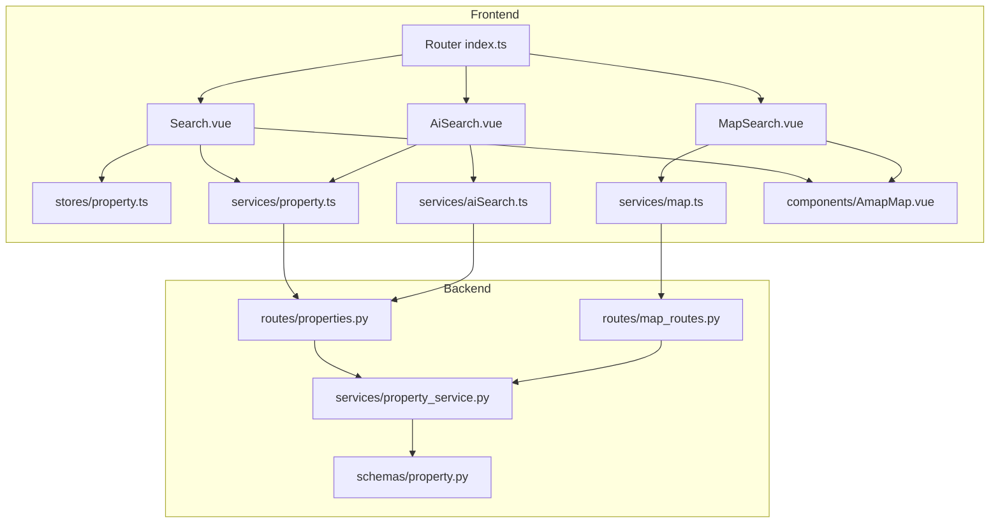
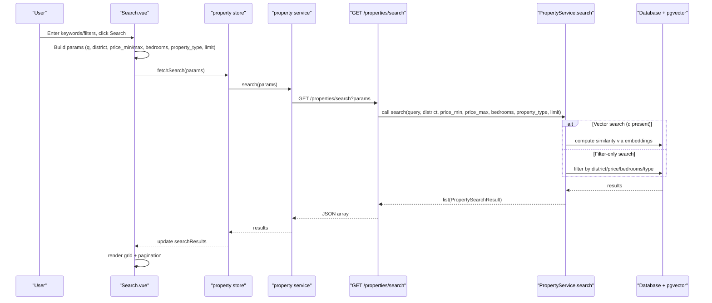
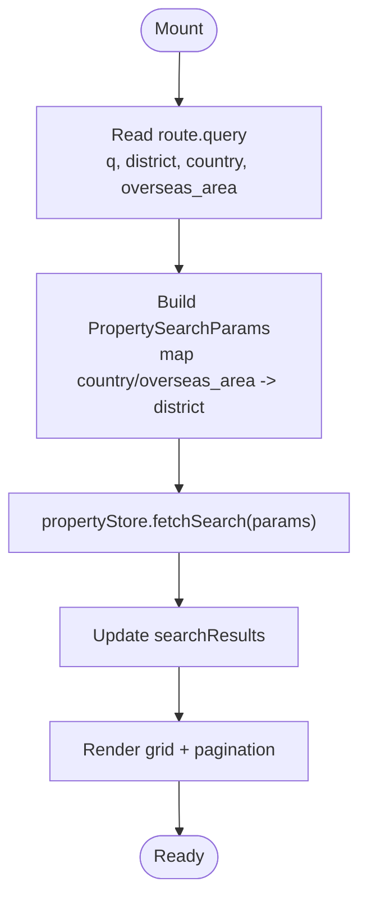
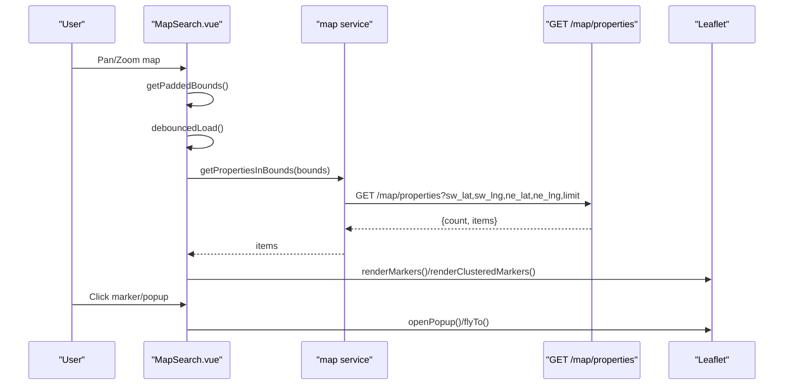
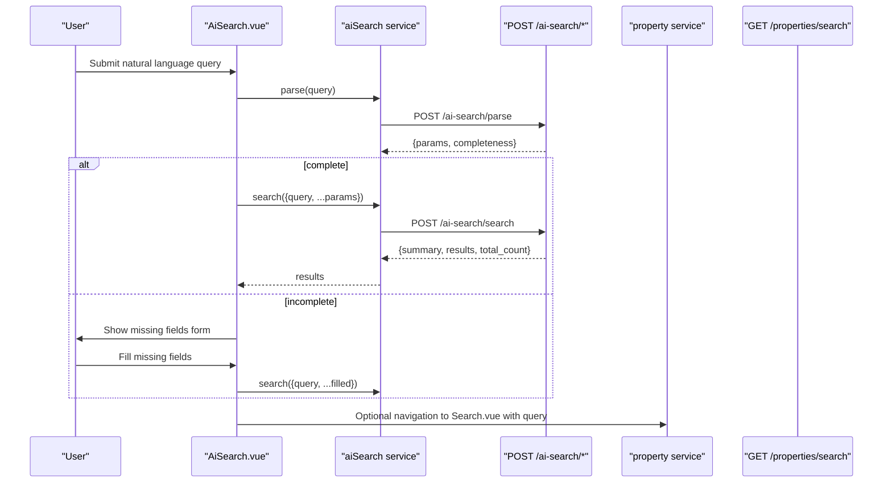
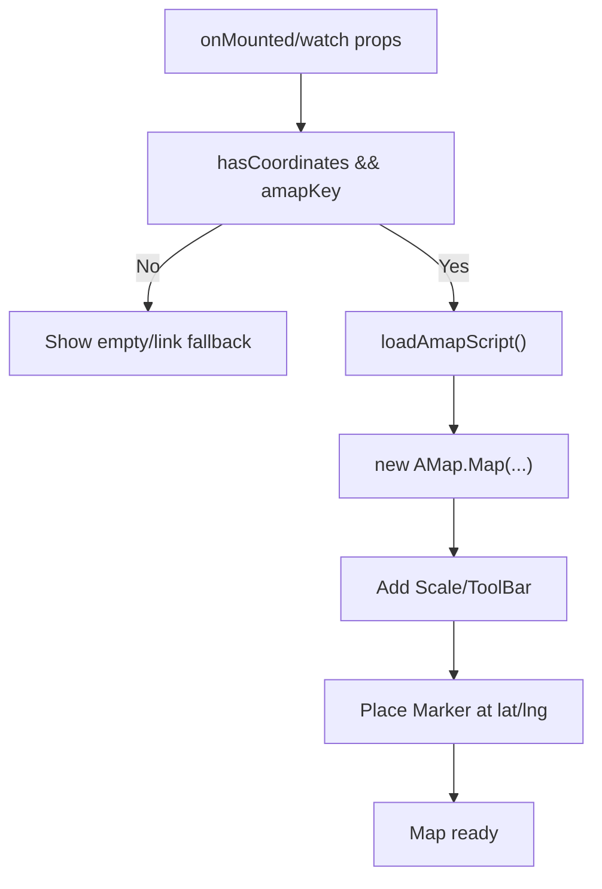
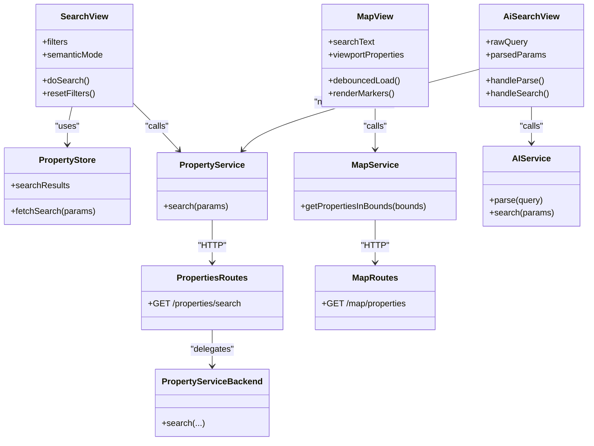
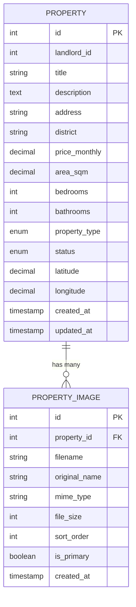

# Search Page

<cite>
**Referenced Files in This Document**
- [Search.vue](file://frontend/src/views/Search.vue)
- [MapSearch.vue](file://frontend/src/views/MapSearch.vue)
- [AmapMap.vue](file://frontend/src/components/AmapMap.vue)
- [property.ts (services)](file://frontend/src/services/property.ts)
- [map.ts (services)](file://frontend/src/services/map.ts)
- [aiSearch.ts (services)](file://frontend/src/services/aiSearch.ts)
- [AiSearch.vue](file://frontend/src/views/AiSearch.vue)
- [property.ts (types)](file://frontend/src/types/property.ts)
- [property.ts (store)](file://frontend/src/stores/property.ts)
- [properties.py (routes)](file://backend/app/api/v1/routes/properties.py)
- [map_routes.py (routes)](file://backend/app/api/v1/routes/map_routes.py)
- [property_service.py](file://backend/app/services/property_service.py)
- [property.py (schemas)](file://backend/app/schemas/property.py)
- [index.ts (router)](file://frontend/src/router/index.ts)
</cite>

## Table of Contents
1. [Introduction](#introduction)
2. [Project Structure](#project-structure)
3. [Core Components](#core-components)
4. [Architecture Overview](#architecture-overview)
5. [Detailed Component Analysis](#detailed-component-analysis)
6. [Dependency Analysis](#dependency-analysis)
7. [Performance Considerations](#performance-considerations)
8. [Troubleshooting Guide](#troubleshooting-guide)
9. [Conclusion](#conclusion)
10. [Appendices](#appendices)

## Introduction
This document explains the Search Page functionality across list view and map view experiences. It covers:
- Dual-mode interface: list-based search with filters and AI semantic mode, and a full-screen map view for location-based exploration.
- Query processing: keyword handling, parameter mapping (including country/overseas_area to district), sorting options, and pagination.
- Backend integration: property search API, vector similarity search, and map viewport queries.
- Property filtering and display formats: price range, bedrooms, type, district/country, and result cards.
- Map integration: Leaflet-based map with clustering, markers, popups, and side drawer; AMap component fallback for detail views.
- Real-time updates: debounced viewport queries and live marker rendering.
- Examples: search history via URL query sync, debounced input patterns, and responsive layout switching between list and map modes.

## Project Structure
The search feature spans frontend views, services, store, types, and backend routes/services. The key entry points are:
- List search page: /search
- Map search page: /map
- AI-assisted search: /ai-search

**Diagram sources**
- [index.ts (router):1-212](file://frontend/src/router/index.ts#L1-L212)
- [Search.vue:1-495](file://frontend/src/views/Search.vue#L1-L495)
- [MapSearch.vue:1-612](file://frontend/src/views/MapSearch.vue#L1-L612)
- [AiSearch.vue:1-593](file://frontend/src/views/AiSearch.vue#L1-L593)
- [property.ts (store):1-136](file://frontend/src/stores/property.ts#L1-L136)
- [property.ts (services):1-86](file://frontend/src/services/property.ts#L1-L86)
- [map.ts (services):1-57](file://frontend/src/services/map.ts#L1-L57)
- [aiSearch.ts (services):1-66](file://frontend/src/services/aiSearch.ts#L1-L66)
- [AmapMap.vue:1-198](file://frontend/src/components/AmapMap.vue#L1-L198)
- [properties.py (routes):1-162](file://backend/app/api/v1/routes/properties.py#L1-L162)
- [map_routes.py (routes):1-80](file://backend/app/api/v1/routes/map_routes.py#L1-L80)
- [property_service.py:1-239](file://backend/app/services/property_service.py#L1-L239)
- [property.py (schemas):1-79](file://backend/app/schemas/property.py#L1-L79)

**Section sources**
- [index.ts (router):1-212](file://frontend/src/router/index.ts#L1-L212)

## Core Components
- Search.vue: List view search with AI semantic toggle, multi-field filters, sorting, pagination, and route-synced parameters.
- MapSearch.vue: Full-screen map using Leaflet with viewport-based queries, clustering, markers, popups, and a slide-in drawer.
- AiSearch.vue: Natural language parsing flow that extracts structured parameters and optionally prompts for missing fields before searching.
- Services:
  - property.ts: Wraps GET /properties/search and other property endpoints.
  - map.ts: Wraps GET /map/properties for viewport queries and GET /map/config.
  - aiSearch.ts: Wraps POST /ai-search/parse and POST /ai-search/search.
- Store: property.ts maintains search results and loading state.
- Types: property.ts defines shared interfaces for properties and search parameters.
- Backend:
  - properties.py: Exposes GET /properties/search supporting q, district, price_min/max, bedrooms, property_type, limit.
  - map_routes.py: Exposes GET /map/properties for bounding box queries and GET /map/config.
  - property_service.py: Implements search logic including pgvector similarity and Redis caching for non-vector queries.
  - schemas/property.py: Defines PropertySearchResult and related models.

**Section sources**
- [Search.vue:1-495](file://frontend/src/views/Search.vue#L1-L495)
- [MapSearch.vue:1-612](file://frontend/src/views/MapSearch.vue#L1-L612)
- [AiSearch.vue:1-593](file://frontend/src/views/AiSearch.vue#L1-L593)
- [property.ts (services):1-86](file://frontend/src/services/property.ts#L1-L86)
- [map.ts (services):1-57](file://frontend/src/services/map.ts#L1-L57)
- [aiSearch.ts (services):1-66](file://frontend/src/services/aiSearch.ts#L1-L66)
- [property.ts (store):1-136](file://frontend/src/stores/property.ts#L1-L136)
- [property.ts (types):1-95](file://frontend/src/types/property.ts#L1-L95)
- [properties.py (routes):1-162](file://backend/app/api/v1/routes/properties.py#L1-L162)
- [map_routes.py (routes):1-80](file://backend/app/api/v1/routes/map_routes.py#L1-L80)
- [property_service.py:1-239](file://backend/app/services/property_service.py#L1-L239)
- [property.py (schemas):1-79](file://backend/app/schemas/property.py#L1-L79)

## Architecture Overview
End-to-end flows for list search, map search, and AI search.

**Diagram sources**
- [Search.vue:244-390](file://frontend/src/views/Search.vue#L244-L390)
- [property.ts (store):26-34](file://frontend/src/stores/property.ts#L26-L34)
- [property.ts (services):33-35](file://frontend/src/services/property.ts#L33-L35)
- [properties.py (routes):36-91](file://backend/app/api/v1/routes/properties.py#L36-L91)
- [property_service.py:91-195](file://backend/app/services/property_service.py#L91-L195)

## Detailed Component Analysis

### Search.vue (List View)
Responsibilities:
- UI for AI semantic vs exact search toggle.
- Filters: country/region, district/overseas area, price range, bedrooms, property type, sort order.
- Route synchronization: reads/writes query parameters (q, district, country, overseas_area).
- Pagination: client-side slicing over fetched results.
- Booking dialog integration.

Key behaviors:
- Parameter mapping: country/overseas_area mapped to district before sending to backend.
- Sorting: UI supports similarity, price asc/desc, area desc; backend currently orders by similarity when q is provided or created_at otherwise.
- Debounced input: not implemented here; immediate search on submit/filter change.

**Diagram sources**
- [Search.vue:353-390](file://frontend/src/views/Search.vue#L353-L390)
- [Search.vue:319-338](file://frontend/src/views/Search.vue#L319-L338)
- [property.ts (store):26-34](file://frontend/src/stores/property.ts#L26-L34)

**Section sources**
- [Search.vue:1-495](file://frontend/src/views/Search.vue#L1-L495)
- [property.ts (types):68-80](file://frontend/src/types/property.ts#L68-L80)

### MapSearch.vue (Map View)
Responsibilities:
- Initialize Leaflet map with OpenStreetMap tiles.
- Location search via Nominatim geocoding.
- Viewport-based property queries with padding and debouncing.
- Marker rendering: individual markers at high zoom, custom cluster icons at low zoom.
- Side drawer listing current viewport properties with fly-to interactions.

Key behaviors:
- Debounced viewport load: 300ms delay on moveend/zoomend.
- Bounds calculation: padded bounds to include nearby properties.
- Clustering: manual grid-based clustering with dynamic size based on count.
- Popup content: title, address, price, link to detail.

**Diagram sources**
- [MapSearch.vue:107-145](file://frontend/src/views/MapSearch.vue#L107-L145)
- [MapSearch.vue:148-253](file://frontend/src/views/MapSearch.vue#L148-L253)
- [map.ts (services):38-50](file://frontend/src/services/map.ts#L38-L50)
- [map_routes.py (routes):14-68](file://backend/app/api/v1/routes/map_routes.py#L14-L68)

**Section sources**
- [MapSearch.vue:1-612](file://frontend/src/views/MapSearch.vue#L1-L612)
- [map.ts (services):1-57](file://frontend/src/services/map.ts#L1-L57)

### AiSearch.vue (Natural Language Flow)
Responsibilities:
- Parse natural language into structured parameters.
- Prompt user for missing fields if incomplete.
- Execute search and display summary + results.
- Navigate to traditional search with populated query params.

Key behaviors:
- Two-step flow: parse then search.
- Completeness report guides form inputs.
- Transitions seamlessly to Search.vue with query parameters.

**Diagram sources**
- [AiSearch.vue:269-336](file://frontend/src/views/AiSearch.vue#L269-L336)
- [aiSearch.ts (services):56-66](file://frontend/src/services/aiSearch.ts#L56-L66)
- [property.ts (services):33-35](file://frontend/src/services/property.ts#L33-L35)

**Section sources**
- [AiSearch.vue:1-593](file://frontend/src/views/AiSearch.vue#L1-L593)
- [aiSearch.ts (services):1-66](file://frontend/src/services/aiSearch.ts#L1-L66)

### AmapMap.vue (AMap Integration)
Responsibilities:
- Display an embedded AMap instance if coordinates and API key are available.
- Fallback to external AMap link if key missing or coordinates absent.
- Dynamically load AMap script and manage lifecycle.

Key behaviors:
- Lazy script loading with security code support.
- Watchers reinitialize map on coordinate/key changes.
- Provides formatted coordinates and actions.

**Diagram sources**
- [AmapMap.vue:66-122](file://frontend/src/components/AmapMap.vue#L66-L122)
- [AmapMap.vue:124-139](file://frontend/src/components/AmapMap.vue#L124-L139)

**Section sources**
- [AmapMap.vue:1-198](file://frontend/src/components/AmapMap.vue#L1-L198)

## Dependency Analysis
Component relationships and data flows:

**Diagram sources**
- [Search.vue:244-390](file://frontend/src/views/Search.vue#L244-L390)
- [MapSearch.vue:68-145](file://frontend/src/views/MapSearch.vue#L68-L145)
- [AiSearch.vue:200-336](file://frontend/src/views/AiSearch.vue#L200-L336)
- [property.ts (store):1-136](file://frontend/src/stores/property.ts#L1-L136)
- [property.ts (services):1-86](file://frontend/src/services/property.ts#L1-L86)
- [map.ts (services):1-57](file://frontend/src/services/map.ts#L1-L57)
- [aiSearch.ts (services):1-66](file://frontend/src/services/aiSearch.ts#L1-L66)
- [properties.py (routes):36-91](file://backend/app/api/v1/routes/properties.py#L36-L91)
- [map_routes.py (routes):14-68](file://backend/app/api/v1/routes/map_routes.py#L14-L68)
- [property_service.py:91-195](file://backend/app/services/property_service.py#L91-L195)

**Section sources**
- [Search.vue:1-495](file://frontend/src/views/Search.vue#L1-L495)
- [MapSearch.vue:1-612](file://frontend/src/views/MapSearch.vue#L1-L612)
- [AiSearch.vue:1-593](file://frontend/src/views/AiSearch.vue#L1-L593)
- [property.ts (store):1-136](file://frontend/src/stores/property.ts#L1-L136)
- [property.ts (services):1-86](file://frontend/src/services/property.ts#L1-L86)
- [map.ts (services):1-57](file://frontend/src/services/map.ts#L1-L57)
- [aiSearch.ts (services):1-66](file://frontend/src/services/aiSearch.ts#L1-L66)
- [properties.py (routes):1-162](file://backend/app/api/v1/routes/properties.py#L1-L162)
- [map_routes.py (routes):1-80](file://backend/app/api/v1/routes/map_routes.py#L1-L80)
- [property_service.py:1-239](file://backend/app/services/property_service.py#L1-L239)

## Performance Considerations
- Debouncing:
  - MapSearch uses a 300ms debounce on map movement/zoom to reduce repeated viewport queries.
  - Search.vue does not implement input debouncing; consider adding it for smoother typing experience.
- Caching:
  - Backend caches non-vector search results (filter-only) in Redis with TTL.
  - Vector searches bypass cache due to dynamic embedding generation.
- Rendering:
  - Map clustering reduces DOM overhead at lower zoom levels.
  - Client-side pagination slices results for efficient rendering.

[No sources needed since this section provides general guidance]

## Troubleshooting Guide
Common issues and resolutions:
- No results in list search:
  - Verify filters and ensure district mapping from country/overseas_area is correct.
  - Confirm backend accepts limit within 1–100.
- Map shows no markers:
  - Ensure properties have latitude/longitude set.
  - Check network requests to /map/properties and verify bounds parameters.
- AMap not displaying:
  - Confirm VITE_AMAP_KEY configured; otherwise, component falls back to external link.
  - Validate coordinates exist for the property.
- AI search errors:
  - Inspect parse/search responses for validation errors.
  - Ensure required fields are filled when completeness indicates missing fields.

**Section sources**
- [Search.vue:319-338](file://frontend/src/views/Search.vue#L319-L338)
- [MapSearch.vue:124-145](file://frontend/src/views/MapSearch.vue#L124-L145)
- [AmapMap.vue:66-122](file://frontend/src/components/AmapMap.vue#L66-L122)
- [AiSearch.vue:269-336](file://frontend/src/views/AiSearch.vue#L269-L336)
- [property_service.py:102-195](file://backend/app/services/property_service.py#L102-L195)

## Conclusion
The Search Page offers a comprehensive dual-mode experience:
- List view with robust filtering, AI semantic mode, and route-synced parameters.
- Map view with real-time viewport queries, clustering, and interactive markers.
- AI-assisted search streamlines natural language input into structured queries.
Integration with backend APIs ensures scalable search with vector similarity and efficient caching. Future enhancements may include input debouncing in list view and expanded sorting capabilities aligned with backend ordering.

[No sources needed since this section summarizes without analyzing specific files]

## Appendices

### API Definitions

- GET /properties/search
  - Query parameters:
    - q: string | null — Natural language query for vector similarity.
    - district: string | null — District filter.
    - price_min: Decimal | null — Minimum monthly price.
    - price_max: Decimal | null — Maximum monthly price.
    - bedrooms: int | null — Exact bedroom count.
    - property_type: string | null — Type filter.
    - limit: int — Max results (1–100).
  - Response: Array of PropertySearchResult objects.

- GET /map/properties
  - Query parameters:
    - sw_lat, sw_lng, ne_lat, ne_lng: float | null — Bounding box.
    - limit: int — Max results (≤1000).
  - Response: { count: number, items: MapProperty[] }.

- POST /ai-search/parse
  - Body: { query: string }
  - Response: { params: ParsedSearchParams, completeness: CompletenessReport }

- POST /ai-search/search
  - Body: AiSearchRequest (includes query and optional structured fields).
  - Response: { summary: string, top_ids: number[], results: PropertySearchResult[], total_count: number, search_params: AiSearchRequest }

**Section sources**
- [properties.py (routes):36-91](file://backend/app/api/v1/routes/properties.py#L36-L91)
- [map_routes.py (routes):14-68](file://backend/app/api/v1/routes/map_routes.py#L14-L68)
- [aiSearch.ts (services):56-66](file://frontend/src/services/aiSearch.ts#L56-L66)
- [property.py (schemas):64-79](file://backend/app/schemas/property.py#L64-L79)

### Data Models

**Diagram sources**
- [property.py (schemas):11-79](file://backend/app/schemas/property.py#L11-L79)