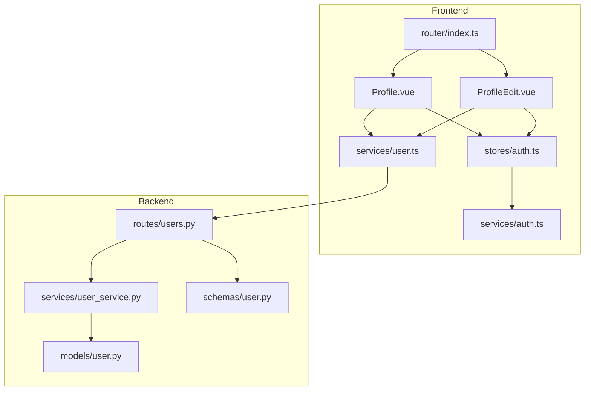
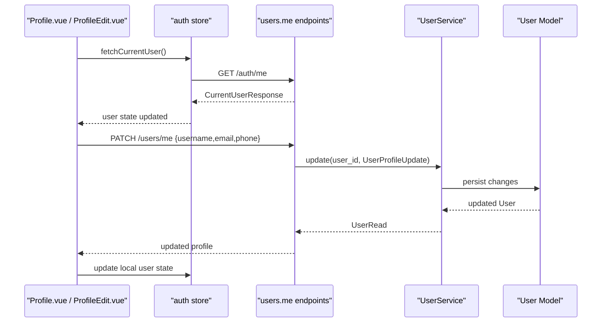

# User Profile Page

<cite>
**Referenced Files in This Document**
- [Profile.vue](file://frontend/src/views/Profile.vue)
- [ProfileEdit.vue](file://frontend/src/views/ProfileEdit.vue)
- [auth.ts](file://frontend/src/stores/auth.ts)
- [user.ts](file://frontend/src/services/user.ts)
- [auth.ts](file://frontend/src/services/auth.ts)
- [index.ts](file://frontend/src/router/index.ts)
- [users.py](file://backend/app/api/v1/routes/users.py)
- [user_service.py](file://backend/app/services/user_service.py)
- [user.py](file://backend/app/models/user.py)
- [user.py](file://backend/app/schemas/user.py)
</cite>

## Table of Contents
1. [Introduction](#introduction)
2. [Project Structure](#project-structure)
3. [Core Components](#core-components)
4. [Architecture Overview](#architecture-overview)
5. [Detailed Component Analysis](#detailed-component-analysis)
6. [Dependency Analysis](#dependency-analysis)
7. [Performance Considerations](#performance-considerations)
8. [Troubleshooting Guide](#troubleshooting-guide)
9. [Conclusion](#conclusion)

## Introduction
This document provides comprehensive documentation for the User Profile and Account Management feature set, focusing on:
- Authentication status display
- Profile information editing
- Role-based interface variations (tenant, landlord, administrator)
- User statistics dashboard, activity history, and preference settings
- Logout functionality and account deletion processes
- Privacy controls and security considerations for sensitive user data and session management
- Examples for profile image upload, contact information management, and notification preferences

The implementation spans both frontend Vue components and backend FastAPI routes and services.

## Project Structure
The profile feature is implemented across these key areas:
- Frontend views: Profile overview and profile editing pages
- Frontend store: Authentication state and logout behavior
- Frontend services: API calls for user profile operations
- Backend routes: REST endpoints for reading/updating current user profile
- Backend service: Business logic for user CRUD operations
- Backend models and schemas: Data contracts and role/status enums



**Diagram sources**
- [Profile.vue:1-478](file://frontend/src/views/Profile.vue#L1-L478)
- [ProfileEdit.vue:1-187](file://frontend/src/views/ProfileEdit.vue#L1-L187)
- [auth.ts:1-101](file://frontend/src/stores/auth.ts#L1-L101)
- [user.ts:1-17](file://frontend/src/services/user.ts#L1-L17)
- [auth.ts:1-22](file://frontend/src/services/auth.ts#L1-L22)
- [index.ts:1-212](file://frontend/src/router/index.ts#L1-L212)
- [users.py:1-102](file://backend/app/api/v1/routes/users.py#L1-L102)
- [user_service.py:1-57](file://backend/app/services/user_service.py#L1-L57)
- [user.py:1-48](file://backend/app/models/user.py#L1-L48)
- [user.py:1-45](file://backend/app/schemas/user.py#L1-L45)

**Section sources**
- [Profile.vue:1-478](file://frontend/src/views/Profile.vue#L1-L478)
- [ProfileEdit.vue:1-187](file://frontend/src/views/ProfileEdit.vue#L1-L187)
- [auth.ts:1-101](file://frontend/src/stores/auth.ts#L1-L101)
- [user.ts:1-17](file://frontend/src/services/user.ts#L1-L17)
- [auth.ts:1-22](file://frontend/src/services/auth.ts#L1-L22)
- [index.ts:1-212](file://frontend/src/router/index.ts#L1-L212)
- [users.py:1-102](file://backend/app/api/v1/routes/users.py#L1-L102)
- [user_service.py:1-57](file://backend/app/services/user_service.py#L1-L57)
- [user.py:1-48](file://backend/app/models/user.py#L1-L48)
- [user.py:1-45](file://backend/app/schemas/user.py#L1-L45)

## Core Components
- Profile overview page: Displays authentication status, basic user info, quick stats, and tabs for bookings, contracts, favorites, bills, repairs, messages, and settings.
- Profile edit page: View/edit mode for username, email, phone; shows role and WeChat binding status; includes notification toggles and a logout action.
- Auth store: Manages token and user state, login flow, logout, and derived flags like isLoggedIn, isLandlord, isAdmin.
- User service: Provides methods to get and update the current user’s profile via backend endpoints.
- Backend user routes: Expose GET/PATCH /api/v1/users/me for authenticated users; admin-only endpoints for listing/updating/deleting other users.
- User model and schema: Define roles, statuses, and request/response contracts.

Key responsibilities:
- Displaying and updating non-sensitive profile fields safely
- Enforcing role-based access at router and API levels
- Managing session persistence and logout behavior
- Presenting user statistics and activity-related tabs

**Section sources**
- [Profile.vue:1-478](file://frontend/src/views/Profile.vue#L1-L478)
- [ProfileEdit.vue:1-187](file://frontend/src/views/ProfileEdit.vue#L1-L187)
- [auth.ts:1-101](file://frontend/src/stores/auth.ts#L1-L101)
- [user.ts:1-17](file://frontend/src/services/user.ts#L1-L17)
- [users.py:1-102](file://backend/app/api/v1/routes/users.py#L1-L102)
- [user_service.py:1-57](file://backend/app/services/user_service.py#L1-L57)
- [user.py:1-48](file://backend/app/models/user.py#L1-L48)
- [user.py:1-45](file://backend/app/schemas/user.py#L1-L45)

## Architecture Overview
The profile feature follows a standard client-server architecture with role-based guards:



**Diagram sources**
- [Profile.vue:322-428](file://frontend/src/views/Profile.vue#L322-L428)
- [ProfileEdit.vue:122-139](file://frontend/src/views/ProfileEdit.vue#L122-L139)
- [auth.ts:68-76](file://frontend/src/stores/auth.ts#L68-L76)
- [user.ts:4-16](file://frontend/src/services/user.ts#L4-L16)
- [users.py:37-58](file://backend/app/api/v1/routes/users.py#L37-L58)
- [user_service.py:37-47](file://backend/app/services/user_service.py#L37-L47)
- [user.py:24-48](file://backend/app/models/user.py#L24-L48)
- [user.py:31-45](file://backend/app/schemas/user.py#L31-L45)

## Detailed Component Analysis

### Profile Overview (Profile.vue)
- Authentication status display: Shows username, tags for tenant role and verification status, masked phone, join date, and actions to edit profile and start identity verification.
- Statistics dashboard: Cards for bookings count, unpaid orders, contracts, and favorites; clicking navigates to relevant tabs or flows.
- Tabs:
  - Bookings: Filterable list with cancel and pay actions.
  - Contracts: Derived from bookings with deposit/payment states; view/download options.
  - Favorites: Grid of properties using shared component.
  - Bills: Unpaid/paid lists with payment navigation.
  - Repairs: Simple form and list with status tags.
  - Messages: Landlord chats and system notices.
  - Settings: Account security (phone, password placeholder, WeChat binding), ID upload, notifications switches, help links.
- Data fetching: On mount, loads current user and initial data (bookings, favorites).

Role-based variations:
- The overview displays a tenant tag by default and uses generic labels. Role-specific sections are gated elsewhere in the app (e.g., landlord workspace), but this page remains accessible to all authenticated users.

Security and privacy:
- Phone numbers are masked when displayed.
- Password field is shown as masked placeholder only.
- Identity verification and ID upload are present but not wired to backend in this view.

**Section sources**
- [Profile.vue:1-478](file://frontend/src/views/Profile.vue#L1-L478)

### Profile Edit (ProfileEdit.vue)
- View mode: Displays username, email, phone, role tag, WeChat binding status, registration date, and a logout button.
- Edit mode: Form with validation for username; optional email and phone; file upload for ID/passport; notification toggles for booking, contract, and new listing alerts.
- Save flow: Validates form, calls updateMyProfile, updates local store and localStorage, shows success message.
- WeChat binding: Placeholder actions for rebind/bind.

Role-based variations:
- Role label and tag type reflect current user role (tenant/landlord/admin).

Privacy controls:
- Only allows updating safe fields (username, email, phone) via the allowed schema.

**Section sources**
- [ProfileEdit.vue:1-187](file://frontend/src/views/ProfileEdit.vue#L1-L187)

### Authentication Status and Session Management (auth store)
- State: user, token, loading.
- Computed flags: isLoggedIn, isLandlord, isAdmin.
- Login: Obtains token, then fetches full profile and persists both token and user object to localStorage.
- Logout: Clears token and user from memory and storage, redirects to login.
- Initialization: Loads persisted auth state on store creation.

Session management:
- Token and user are stored in localStorage.
- Router guards enforce authentication and role requirements before accessing protected routes.

**Section sources**
- [auth.ts:1-101](file://frontend/src/stores/auth.ts#L1-L101)
- [index.ts:182-209](file://frontend/src/router/index.ts#L182-L209)

### User Service and API Integration
- userService.getMyProfile(): Calls GET /users/me.
- userService.updateMyProfile(data): Calls PATCH /users/me with allowed fields.
- userService.list(params): Admin-only listing endpoint (requires admin role on backend).

**Section sources**
- [user.ts:1-17](file://frontend/src/services/user.ts#L1-L17)
- [users.py:27-34](file://backend/app/api/v1/routes/users.py#L27-L34)

### Backend Endpoints and Security
- GET /api/v1/users/me: Returns current user profile for authenticated users.
- PATCH /api/v1/users/me: Updates allowed fields (username, phone, email) for the current user; rejects attempts to change role/status due to schema constraints.
- Admin-only endpoints: List/update/delete other users require admin role.

Data contracts:
- UserProfileUpdate restricts fields to username, phone, email.
- UserRead exposes id, timestamps, role, status, and contact fields without password_hash.

**Section sources**
- [users.py:37-58](file://backend/app/api/v1/routes/users.py#L37-L58)
- [user.py:31-45](file://backend/app/schemas/user.py#L31-L45)
- [user.py:24-48](file://backend/app/models/user.py#L24-L48)

### Role-Based Interface Variations
- Tenant: Default role; can access profile and personal tabs.
- Landlord: Can access landlord-specific routes (workspace, manage properties); profile page remains available.
- Administrator: Access to admin routes; can manage other users via admin endpoints.

Router-level enforcement:
- requiresAuth: Protects profile and related routes.
- requiresLandlord: Restricts landlord-only routes.
- requiresAdmin: Restricts admin-only routes.

**Section sources**
- [index.ts:36-160](file://frontend/src/router/index.ts#L36-L160)
- [index.ts:182-209](file://frontend/src/router/index.ts#L182-L209)

### User Statistics Dashboard and Activity History
- Stats cards show counts for bookings, unpaid orders, contracts, and favorites.
- Activity history is represented through tabs:
  - Bookings: Filterable by status.
  - Contracts: Derived from bookings with deposit/payment states.
  - Bills: Unpaid/paid lists.
  - Repairs: Submission and tracking.
  - Messages: Landlord chats and system notices.

Note: Some data sources are currently mocked within the view; integration with backend services would be required for production accuracy.

**Section sources**
- [Profile.vue:27-294](file://frontend/src/views/Profile.vue#L27-L294)

### Preference Settings
- Notification toggles:
  - In-app notifications and SMS in settings tab.
  - Booking, contract, and new listing toggles in profile edit.
- These toggles are currently local UI state; persistence to backend is not implemented in the referenced files.

**Section sources**
- [Profile.vue:247-294](file://frontend/src/views/Profile.vue#L247-L294)
- [ProfileEdit.vue:60-66](file://frontend/src/views/ProfileEdit.vue#L60-L66)

### Logout Functionality
- From ProfileEdit: “退出登录” triggers authStore.logout(), clearing tokens and redirecting to login.
- From auth store: logout clears local storage and navigates to login route.

**Section sources**
- [ProfileEdit.vue:33-34](file://frontend/src/views/ProfileEdit.vue#L33-L34)
- [auth.ts:78-81](file://frontend/src/stores/auth.ts#L78-L81)

### Account Deletion Processes
- Backend supports deleting users via DELETE /api/v1/users/{user_id}, guarded by admin requirement.
- Frontend does not expose a self-service account deletion option in the profile pages.
- For compliance and safety, consider adding a confirmation flow and soft-delete semantics if needed.

**Section sources**
- [users.py:93-102](file://backend/app/api/v1/routes/users.py#L93-L102)

### Privacy Controls
- Masked phone display in profile header.
- Password field shown as masked placeholder only.
- Allowed update fields restricted to username, phone, email via UserProfileUpdate schema.
- No direct exposure of password_hash in responses.

**Section sources**
- [Profile.vue:14-18](file://frontend/src/views/Profile.vue#L14-L18)
- [Profile.vue:253-261](file://frontend/src/views/Profile.vue#L253-L261)
- [user.py:31-45](file://backend/app/schemas/user.py#L31-L45)

### Examples: Profile Image Upload and Contact Information Management
- Profile image upload: Not implemented in the profile pages; placeholders exist for ID upload and verification dialogs.
- Contact information management: Username, email, and phone can be edited via ProfileEdit and persisted via PATCH /users/me.

**Section sources**
- [Profile.vue:266-272](file://frontend/src/views/Profile.vue#L266-L272)
- [ProfileEdit.vue:46-59](file://frontend/src/views/ProfileEdit.vue#L46-L59)
- [user.ts:9-11](file://frontend/src/services/user.ts#L9-L11)
- [users.py:42-58](file://backend/app/api/v1/routes/users.py#L42-L58)

### Security Considerations for Sensitive User Data and Session Management
- Session persistence: Token and user stored in localStorage; ensure HTTPS and secure cookie strategies in production.
- Role-based access control enforced at router level and backend dependencies.
- Input validation: Backend schemas forbid extra fields and constrain lengths/types.
- Integrity checks: Unique constraints on username, email, phone, wechat_openid prevent conflicts.
- Audit logging: Authentication events are logged on register/login endpoints.

**Section sources**
- [auth.ts:17-42](file://frontend/src/stores/auth.ts#L17-L42)
- [index.ts:182-209](file://frontend/src/router/index.ts#L182-L209)
- [users.py:13-24](file://backend/app/api/v1/routes/users.py#L13-L24)
- [user.py:8-15](file://backend/app/schemas/user.py#L8-L15)

## Dependency Analysis
```mermaid
classDiagram
class ProfileView {
+activeTab
+bookings
+favorites
+repairs
+chats
+notices
+fetchAll()
+cancelBooking()
+downloadContract()
}
class ProfileEditView {
+editing
+saving
+editForm
+notifSettings
+saveProfile()
+startEdit()
}
class AuthStore {
+user
+token
+isLoggedIn
+isLandlord
+isAdmin
+login()
+logout()
+fetchCurrentUser()
}
class UserService {
+getMyProfile()
+updateMyProfile()
+list()
}
class UsersRoutes {
+GET /me
+PATCH /me
+GET /
+PATCH /{id}
+DELETE /{id}
}
class UserServiceBackend {
+create()
+get()
+list()
+update()
+delete()
}
ProfileView --> AuthStore : "reads user"
ProfileEditView --> AuthStore : "updates user"
ProfileView --> UserService : "calls API"
ProfileEditView --> UserService : "calls API"
UserService --> UsersRoutes : "HTTP"
UsersRoutes --> UserServiceBackend : "delegates"
```

**Diagram sources**
- [Profile.vue:322-428](file://frontend/src/views/Profile.vue#L322-L428)
- [ProfileEdit.vue:76-152](file://frontend/src/views/ProfileEdit.vue#L76-L152)
- [auth.ts:1-101](file://frontend/src/stores/auth.ts#L1-L101)
- [user.ts:1-17](file://frontend/src/services/user.ts#L1-L17)
- [users.py:1-102](file://backend/app/api/v1/routes/users.py#L1-L102)
- [user_service.py:1-57](file://backend/app/services/user_service.py#L1-L57)

**Section sources**
- [Profile.vue:1-478](file://frontend/src/views/Profile.vue#L1-L478)
- [ProfileEdit.vue:1-187](file://frontend/src/views/ProfileEdit.vue#L1-L187)
- [auth.ts:1-101](file://frontend/src/stores/auth.ts#L1-L101)
- [user.ts:1-17](file://frontend/src/services/user.ts#L1-L17)
- [users.py:1-102](file://backend/app/api/v1/routes/users.py#L1-L102)
- [user_service.py:1-57](file://backend/app/services/user_service.py#L1-L57)

## Performance Considerations
- Minimize unnecessary refetches: Cache user profile after login and reuse across views.
- Debounce search/filter inputs in large lists (e.g., bookings, contracts).
- Lazy-load heavy tabs (e.g., messages, notifications) to reduce initial render time.
- Use pagination for listings where applicable (admin user list already supports skip/limit).

[No sources needed since this section provides general guidance]

## Troubleshooting Guide
Common issues and resolutions:
- Unauthorized access to profile routes: Ensure token exists in localStorage and is valid; check router guards and backend authentication dependency.
- Profile update fails with conflict: Indicates duplicate username/email/phone; prompt user to choose unique values.
- Cannot change role/status via profile: Expected behavior; UserProfileUpdate forbids those fields; use admin endpoints if necessary.
- Missing data in tabs: Some lists are currently mocked; integrate with backend services to populate real data.

**Section sources**
- [index.ts:182-209](file://frontend/src/router/index.ts#L182-L209)
- [users.py:42-58](file://backend/app/api/v1/routes/users.py#L42-L58)
- [user.py:31-45](file://backend/app/schemas/user.py#L31-L45)
- [Profile.vue:399-428](file://frontend/src/views/Profile.vue#L399-L428)

## Conclusion
The User Profile and Account Management feature provides a robust foundation for displaying and editing user profiles, managing session state, and enforcing role-based access. While some data sources are currently mocked, the backend contracts and guards are in place to support production-grade behavior. Recommended next steps include integrating real data sources for statistics and activity history, implementing persistent notification preferences, and adding secure account deletion workflows with appropriate safeguards.