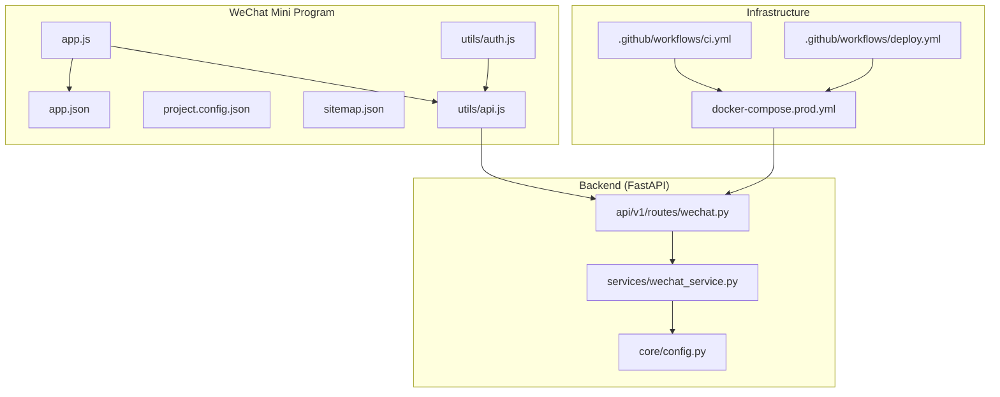
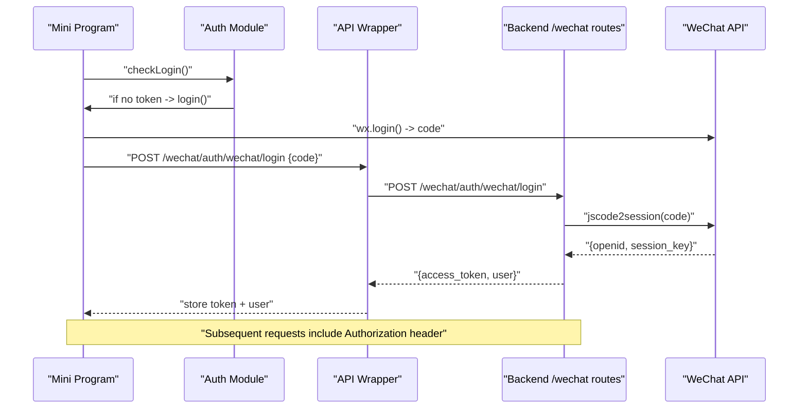
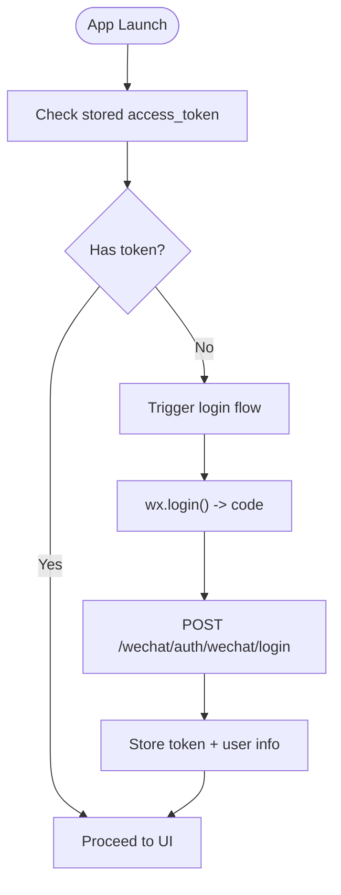
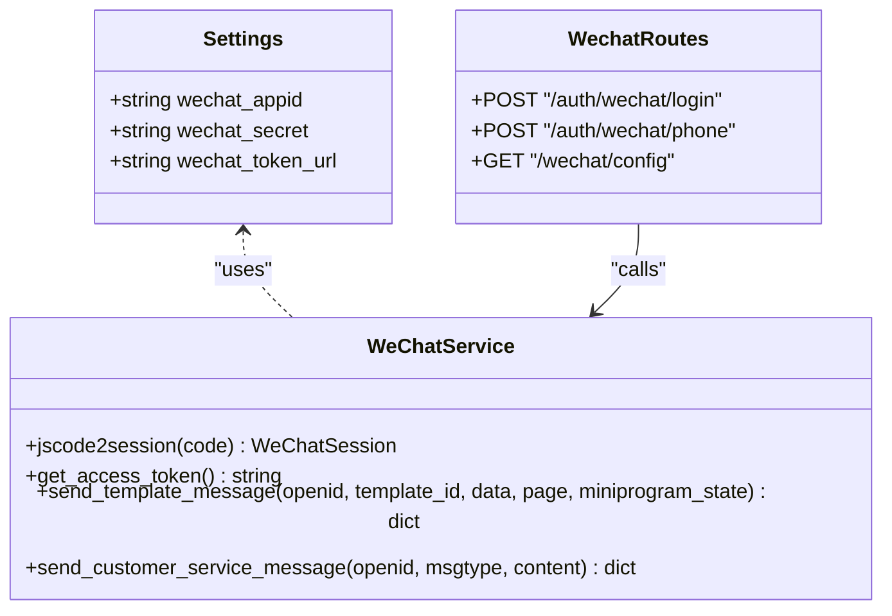
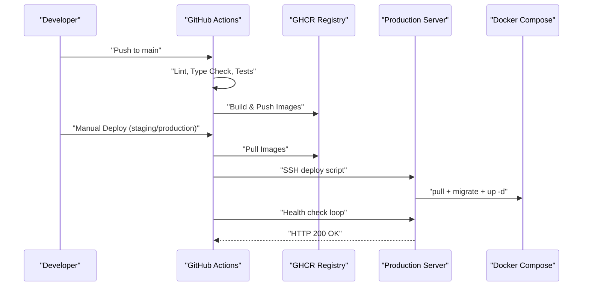
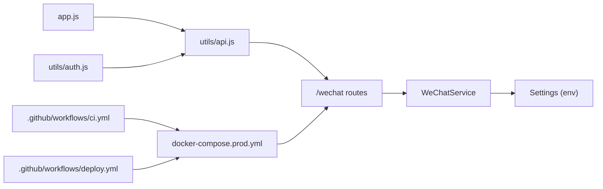

# Publishing & Deployment Process

<cite>
**Referenced Files in This Document**
- [app.json](file://wechat-miniprogram/app.json)
- [project.config.json](file://wechat-miniprogram/project.config.json)
- [sitemap.json](file://wechat-miniprogram/sitemap.json)
- [app.js](file://wechat-miniprogram/app.js)
- [api.js](file://wechat-miniprogram/utils/api.js)
- [auth.js](file://wechat-miniprogram/utils/auth.js)
- [config.py](file://backend/app/core/config.py)
- [wechat_service.py](file://backend/app/services/wechat_service.py)
- [wechat.py](file://backend/app/api/v1/routes/wechat.py)
- [docker-compose.prod.yml](file://docker-compose.prod.yml)
- [DEPLOYMENT.md](file://DEPLOYMENT.md)
- [ci.yml](file:.github/workflows/ci.yml)
- [deploy.yml](file:.github/workflows/deploy.yml)
</cite>

## Table of Contents
1. Introduction
2. Project Structure
3. Core Components
4. Architecture Overview
5. Detailed Component Analysis
6. Dependency Analysis
7. Performance Considerations
8. Troubleshooting Guide
9. Conclusion
10. Appendices

## Introduction
This document describes the end-to-end publishing and deployment process for the WeChat Mini Program, including preparation (code review, testing, compliance), submission workflow via the WeChat Developer Platform, build and environment configuration, post-launch monitoring, update management, rollback procedures, and maintenance workflows. It also covers platform-specific requirements and best practices to ensure successful publication.

## Project Structure
The repository contains:
- A WeChat Mini Program under wechat-miniprogram with app configuration, pages, components, and utilities for API calls and authentication.
- A FastAPI backend with services for WeChat login, phone binding, and configuration exposure.
- Dockerized production stack with PostgreSQL, Redis, backend, Celery workers/beat, and Nginx.
- GitHub Actions CI/CD pipelines for linting, testing, building, pushing images, and deploying to staging/production.

**Diagram sources**
- [app.js:1-21](file://wechat-miniprogram/app.js#L1-L21)
- [app.json:1-57](file://wechat-miniprogram/app.json#L1-L57)
- [project.config.json:1-37](file://wechat-miniprogram/project.config.json#L1-L37)
- [sitemap.json:1-7](file://wechat-miniprogram/sitemap.json#L1-L7)
- [api.js:1-52](file://wechat-miniprogram/utils/api.js#L1-L52)
- [auth.js:1-81](file://wechat-miniprogram/utils/auth.js#L1-L81)
- [config.py:1-167](file://backend/app/core/config.py#L1-L167)
- [wechat_service.py:1-146](file://backend/app/services/wechat_service.py#L1-L146)
- [wechat.py:34-81](file://backend/app/api/v1/routes/wechat.py#L34-L81)
- [docker-compose.prod.yml:1-217](file://docker-compose.prod.yml#L1-L217)
- [ci.yml](file:.github/workflows/ci.yml#L1-L210)
- [deploy.yml](file:.github/workflows/deploy.yml#L1-L83)

**Section sources**
- [app.json:1-57](file://wechat-miniprogram/app.json#L1-L57)
- [project.config.json:1-37](file://wechat-miniprogram/project.config.json#L1-L37)
- [sitemap.json:1-7](file://wechat-miniprogram/sitemap.json#L1-L7)
- [app.js:1-21](file://wechat-miniprogram/app.js#L1-L21)
- [api.js:1-52](file://wechat-miniprogram/utils/api.js#L1-L52)
- [auth.js:1-81](file://wechat-miniprogram/utils/auth.js#L1-L81)
- [config.py:1-167](file://backend/app/core/config.py#L1-L167)
- [wechat_service.py:1-146](file://backend/app/services/wechat_service.py#L1-L146)
- [wechat.py:34-81](file://backend/app/api/v1/routes/wechat.py#L34-L81)
- [docker-compose.prod.yml:1-217](file://docker-compose.prod.yml#L1-L217)
- [ci.yml](file:.github/workflows/ci.yml#L1-L210)
- [deploy.yml](file:.github/workflows/deploy.yml#L1-L83)

## Core Components
- WeChat Mini Program configuration and runtime:
  - App entry initializes login status and global base URL.
  - App manifest defines pages, tabs, permissions, and sitemap reference.
  - Project settings control compilation features and source map upload.
  - Sitemap rules allow indexing of all pages.
- Authentication and API client:
  - Auth module performs wx.login, exchanges code for token, stores credentials, and manages session state.
  - API wrapper attaches Authorization header, handles 401 by clearing local tokens, and shows user-friendly messages.
- Backend WeChat integration:
  - Service provides jscode2session, access token caching, template messaging, and customer service messaging.
  - Routes expose endpoints for WeChat login, phone binding, and config retrieval.
  - Configuration centralizes WeChat appid/secret and other service keys.
- Production infrastructure:
  - Docker Compose defines Postgres, Redis, backend, Celery worker/beat, and Nginx with health checks and resource limits.
  - Deployment guide details SSL, DNS, backups, monitoring, and maintenance tasks.
- CI/CD:
  - CI pipeline runs backend lint/type checks, tests (including pgvector), frontend build/tests, and builds/pushes container images on main branch pushes.
  - Deploy pipeline triggers manual deployments to staging or production, builds tagged images, deploys via SSH, runs migrations, restarts services, prunes old images, and performs a health check.

**Section sources**
- [app.js:1-21](file://wechat-miniprogram/app.js#L1-L21)
- [app.json:1-57](file://wechat-miniprogram/app.json#L1-L57)
- [project.config.json:1-37](file://wechat-miniprogram/project.config.json#L1-L37)
- [sitemap.json:1-7](file://wechat-miniprogram/sitemap.json#L1-L7)
- [auth.js:1-81](file://wechat-miniprogram/utils/auth.js#L1-L81)
- [api.js:1-52](file://wechat-miniprogram/utils/api.js#L1-L52)
- [wechat_service.py:1-146](file://backend/app/services/wechat_service.py#L1-L146)
- [wechat.py:34-81](file://backend/app/api/v1/routes/wechat.py#L34-L81)
- [config.py:1-167](file://backend/app/core/config.py#L1-L167)
- [docker-compose.prod.yml:1-217](file://docker-compose.prod.yml#L1-L217)
- [DEPLOYMENT.md:1-134](file://DEPLOYMENT.md#L1-L134)
- [ci.yml](file:.github/workflows/ci.yml#L1-L210)
- [deploy.yml](file:.github/workflows/deploy.yml#L1-L83)

## Architecture Overview
The WeChat Mini Program authenticates users via WeChat login, obtains an access token from the backend, and then uses it for subsequent API calls. The backend integrates with WeChat APIs for session exchange and optional phone number retrieval. Production is orchestrated with Docker Compose, exposing HTTPS through Nginx, while CI/CD automates builds and deployments.

**Diagram sources**
- [auth.js:1-81](file://wechat-miniprogram/utils/auth.js#L1-L81)
- [api.js:1-52](file://wechat-miniprogram/utils/api.js#L1-L52)
- [wechat.py:34-81](file://backend/app/api/v1/routes/wechat.py#L34-L81)
- [wechat_service.py:1-146](file://backend/app/services/wechat_service.py#L1-L146)

## Detailed Component Analysis

### WeChat Mini Program Preparation and Compliance
- App manifest and permissions:
  - Pages and tabBar are declared; location permission is requested with a description.
  - Required private info includes getLocation.
  - Sitemap allows indexing of all pages.
- Project settings:
  - ES6 enabled, minified output, source maps uploaded for debugging.
  - Library version pinned for consistent behavior.
- Runtime initialization:
  - Global base URL points to backend API; login status checked at launch.
- Privacy and policy compliance:
  - Ensure only necessary permissions are requested.
  - Provide clear descriptions for sensitive scopes.
  - Keep sitemap aligned with public pages.

**Diagram sources**
- [app.js:1-21](file://wechat-miniprogram/app.js#L1-L21)
- [auth.js:1-81](file://wechat-miniprogram/utils/auth.js#L1-L81)
- [api.js:1-52](file://wechat-miniprogram/utils/api.js#L1-L52)
- [wechat.py:34-81](file://backend/app/api/v1/routes/wechat.py#L34-L81)

**Section sources**
- [app.json:1-57](file://wechat-miniprogram/app.json#L1-L57)
- [sitemap.json:1-7](file://wechat-miniprogram/sitemap.json#L1-L7)
- [project.config.json:1-37](file://wechat-miniprogram/project.config.json#L1-L37)
- [app.js:1-21](file://wechat-miniprogram/app.js#L1-L21)
- [auth.js:1-81](file://wechat-miniprogram/utils/auth.js#L1-L81)
- [api.js:1-52](file://wechat-miniprogram/utils/api.js#L1-L52)

### Backend WeChat Integration and Environment Configuration
- Configuration:
  - WeChat appid/secret and token endpoint are loaded from environment variables.
  - Other integrations (AI, SMS, email, AMap) are centralized for easy environment switching.
- Service layer:
  - Exchanges login codes for openid/session_key.
  - Caches access tokens with expiration handling.
  - Supports template and customer service messages.
- API routes:
  - Provides login endpoint returning JWT and user info.
  - Phone binding endpoint using WeChat business API.
  - Config endpoint exposing appid to the mini program.

**Diagram sources**
- [config.py:107-120](file://backend/app/core/config.py#L107-L120)
- [wechat_service.py:1-146](file://backend/app/services/wechat_service.py#L1-L146)
- [wechat.py:34-81](file://backend/app/api/v1/routes/wechat.py#L34-L81)

**Section sources**
- [config.py:1-167](file://backend/app/core/config.py#L1-L167)
- [wechat_service.py:1-146](file://backend/app/services/wechat_service.py#L1-L146)
- [wechat.py:34-81](file://backend/app/api/v1/routes/wechat.py#L34-L81)

### Build and Deployment Pipeline (Development to Production)
- CI pipeline:
  - Lints and type-checks backend code.
  - Runs unit tests (in-memory SQLite) and pgvector integration tests against real Postgres/Redis.
  - Builds and tests the frontend SPA.
  - Builds and pushes backend/frontend images to GHCR on pushes to main.
- Production deployment:
  - Manual workflow dispatch selects target environment (staging/production).
  - Builds tagged images, pushes to registry, deploys via SSH, runs Alembic migrations, restarts services, prunes old images, and verifies health endpoint.
- Infrastructure:
  - Docker Compose orchestrates Postgres, Redis, backend, Celery worker/beat, and Nginx with health checks and resource constraints.
  - Deployment guide covers SSL setup, DNS, backups, monitoring, scaling, and security checklist.

**Diagram sources**
- [ci.yml](file:.github/workflows/ci.yml#L1-L210)
- [deploy.yml](file:.github/workflows/deploy.yml#L1-L83)
- [docker-compose.prod.yml:1-217](file://docker-compose.prod.yml#L1-L217)
- [DEPLOYMENT.md:1-134](file://DEPLOYMENT.md#L1-L134)

**Section sources**
- [ci.yml](file:.github/workflows/ci.yml#L1-L210)
- [deploy.yml](file:.github/workflows/deploy.yml#L1-L83)
- [docker-compose.prod.yml:1-217](file://docker-compose.prod.yml#L1-L217)
- [DEPLOYMENT.md:1-134](file://DEPLOYMENT.md#L1-L134)

### Submission Workflow Through WeChat Developer Platform
- Pre-submission checklist:
  - Verify app.json pages, tabBar, and permissions are correct and minimal.
  - Confirm requiredPrivateInfos declarations match actual usage.
  - Ensure sitemap aligns with public pages.
  - Validate project settings (minification, source maps) for release builds.
- Version management:
  - Use distinct versions for development, beta, and formal releases.
  - Maintain concise release notes describing changes and fixes.
- Review process:
  - Submit for review after passing internal QA and compliance checks.
  - Address feedback promptly; re-submit if rejected.
- Best practices:
  - Avoid unnecessary permissions; provide clear descriptions.
  - Keep library version stable across environments.
  - Test critical flows (login, booking, chat) on real devices before submission.

[No sources needed since this section provides general guidance]

### Post-Launch Monitoring, Update Management, and Rollback Procedures
- Monitoring:
  - Health endpoint available for liveness checks.
  - Structured JSON logging and Prometheus metrics exposed by backend.
  - Container logs accessible via Docker Compose.
- Update management:
  - Increment version numbers and publish updates via WeChat Developer Platform.
  - Use feature flags or staged rollouts where applicable.
- Rollback procedures:
  - Re-deploy previous image tag via the same deployment workflow.
  - Run database migrations only forward; avoid destructive changes without safeguards.
  - Monitor health endpoint and revert quickly if issues arise.

**Section sources**
- [DEPLOYMENT.md:86-134](file://DEPLOYMENT.md#L86-L134)
- [docker-compose.prod.yml:1-217](file://docker-compose.prod.yml#L1-L217)
- [deploy.yml](file:.github/workflows/deploy.yml#L1-L83)

### Maintenance Workflow: Bug Fixes, Feature Updates, Performance Monitoring
- Bug fixes:
  - Create issue, implement fix, add tests, open PR, pass CI, merge, deploy to staging first.
- Feature updates:
  - Follow PR template, include screenshots for UI changes, update documentation and env templates if needed.
- Performance monitoring:
  - Track request latency and error rates via metrics.
  - Inspect Celery task queues and DB pool utilization.
  - Optimize queries and cache strategies based on observed bottlenecks.

**Section sources**
- [ci.yml](file:.github/workflows/ci.yml#L1-L210)
- [DEPLOYMENT.md:86-134](file://DEPLOYMENT.md#L86-L134)

## Dependency Analysis
The following diagram highlights key dependencies between the WeChat Mini Program, backend services, and infrastructure.

**Diagram sources**
- [app.js:1-21](file://wechat-miniprogram/app.js#L1-L21)
- [api.js:1-52](file://wechat-miniprogram/utils/api.js#L1-L52)
- [auth.js:1-81](file://wechat-miniprogram/utils/auth.js#L1-L81)
- [wechat.py:34-81](file://backend/app/api/v1/routes/wechat.py#L34-L81)
- [wechat_service.py:1-146](file://backend/app/services/wechat_service.py#L1-L146)
- [config.py:1-167](file://backend/app/core/config.py#L1-L167)
- [docker-compose.prod.yml:1-217](file://docker-compose.prod.yml#L1-L217)
- [ci.yml](file:.github/workflows/ci.yml#L1-L210)
- [deploy.yml](file:.github/workflows/deploy.yml#L1-L83)

**Section sources**
- [app.js:1-21](file://wechat-miniprogram/app.js#L1-L21)
- [api.js:1-52](file://wechat-miniprogram/utils/api.js#L1-L52)
- [auth.js:1-81](file://wechat-miniprogram/utils/auth.js#L1-L81)
- [wechat.py:34-81](file://backend/app/api/v1/routes/wechat.py#L34-L81)
- [wechat_service.py:1-146](file://backend/app/services/wechat_service.py#L1-L146)
- [config.py:1-167](file://backend/app/core/config.py#L1-L167)
- [docker-compose.prod.yml:1-217](file://docker-compose.prod.yml#L1-L217)
- [ci.yml](file:.github/workflows/ci.yml#L1-L210)
- [deploy.yml](file:.github/workflows/deploy.yml#L1-L83)

## Performance Considerations
- Minify and enable source maps for production builds to balance performance and debuggability.
- Pin library versions to reduce variability across environments.
- Use efficient pagination and filtering on backend endpoints consumed by the mini program.
- Cache frequently accessed data in Redis where appropriate.
- Monitor Celery queue lengths and adjust concurrency based on workload.

[No sources needed since this section provides general guidance]

## Troubleshooting Guide
- Common issues:
  - Login failures: verify WeChat appid/secret and network connectivity to WeChat APIs.
  - Token expiration: ensure 401 handling clears local storage and prompts re-login.
  - Permission denied: confirm scope descriptions and requiredPrivateInfos declarations.
  - Deployment failures: check health endpoint responses and container logs.
- Commands and checks:
  - View logs for services via Docker Compose.
  - Verify database readiness and Redis connectivity.
  - Perform health checks against the deployed domain.

**Section sources**
- [api.js:1-52](file://wechat-miniprogram/utils/api.js#L1-L52)
- [auth.js:1-81](file://wechat-miniprogram/utils/auth.js#L1-L81)
- [DEPLOYMENT.md:112-134](file://DEPLOYMENT.md#L112-L134)

## Conclusion
By adhering to the preparation, submission, build, deployment, and maintenance processes outlined here, teams can reliably publish and operate the WeChat Mini Program. Strong CI/CD automation, clear environment configuration, and robust monitoring ensure smooth updates and quick recovery from issues.

[No sources needed since this section summarizes without analyzing specific files]

## Appendices
- Environment variables:
  - Ensure WECHAT_APPID and WECHAT_SECRET are set correctly for each environment.
  - Align CORS_ORIGINS and other security settings with production domains.
- Security checklist:
  - Rotate secrets regularly, disable debug mode, enforce HTTPS, and restrict ports.

**Section sources**
- [config.py:1-167](file://backend/app/core/config.py#L1-L167)
- [DEPLOYMENT.md:122-134](file://DEPLOYMENT.md#L122-L134)