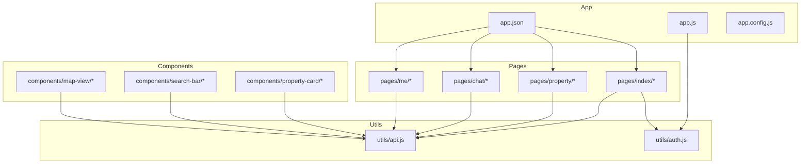
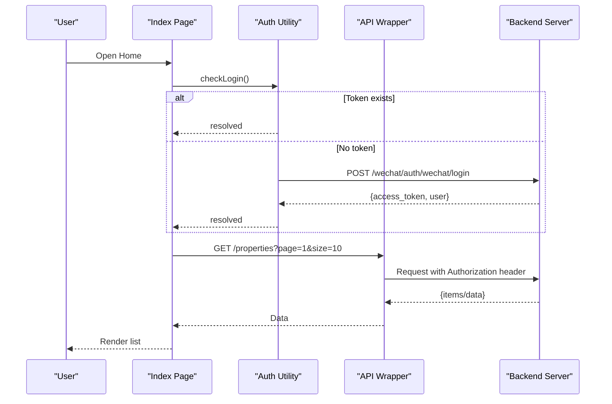
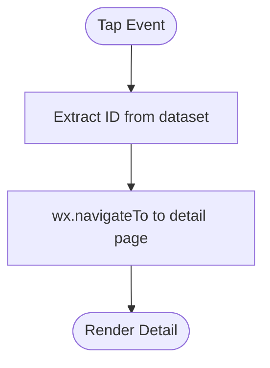
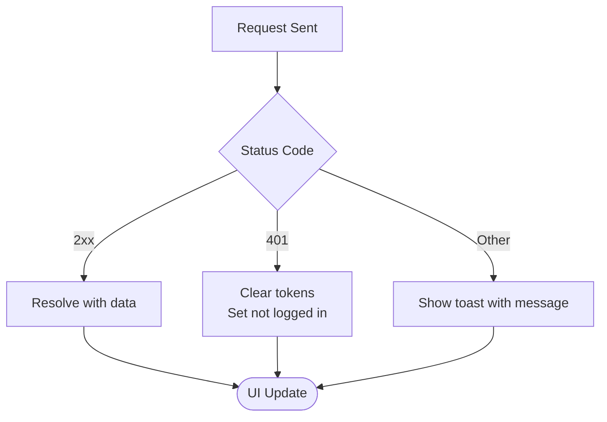
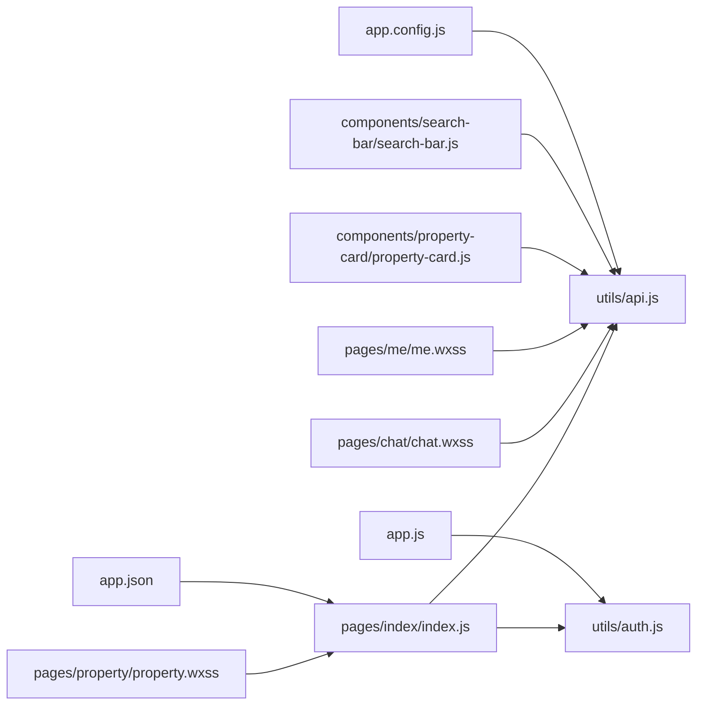

# UI/UX Patterns & Responsive Design

<cite>
**Referenced Files in This Document**
- [app.json](file://wechat-miniprogram/app.json)
- [app.js](file://wechat-miniprogram/app.js)
- [app.config.js](file://wechat-miniprogram/app.config.js)
- [index.wxss](file://wechat-miniprogram/pages/index/index.wxss)
- [index.js](file://wechat-miniprogram/pages/index/index.js)
- [property.wxss](file://wechat-miniprogram/pages/property/property.wxss)
- [chat.wxss](file://wechat-miniprogram/pages/chat/chat.wxss)
- [me.wxss](file://wechat-miniprogram/pages/me/me.wxss)
- [property-card.wxss](file://wechat-miniprogram/components/property-card/property-card.wxss)
- [property-card.js](file://wechat-miniprogram/components/property-card/property-card.js)
- [search-bar.wxss](file://wechat-miniprogram/components/search-bar/search-bar.wxss)
- [search-bar.js](file://wechat-miniprogram/components/search-bar/search-bar.js)
- [map-view.wxss](file://wechat-miniprogram/components/map-view/map-view.wxss)
- [api.js](file://wechat-miniprogram/utils/api.js)
- [auth.js](file://wechat-miniprogram/utils/auth.js)
</cite>

## Table of Contents
1. Introduction
2. Project Structure
3. Core Components
4. Architecture Overview
5. Detailed Component Analysis
6. Dependency Analysis
7. Performance Considerations
8. Troubleshooting Guide
9. Conclusion

## Introduction
This document explains the UI/UX design patterns and responsive implementation for the WeChat Mini Program. It covers WXSS architecture, responsive layout strategies, touch interactions, gesture handling, accessibility considerations, visual design system (colors, typography, spacing), component styling conventions, animations, loading states, error feedback, use of built-in components versus custom solutions, and performance optimization for rendering, images, and memory management.

## Project Structure
The Mini Program follows a feature-based structure with pages, reusable components, and shared utilities:
- Pages: index, search, property, chat, booking, me
- Components: property-card, search-bar, map-view
- Utilities: api.js (HTTP wrapper), auth.js (WeChat login state)
- App configuration: app.json (pages, window, tabBar, permissions), app.js (global data), app.config.js (environment endpoints)

**Diagram sources**
- [app.json:1-57](file://wechat-miniprogram/app.json#L1-L57)
- [app.js:1-21](file://wechat-miniprogram/app.js#L1-L21)
- [app.config.js:1-16](file://wechat-miniprogram/app.config.js#L1-L16)
- [index.js:1-74](file://wechat-miniprogram/pages/index/index.js#L1-L74)
- [property-card.js:1-30](file://wechat-miniprogram/components/property-card/property-card.js#L1-L30)
- [search-bar.js:1-17](file://wechat-miniprogram/components/search-bar/search-bar.js#L1-L17)
- [api.js:1-52](file://wechat-miniprogram/utils/api.js#L1-L52)
- [auth.js:1-81](file://wechat-miniprogram/utils/auth.js#L1-L81)

**Section sources**
- [app.json:1-57](file://wechat-miniprogram/app.json#L1-L57)
- [app.js:1-21](file://wechat-miniprogram/app.js#L1-L21)
- [app.config.js:1-16](file://wechat-miniprogram/app.config.js#L1-L16)

## Core Components
- Property Card: Reusable card displaying cover image, title, address, tags, and price. Emits tap events to parent pages.
- Search Bar: Input with placeholder and search action; emits input and search events.
- Map View: Wrapper around the native map component with consistent sizing and rounded corners.

Key interaction patterns:
- Tap navigation from cards to property detail
- Pull-to-refresh on home page
- Sticky search header for quick access
- Modal overlay for confirmations

Accessibility highlights:
- Sufficient color contrast for primary actions and text
- Clear focus affordances via button styles
- Descriptive placeholders and labels in inputs

**Section sources**
- [property-card.js:1-30](file://wechat-miniprogram/components/property-card/property-card.js#L1-L30)
- [property-card.wxss:1-66](file://wechat-miniprogram/components/property-card/property-card.wxss#L1-L66)
- [search-bar.js:1-17](file://wechat-miniprogram/components/search-bar/search-bar.js#L1-L17)
- [search-bar.wxss:1-25](file://wechat-miniprogram/components/search-bar/search-bar.wxss#L1-L25)
- [map-view.wxss:1-7](file://wechat-miniprogram/components/map-view/map-view.wxss#L1-L7)
- [index.js:1-74](file://wechat-miniprogram/pages/index/index.js#L1-L74)

## Architecture Overview
The UI layer is driven by WXSS and WXML templates, while JS handles user interactions and API calls through a centralized HTTP wrapper. Authentication is managed via a dedicated utility that integrates with WeChat login.

**Diagram sources**
- [index.js:1-74](file://wechat-miniprogram/pages/index/index.js#L1-L74)
- [auth.js:1-81](file://wechat-miniprogram/utils/auth.js#L1-L81)
- [api.js:1-52](file://wechat-miniprogram/utils/api.js#L1-L52)

## Detailed Component Analysis

### Visual Design System
- Color scheme:
  - Primary green for actions and accents
  - Red for price emphasis
  - Neutral grays for backgrounds, borders, and secondary text
- Typography:
  - Base font sizes in rpx for responsiveness
  - Semibold headings, regular body text
  - Line-heights tuned for readability
- Spacing:
  - Consistent padding/margins using rpx units
  - Section gaps and card margins for rhythm
- Component styling conventions:
  - Rounded corners for cards and inputs
  - Subtle shadows for elevation
  - Sticky headers for persistent controls

Examples:
- Home page sticky search section and banner swiper
- Property detail bottom bar fixed at viewport bottom
- Chat bubbles with distinct user/assistant styles
- Profile gradient header and menu items

**Section sources**
- [index.wxss:1-73](file://wechat-miniprogram/pages/index/index.wxss#L1-L73)
- [property.wxss:1-215](file://wechat-miniprogram/pages/property/property.wxss#L1-L215)
- [chat.wxss:1-96](file://wechat-miniprogram/pages/chat/chat.wxss#L1-L96)
- [me.wxss:1-109](file://wechat-miniprogram/pages/me/me.wxss#L1-L109)
- [property-card.wxss:1-66](file://wechat-miniprogram/components/property-card/property-card.wxss#L1-L66)
- [search-bar.wxss:1-25](file://wechat-miniprogram/components/search-bar/search-bar.wxss#L1-L25)

### Responsive Layout Principles
- Use rpx units to scale across device widths
- Flexbox for alignment and wrapping
- Percentage widths for full-width media
- Fixed bottom bars with z-index to avoid content overlap
- Sticky positioning for search sections

Practical examples:
- Full-width image swipers
- Two-column detail grids with wrap
- Responsive tag lists with flex-wrap

**Section sources**
- [index.wxss:1-73](file://wechat-miniprogram/pages/index/index.wxss#L1-L73)
- [property.wxss:1-215](file://wechat-miniprogram/pages/property/property.wxss#L1-L215)
- [chat.wxss:1-96](file://wechat-miniprogram/pages/chat/chat.wxss#L1-L96)
- [me.wxss:1-109](file://wechat-miniprogram/pages/me/me.wxss#L1-L109)

### Touch Interactions and Gesture Handling
- Tap navigation:
  - Property cards emit tap events to navigate to details
  - Home page taps route to property detail or search
- Pull-to-refresh:
  - Home page triggers refresh and stops spinner after load
- Modal interactions:
  - Confirm/cancel flows with mask overlay

**Diagram sources**
- [property-card.js:1-30](file://wechat-miniprogram/components/property-card/property-card.js#L1-L30)
- [index.js:1-74](file://wechat-miniprogram/pages/index/index.js#L1-L74)

**Section sources**
- [property-card.js:1-30](file://wechat-miniprogram/components/property-card/property-card.js#L1-L30)
- [index.js:1-74](file://wechat-miniprogram/pages/index/index.js#L1-L74)

### Accessibility Considerations
- Contrast:
  - Green buttons and red prices against light backgrounds meet readability needs
- Focusable elements:
  - Buttons styled distinctly for visibility
- Labels and placeholders:
  - Inputs include descriptive placeholders
- Navigation clarity:
  - TabBar icons and texts define main routes

**Section sources**
- [app.json:1-57](file://wechat-miniprogram/app.json#L1-L57)
- [search-bar.wxss:1-25](file://wechat-miniprogram/components/search-bar/search-bar.wxss#L1-L25)
- [chat.wxss:1-96](file://wechat-miniprogram/pages/chat/chat.wxss#L1-L96)

### Animations, Loading States, and Error Feedback
- Loading states:
  - Centralized loading flags in page data
  - Empty and loading messages with centered layouts
- Error feedback:
  - Toast notifications for network errors and server messages
  - 401 handling clears tokens and prompts re-login
- Smooth transitions:
  - Use CSS transitions sparingly for hover-like effects on buttons
  - Avoid heavy animations on low-end devices

**Diagram sources**
- [api.js:1-52](file://wechat-miniprogram/utils/api.js#L1-L52)
- [index.js:1-74](file://wechat-miniprogram/pages/index/index.js#L1-L74)

**Section sources**
- [api.js:1-52](file://wechat-miniprogram/utils/api.js#L1-L52)
- [index.wxss:1-73](file://wechat-miniprogram/pages/index/index.wxss#L1-L73)
- [property.wxss:1-215](file://wechat-miniprogram/pages/property/property.wxss#L1-L215)

### Built-in vs Custom Components
- Built-in components used:
  - Native map via map-view wrapper
  - Swiper for banners and image galleries
  - TabBar and navigation defined in app.json
- Custom components created:
  - property-card for consistent listing presentation
  - search-bar for reusable search UX
  - map-view to encapsulate map styling and behavior

Guidelines:
- Prefer built-ins for standard behaviors (navigation, tabs, maps)
- Build custom components when you need reusable composition and consistent styling across screens

**Section sources**
- [app.json:1-57](file://wechat-miniprogram/app.json#L1-L57)
- [map-view.wxss:1-7](file://wechat-miniprogram/components/map-view/map-view.wxss#L1-L7)
- [property-card.js:1-30](file://wechat-miniprogram/components/property-card/property-card.js#L1-L30)
- [search-bar.js:1-17](file://wechat-miniprogram/components/search-bar/search-bar.js#L1-L17)

## Dependency Analysis
High-level dependencies between UI layers and utilities:

**Diagram sources**
- [index.js:1-74](file://wechat-miniprogram/pages/index/index.js#L1-L74)
- [api.js:1-52](file://wechat-miniprogram/utils/api.js#L1-L52)
- [auth.js:1-81](file://wechat-miniprogram/utils/auth.js#L1-L81)
- [app.json:1-57](file://wechat-miniprogram/app.json#L1-L57)
- [app.config.js:1-16](file://wechat-miniprogram/app.config.js#L1-L16)
- [app.js:1-21](file://wechat-miniprogram/app.js#L1-L21)
- [property-card.js:1-30](file://wechat-miniprogram/components/property-card/property-card.js#L1-L30)
- [search-bar.js:1-17](file://wechat-miniprogram/components/search-bar/search-bar.js#L1-L17)
- [property.wxss:1-215](file://wechat-miniprogram/pages/property/property.wxss#L1-L215)
- [chat.wxss:1-96](file://wechat-miniprogram/pages/chat/chat.wxss#L1-L96)
- [me.wxss:1-109](file://wechat-miniprogram/pages/me/me.wxss#L1-L109)

**Section sources**
- [index.js:1-74](file://wechat-miniprogram/pages/index/index.js#L1-L74)
- [api.js:1-52](file://wechat-miniprogram/utils/api.js#L1-L52)
- [auth.js:1-81](file://wechat-miniprogram/utils/auth.js#L1-L81)
- [app.json:1-57](file://wechat-miniprogram/app.json#L1-L57)
- [app.config.js:1-16](file://wechat-miniprogram/app.config.js#L1-L16)
- [app.js:1-21](file://wechat-miniprogram/app.js#L1-L21)

## Performance Considerations
- Rendering:
  - Keep DOM depth shallow; prefer flat lists with keys
  - Use sticky headers judiciously to avoid reflows
  - Limit simultaneous animations; prefer transform and opacity
- Images:
  - Use appropriate dimensions and formats
  - Lazy-load offscreen images where possible
  - Provide fallbacks for missing cover images
- Memory:
  - Unbind listeners and clear timers on page unload
  - Avoid storing large objects in globalData
  - Reuse components instead of recreating views frequently
- Network:
  - Cache static assets and reuse base URLs
  - Debounce search inputs to reduce requests
  - Handle 401 gracefully and prompt re-authentication

[No sources needed since this section provides general guidance]

## Troubleshooting Guide
Common issues and resolutions:
- Network failures:
  - Check baseUrl configuration per environment
  - Inspect toast messages for server-side details
- Authentication expired:
  - Tokens cleared on 401; trigger re-login flow
- Map permission denied:
  - Ensure location permission declared and user granted
- UI overlaps:
  - Verify fixed bottom bars have sufficient page padding

Action references:
- Environment endpoints and base URL selection
- Global login status initialization
- API request wrapper error handling
- Permission declarations in app config

**Section sources**
- [app.config.js:1-16](file://wechat-miniprogram/app.config.js#L1-L16)
- [app.js:1-21](file://wechat-miniprogram/app.js#L1-L21)
- [api.js:1-52](file://wechat-miniprogram/utils/api.js#L1-L52)
- [app.json:1-57](file://wechat-miniprogram/app.json#L1-L57)

## Conclusion
The Mini Program’s UI/UX leverages a consistent design system, responsive WXSS patterns, and well-structured components. Interactions are intuitive with clear feedback, and performance-conscious practices ensure smooth experiences across devices. By combining built-in components with focused custom modules, the codebase remains maintainable and scalable.