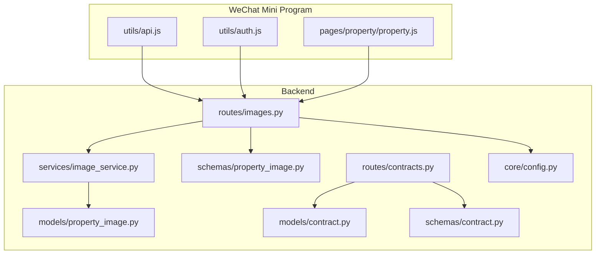
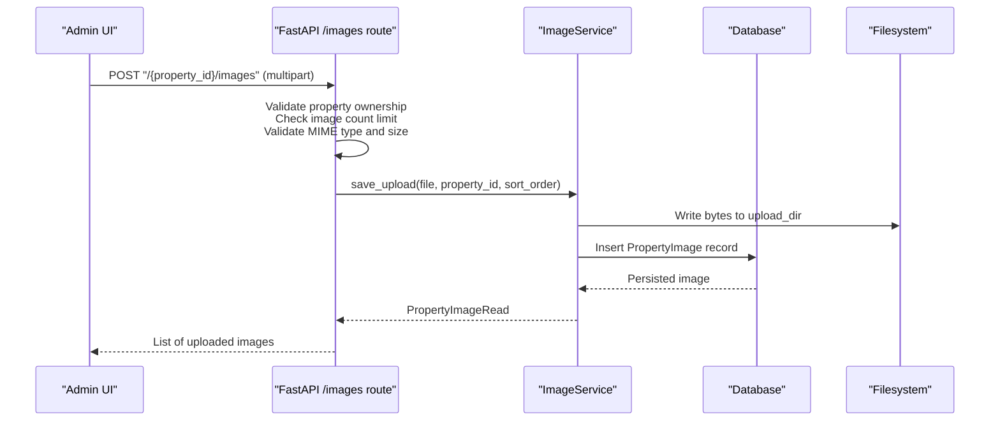
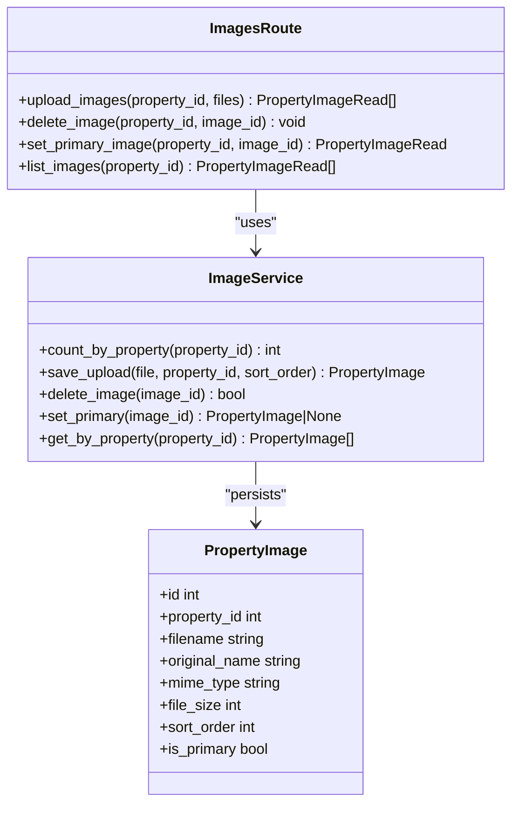
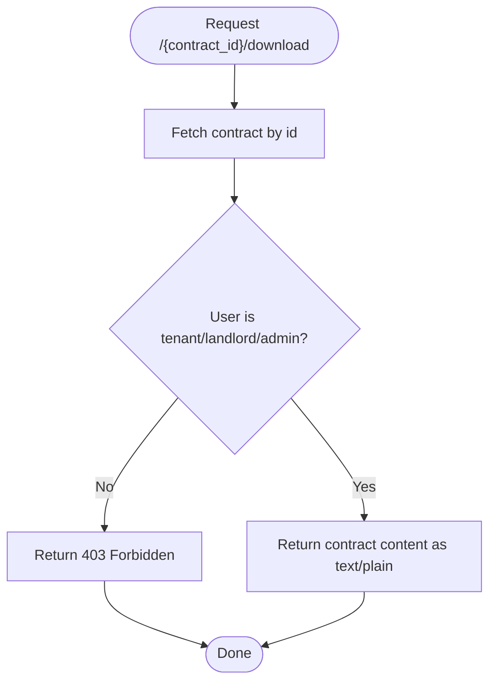
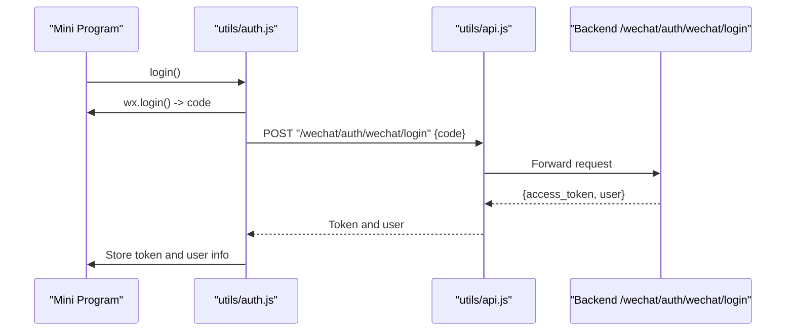
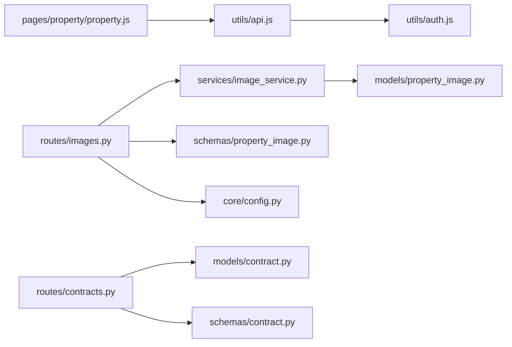

# File Operations & Media Handling

<cite>
**Referenced Files in This Document**
- [api.js](file://wechat-miniprogram/utils/api.js)
- [auth.js](file://wechat-miniprogram/utils/auth.js)
- [property.js](file://wechat-miniprogram/pages/property/property.js)
- [images.py](file://backend/app/api/v1/routes/images.py)
- [image_service.py](file://backend/app/services/image_service.py)
- [property_image.py](file://backend/app/models/property_image.py)
- [property_image.py (schema)](file://backend/app/schemas/property_image.py)
- [config.py](file://backend/app/core/config.py)
- [contracts.py](file://backend/app/api/v1/routes/contracts.py)
- [contract.py](file://backend/app/models/contract.py)
- [contract.py (schema)](file://backend/app/schemas/contract.py)
</cite>

## Table of Contents
1. [Introduction](#introduction)
2. [Project Structure](#project-structure)
3. [Core Components](#core-components)
4. [Architecture Overview](#architecture-overview)
5. [Detailed Component Analysis](#detailed-component-analysis)
6. [Dependency Analysis](#dependency-analysis)
7. [Performance Considerations](#performance-considerations)
8. [Troubleshooting Guide](#troubleshooting-guide)
9. [Conclusion](#conclusion)
10. [Appendices](#appendices)

## Introduction
This document explains file operations and media handling across the WeChat Mini Program frontend and the backend. It covers image upload flows, validation, storage, listing, and deletion; contract document generation and download; and provides guidance for implementing video/audio uploads, galleries, previews, and performance optimizations such as lazy loading and CDN usage. Where specific implementation details exist in the codebase, they are referenced with precise file paths and line ranges.

## Project Structure
The relevant parts for file operations and media handling include:
- WeChat Mini Program utilities for API calls and authentication
- Backend routes for images and contracts
- Backend services and models for image persistence and contract content management
- Configuration for upload limits and allowed types

**Diagram sources**
- [api.js:1-52](file://wechat-miniprogram/utils/api.js#L1-L52)
- [auth.js:1-53](file://wechat-miniprogram/utils/auth.js#L1-L53)
- [property.js:1-90](file://wechat-miniprogram/pages/property/property.js#L1-L90)
- [images.py:1-151](file://backend/app/api/v1/routes/images.py#L1-L151)
- [image_service.py:1-95](file://backend/app/services/image_service.py#L1-L95)
- [property_image.py:1-23](file://backend/app/models/property_image.py#L1-L23)
- [property_image.py (schema):1-22](file://backend/app/schemas/property_image.py#L1-L22)
- [contracts.py:1-88](file://backend/app/api/v1/routes/contracts.py#L1-L88)
- [contract.py:1-37](file://backend/app/models/contract.py#L1-L37)
- [contract.py (schema):1-23](file://backend/app/schemas/contract.py#L1-L23)
- [config.py:99-105](file://backend/app/core/config.py#L99-L105)

**Section sources**
- [api.js:1-52](file://wechat-miniprogram/utils/api.js#L1-L52)
- [auth.js:1-53](file://wechat-miniprogram/utils/auth.js#L1-L53)
- [property.js:1-90](file://wechat-miniprogram/pages/property/property.js#L1-L90)
- [images.py:1-151](file://backend/app/api/v1/routes/images.py#L1-L151)
- [image_service.py:1-95](file://backend/app/services/image_service.py#L1-L95)
- [property_image.py:1-23](file://backend/app/models/property_image.py#L1-L23)
- [property_image.py (schema):1-22](file://backend/app/schemas/property_image.py#L1-L22)
- [contracts.py:1-88](file://backend/app/api/v1/routes/contracts.py#L1-L88)
- [contract.py:1-37](file://backend/app/models/contract.py#L1-L37)
- [contract.py (schema):1-23](file://backend/app/schemas/contract.py#L1-L23)
- [config.py:99-105](file://backend/app/core/config.py#L99-L105)

## Core Components
- Image upload endpoint validates property ownership, enforces per-property image count limits, checks MIME types and size, persists files to disk, and records metadata in the database.
- Image service handles file naming, writing to disk, primary image selection, deletion, and retrieval ordered by sort order.
- Contract endpoints generate, retrieve, sign, and download contract content. Contracts store text content and an optional file path.

Key configuration includes upload directory, maximum upload size, allowed image types, and maximum images per property.

**Section sources**
- [images.py:26-80](file://backend/app/api/v1/routes/images.py#L26-L80)
- [image_service.py:27-52](file://backend/app/services/image_service.py#L27-L52)
- [property_image.py:8-23](file://backend/app/models/property_image.py#L8-L23)
- [property_image.py (schema):10-22](file://backend/app/schemas/property_image.py#L10-L22)
- [contracts.py:14-88](file://backend/app/api/v1/routes/contracts.py#L14-L88)
- [contract.py:12-37](file://backend/app/models/contract.py#L12-L37)
- [contract.py (schema):10-23](file://backend/app/schemas/contract.py#L10-L23)
- [config.py:99-105](file://backend/app/core/config.py#L99-L105)

## Architecture Overview
End-to-end flow for image upload from a web admin interface to backend storage and listing:

**Diagram sources**
- [images.py:26-80](file://backend/app/api/v1/routes/images.py#L26-L80)
- [image_service.py:27-52](file://backend/app/services/image_service.py#L27-L52)
- [property_image.py:8-23](file://backend/app/models/property_image.py#L8-L23)

## Detailed Component Analysis

### Image Upload and Management
- Ownership and authorization: The endpoint ensures the current user is authorized to manage images for the specified property.
- Limits and validation: Enforces maximum images per property, allowed MIME types, and maximum file size.
- Persistence: Files are saved to a configured upload directory with unique filenames; metadata is stored in the database including original name, MIME type, size, sort order, and primary flag.
- Listing and ordering: Images are returned ordered by sort order and id.
- Deletion and primary setting: Supports deleting images and designating a primary image per property.

**Diagram sources**
- [image_service.py:1-95](file://backend/app/services/image_service.py#L1-L95)
- [property_image.py:1-23](file://backend/app/models/property_image.py#L1-L23)
- [images.py:1-151](file://backend/app/api/v1/routes/images.py#L1-L151)

**Section sources**
- [images.py:26-80](file://backend/app/api/v1/routes/images.py#L26-L80)
- [images.py:83-107](file://backend/app/api/v1/routes/images.py#L83-L107)
- [images.py:109-133](file://backend/app/api/v1/routes/images.py#L109-L133)
- [images.py:136-151](file://backend/app/api/v1/routes/images.py#L136-L151)
- [image_service.py:27-52](file://backend/app/services/image_service.py#L27-L52)
- [image_service.py:54-66](file://backend/app/services/image_service.py#L54-L66)
- [image_service.py:68-85](file://backend/app/services/image_service.py#L68-L85)
- [image_service.py:87-95](file://backend/app/services/image_service.py#L87-L95)
- [property_image.py:8-23](file://backend/app/models/property_image.py#L8-L23)

### Contract Documents
- Generation: Creates a contract tied to a booking, enforcing access control for tenant, landlord, or admin.
- Retrieval and signing: Fetches contract details and allows tenant to sign; prevents double-signing.
- Download: Returns contract content as plain text with UTF-8 encoding after verifying permissions.

**Diagram sources**
- [contracts.py:74-88](file://backend/app/api/v1/routes/contracts.py#L74-L88)
- [contract.py:12-37](file://backend/app/models/contract.py#L12-L37)

**Section sources**
- [contracts.py:14-33](file://backend/app/api/v1/routes/contracts.py#L14-L33)
- [contracts.py:36-51](file://backend/app/api/v1/routes/contracts.py#L36-L51)
- [contracts.py:54-72](file://backend/app/api/v1/routes/contracts.py#L54-L72)
- [contracts.py:74-88](file://backend/app/api/v1/routes/contracts.py#L74-L88)
- [contract.py:12-37](file://backend/app/models/contract.py#L12-L37)
- [contract.py (schema):10-23](file://backend/app/schemas/contract.py#L10-L23)

### WeChat Mini Program Integration Points
- Authentication: Uses wx.login to obtain a code, exchanges it for a JWT via the backend, and stores tokens locally.
- API wrapper: Adds Authorization headers and handles token expiration and network errors.
- Image preview: Builds URLs for images using base URL and serves them through the backend’s upload path.

**Diagram sources**
- [auth.js:9-33](file://wechat-miniprogram/utils/auth.js#L9-L33)
- [api.js:1-52](file://wechat-miniprogram/utils/api.js#L1-L52)

**Section sources**
- [auth.js:9-33](file://wechat-miniprogram/utils/auth.js#L9-L33)
- [auth.js:38-53](file://wechat-miniprogram/utils/auth.js#L38-L53)
- [api.js:1-52](file://wechat-miniprogram/utils/api.js#L1-L52)
- [property.js:25-38](file://wechat-miniprogram/pages/property/property.js#L25-L38)
- [property.js:41-47](file://wechat-miniprogram/pages/property/property.js#L41-L47)

## Dependency Analysis
- Frontend dependencies:
  - utils/api.js depends on global app configuration and local storage for tokens.
  - utils/auth.js depends on utils/api.js for authenticated requests.
  - pages/property/property.js uses api.js to fetch properties and build image URLs.
- Backend dependencies:
  - routes/images.py depends on services/image_service.py and models/schemas for persistence and response formatting.
  - routes/contracts.py depends on models/schemas for contract data.
  - core/config.py provides upload settings used by routes and services.

**Diagram sources**
- [api.js:1-52](file://wechat-miniprogram/utils/api.js#L1-L52)
- [auth.js:1-53](file://wechat-miniprogram/utils/auth.js#L1-L53)
- [property.js:1-90](file://wechat-miniprogram/pages/property/property.js#L1-L90)
- [images.py:1-151](file://backend/app/api/v1/routes/images.py#L1-L151)
- [image_service.py:1-95](file://backend/app/services/image_service.py#L1-L95)
- [property_image.py:1-23](file://backend/app/models/property_image.py#L1-L23)
- [property_image.py (schema):1-22](file://backend/app/schemas/property_image.py#L1-L22)
- [contracts.py:1-88](file://backend/app/api/v1/routes/contracts.py#L1-L88)
- [contract.py:1-37](file://backend/app/models/contract.py#L1-L37)
- [contract.py (schema):1-23](file://backend/app/schemas/contract.py#L1-L23)
- [config.py:99-105](file://backend/app/core/config.py#L99-L105)

**Section sources**
- [api.js:1-52](file://wechat-miniprogram/utils/api.js#L1-L52)
- [auth.js:1-53](file://wechat-miniprogram/utils/auth.js#L1-L53)
- [property.js:1-90](file://wechat-miniprogram/pages/property/property.js#L1-L90)
- [images.py:1-151](file://backend/app/api/v1/routes/images.py#L1-L151)
- [image_service.py:1-95](file://backend/app/services/image_service.py#L1-L95)
- [property_image.py:1-23](file://backend/app/models/property_image.py#L1-L23)
- [property_image.py (schema):1-22](file://backend/app/schemas/property_image.py#L1-L22)
- [contracts.py:1-88](file://backend/app/api/v1/routes/contracts.py#L1-L88)
- [contract.py:1-37](file://backend/app/models/contract.py#L1-L37)
- [contract.py (schema):1-23](file://backend/app/schemas/contract.py#L1-L23)
- [config.py:99-105](file://backend/app/core/config.py#L99-L105)

## Performance Considerations
- Lazy loading: For large galleries, load thumbnails first and defer full-size images until needed.
- Image optimization: Use appropriate formats (JPEG/PNG/WebP), compress before upload where possible, and serve optimized sizes.
- CDN integration: Serve static assets (including uploaded images) via a CDN to reduce latency and improve availability.
- Pagination and sorting: When listing many images, use server-side pagination and rely on sort_order for consistent ordering.
- Concurrency: Avoid uploading too many files concurrently; queue uploads and show progress to users.

[No sources needed since this section provides general guidance]

## Troubleshooting Guide
Common issues and resolutions:
- Network errors: The API wrapper shows toast messages and rejects on failure; ensure baseUrl is correct and network connectivity is stable.
- Token expiration: On 401 responses, clear local tokens and prompt re-login.
- Large files: If file size exceeds configured max_upload_size, the backend returns a bad request error; compress or split uploads.
- Unsupported types: Only allowed_image_types are accepted; validate MIME types on the client side and inform users.
- Storage limitations: Monitor disk space for upload_dir; consider moving to object storage if needed.

**Section sources**
- [api.js:19-38](file://wechat-miniprogram/utils/api.js#L19-L38)
- [images.py:60-71](file://backend/app/api/v1/routes/images.py#L60-L71)
- [config.py:99-105](file://backend/app/core/config.py#L99-L105)

## Conclusion
The system provides robust image upload, validation, and management capabilities backed by secure ownership checks and configurable limits. Contracts can be generated, signed, and downloaded with proper access control. While the current implementation focuses on images and text-based contracts, the architecture supports extending to video and audio handling with similar patterns. Integrating CDN and optimizing media delivery will further enhance user experience.

[No sources needed since this section summarizes without analyzing specific files]

## Appendices

### Implementing Image Galleries and Previews
- Build image lists from backend responses and construct URLs using the configured base path.
- Use platform-specific preview APIs to display images in a gallery view.
- Sort images by primary flag and sort_order to maintain consistent presentation.

**Section sources**
- [property.js:25-38](file://wechat-miniprogram/pages/property/property.js#L25-L38)
- [property.js:41-47](file://wechat-miniprogram/pages/property/property.js#L41-L47)
- [images.py:136-151](file://backend/app/api/v1/routes/images.py#L136-L151)

### Contract Document Uploads
- Current implementation generates and downloads contract content as text. To support actual file uploads (e.g., PDFs), add a multipart endpoint similar to images, enforce file type restrictions (e.g., application/pdf), and persist files securely.
- Ensure access controls mirror those used for contract retrieval and signing.

**Section sources**
- [contracts.py:74-88](file://backend/app/api/v1/routes/contracts.py#L74-L88)
- [contract.py:12-37](file://backend/app/models/contract.py#L12-L37)

### Video and Audio Handling
- Extend the upload pipeline with new endpoints for video/audio, validating MIME types and sizes.
- Consider streaming uploads and chunked processing for large media files.
- Integrate with object storage and CDN for efficient distribution.

[No sources needed since this section provides general guidance]