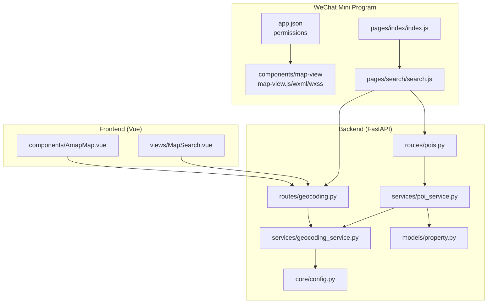
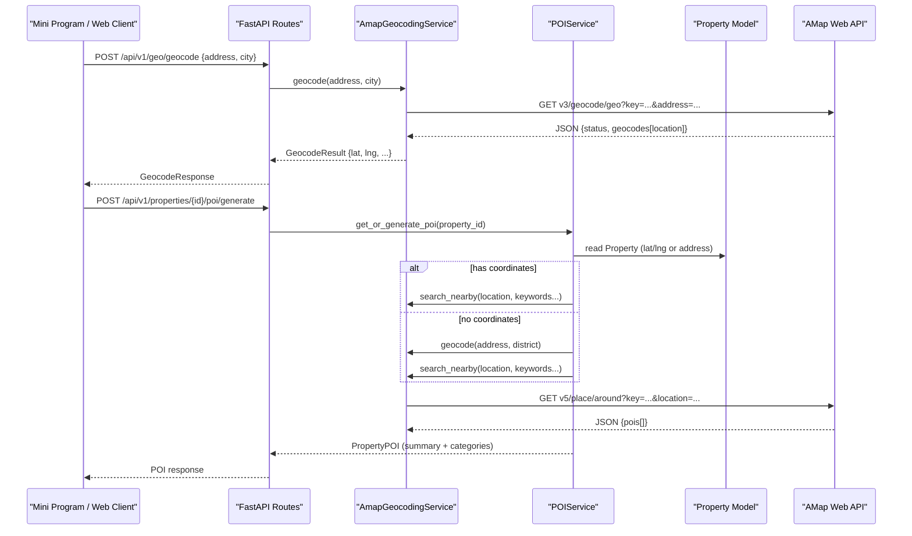
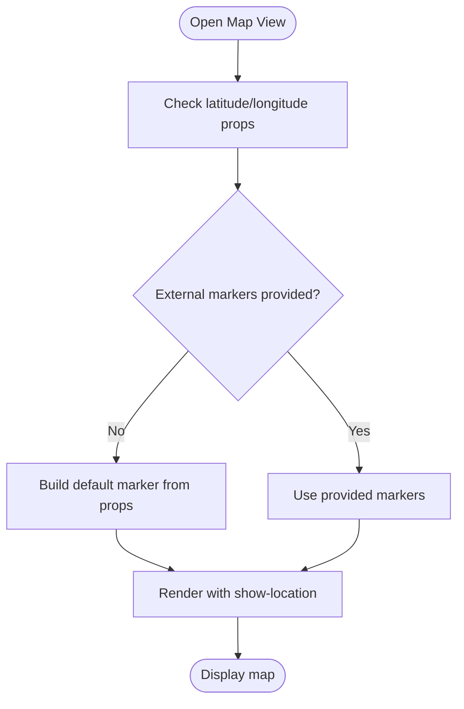
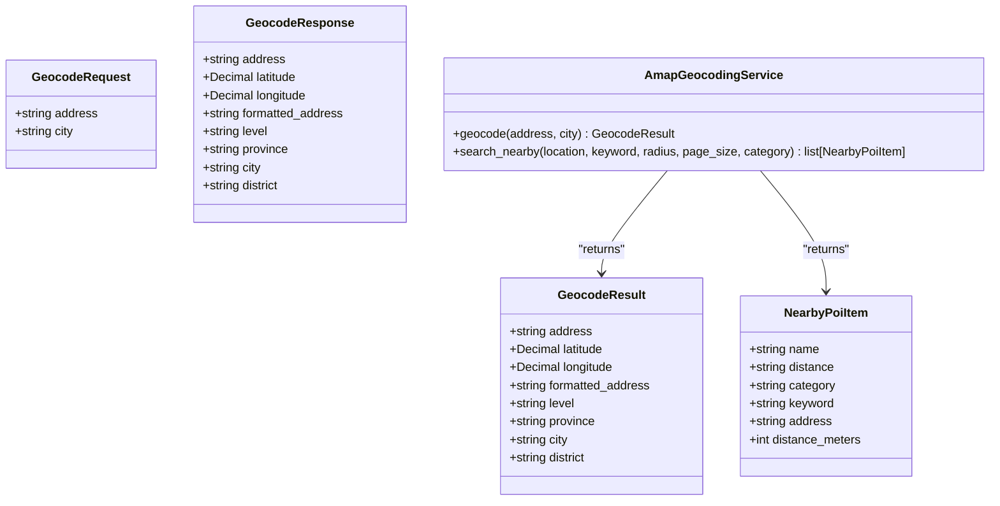
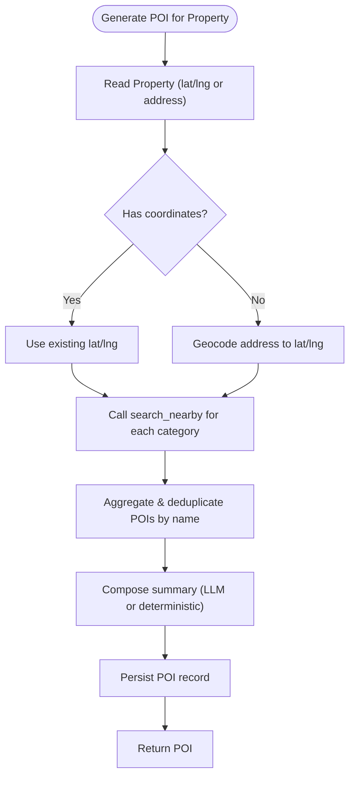
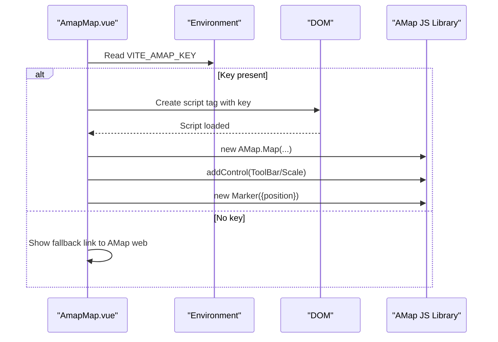
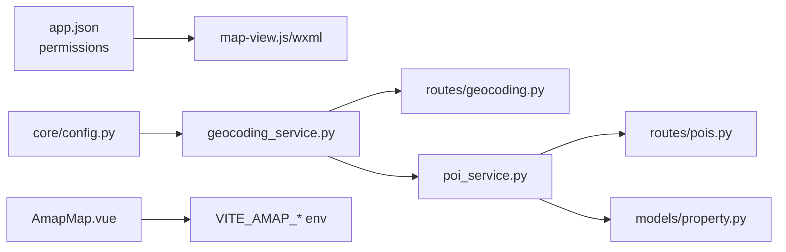

# Location Services Integration

<cite>
**Referenced Files in This Document**
- [app.json](file://wechat-miniprogram/app.json)
- [map-view.js](file://wechat-miniprogram/components/map-view/map-view.js)
- [map-view.wxml](file://wechat-miniprogram/components/map-view/map-view.wxml)
- [map-view.wxss](file://wechat-miniprogram/components/map-view/map-view.wxss)
- [index.js](file://wechat-miniprogram/pages/index/index.js)
- [search.js](file://wechat-miniprogram/pages/search/search.js)
- [geocoding.py](file://backend/app/api/v1/routes/geocoding.py)
- [geocoding_service.py](file://backend/app/services/geocoding_service.py)
- [poi_service.py](file://backend/app/services/poi_service.py)
- [pois.py](file://backend/app/api/v1/routes/pois.py)
- [config.py](file://backend/app/core/config.py)
- [property.py](file://backend/app/models/property.py)
- [AmapMap.vue](file://frontend/src/components/AmapMap.vue)
- [MapSearch.vue](file://frontend/src/views/MapSearch.vue)
</cite>

## Table of Contents
1. Introduction
2. Project Structure
3. Core Components
4. Architecture Overview
5. Detailed Component Analysis
6. Dependency Analysis
7. Performance Considerations
8. Troubleshooting Guide
9. Conclusion

## Introduction
This document explains how location services are integrated across the WeChat Mini Program, backend geocoding with AMap, and frontend map components. It covers:
- WeChat location permission declaration and usage patterns for wx.getLocation
- Coordinate system considerations between WGS84 and GCJ02
- Map-view component behavior (markers, show-location, default markers)
- Backend geocoding and nearby POI generation via AMap
- Error handling strategies for permissions, GPS signal loss, and accuracy issues
- Examples for location-based property search and nearby POI features
- Performance optimization for frequent updates and battery consumption

## Project Structure
The location-related code spans three layers:
- WeChat Mini Program: declares location permissions, provides a reusable map-view component, and navigates to search pages that can operate in map mode.
- Backend: exposes geocoding endpoints and generates POI summaries using AMap’s geocode and around APIs.
- Frontend (Web): includes an AMap-based map component and a Leaflet-based map search view.

**Diagram sources**
- [app.json:48-53](file://wechat-miniprogram/app.json#L48-L53)
- [map-view.js:1-29](file://wechat-miniprogram/components/map-view/map-view.js#L1-L29)
- [map-view.wxml:1-10](file://wechat-miniprogram/components/map-view/map-view.wxml#L1-L10)
- [map-view.wxss:1-6](file://wechat-miniprogram/components/map-view/map-view.wxss#L1-L6)
- [index.js:62-65](file://wechat-miniprogram/pages/index/index.js#L62-L65)
- [search.js:20-28](file://wechat-miniprogram/pages/search/search.js#L20-L28)
- [geocoding.py:1-25](file://backend/app/api/v1/routes/geocoding.py#L1-L25)
- [geocoding_service.py:38-85](file://backend/app/services/geocoding_service.py#L38-L85)
- [poi_service.py:109-195](file://backend/app/services/poi_service.py#L109-L195)
- [pois.py:1-32](file://backend/app/api/v1/routes/pois.py#L1-L32)
- [config.py:74-97](file://backend/app/core/config.py#L74-L97)
- [property.py:72-73](file://backend/app/models/property.py#L72-L73)
- [AmapMap.vue:1-140](file://frontend/src/components/AmapMap.vue#L1-L140)
- [MapSearch.vue:1-120](file://frontend/src/views/MapSearch.vue#L1-L120)

**Section sources**
- [app.json:48-53](file://wechat-miniprogram/app.json#L48-L53)
- [map-view.js:1-29](file://wechat-miniprogram/components/map-view/map-view.js#L1-L29)
- [map-view.wxml:1-10](file://wechat-miniprogram/components/map-view/map-view.wxml#L1-L10)
- [map-view.wxss:1-6](file://wechat-miniprogram/components/map-view/map-view.wxss#L1-L6)
- [index.js:62-65](file://wechat-miniprogram/pages/index/index.js#L62-L65)
- [search.js:20-28](file://wechat-miniprogram/pages/search/search.js#L20-L28)
- [geocoding.py:1-25](file://backend/app/api/v1/routes/geocoding.py#L1-L25)
- [geocoding_service.py:38-85](file://backend/app/services/geocoding_service.py#L38-L85)
- [poi_service.py:109-195](file://backend/app/services/poi_service.py#L109-L195)
- [pois.py:1-32](file://backend/app/api/v1/routes/pois.py#L1-L32)
- [config.py:74-97](file://backend/app/core/config.py#L74-L97)
- [property.py:72-73](file://backend/app/models/property.py#L72-L73)
- [AmapMap.vue:1-140](file://frontend/src/components/AmapMap.vue#L1-L140)
- [MapSearch.vue:1-120](file://frontend/src/views/MapSearch.vue#L1-L120)

## Core Components
- WeChat Mini Program map-view component:
  - Accepts latitude/longitude properties and renders a default marker when no external markers are provided.
  - Uses show-location to display the user’s current position on the built-in map.
- Backend geocoding service:
  - Wraps AMap Web geocoding and nearby POI search.
  - Returns structured results including coordinates and optional metadata.
- POI generation service:
  - Resolves location from address or existing coordinates.
  - Aggregates nearby categories and composes a summary; falls back to mock data if external services fail.
- Frontend map components:
  - AMap-based Vue component for displaying a marker and fallback link when keys are missing.
  - Leaflet-based map search view with clustering and viewport queries.

**Section sources**
- [map-view.js:1-29](file://wechat-miniprogram/components/map-view/map-view.js#L1-L29)
- [map-view.wxml:1-10](file://wechat-miniprogram/components/map-view/map-view.wxml#L1-L10)
- [geocoding_service.py:38-85](file://backend/app/services/geocoding_service.py#L38-L85)
- [poi_service.py:109-195](file://backend/app/services/poi_service.py#L109-L195)
- [AmapMap.vue:1-140](file://frontend/src/components/AmapMap.vue#L1-L140)
- [MapSearch.vue:1-120](file://frontend/src/views/MapSearch.vue#L1-L120)

## Architecture Overview
End-to-end flow for geocoding and POI generation:

**Diagram sources**
- [geocoding.py:1-25](file://backend/app/api/v1/routes/geocoding.py#L1-L25)
- [geocoding_service.py:46-85](file://backend/app/services/geocoding_service.py#L46-L85)
- [poi_service.py:123-195](file://backend/app/services/poi_service.py#L123-L195)
- [pois.py:11-32](file://backend/app/api/v1/routes/pois.py#L11-L32)
- [property.py:72-73](file://backend/app/models/property.py#L72-L73)
- [config.py:74-97](file://backend/app/core/config.py#L74-L97)

## Detailed Component Analysis

### WeChat Mini Program: Location Permissions and Map View
- Permission declaration:
  - Declares scope.userLocation and requiredPrivateInfos for getLocation.
- Map-view component:
  - Observes latitude/longitude changes and builds a default marker with callout text.
  - Renders show-location to indicate the device’s current position.
- Navigation to map mode:
  - Index page navigates to search with mapMode flag.

**Diagram sources**
- [map-view.js:13-27](file://wechat-miniprogram/components/map-view/map-view.js#L13-L27)
- [map-view.wxml:1-10](file://wechat-miniprogram/components/map-view/map-view.wxml#L1-L10)
- [app.json:48-53](file://wechat-miniprogram/app.json#L48-L53)
- [index.js:62-65](file://wechat-miniprogram/pages/index/index.js#L62-L65)

**Section sources**
- [app.json:48-53](file://wechat-miniprogram/app.json#L48-L53)
- [map-view.js:1-29](file://wechat-miniprogram/components/map-view/map-view.js#L1-L29)
- [map-view.wxml:1-10](file://wechat-miniprogram/components/map-view/map-view.wxml#L1-L10)
- [map-view.wxss:1-6](file://wechat-miniprogram/components/map-view/map-view.wxss#L1-L6)
- [index.js:62-65](file://wechat-miniprogram/pages/index/index.js#L62-L65)

### Backend: Geocoding Service and API
- API route:
  - Exposes POST /api/v1/geo/geocode.
  - Maps errors to HTTP status codes (503 for configuration issues, 400 for invalid requests).
- Service:
  - Validates AMAP_WEB_KEY.
  - Calls AMap geocode endpoint and parses location string into Decimal lat/lng.
  - Nearby search aggregates POIs by category and sorts by distance.

**Diagram sources**
- [geocoding.py:1-25](file://backend/app/api/v1/routes/geocoding.py#L1-L25)
- [geocoding_service.py:9-35](file://backend/app/services/geocoding_service.py#L9-L35)
- [geocoding_service.py:38-85](file://backend/app/services/geocoding_service.py#L38-L85)
- [geocoding_service.py:87-145](file://backend/app/services/geocoding_service.py#L87-L145)

**Section sources**
- [geocoding.py:1-25](file://backend/app/api/v1/routes/geocoding.py#L1-L25)
- [geocoding_service.py:38-85](file://backend/app/services/geocoding_service.py#L38-L85)
- [geocoding_service.py:87-145](file://backend/app/services/geocoding_service.py#L87-L145)

### Backend: POI Generation Flow
- POI service:
  - Reads Property model for coordinates; if absent, geocodes address.
  - Collects nearby categories using multiple keywords per category.
  - Composes a summary using LLM if configured; otherwise deterministic summary.
  - Persists POI data and returns it via routes.

**Diagram sources**
- [poi_service.py:123-195](file://backend/app/services/poi_service.py#L123-L195)
- [poi_service.py:197-236](file://backend/app/services/poi_service.py#L197-L236)
- [poi_service.py:238-278](file://backend/app/services/poi_service.py#L238-L278)
- [pois.py:11-32](file://backend/app/api/v1/routes/pois.py#L11-L32)
- [property.py:72-73](file://backend/app/models/property.py#L72-L73)

**Section sources**
- [poi_service.py:109-195](file://backend/app/services/poi_service.py#L109-L195)
- [poi_service.py:197-236](file://backend/app/services/poi_service.py#L197-L236)
- [poi_service.py:238-278](file://backend/app/services/poi_service.py#L238-L278)
- [pois.py:1-32](file://backend/app/api/v1/routes/pois.py#L1-L32)
- [property.py:72-73](file://backend/app/models/property.py#L72-L73)

### Frontend: AMap Component and Leaflet Map Search
- AMap component:
  - Dynamically loads AMap script if key is configured.
  - Creates a map instance, adds controls, and places a marker at given coordinates.
  - Provides a fallback link to AMap web when key is missing.
- Leaflet map search:
  - Initializes OpenStreetMap tiles.
  - Debounces viewport change events to load properties within bounds.
  - Implements custom clustering based on zoom level.

**Diagram sources**
- [AmapMap.vue:66-122](file://frontend/src/components/AmapMap.vue#L66-L122)

**Section sources**
- [AmapMap.vue:1-140](file://frontend/src/components/AmapMap.vue#L1-L140)
- [MapSearch.vue:1-120](file://frontend/src/views/MapSearch.vue#L1-L120)

## Dependency Analysis
Key dependencies and relationships:
- Mini Program app.json declares location permissions used by map-view and any wx.getLocation calls.
- Backend config centralizes AMap URLs, timeouts, and keys consumed by geocoding and POI services.
- POI service depends on geocoding service and Property model for coordinate resolution.
- Frontend AMap component depends on environment variables for key and security code.

**Diagram sources**
- [app.json:48-53](file://wechat-miniprogram/app.json#L48-L53)
- [config.py:74-97](file://backend/app/core/config.py#L74-L97)
- [geocoding_service.py:38-85](file://backend/app/services/geocoding_service.py#L38-L85)
- [geocoding.py:1-25](file://backend/app/api/v1/routes/geocoding.py#L1-L25)
- [poi_service.py:109-195](file://backend/app/services/poi_service.py#L109-L195)
- [pois.py:1-32](file://backend/app/api/v1/routes/pois.py#L1-L32)
- [property.py:72-73](file://backend/app/models/property.py#L72-L73)
- [AmapMap.vue:54-86](file://frontend/src/components/AmapMap.vue#L54-L86)

**Section sources**
- [app.json:48-53](file://wechat-miniprogram/app.json#L48-L53)
- [config.py:74-97](file://backend/app/core/config.py#L74-L97)
- [geocoding_service.py:38-85](file://backend/app/services/geocoding_service.py#L38-L85)
- [geocoding.py:1-25](file://backend/app/api/v1/routes/geocoding.py#L1-L25)
- [poi_service.py:109-195](file://backend/app/services/poi_service.py#L109-L195)
- [pois.py:1-32](file://backend/app/api/v1/routes/pois.py#L1-L32)
- [property.py:72-73](file://backend/app/models/property.py#L72-L73)
- [AmapMap.vue:54-86](file://frontend/src/components/AmapMap.vue#L54-L86)

## Performance Considerations
- Frequent location updates:
  - Debounce map viewport change handlers to avoid excessive backend calls.
  - Limit nearby POI radius and page size via configuration to reduce network payload.
- Battery consumption:
  - Avoid continuous high-frequency wx.getLocation polling; prefer event-driven updates or lower frequency intervals.
  - Use map-level show-location only when needed; disable when not visible.
- Rendering performance:
  - Cluster markers at low zoom levels to reduce DOM overhead.
  - Reuse map instances and destroy them on unmount to free resources.
- Network efficiency:
  - Cache POI summaries where appropriate and regenerate only when addresses change.
  - Set reasonable timeouts for AMap requests to prevent long hangs.

[No sources needed since this section provides general guidance]

## Troubleshooting Guide
Common issues and resolutions:
- Location permission denied:
  - Ensure scope.userLocation and requiredPrivateInfos are declared.
  - Prompt users to enable location in system settings if denied.
- GPS signal loss or poor accuracy:
  - Validate returned coordinates and accuracy fields before rendering markers.
  - Provide UI feedback when accuracy is below threshold.
- AMap key not configured:
  - Backend returns 503 if AMAP_WEB_KEY is missing; verify environment variables.
  - Frontend AMap component shows fallback link when key is absent.
- Invalid or empty geocoding results:
  - Handle ValueError cases gracefully and inform users to refine address input.
- POI generation failures:
  - Fallback to mock POI data when AMap or LLM calls fail; ensure POI endpoints still return valid responses.

**Section sources**
- [app.json:48-53](file://wechat-miniprogram/app.json#L48-L53)
- [geocoding.py:14-23](file://backend/app/api/v1/routes/geocoding.py#L14-L23)
- [geocoding_service.py:46-68](file://backend/app/services/geocoding_service.py#L46-L68)
- [poi_service.py:164-195](file://backend/app/services/poi_service.py#L164-L195)
- [AmapMap.vue:16-25](file://frontend/src/components/AmapMap.vue#L16-L25)

## Conclusion
The integration combines WeChat Mini Program location capabilities, robust backend geocoding and POI generation with AMap, and flexible frontend map components. Proper permission handling, coordinate validation, and performance optimizations ensure reliable location-based features such as property search and nearby POI discovery.

[No sources needed since this section summarizes without analyzing specific files]