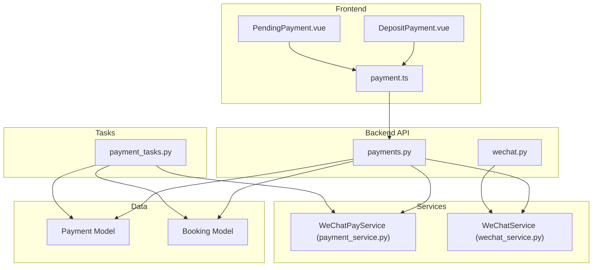
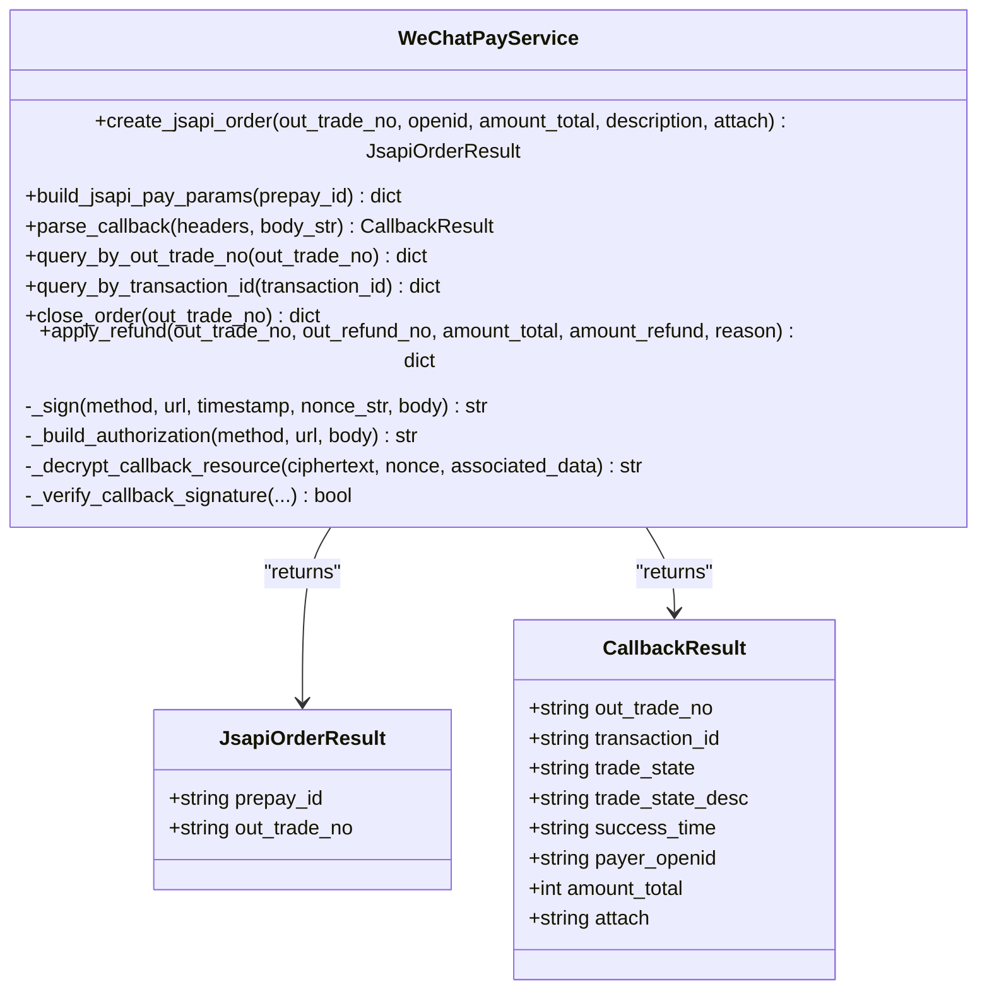
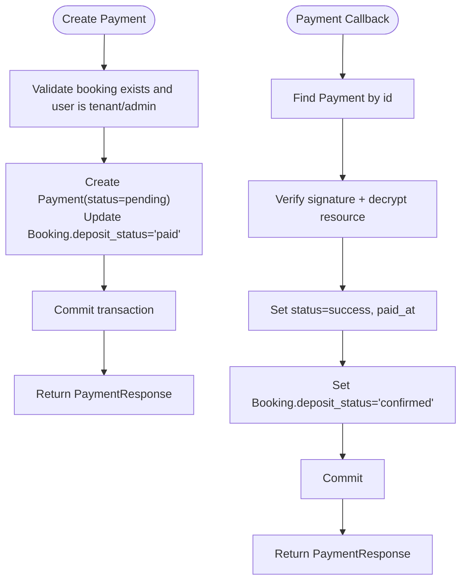
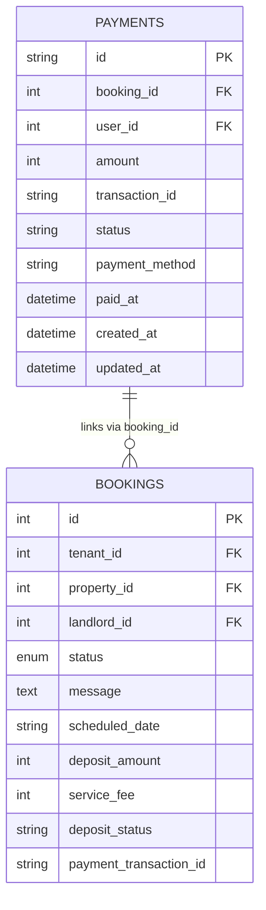
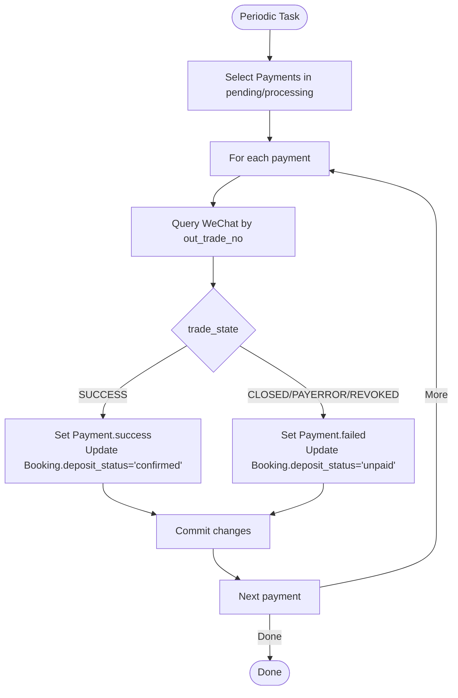
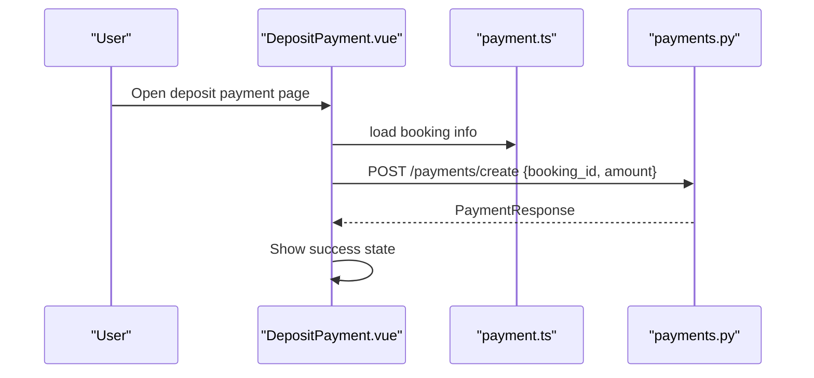
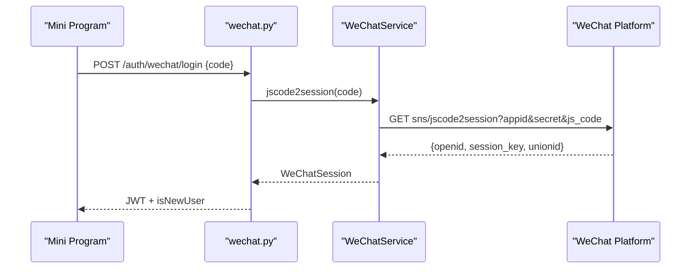
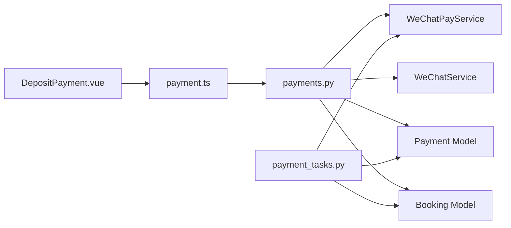

# Payment Processing Integration

<cite>
**Referenced Files in This Document**
- [payments.py](file://backend/app/api/v1/routes/payments.py)
- [payment_service.py](file://backend/app/services/payment_service.py)
- [payment.py](file://backend/app/models/payment.py)
- [payment.py](file://backend/app/schemas/payment.py)
- [wechat.py](file://backend/app/api/v1/routes/wechat.py)
- [wechat_service.py](file://backend/app/services/wechat_service.py)
- [payment_tasks.py](file://backend/app/tasks/payment_tasks.py)
- [config.py](file://backend/app/core/config.py)
- [booking.py](file://backend/app/models/booking.py)
- [DepositPayment.vue](file://frontend/src/views/DepositPayment.vue)
- [PendingPayment.vue](file://frontend/src/views/PendingPayment.vue)
- [payment.ts](file://frontend/src/services/payment.ts)
</cite>

## Table of Contents
1. [Introduction](#introduction)
2. [Project Structure](#project-structure)
3. [Core Components](#core-components)
4. [Architecture Overview](#architecture-overview)
5. [Detailed Component Analysis](#detailed-component-analysis)
6. [Dependency Analysis](#dependency-analysis)
7. [Performance Considerations](#performance-considerations)
8. [Troubleshooting Guide](#troubleshooting-guide)
9. [Conclusion](#conclusion)
10. [Appendices](#appendices)

## Introduction
This document explains the WeChat payment integration for rental deposit payments, covering:
- Frontend flow and wx.requestPayment parameter preparation
- Backend order creation, signature generation, and callback handling
- Transaction lifecycle management with polling and expiration tasks
- Deposit payment flow for rental properties (amount calculation, confirmation, receipt)
- Error handling for failures, timeouts, and refunds
- Security considerations including signature verification, idempotency, and PCI compliance

## Project Structure
The payment feature spans backend API routes, services, models, Celery tasks, and frontend views/services.



**Diagram sources**
- [payments.py:15-85](file://backend/app/api/v1/routes/payments.py#L15-L85)
- [payment_service.py:245-323](file://backend/app/services/payment_service.py#L245-L323)
- [payment_tasks.py:80-173](file://backend/app/tasks/payment_tasks.py#L80-L173)
- [payment.py](file://backend/app/models/payment.py)
- [booking.py](file://backend/app/models/booking.py)
- [DepositPayment.vue:138-153](file://frontend/src/views/DepositPayment.vue#L138-L153)
- [PendingPayment.vue:126-130](file://frontend/src/views/PendingPayment.vue#L126-L130)
- [payment.ts:21-33](file://frontend/src/services/payment.ts#L21-L33)
- [wechat.py:19-81](file://backend/app/api/v1/routes/wechat.py#L19-L81)
- [wechat_service.py:45-88](file://backend/app/services/wechat_service.py#L45-L88)

**Section sources**
- [payments.py:15-85](file://backend/app/api/v1/routes/payments.py#L15-L85)
- [payment_service.py:245-323](file://backend/app/services/payment_service.py#L245-L323)
- [payment_tasks.py:80-173](file://backend/app/tasks/payment_tasks.py#L80-L173)
- [payment.py](file://backend/app/models/payment.py)
- [booking.py](file://backend/app/models/booking.py)
- [DepositPayment.vue:138-153](file://frontend/src/views/DepositPayment.vue#L138-L153)
- [PendingPayment.vue:126-130](file://frontend/src/views/PendingPayment.vue#L126-L130)
- [payment.ts:21-33](file://frontend/src/services/payment.ts#L21-L33)
- [wechat.py:19-81](file://backend/app/api/v1/routes/wechat.py#L19-L81)
- [wechat_service.py:45-88](file://backend/app/services/wechat_service.py#L45-L88)

## Core Components
- Payment API endpoints: create payment record, simulate callback, get payment details
- WeChat Pay V3 service: JSAPI prepay order creation, pay params signing, callback parsing/decryption, order query/close/refund
- Payment model and schema: persistent payment state and DTOs
- Celery tasks: sync pending payments, close expired orders, send result notifications
- Frontend deposit payment page and pending payment detail view
- WeChat mini program login and config endpoints

Key responsibilities:
- Order creation and signature generation on the backend
- Callback verification and decryption
- Idempotent updates to payment and booking states
- Polling and cleanup for long-running or expired transactions
- UI flows for deposit amount display, payment initiation, and success/failure feedback

**Section sources**
- [payments.py:15-85](file://backend/app/api/v1/routes/payments.py#L15-L85)
- [payment_service.py:245-323](file://backend/app/services/payment_service.py#L245-L323)
- [payment_tasks.py:80-173](file://backend/app/tasks/payment_tasks.py#L80-L173)
- [payment.py](file://backend/app/models/payment.py)
- [payment.py](file://backend/app/schemas/payment.py)
- [DepositPayment.vue:138-153](file://frontend/src/views/DepositPayment.vue#L138-L153)
- [PendingPayment.vue:126-130](file://frontend/src/views/PendingPayment.vue#L126-L130)
- [payment.ts:21-33](file://frontend/src/services/payment.ts#L21-L33)

## Architecture Overview
End-to-end deposit payment flow using WeChat JSAPI:

```mermaid
sequenceDiagram
participant FE as "DepositPayment.vue"
participant API as "payments.py"
participant Svc as "WeChatPayService"
participant WX as "WeChat Pay V3"
participant DB as "Payments/Bookings"
participant Task as "Celery Tasks"
FE->>API : POST /api/v1/payments/create {booking_id, amount}
API->>DB : Create Payment (status=pending)
API-->>FE : PaymentResponse
FE->>API : Request JSAPI prepay params (out_trade_no, openid, amount)
API->>Svc : create_jsapi_order(out_trade_no, openid, amount, description)
Svc->>WX : POST /v3/pay/transactions/jsapi
WX-->>Svc : {prepay_id}
Svc-->>API : JsapiOrderResult
API-->>FE : build_jsapi_pay_params(prepay_id) -> {appId,timeStamp,nonceStr,package,signType,paySign}
FE->>WX : wx.requestPayment(params)
WX-->>FE : Success/Failure callback
WX->>API : POST /api/v1/payments/{id}/callback (headers + encrypted body)
API->>Svc : parse_callback(headers, body)
Svc->>Svc : verify_signature() + decrypt_resource()
Svc-->>API : CallbackResult
API->>DB : Update Payment.status=success, paid_at; Booking.deposit_status=confirmed
API-->>WX : 200 OK
Note over Task,WX : Periodic sync and expiry handling
Task->>Svc : query_by_out_trade_no(out_trade_no)
Svc->>WX : GET /v3/pay/transactions/out-trade-no/{out_trade_no}?mchid=...
WX-->>Svc : trade_state
Task->>DB : Update Payment/Booking based on trade_state
Task->>Task : close_expired_payments() if overdue
```

**Diagram sources**
- [payments.py:15-85](file://backend/app/api/v1/routes/payments.py#L15-L85)
- [payment_service.py:245-323](file://backend/app/services/payment_service.py#L245-L323)
- [payment_tasks.py:80-173](file://backend/app/tasks/payment_tasks.py#L80-L173)
- [payment.py](file://backend/app/models/payment.py)
- [booking.py](file://backend/app/models/booking.py)
- [DepositPayment.vue:138-153](file://frontend/src/views/DepositPayment.vue#L138-L153)

## Detailed Component Analysis

### WeChat Pay Service (JSAPI, Signatures, Callbacks)
Responsibilities:
- Create JSAPI prepay orders
- Build wx.requestPayment parameters with RSA signature
- Parse and validate WeChat callbacks (signature verification structure and AES-GCM decryption)
- Query order status, close unpaid orders, apply refunds



**Diagram sources**
- [payment_service.py:245-323](file://backend/app/services/payment_service.py#L245-L323)
- [payment_service.py:325-377](file://backend/app/services/payment_service.py#L325-L377)
- [payment_service.py:379-444](file://backend/app/services/payment_service.py#L379-L444)

**Section sources**
- [payment_service.py:245-323](file://backend/app/services/payment_service.py#L245-L323)
- [payment_service.py:325-377](file://backend/app/services/payment_service.py#L325-L377)
- [payment_service.py:379-444](file://backend/app/services/payment_service.py#L379-L444)

### Payment API Endpoints
Endpoints:
- POST /api/v1/payments/create: Create a payment record tied to a booking
- POST /api/v1/payments/{payment_id}/callback: Handle WeChat notification (currently simulated)
- GET /api/v1/payments/{payment_id}: Retrieve payment details with authorization checks



**Diagram sources**
- [payments.py:15-45](file://backend/app/api/v1/routes/payments.py#L15-L45)
- [payments.py:48-69](file://backend/app/api/v1/routes/payments.py#L48-L69)

**Section sources**
- [payments.py:15-85](file://backend/app/api/v1/routes/payments.py#L15-L85)

### Payment Model and Schema
- Payment entity stores booking linkage, amount, transaction identifiers, status, method, and timestamps
- Pydantic schemas define request/response contracts



**Diagram sources**
- [payment.py](file://backend/app/models/payment.py)
- [booking.py](file://backend/app/models/booking.py)

**Section sources**
- [payment.py](file://backend/app/models/payment.py)
- [payment.py](file://backend/app/schemas/payment.py)
- [booking.py](file://backend/app/models/booking.py)

### Celery Tasks: Sync, Expiry, Notifications
- sync_pending_payments: Poll WeChat for pending/processing payments and update local state
- close_expired_payments: Close orders older than threshold locally and on WeChat side
- send_payment_result_message: Send template messages upon payment outcome



**Diagram sources**
- [payment_tasks.py:80-118](file://backend/app/tasks/payment_tasks.py#L80-L118)
- [payment_tasks.py:121-173](file://backend/app/tasks/payment_tasks.py#L121-L173)

**Section sources**
- [payment_tasks.py:80-173](file://backend/app/tasks/payment_tasks.py#L80-L173)

### Frontend Deposit Payment Flow
- DepositPayment.vue displays deposit amount (CNY and USD reference), selects payment method, initiates payment
- PendingPayment.vue shows booking details and navigates to deposit payment
- payment.ts provides client methods for creating and querying payments



**Diagram sources**
- [DepositPayment.vue:138-153](file://frontend/src/views/DepositPayment.vue#L138-L153)
- [payment.ts:21-33](file://frontend/src/services/payment.ts#L21-L33)
- [payments.py:15-45](file://backend/app/api/v1/routes/payments.py#L15-L45)

**Section sources**
- [DepositPayment.vue:138-153](file://frontend/src/views/DepositPayment.vue#L138-L153)
- [PendingPayment.vue:126-130](file://frontend/src/views/PendingPayment.vue#L126-L130)
- [payment.ts:21-33](file://frontend/src/services/payment.ts#L21-L33)

### WeChat Mini Program Login and Config
- wechat.py exposes login and phone binding endpoints
- WeChatService handles jscode2session and access token caching



**Diagram sources**
- [wechat.py:19-38](file://backend/app/api/v1/routes/wechat.py#L19-L38)
- [wechat_service.py:45-65](file://backend/app/services/wechat_service.py#L45-L65)

**Section sources**
- [wechat.py:19-81](file://backend/app/api/v1/routes/wechat.py#L19-L81)
- [wechat_service.py:45-88](file://backend/app/services/wechat_service.py#L45-L88)

## Dependency Analysis
- API routes depend on services for external integrations and on models for persistence
- Services encapsulate cryptographic operations and HTTP calls to WeChat
- Celery tasks depend on services and database sessions to reconcile state
- Frontend depends on API routes and uses Vue components for UX



**Diagram sources**
- [payments.py:15-85](file://backend/app/api/v1/routes/payments.py#L15-L85)
- [payment_service.py:245-323](file://backend/app/services/payment_service.py#L245-L323)
- [payment_tasks.py:80-173](file://backend/app/tasks/payment_tasks.py#L80-L173)
- [payment.py](file://backend/app/models/payment.py)
- [booking.py](file://backend/app/models/booking.py)
- [DepositPayment.vue:138-153](file://frontend/src/views/DepositPayment.vue#L138-L153)
- [payment.ts:21-33](file://frontend/src/services/payment.ts#L21-L33)

**Section sources**
- [payments.py:15-85](file://backend/app/api/v1/routes/payments.py#L15-L85)
- [payment_service.py:245-323](file://backend/app/services/payment_service.py#L245-L323)
- [payment_tasks.py:80-173](file://backend/app/tasks/payment_tasks.py#L80-L173)
- [payment.py](file://backend/app/models/payment.py)
- [booking.py](file://backend/app/models/booking.py)
- [DepositPayment.vue:138-153](file://frontend/src/views/DepositPayment.vue#L138-L153)
- [payment.ts:21-33](file://frontend/src/services/payment.ts#L21-L33)

## Performance Considerations
- Use async HTTP clients for WeChat API calls to avoid blocking
- Cache WeChat platform certificates and access tokens where applicable
- Batch or limit polling frequency for pending payments
- Ensure database indexes on frequently queried fields (e.g., status, out_trade_no)
- Avoid redundant computations by memoizing private key loading

[No sources needed since this section provides general guidance]

## Troubleshooting Guide
Common issues and resolutions:
- Signature verification failures: Ensure correct header values and platform certificate usage; verify AES-GCM decryption with API v3 key
- Callback not received: Confirm notify_url is reachable and whitelisted; check firewall and DNS
- Expired orders: Use close_expired_payments task; ensure out_trade_no is set before closing
- Duplicate processing: Implement idempotency by checking existing final states before updating
- Refund errors: Validate refund amounts against original payment; handle refund_notify_url properly

Operational tips:
- Log all WeChat responses and exceptions
- Add retry/backoff for transient network errors
- Monitor Celery task metrics and alert on failures

**Section sources**
- [payment_service.py:325-377](file://backend/app/services/payment_service.py#L325-L377)
- [payment_tasks.py:121-173](file://backend/app/tasks/payment_tasks.py#L121-L173)

## Conclusion
The integration implements a robust WeChat JSAPI payment flow with clear separation of concerns:
- Frontend orchestrates user interactions and invokes backend APIs
- Backend creates orders, signs parameters, verifies callbacks, and reconciles state
- Celery tasks provide resilience through polling and cleanup
- Models and schemas enforce data integrity and API contracts

Adopting the security and operational recommendations will strengthen reliability and compliance.

[No sources needed since this section summarizes without analyzing specific files]

## Appendices

### wx.requestPayment Parameter Preparation
- Prepay order creation returns prepay_id
- Build pay params with appId, timeStamp, nonceStr, package, signType, paySign
- Ensure consistent signing string format per WeChat spec

**Section sources**
- [payment_service.py:294-323](file://backend/app/services/payment_service.py#L294-L323)

### Deposit Payment Flow Details
- Amount calculation: use booking.deposit_amount; optionally show USD reference rate
- Payment confirmation: update Payment.status and Booking.deposit_status on success
- Receipt generation: store PaymentResponse and link to booking for later retrieval

**Section sources**
- [booking.py:39-42](file://backend/app/models/booking.py#L39-L42)
- [payments.py:15-45](file://backend/app/api/v1/routes/payments.py#L15-L45)
- [DepositPayment.vue:122-128](file://frontend/src/views/DepositPayment.vue#L122-L128)

### Error Handling Examples
- Payment failure: Set Payment.status=failed; notify user; allow retry
- Timeout scenarios: Mark closed after threshold; inform user to re-initiate
- Refund processing: Apply refund via service; handle refund_notify_url; update statuses

**Section sources**
- [payment_tasks.py:121-173](file://backend/app/tasks/payment_tasks.py#L121-L173)
- [payment_service.py:421-444](file://backend/app/services/payment_service.py#L421-L444)

### Security Considerations
- Signature verification: Validate callback headers and decrypt resource with API v3 key
- Idempotency: Check final states before applying updates; deduplicate callbacks
- PCI compliance: Do not handle raw card data; rely on WeChat Pay’s secure channels; minimize sensitive data storage

**Section sources**
- [payment_service.py:207-239](file://backend/app/services/payment_service.py#L207-L239)
- [payment_service.py:325-377](file://backend/app/services/payment_service.py#L325-L377)

### Configuration Keys
- WeChat app credentials and keys are loaded from settings
- Ensure environment variables are correctly set for production

**Section sources**
- [config.py:107-119](file://backend/app/core/config.py#L107-L119)