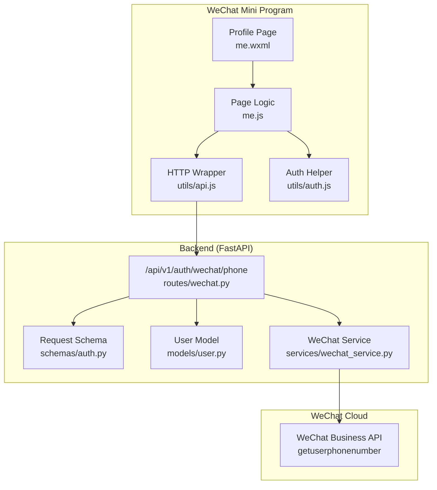
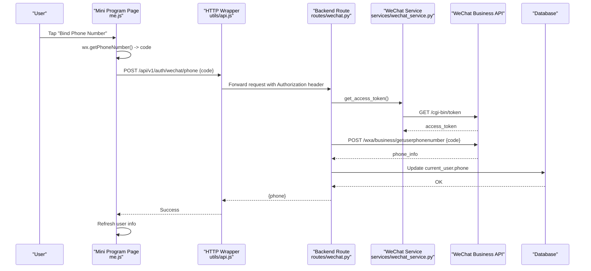
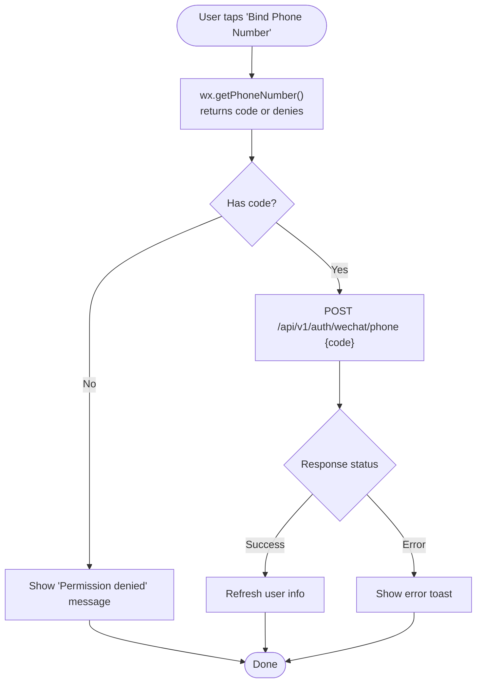
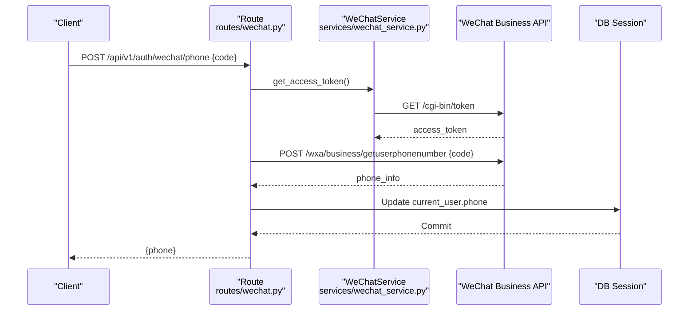
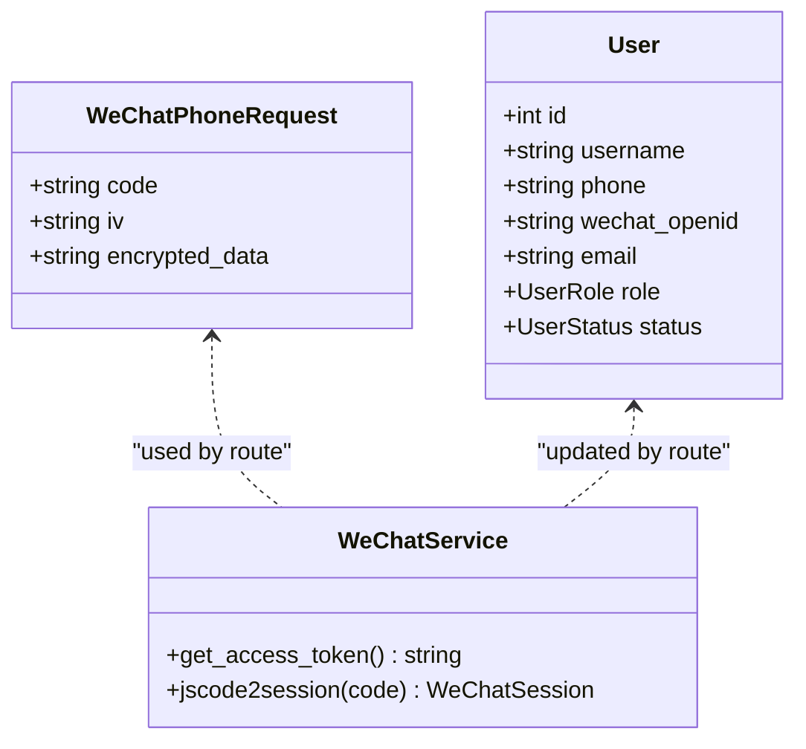
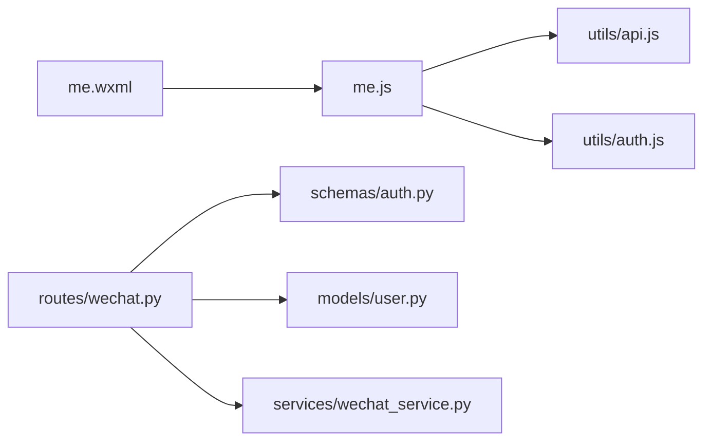

# Phone Number Binding

<cite>
**Referenced Files in This Document**
- [wechat.py](file://backend/app/api/v1/routes/wechat.py)
- [wechat_service.py](file://backend/app/services/wechat_service.py)
- [auth.py](file://backend/app/schemas/auth.py)
- [user.py](file://backend/app/models/user.py)
- [me.js](file://wechat-miniprogram/pages/me/me.js)
- [me.wxml](file://wechat-miniprogram/pages/me/me.wxml)
- [api.js](file://wechat-miniprogram/utils/api.js)
- [auth.js](file://wechat-miniprogram/utils/auth.js)
- [test_wechat.py](file://backend/tests/test_wechat.py)
</cite>

## Table of Contents
1. [Introduction](#introduction)
2. [Project Structure](#project-structure)
3. [Core Components](#core-components)
4. [Architecture Overview](#architecture-overview)
5. [Detailed Component Analysis](#detailed-component-analysis)
6. [Dependency Analysis](#dependency-analysis)
7. [Performance Considerations](#performance-considerations)
8. [Troubleshooting Guide](#troubleshooting-guide)
9. [Conclusion](#conclusion)
10. [Appendices](#appendices)

## Introduction
This document explains the WeChat phone number binding feature end-to-end: how the frontend collects user consent, how the backend verifies and stores the phone number, and how to handle errors and privacy requirements. It focuses on the getPhoneNumber flow using a temporary code exchanged server-side for the actual phone number via WeChat’s business API.

## Project Structure
The phone binding spans both the WeChat Mini Program frontend and the FastAPI backend:
- Frontend (Mini Program): UI button with open-type="getPhoneNumber", event handler that posts the returned code to the backend.
- Backend (FastAPI): Endpoint that exchanges the code for a phone number via WeChat’s API and updates the current user’s profile.

**Diagram sources**
- [me.wxml:20-30](file://wechat-miniprogram/pages/me/me.wxml#L20-L30)
- [me.js:44-60](file://wechat-miniprogram/pages/me/me.js#L44-L60)
- [api.js:1-52](file://wechat-miniprogram/utils/api.js#L1-L52)
- [auth.js:1-81](file://wechat-miniprogram/utils/auth.js#L1-L81)
- [wechat.py:41-74](file://backend/app/api/v1/routes/wechat.py#L41-L74)
- [auth.py:34-38](file://backend/app/schemas/auth.py#L34-L38)
- [user.py:24-48](file://backend/app/models/user.py#L24-L48)
- [wechat_service.py:67-88](file://backend/app/services/wechat_service.py#L67-L88)

**Section sources**
- [me.wxml:20-30](file://wechat-miniprogram/pages/me/me.wxml#L20-L30)
- [me.js:44-60](file://wechat-miniprogram/pages/me/me.js#L44-L60)
- [api.js:1-52](file://wechat-miniprogram/utils/api.js#L1-L52)
- [auth.js:1-81](file://wechat-miniprogram/utils/auth.js#L1-L81)
- [wechat.py:41-74](file://backend/app/api/v1/routes/wechat.py#L41-L74)
- [auth.py:34-38](file://backend/app/schemas/auth.py#L34-L38)
- [user.py:24-48](file://backend/app/models/user.py#L24-L48)
- [wechat_service.py:67-88](file://backend/app/services/wechat_service.py#L67-L88)

## Core Components
- Frontend Button and Event Handling
  - The profile page renders a “Bind Phone Number” button only when the user has not yet bound a phone.
  - The button uses open-type="getPhoneNumber" to request user consent and returns a short-lived code.
  - The page logic posts this code to the backend endpoint /api/v1/auth/wechat/phone.

- Backend Endpoint
  - POST /api/v1/auth/wechat/phone accepts a WeChatPhoneRequest containing the code.
  - It obtains an access token from WeChat, calls the business API to retrieve the phone number, then updates the authenticated user’s phone field.

- Data Models and Schemas
  - WeChatPhoneRequest defines the expected fields for the phone binding request.
  - User model includes a unique phone column used for storage and indexing.

- WeChat Service
  - Provides access token retrieval with caching and other WeChat utilities.

**Section sources**
- [me.wxml:20-30](file://wechat-miniprogram/pages/me/me.wxml#L20-L30)
- [me.js:44-60](file://wechat-miniprogram/pages/me/me.js#L44-L60)
- [wechat.py:41-74](file://backend/app/api/v1/routes/wechat.py#L41-L74)
- [auth.py:34-38](file://backend/app/schemas/auth.py#L34-L38)
- [user.py:24-48](file://backend/app/models/user.py#L24-L48)
- [wechat_service.py:67-88](file://backend/app/services/wechat_service.py#L67-L88)

## Architecture Overview
The phone binding uses WeChat’s modern business API flow:
- Frontend triggers getPhoneNumber, receives a temporary code.
- Backend exchanges the code for the actual phone number using an access token.
- Backend persists the phone number to the database and returns it to the client.

**Diagram sources**
- [me.js:44-60](file://wechat-miniprogram/pages/me/me.js#L44-L60)
- [api.js:1-52](file://wechat-miniprogram/utils/api.js#L1-L52)
- [wechat.py:41-74](file://backend/app/api/v1/routes/wechat.py#L41-L74)
- [wechat_service.py:67-88](file://backend/app/services/wechat_service.py#L67-L88)

## Detailed Component Analysis

### Frontend: Button Configuration and Consent Management
- Button configuration
  - The profile page conditionally shows a “Bind Phone Number” button when the user does not have a phone number set.
  - The button uses open-type="getPhoneNumber" to trigger WeChat’s permission prompt.
- Event handling
  - The onBindPhone handler extracts the code from the event detail and posts it to the backend.
  - On success, it refreshes the user info; on failure, it shows an error toast.
- Authentication context
  - The HTTP wrapper attaches the Bearer token if present, enabling protected endpoints.

**Diagram sources**
- [me.wxml:20-30](file://wechat-miniprogram/pages/me/me.wxml#L20-L30)
- [me.js:44-60](file://wechat-miniprogram/pages/me/me.js#L44-L60)
- [api.js:1-52](file://wechat-miniprogram/utils/api.js#L1-L52)

**Section sources**
- [me.wxml:20-30](file://wechat-miniprogram/pages/me/me.wxml#L20-L30)
- [me.js:44-60](file://wechat-miniprogram/pages/me/me.js#L44-L60)
- [api.js:1-52](file://wechat-miniprogram/utils/api.js#L1-L52)

### Backend: Phone Binding Endpoint
- Request validation
  - The route expects a WeChatPhoneRequest with at least a code field.
- Access token management
  - Uses WeChatService.get_access_token(), which caches tokens to avoid repeated network calls.
- Phone retrieval
  - Calls WeChat’s business API with the temporary code to obtain the phone number.
- Persistence
  - Updates the current authenticated user’s phone field and commits the change.
- Response
  - Returns the phone number to the client.

**Diagram sources**
- [wechat.py:41-74](file://backend/app/api/v1/routes/wechat.py#L41-L74)
- [wechat_service.py:67-88](file://backend/app/services/wechat_service.py#L67-L88)

**Section sources**
- [wechat.py:41-74](file://backend/app/api/v1/routes/wechat.py#L41-L74)
- [auth.py:34-38](file://backend/app/schemas/auth.py#L34-L38)
- [wechat_service.py:67-88](file://backend/app/services/wechat_service.py#L67-L88)
- [user.py:24-48](file://backend/app/models/user.py#L24-L48)

### Data Models and Schemas
- WeChatPhoneRequest
  - Fields: code (required), iv (optional), encrypted_data (optional). In the current implementation, only code is used.
- User model
  - Includes a unique, indexed phone field suitable for storing the bound number.

**Diagram sources**
- [auth.py:34-38](file://backend/app/schemas/auth.py#L34-L38)
- [user.py:24-48](file://backend/app/models/user.py#L24-L48)
- [wechat_service.py:67-88](file://backend/app/services/wechat_service.py#L67-L88)

**Section sources**
- [auth.py:34-38](file://backend/app/schemas/auth.py#L34-L38)
- [user.py:24-48](file://backend/app/models/user.py#L24-L48)

### Encrypted Data Handling and Decryption
- Current behavior
  - The endpoint uses the modern business API flow: the frontend sends a temporary code, and the backend retrieves the phone number directly from WeChat. No client-side decryption is required.
- Legacy alternative (for reference)
  - If you ever need to support the legacy flow where the frontend provides encrypted_data and iv, the backend would decrypt using the session_key obtained from jscode2session. The service already exposes jscode2session for that purpose.

Note: The current implementation does not perform AES decryption on the server side for phone binding because it relies on the business API.

**Section sources**
- [wechat.py:41-74](file://backend/app/api/v1/routes/wechat.py#L41-L74)
- [wechat_service.py:45-65](file://backend/app/services/wechat_service.py#L45-L65)
- [auth.py:34-38](file://backend/app/schemas/auth.py#L34-L38)

## Dependency Analysis
- Frontend dependencies
  - me.wxml depends on me.js for event handling.
  - me.js depends on utils/api.js for HTTP requests and utils/auth.js for login state.
- Backend dependencies
  - routes/wechat.py depends on schemas/auth.py for request/response models, models/user.py for persistence, and services/wechat_service.py for WeChat API interactions.

**Diagram sources**
- [me.wxml:20-30](file://wechat-miniprogram/pages/me/me.wxml#L20-L30)
- [me.js:44-60](file://wechat-miniprogram/pages/me/me.js#L44-L60)
- [api.js:1-52](file://wechat-miniprogram/utils/api.js#L1-L52)
- [auth.js:1-81](file://wechat-miniprogram/utils/auth.js#L1-L81)
- [wechat.py:41-74](file://backend/app/api/v1/routes/wechat.py#L41-L74)
- [auth.py:34-38](file://backend/app/schemas/auth.py#L34-L38)
- [user.py:24-48](file://backend/app/models/user.py#L24-L48)
- [wechat_service.py:67-88](file://backend/app/services/wechat_service.py#L67-L88)

**Section sources**
- [me.wxml:20-30](file://wechat-miniprogram/pages/me/me.wxml#L20-L30)
- [me.js:44-60](file://wechat-miniprogram/pages/me/me.js#L44-L60)
- [api.js:1-52](file://wechat-miniprogram/utils/api.js#L1-L52)
- [auth.js:1-81](file://wechat-miniprogram/utils/auth.js#L1-L81)
- [wechat.py:41-74](file://backend/app/api/v1/routes/wechat.py#L41-L74)
- [auth.py:34-38](file://backend/app/schemas/auth.py#L34-L38)
- [user.py:24-48](file://backend/app/models/user.py#L24-L48)
- [wechat_service.py:67-88](file://backend/app/services/wechat_service.py#L67-L88)

## Performance Considerations
- Access token caching
  - The WeChatService caches the access token and avoids redundant network calls until near expiration.
- Minimal payload
  - The frontend only sends a short-lived code; no large encrypted payloads are transmitted.
- Database update
  - A single UPDATE operation per binding attempt; ensure indexes exist on phone and openid for lookups elsewhere.

[No sources needed since this section provides general guidance]

## Troubleshooting Guide
Common issues and resolutions:
- Permission denied
  - The frontend should show a clear message when the user denies the phone permission. Ensure the button is visible only when the user has not yet bound a phone.
- Network errors
  - The HTTP wrapper displays a generic network failure toast and rejects the promise. Check connectivity and base URL configuration.
- Invalid or expired code
  - The backend will receive an error from WeChat and return a 400 response. The frontend should display the error message provided by the backend.
- Duplicate phone numbers
  - The User model enforces uniqueness on phone. If a conflict occurs, the database layer will raise an integrity error. Add explicit handling to inform the user that the number is already in use.

Operational checks:
- Verify that the authorization header is attached for protected endpoints.
- Confirm that the WeChat appid and secret are configured correctly for access token retrieval.

**Section sources**
- [api.js:1-52](file://wechat-miniprogram/utils/api.js#L1-L52)
- [wechat.py:41-74](file://backend/app/api/v1/routes/wechat.py#L41-L74)
- [user.py:24-48](file://backend/app/models/user.py#L24-L48)

## Conclusion
The phone binding feature leverages WeChat’s secure business API to exchange a temporary code for a verified phone number. The frontend manages user consent and UI feedback, while the backend handles token management, API calls, and database updates. This design minimizes sensitive data exposure and simplifies encryption concerns by relying on WeChat’s official flows.

[No sources needed since this section summarizes without analyzing specific files]

## Appendices

### Integration Examples into User Profile Workflows
- After successful binding, refresh the user profile to reflect the new phone number in the UI.
- Optionally gate certain features (e.g., booking confirmations) until a phone number is bound.

**Section sources**
- [me.js:44-60](file://wechat-miniprogram/pages/me/me.js#L44-L60)

### Privacy Compliance and Security Best Practices
- Use HTTPS for all communications between the Mini Program and backend.
- Store only necessary personal data; avoid logging phone numbers.
- Respect user consent: do not proceed if the user denies permission.
- Follow platform policies for collecting and storing phone numbers.

[No sources needed since this section provides general guidance]

### Tests and Validation
- Existing tests cover WeChat login and config endpoints; they demonstrate mocking patterns for external APIs and token handling.

**Section sources**
- [test_wechat.py:1-183](file://backend/tests/test_wechat.py#L1-L183)