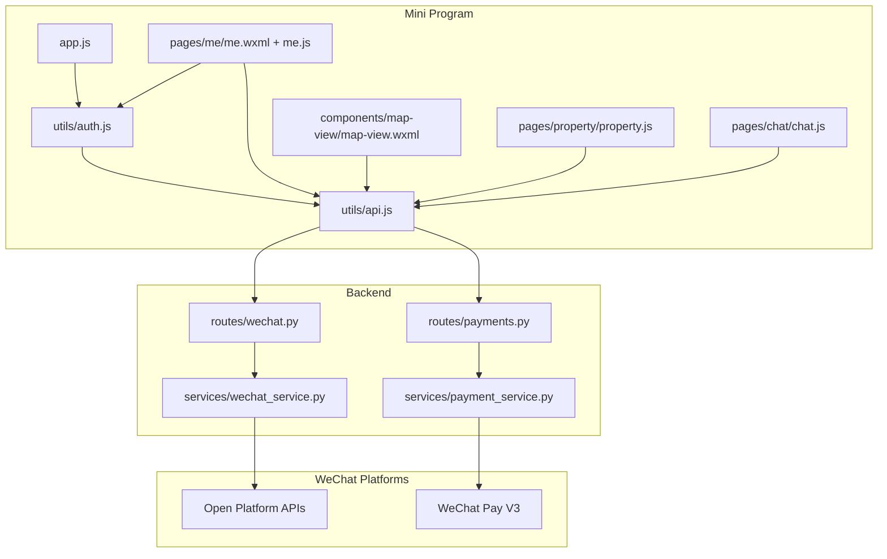
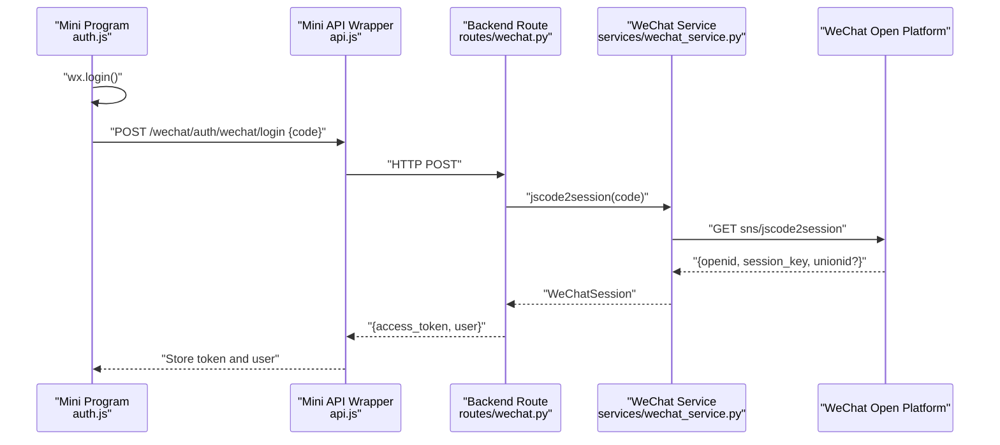
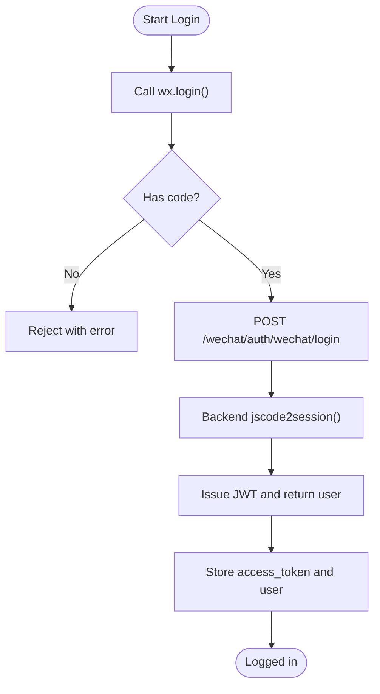
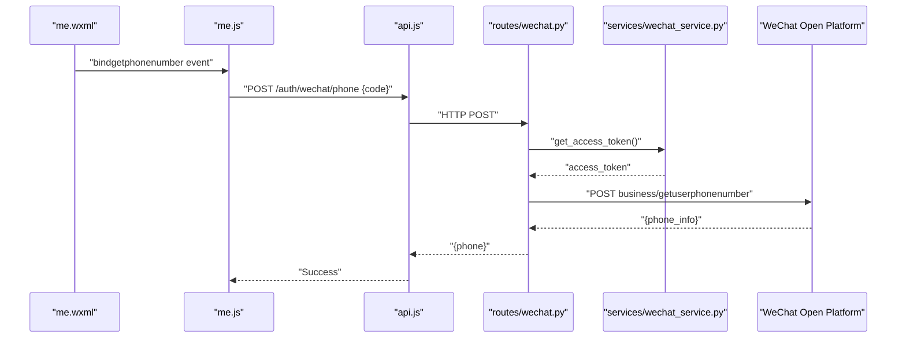
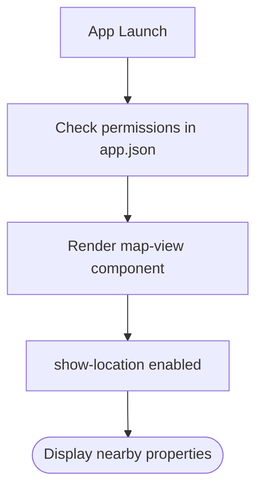
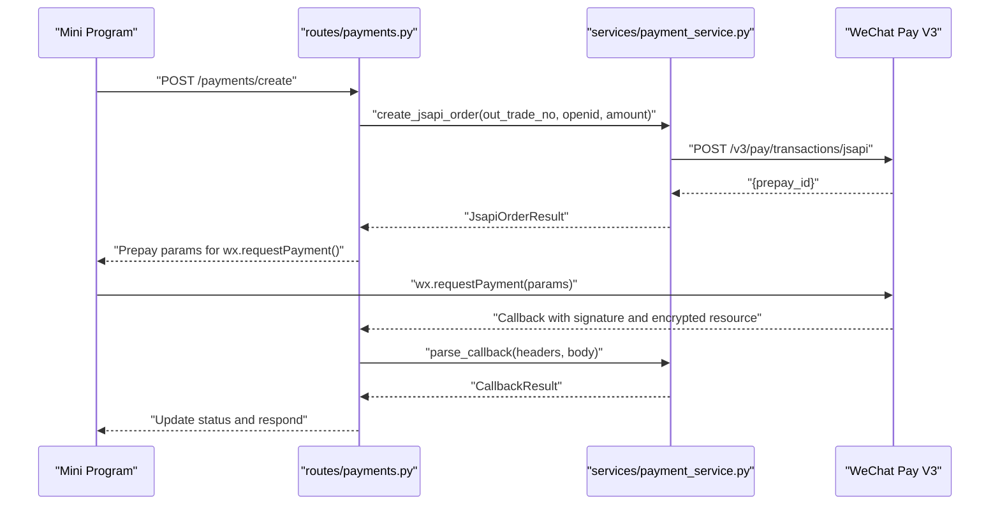
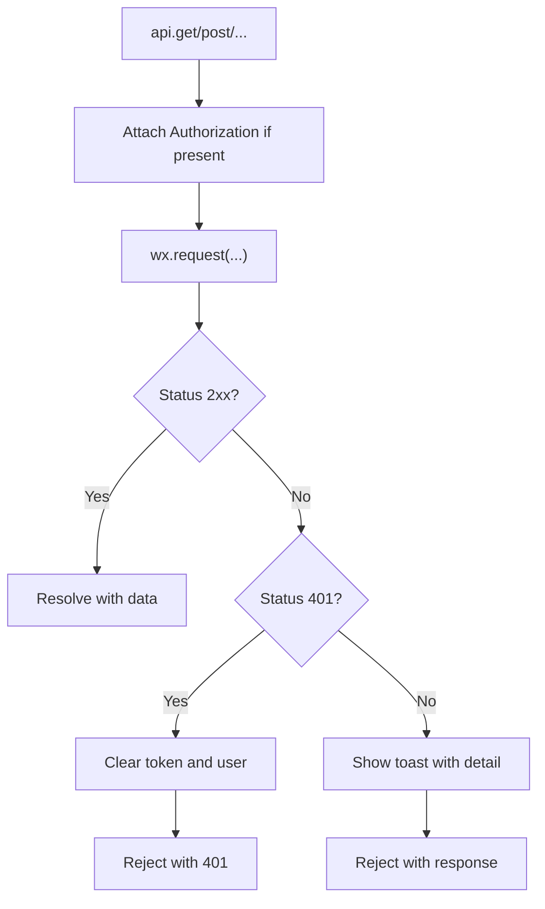
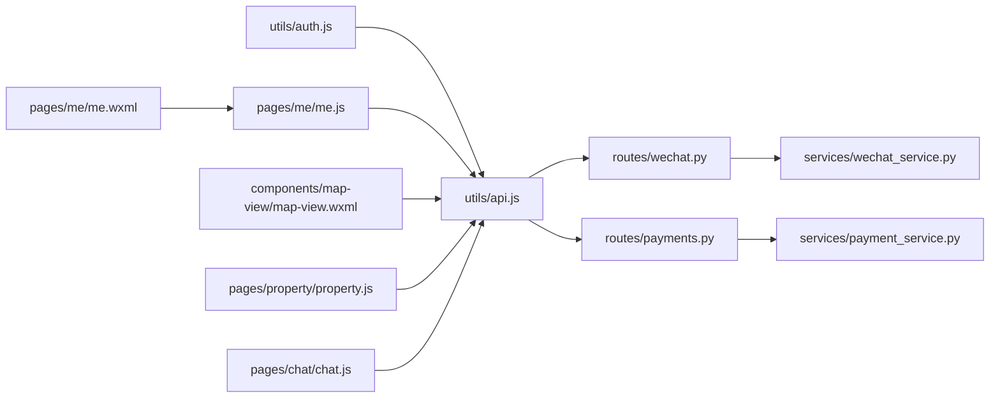

# WeChat API Integration

<cite>
**Referenced Files in This Document**
- [app.js](file://wechat-miniprogram/app.js)
- [auth.js](file://wechat-miniprogram/utils/auth.js)
- [api.js](file://wechat-miniprogram/utils/api.js)
- [app.json](file://wechat-miniprogram/app.json)
- [map-view.wxml](file://wechat-miniprogram/components/map-view/map-view.wxml)
- [me.wxml](file://wechat-miniprogram/pages/me/me.wxml)
- [me.js](file://wechat-miniprogram/pages/me/me.js)
- [property.js](file://wechat-miniprogram/pages/property/property.js)
- [chat.js](file://wechat-miniprogram/pages/chat/chat.js)
- [wechat.py](file://backend/app/api/v1/routes/wechat.py)
- [wechat_service.py](file://backend/app/services/wechat_service.py)
- [payments.py](file://backend/app/api/v1/routes/payments.py)
- [payment_service.py](file://backend/app/services/payment_service.py)
</cite>

## Table of Contents
1. Introduction
2. Project Structure
3. Core Components
4. Architecture Overview
5. Detailed Component Analysis
6. Dependency Analysis
7. Performance Considerations
8. Troubleshooting Guide
9. Conclusion

## Introduction
This document explains how the mini program integrates with WeChat APIs and backend services to implement authentication, phone number binding, location services, payment processing, and common WeChat features such as sharing, scanning, and file uploads. It focuses on the end-to-end flows from the mini program UI through the backend to WeChat platforms, including error handling, security considerations, and practical implementation references.

## Project Structure
The integration spans two layers:
- Mini program (frontend): Handles user interactions, calls WeChat native APIs, and communicates with the backend via HTTP.
- Backend (Python/FastAPI): Exposes REST endpoints for login, phone binding, payments, and configuration; interacts with WeChat Open Platform and WeChat Pay V3.

**Diagram sources**
- [app.js:1-21](file://wechat-miniprogram/app.js#L1-L21)
- [auth.js:1-81](file://wechat-miniprogram/utils/auth.js#L1-L81)
- [api.js:1-52](file://wechat-miniprogram/utils/api.js#L1-L52)
- [me.wxml:1-30](file://wechat-miniprogram/pages/me/me.wxml#L1-L30)
- [me.js:1-60](file://wechat-miniprogram/pages/me/me.js#L1-L60)
- [map-view.wxml:1-9](file://wechat-miniprogram/components/map-view/map-view.wxml#L1-L9)
- [property.js:1-90](file://wechat-miniprogram/pages/property/property.js#L1-L90)
- [chat.js:53-107](file://wechat-miniprogram/pages/chat/chat.js#L53-L107)
- [wechat.py:1-82](file://backend/app/api/v1/routes/wechat.py#L1-L82)
- [wechat_service.py:1-146](file://backend/app/services/wechat_service.py#L1-L146)
- [payments.py:1-85](file://backend/app/api/v1/routes/payments.py#L1-L85)
- [payment_service.py:1-445](file://backend/app/services/payment_service.py#L1-L445)

**Section sources**
- [app.js:1-21](file://wechat-miniprogram/app.js#L1-L21)
- [app.json:1-57](file://wechat-miniprogram/app.json#L1-L57)

## Core Components
- Authentication flow: wx.login -> backend code-to-session exchange -> JWT issuance and storage.
- Phone binding: getPhoneNumber button -> backend exchanges code for phone number -> persists to user profile.
- Location services: permission declaration and map component usage.
- Payment processing: JSAPI order creation, signature building, and callback verification.
- Network layer: centralized request wrapper with token injection and error handling.

**Section sources**
- [auth.js:1-81](file://wechat-miniprogram/utils/auth.js#L1-L81)
- [api.js:1-52](file://wechat-miniprogram/utils/api.js#L1-L52)
- [wechat.py:1-82](file://backend/app/api/v1/routes/wechat.py#L1-L82)
- [wechat_service.py:1-146](file://backend/app/services/wechat_service.py#L1-L146)
- [payments.py:1-85](file://backend/app/api/v1/routes/payments.py#L1-L85)
- [payment_service.py:1-445](file://backend/app/services/payment_service.py#L1-L445)
- [app.json:48-53](file://wechat-miniprogram/app.json#L48-L53)
- [map-view.wxml:1-9](file://wechat-miniprogram/components/map-view/map-view.wxml#L1-L9)

## Architecture Overview
End-to-end flows for key features:

**Diagram sources**
- [auth.js:9-33](file://wechat-miniprogram/utils/auth.js#L9-L33)
- [api.js:4-41](file://wechat-miniprogram/utils/api.js#L4-L41)
- [wechat.py:19-38](file://backend/app/api/v1/routes/wechat.py#L19-L38)
- [wechat_service.py:45-65](file://backend/app/services/wechat_service.py#L45-L65)

## Detailed Component Analysis

### Authentication Flow (wx.login and code-to-session)
- The mini program obtains a temporary login code via wx.login and sends it to the backend.
- The backend exchanges the code for openid and session_key using the WeChat Open Platform API.
- The backend issues an access token and returns user info to the mini program, which stores them locally.

**Diagram sources**
- [auth.js:9-33](file://wechat-miniprogram/utils/auth.js#L9-L33)
- [wechat.py:19-38](file://backend/app/api/v1/routes/wechat.py#L19-L38)
- [wechat_service.py:45-65](file://backend/app/services/wechat_service.py#L45-L65)

**Section sources**
- [auth.js:1-81](file://wechat-miniprogram/utils/auth.js#L1-L81)
- [wechat.py:1-82](file://backend/app/api/v1/routes/wechat.py#L1-L82)
- [wechat_service.py:1-146](file://backend/app/services/wechat_service.py#L1-L146)

### Phone Number Binding (getPhoneNumber)
- The “Bind phone number” button uses open-type="getPhoneNumber" to obtain a one-time code.
- The mini program posts this code to the backend, which calls WeChat’s getuserphonenumber API to retrieve the phone number and updates the user record.

**Diagram sources**
- [me.wxml:27-29](file://wechat-miniprogram/pages/me/me.wxml#L27-L29)
- [me.js:44-60](file://wechat-miniprogram/pages/me/me.js#L44-L60)
- [wechat.py:41-74](file://backend/app/api/v1/routes/wechat.py#L41-L74)
- [wechat_service.py:67-88](file://backend/app/services/wechat_service.py#L67-L88)

**Section sources**
- [me.wxml:1-30](file://wechat-miniprogram/pages/me/me.wxml#L1-L30)
- [me.js:1-60](file://wechat-miniprogram/pages/me/me.js#L1-L60)
- [wechat.py:41-74](file://backend/app/api/v1/routes/wechat.py#L41-L74)
- [wechat_service.py:67-88](file://backend/app/services/wechat_service.py#L67-L88)

### Location Services Integration
- Permission is declared in app.json for scope.userLocation and requiredPrivateInfos includes getLocation.
- The map component displays current location and markers.

**Diagram sources**
- [app.json:48-53](file://wechat-miniprogram/app.json#L48-L53)
- [map-view.wxml:1-9](file://wechat-miniprogram/components/map-view/map-view.wxml#L1-L9)

**Section sources**
- [app.json:48-53](file://wechat-miniprogram/app.json#L48-L53)
- [map-view.wxml:1-9](file://wechat-miniprogram/components/map-view/map-view.wxml#L1-L9)

### Payment Processing Integration (JSAPI)
- The backend creates a JSAPI prepay order and builds parameters for wx.requestPayment().
- After payment, WeChat Pay sends a callback that must be verified and decrypted before updating records.

**Diagram sources**
- [payments.py:15-45](file://backend/app/api/v1/routes/payments.py#L15-L45)
- [payment_service.py:245-323](file://backend/app/services/payment_service.py#L245-L323)
- [payment_service.py:325-377](file://backend/app/services/payment_service.py#L325-L377)

**Section sources**
- [payments.py:1-85](file://backend/app/api/v1/routes/payments.py#L1-L85)
- [payment_service.py:1-445](file://backend/app/services/payment_service.py#L1-L445)

### Network Request Layer and Error Handling
- The request wrapper injects Authorization headers when available and handles 401 by clearing local tokens.
- Non-2xx responses show toast messages and reject with structured errors.

**Diagram sources**
- [api.js:4-41](file://wechat-miniprogram/utils/api.js#L4-L41)

**Section sources**
- [api.js:1-52](file://wechat-miniprogram/utils/api.js#L1-L52)

### WeChat-Specific Features Examples
- Sharing: Implement via onShareAppMessage/onShareTimeline handlers in page lifecycle methods.
- Scanning: Use wx.scanCode to read QR/barcodes and navigate or submit results.
- File uploads: Use wx.chooseMedia/wx.chooseImage to select files, then upload via multipart/form-data to the backend upload endpoint.

[No sources needed since this section provides general guidance]

## Dependency Analysis
Key dependencies between modules:

**Diagram sources**
- [auth.js:1-81](file://wechat-miniprogram/utils/auth.js#L1-L81)
- [api.js:1-52](file://wechat-miniprogram/utils/api.js#L1-L52)
- [me.wxml:1-30](file://wechat-miniprogram/pages/me/me.wxml#L1-L30)
- [me.js:1-60](file://wechat-miniprogram/pages/me/me.js#L1-L60)
- [map-view.wxml:1-9](file://wechat-miniprogram/components/map-view/map-view.wxml#L1-L9)
- [property.js:1-90](file://wechat-miniprogram/pages/property/property.js#L1-L90)
- [chat.js:53-107](file://wechat-miniprogram/pages/chat/chat.js#L53-L107)
- [wechat.py:1-82](file://backend/app/api/v1/routes/wechat.py#L1-L82)
- [wechat_service.py:1-146](file://backend/app/services/wechat_service.py#L1-L146)
- [payments.py:1-85](file://backend/app/api/v1/routes/payments.py#L1-L85)
- [payment_service.py:1-445](file://backend/app/services/payment_service.py#L1-L445)

**Section sources**
- [auth.js:1-81](file://wechat-miniprogram/utils/auth.js#L1-L81)
- [api.js:1-52](file://wechat-miniprogram/utils/api.js#L1-L52)
- [wechat.py:1-82](file://backend/app/api/v1/routes/wechat.py#L1-L82)
- [wechat_service.py:1-146](file://backend/app/services/wechat_service.py#L1-L146)
- [payments.py:1-85](file://backend/app/api/v1/routes/payments.py#L1-L85)
- [payment_service.py:1-445](file://backend/app/services/payment_service.py#L1-L445)

## Performance Considerations
- Cache WeChat access tokens server-side with expiration checks to reduce external calls.
- Minimize network requests by batching operations where possible.
- Use lazy loading for images and defer heavy computations until needed.
- For payments, ensure idempotency keys (out_trade_no) are unique and persisted to avoid duplicate charges.

[No sources needed since this section provides general guidance]

## Troubleshooting Guide
Common issues and resolutions:
- 401 Unauthorized: The request wrapper clears tokens and prompts re-login. Ensure the backend validates tokens and refreshes sessions appropriately.
- Phone binding failures: Verify the ephemeral code is used once and within its validity window; check backend logs for WeChat API errcode.
- Payment callbacks not processed: Confirm signature verification and AES-GCM decryption steps; validate timestamps and nonces.
- Location permission denied: Ensure app.json declares scope.userLocation and requiredPrivateInfos; prompt users to enable location in system settings.

**Section sources**
- [api.js:22-38](file://wechat-miniprogram/utils/api.js#L22-L38)
- [wechat.py:60-74](file://backend/app/api/v1/routes/wechat.py#L60-L74)
- [payment_service.py:325-377](file://backend/app/services/payment_service.py#L325-L377)
- [app.json:48-53](file://wechat-miniprogram/app.json#L48-L53)

## Conclusion
The mini program integrates WeChat Open Platform and WeChat Pay V3 through a clear separation of concerns: the frontend handles UX and native APIs, while the backend manages secure exchanges, signatures, and state persistence. Following the documented flows and security practices ensures robust authentication, phone binding, location display, and reliable payment processing.