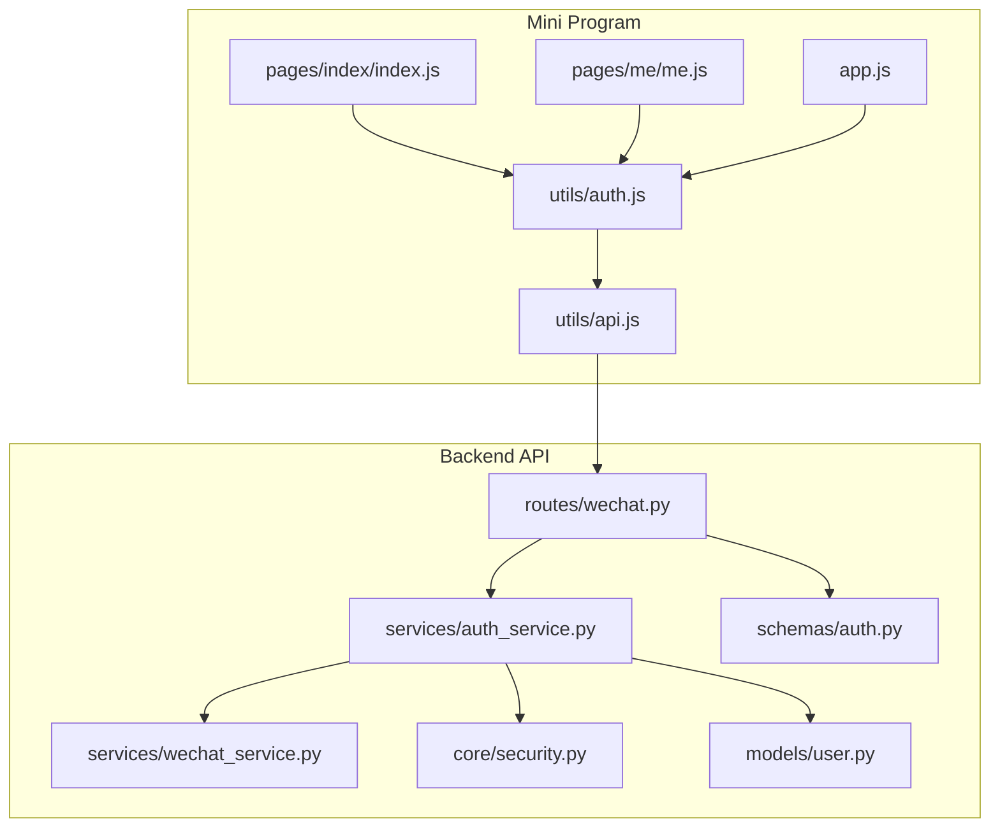
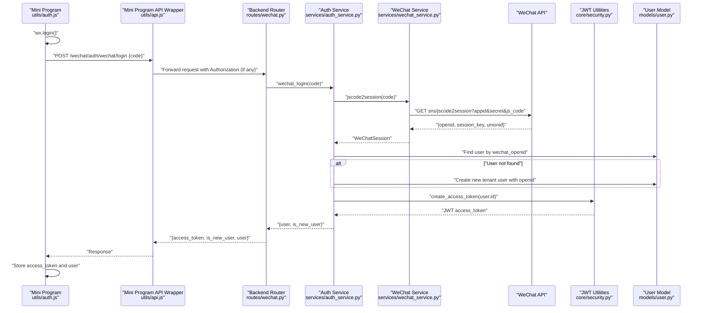
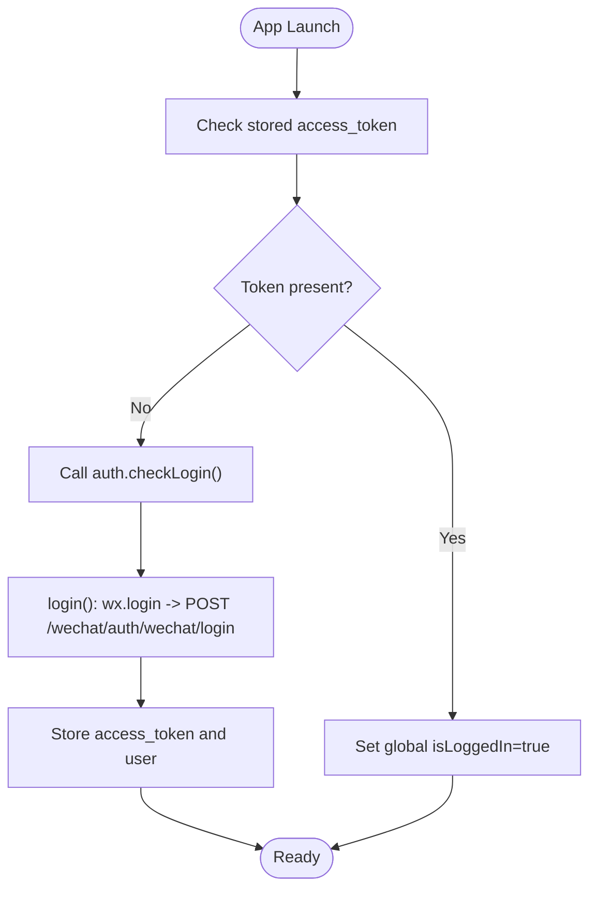
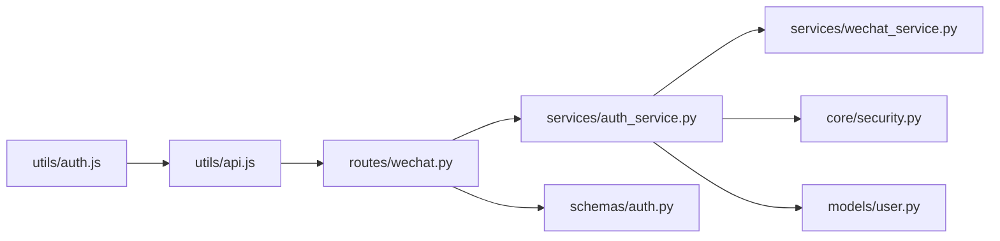

# WeChat Authentication Flow

<cite>
**Referenced Files in This Document**
- [auth.js](file://wechat-miniprogram/utils/auth.js)
- [api.js](file://wechat-miniprogram/utils/api.js)
- [app.js](file://wechat-miniprogram/app.js)
- [index.js](file://wechat-miniprogram/pages/index/index.js)
- [me.js](file://wechat-miniprogram/pages/me/me.js)
- [routes/wechat.py](file://backend/app/api/v1/routes/wechat.py)
- [services/auth_service.py](file://backend/app/services/auth_service.py)
- [services/wechat_service.py](file://backend/app/services/wechat_service.py)
- [schemas/auth.py](file://backend/app/schemas/auth.py)
- [core/security.py](file://backend/app/core/security.py)
- [models/user.py](file://backend/app/models/user.py)
</cite>

## Table of Contents
1. [Introduction](#introduction)
2. [Project Structure](#project-structure)
3. [Core Components](#core-components)
4. [Architecture Overview](#architecture-overview)
5. [Detailed Component Analysis](#detailed-component-analysis)
6. [Dependency Analysis](#dependency-analysis)
7. [Performance Considerations](#performance-considerations)
8. [Troubleshooting Guide](#troubleshooting-guide)
9. [Security Considerations](#security-considerations)
10. [Conclusion](#conclusion)

## Introduction
This document explains the end-to-end WeChat authentication flow for the Mini Program and backend:
- Frontend (Mini Program): login() obtains a temporary code via wx.login, exchanges it with the backend, stores tokens, and manages global state.
- Backend: validates the code using WeChat APIs, creates or finds a user by openid, issues JWT access tokens, and supports phone binding.
- Error handling: network failures, invalid codes, token expiration, and session management are covered.
- Usage examples: how pages integrate auth checks and guards.

## Project Structure
The WeChat authentication spans both frontend (Mini Program) and backend services:
- Mini Program utils: auth.js orchestrates login flow; api.js handles HTTP requests and token injection; app.js initializes global state.
- Pages: index.js and me.js demonstrate login checks and UI flows.
- Backend routes: wechat.py exposes endpoints for login and phone binding.
- Services: auth_service.py performs WeChat code exchange and user lookup/creation; wechat_service.py calls WeChat APIs and caches access tokens.
- Schemas: auth.py defines request/response models.
- Security: security.py provides JWT encode/decode utilities.
- Models: user.py defines the User entity including openid.

**Diagram sources**
- [auth.js:1-81](file://wechat-miniprogram/utils/auth.js#L1-L81)
- [api.js:1-52](file://wechat-miniprogram/utils/api.js#L1-L52)
- [app.js:1-21](file://wechat-miniprogram/app.js#L1-L21)
- [index.js:1-74](file://wechat-miniprogram/pages/index/index.js#L1-L74)
- [me.js:1-104](file://wechat-miniprogram/pages/me/me.js#L1-L104)
- [routes/wechat.py:1-82](file://backend/app/api/v1/routes/wechat.py#L1-L82)
- [services/auth_service.py:1-77](file://backend/app/services/auth_service.py#L1-L77)
- [services/wechat_service.py:1-146](file://backend/app/services/wechat_service.py#L1-L146)
- [schemas/auth.py:1-63](file://backend/app/schemas/auth.py#L1-L63)
- [core/security.py:1-34](file://backend/app/core/security.py#L1-L34)
- [models/user.py:1-48](file://backend/app/models/user.py#L1-L48)

**Section sources**
- [auth.js:1-81](file://wechat-miniprogram/utils/auth.js#L1-L81)
- [api.js:1-52](file://wechat-miniprogram/utils/api.js#L1-L52)
- [app.js:1-21](file://wechat-miniprogram/app.js#L1-L21)
- [index.js:1-74](file://wechat-miniprogram/pages/index/index.js#L1-L74)
- [me.js:1-104](file://wechat-miniprogram/pages/me/me.js#L1-L104)
- [routes/wechat.py:1-82](file://backend/app/api/v1/routes/wechat.py#L1-L82)
- [services/auth_service.py:1-77](file://backend/app/services/auth_service.py#L1-L77)
- [services/wechat_service.py:1-146](file://backend/app/services/wechat_service.py#L1-L146)
- [schemas/auth.py:1-63](file://backend/app/schemas/auth.py#L1-L63)
- [core/security.py:1-34](file://backend/app/core/security.py#L1-L34)
- [models/user.py:1-48](file://backend/app/models/user.py#L1-L48)

## Core Components
- Mini Program auth module (utils/auth.js):
  - login(): Calls wx.login to get a one-time code, posts it to /wechat/auth/wechat/login, stores access_token and user info, updates global state.
  - checkLogin(): Restores state from storage if token exists; otherwise triggers login().
  - logout(): Clears stored tokens and resets global state.
  - getUserInfo()/isLoggedIn(): Read helpers for current user and login status.
- Mini Program API wrapper (utils/api.js):
  - Injects Authorization header with stored access_token.
  - Handles 401 by clearing local tokens and rejecting with a specific message.
  - Shows toast messages on errors and wraps responses in promises.
- App initialization (app.js):
  - On launch, checks for existing token and sets global isLoggedIn flag.
- Pages integration:
  - index.js uses auth.checkLogin() before loading data.
  - me.js demonstrates explicit login(), phone binding, role switch, and logout flows.

**Section sources**
- [auth.js:1-81](file://wechat-miniprogram/utils/auth.js#L1-L81)
- [api.js:1-52](file://wechat-miniprogram/utils/api.js#L1-L52)
- [app.js:1-21](file://wechat-miniprogram/app.js#L1-L21)
- [index.js:1-74](file://wechat-miniprogram/pages/index/index.js#L1-L74)
- [me.js:1-104](file://wechat-miniprogram/pages/me/me.js#L1-L104)

## Architecture Overview
End-to-end sequence from wx.login to JWT issuance and token usage:

**Diagram sources**
- [auth.js:1-81](file://wechat-miniprogram/utils/auth.js#L1-L81)
- [api.js:1-52](file://wechat-miniprogram/utils/api.js#L1-L52)
- [routes/wechat.py:1-82](file://backend/app/api/v1/routes/wechat.py#L1-L82)
- [services/auth_service.py:1-77](file://backend/app/services/auth_service.py#L1-L77)
- [services/wechat_service.py:1-146](file://backend/app/services/wechat_service.py#L1-L146)
- [core/security.py:1-34](file://backend/app/core/security.py#L1-L34)
- [models/user.py:1-48](file://backend/app/models/user.py#L1-L48)

## Detailed Component Analysis

### Mini Program Auth Module (utils/auth.js)
Responsibilities:
- login(): Orchestrates wx.login and backend exchange; persists tokens; updates global state.
- checkLogin(): Restores state from storage; auto-login if missing.
- logout(): Clears persisted tokens and resets global flags.
- getUserInfo()/isLoggedIn(): Provide read-only access to current user and login status.

Integration points:
- Uses utils/api.js for HTTP calls.
- Updates app.globalData.isLoggedIn and app.globalData.userInfo.

Error handling:
- Rejects when wx.login fails or returns no code.
- Propagates backend errors to callers.

Best practices:
- Always call checkLogin() at page load to ensure authenticated state.
- Use logout() to clear state on user-initiated sign-out.

**Section sources**
- [auth.js:1-81](file://wechat-miniprogram/utils/auth.js#L1-L81)
- [api.js:1-52](file://wechat-miniprogram/utils/api.js#L1-L52)
- [app.js:1-21](file://wechat-miniprogram/app.js#L1-L21)

### Mini Program API Wrapper (utils/api.js)
Responsibilities:
- Adds Authorization header with stored access_token.
- Centralizes error handling:
  - 401: clears tokens and rejects with a specific message indicating expired login.
  - Other errors: shows toast and rejects with response payload.
  - Network failures: shows toast and rejects with error object.

Usage:
- All API calls should go through this wrapper to ensure consistent token injection and error UX.

**Section sources**
- [api.js:1-52](file://wechat-miniprogram/utils/api.js#L1-L52)

### Backend WeChat Endpoints (routes/wechat.py)
Endpoints:
- POST /auth/wechat/login: Accepts WeChatLoginRequest.code, delegates to AuthService.wechat_login, returns WeChatLoginResponse with access_token, is_new_user, and user.
- POST /auth/wechat/phone: Binds phone number using WeChatService.get_access_token and WeChat phone API.
- GET /wechat/config: Returns WeChat appid for frontend configuration.

Error handling:
- ValueError from service layer mapped to 400 Bad Request.
- Phone binding errors return 400 with detailed message.

**Section sources**
- [routes/wechat.py:1-82](file://backend/app/api/v1/routes/wechat.py#L1-L82)
- [schemas/auth.py:1-63](file://backend/app/schemas/auth.py#L1-L63)

### Auth Service (services/auth_service.py)
Key method:
- wechat_login(code):
  - Calls WeChatService.jscode2session(code) to obtain openid and session_key.
  - Looks up user by wechat_openid; if not found, creates a new tenant user and associates openid.
  - Returns user and is_new_user flag.
- create_access_token(user):
  - Encodes JWT with user id as subject using core/security.create_access_token.

Data model integration:
- Uses User model fields including wechat_openid and role.

**Section sources**
- [services/auth_service.py:1-77](file://backend/app/services/auth_service.py#L1-L77)
- [models/user.py:1-48](file://backend/app/models/user.py#L1-L48)
- [core/security.py:1-34](file://backend/app/core/security.py#L1-L34)

### WeChat Service (services/wechat_service.py)
Capabilities:
- jscode2session(code): Exchanges wx.login code for openid and session_key via WeChat API.
- get_access_token(): Retrieves and caches platform access token with expiry management.
- send_template_message/send_customer_service_message: Messaging features (not part of login).

Error handling:
- Raises ValueError on non-zero errcode from WeChat APIs.

**Section sources**
- [services/wechat_service.py:1-146](file://backend/app/services/wechat_service.py#L1-L146)

### JWT Security (core/security.py)
Functions:
- create_access_token(subject, expires_delta): Builds JWT with subject and expiration based on settings.
- decode_access_token(token): Decodes and validates JWT using configured secret and algorithm.

Password utilities:
- hash_password/verify_password used during user creation and password-based login.

**Section sources**
- [core/security.py:1-34](file://backend/app/core/security.py#L1-L34)

### Page Integration Examples
- Index page (pages/index/index.js):
  - Calls auth.checkLogin() in onLoad to ensure login before fetching data.
  - Uses auth.isLoggedIn() in onShow to conditionally load content.
- Profile page (pages/me/me.js):
  - Provides explicit login button calling auth.login().
  - Implements phone binding via /auth/wechat/phone.
  - Supports role switching and logout.

**Section sources**
- [index.js:1-74](file://wechat-miniprogram/pages/index/index.js#L1-L74)
- [me.js:1-104](file://wechat-miniprogram/pages/me/me.js#L1-L104)

### Conceptual Overview

[No sources needed since this diagram shows conceptual workflow, not actual code structure]

## Dependency Analysis
Component relationships:
- Mini Program auth depends on api wrapper and app global state.
- Backend router depends on auth service and schemas.
- Auth service depends on WeChat service, security utilities, and user model.
- WeChat service depends on external WeChat APIs and cached access token.

**Diagram sources**
- [auth.js:1-81](file://wechat-miniprogram/utils/auth.js#L1-L81)
- [api.js:1-52](file://wechat-miniprogram/utils/api.js#L1-L52)
- [routes/wechat.py:1-82](file://backend/app/api/v1/routes/wechat.py#L1-L82)
- [services/auth_service.py:1-77](file://backend/app/services/auth_service.py#L1-L77)
- [services/wechat_service.py:1-146](file://backend/app/services/wechat_service.py#L1-L146)
- [core/security.py:1-34](file://backend/app/core/security.py#L1-L34)
- [models/user.py:1-48](file://backend/app/models/user.py#L1-L48)
- [schemas/auth.py:1-63](file://backend/app/schemas/auth.py#L1-L63)

**Section sources**
- [auth.js:1-81](file://wechat-miniprogram/utils/auth.js#L1-L81)
- [api.js:1-52](file://wechat-miniprogram/utils/api.js#L1-L52)
- [routes/wechat.py:1-82](file://backend/app/api/v1/routes/wechat.py#L1-L82)
- [services/auth_service.py:1-77](file://backend/app/services/auth_service.py#L1-L77)
- [services/wechat_service.py:1-146](file://backend/app/services/wechat_service.py#L1-L146)
- [core/security.py:1-34](file://backend/app/core/security.py#L1-L34)
- [models/user.py:1-48](file://backend/app/models/user.py#L1-L48)
- [schemas/auth.py:1-63](file://backend/app/schemas/auth.py#L1-L63)

## Performance Considerations
- Token caching:
  - WeChatService caches platform access_token with expiry to avoid repeated calls to WeChat token endpoint.
- Local storage reads/writes:
  - Mini Program auth reads/stores tokens synchronously; keep operations minimal and centralized in api.js.
- Network resilience:
  - api.js centralizes error handling and user feedback; consider retry logic for transient failures where appropriate.

[No sources needed since this section provides general guidance]

## Troubleshooting Guide
Common issues and strategies:
- Network failure:
  - api.js shows a toast and rejects with error; ensure baseUrl is correct and server reachable.
- Invalid or reused wx.login code:
  - WeChatService.jscode2session raises ValueError on non-zero errcode; backend maps to 400 with detail.
- Token expiration:
  - api.js detects 401, clears local tokens, and rejects with a message prompting re-login; pages should handle rejection and redirect to login.
- Session key handling:
  - The backend does not persist session_key; it is only used during code exchange. Ensure you do not rely on session_key beyond the login step.

Operational tips:
- Always call auth.checkLogin() at page load to restore state.
- For protected actions, wrap calls in try/catch and handle 401 by invoking auth.login() again.

**Section sources**
- [api.js:1-52](file://wechat-miniprogram/utils/api.js#L1-L52)
- [services/wechat_service.py:1-146](file://backend/app/services/wechat_service.py#L1-L146)
- [routes/wechat.py:1-82](file://backend/app/api/v1/routes/wechat.py#L1-L82)

## Security Considerations
- Code reuse prevention:
  - wx.login returns a one-time code; never cache or reuse it. The backend immediately exchanges it for openid/session_key and discards the code.
- Token storage best practices:
  - Mini Program: store access_token in secure storage (wx.setStorageSync) and attach it via Authorization header. Clear on 401 and logout.
  - Web frontend (for reference): use httpOnly cookies or secure storage mechanisms; avoid storing sensitive tokens in plain text without protection.
- User session management:
  - Global state (app.globalData) reflects login status; always refresh after login/logout.
  - Backend JWT includes expiration; enforce short-lived tokens and implement refresh strategies if needed.
- Data validation:
  - Use Pydantic schemas to validate inputs (e.g., WeChatLoginRequest.code).
- Access control:
  - Protect endpoints with dependency injection that decodes JWT and verifies user status.

[No sources needed since this section provides general guidance]

## Conclusion
The WeChat authentication flow integrates a robust Mini Program auth module with backend services that securely exchange wx.login codes for JWT tokens. The design emphasizes:
- Centralized API wrapper for token injection and error handling.
- Stateless JWT-based authorization with configurable expiration.
- Automatic user creation on first login via openid.
- Clear separation of concerns across routes, services, and schemas.
Adhering to the recommended patterns ensures reliable login, resilient error handling, and strong security posture.