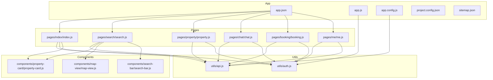
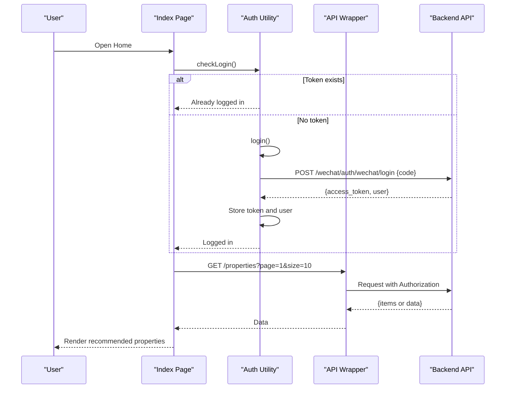
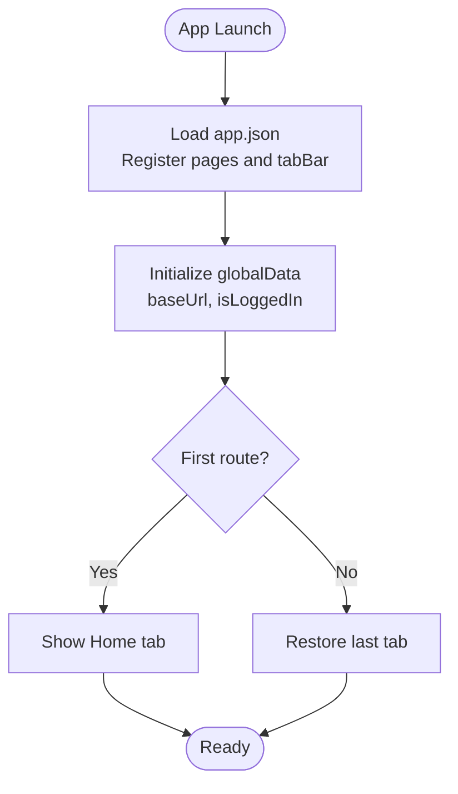
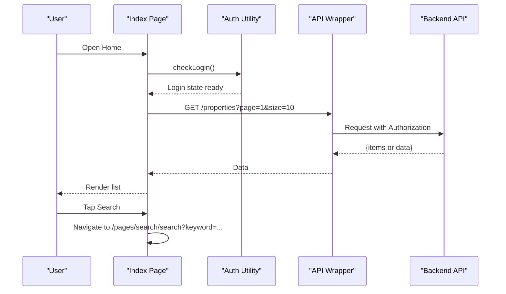
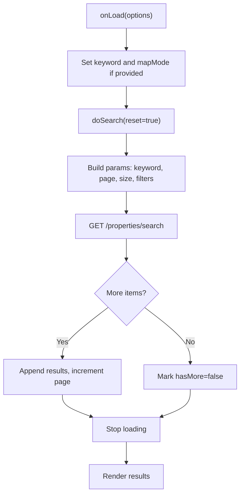
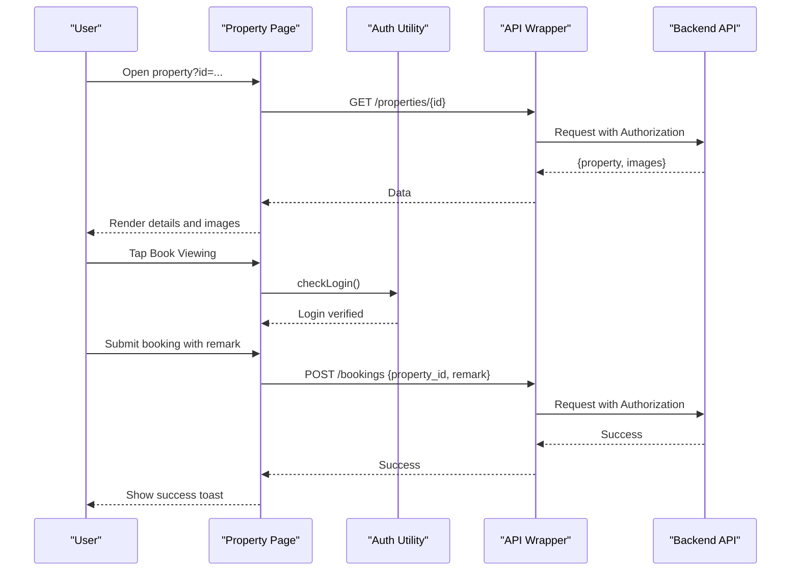
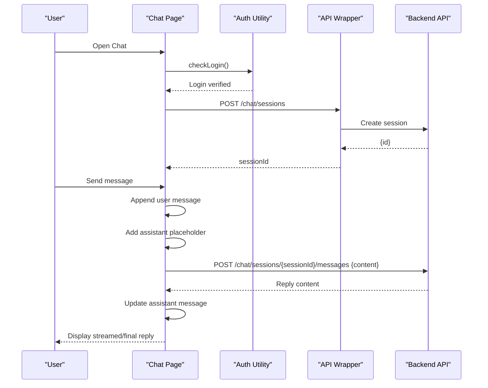
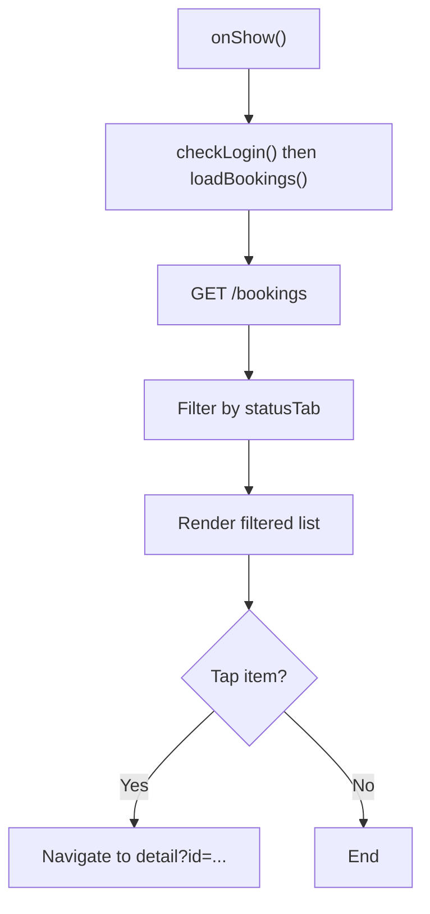
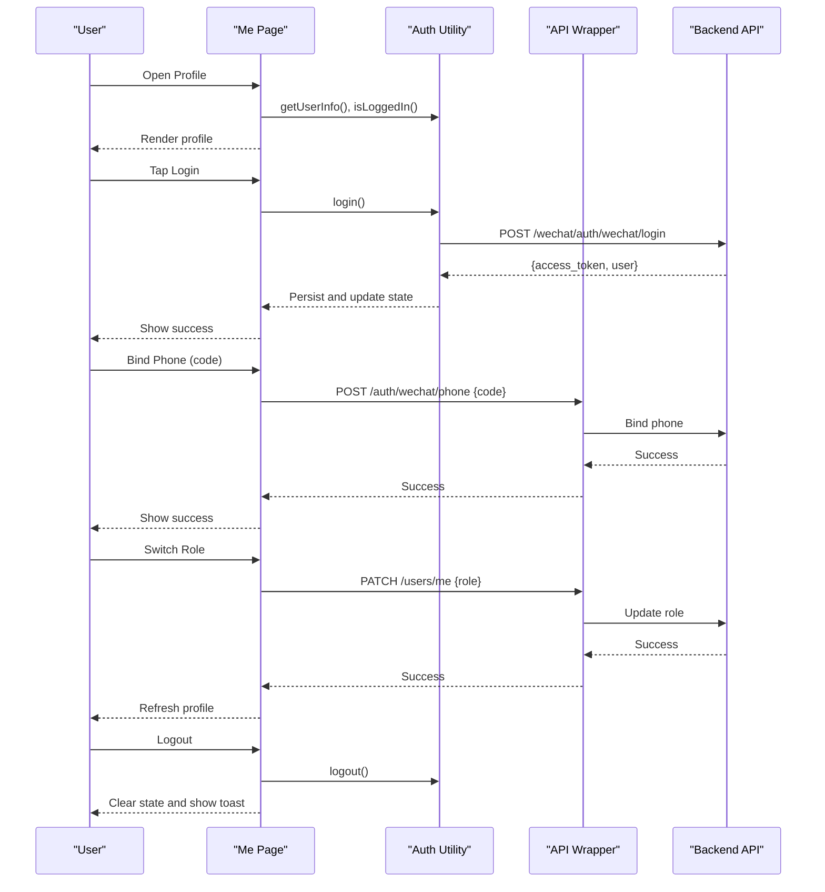
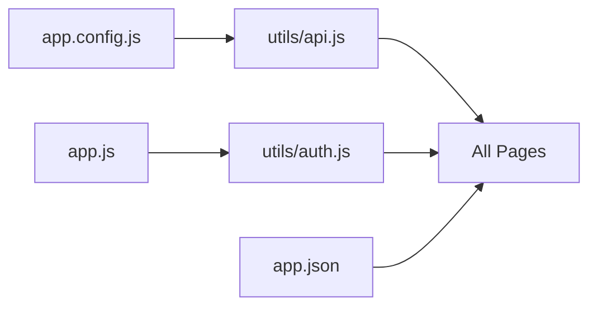

# WeChat Mini Program

<cite>
**Referenced Files in This Document**
- [app.json](file://wechat-miniprogram/app.json)
- [app.js](file://wechat-miniprogram/app.js)
- [app.config.js](file://wechat-miniprogram/app.config.js)
- [project.config.json](file://wechat-miniprogram/project.config.json)
- [sitemap.json](file://wechat-miniprogram/sitemap.json)
- [utils/api.js](file://wechat-miniprogram/utils/api.js)
- [utils/auth.js](file://wechat-miniprogram/utils/auth.js)
- [pages/index/index.js](file://wechat-miniprogram/pages/index/index.js)
- [pages/search/search.js](file://wechat-miniprogram/pages/search/search.js)
- [pages/property/property.js](file://wechat-miniprogram/pages/property/property.js)
- [pages/chat/chat.js](file://wechat-miniprogram/pages/chat/chat.js)
- [pages/booking/booking.js](file://wechat-miniprogram/pages/booking/booking.js)
- [pages/me/me.js](file://wechat-miniprogram/pages/me/me.js)
- [components/property-card/property-card.js](file://wechat-miniprogram/components/property-card/property-card.js)
- [components/map-view/map-view.js](file://wechat-miniprogram/components/map-view/map-view.js)
- [components/search-bar/search-bar.js](file://wechat-miniprogram/components/search-bar/search-bar.js)
</cite>

## Table of Contents
1. [Introduction](#introduction)
2. [Project Structure](#project-structure)
3. [Core Components](#core-components)
4. [Architecture Overview](#architecture-overview)
5. [Detailed Component Analysis](#detailed-component-analysis)
6. [Dependency Analysis](#dependency-analysis)
7. [Performance Considerations](#performance-considerations)
8. [Troubleshooting Guide](#troubleshooting-guide)
9. [Conclusion](#conclusion)
10. [Appendices](#appendices)

## Introduction
This document describes the WeChat Mini Program implementation for a rental housing platform. It covers the mini program architecture, page structure, custom components, navigation patterns, and integration with backend APIs. It also explains authentication flows (WeChat login, phone binding), data formatting, error handling, development setup, debugging techniques, performance optimization, responsive design considerations, and publishing workflows.

## Project Structure
The mini program follows a standard WeChat Mini Program layout:
- App-level configuration and lifecycle are defined in app.json and app.js.
- Environment-specific API endpoints are centralized in app.config.js.
- Pages implement core features such as home, search, property detail, chat, booking, and user profile.
- Reusable UI is encapsulated in custom components under components/.
- Shared utilities handle HTTP requests and authentication state.



**Diagram sources**
- [app.json:1-57](file://wechat-miniprogram/app.json#L1-L57)
- [app.js:1-21](file://wechat-miniprogram/app.js#L1-L21)
- [app.config.js:1-16](file://wechat-miniprogram/app.config.js#L1-L16)
- [project.config.json:1-37](file://wechat-miniprogram/project.config.json#L1-L37)
- [sitemap.json:1-7](file://wechat-miniprogram/sitemap.json#L1-L7)
- [pages/index/index.js:1-74](file://wechat-miniprogram/pages/index/index.js#L1-L74)
- [pages/search/search.js:1-100](file://wechat-miniprogram/pages/search/search.js#L1-L100)
- [pages/property/property.js:1-90](file://wechat-miniprogram/pages/property/property.js#L1-L90)
- [pages/chat/chat.js:1-108](file://wechat-miniprogram/pages/chat/chat.js#L1-L108)
- [pages/booking/booking.js:1-57](file://wechat-miniprogram/pages/booking/booking.js#L1-L57)
- [pages/me/me.js:1-104](file://wechat-miniprogram/pages/me/me.js#L1-L104)
- [components/property-card/property-card.js:1-30](file://wechat-miniprogram/components/property-card/property-card.js#L1-L30)
- [components/map-view/map-view.js:1-29](file://wechat-miniprogram/components/map-view/map-view.js#L1-L29)
- [components/search-bar/search-bar.js:1-17](file://wechat-miniprogram/components/search-bar/search-bar.js#L1-L17)
- [utils/api.js:1-52](file://wechat-miniprogram/utils/api.js#L1-L52)
- [utils/auth.js:1-81](file://wechat-miniprogram/utils/auth.js#L1-L81)

**Section sources**
- [app.json:1-57](file://wechat-miniprogram/app.json#L1-L57)
- [app.js:1-21](file://wechat-miniprogram/app.js#L1-L21)
- [app.config.js:1-16](file://wechat-miniprogram/app.config.js#L1-L16)
- [project.config.json:1-37](file://wechat-miniprogram/project.config.json#L1-L37)
- [sitemap.json:1-7](file://wechat-miniprogram/sitemap.json#L1-L7)

## Core Components
- Authentication utility:
  - Provides WeChat login flow using wx.login and exchanges code for tokens via backend.
  - Persists access token and user info to local storage and updates global login state.
  - Offers logout and status checks.
- HTTP client wrapper:
  - Centralizes wx.request calls, attaches Authorization header when available.
  - Handles 401 by clearing session and prompting re-login.
  - Normalizes success/error responses and shows toast notifications.

Key responsibilities:
- Session management across pages.
- Consistent request/response handling and error UX.
- Environment-aware base URLs from app.config.js.

**Section sources**
- [utils/auth.js:1-81](file://wechat-miniprogram/utils/auth.js#L1-L81)
- [utils/api.js:1-52](file://wechat-miniprogram/utils/api.js#L1-L52)
- [app.config.js:1-16](file://wechat-miniprogram/app.config.js#L1-L16)

## Architecture Overview
The mini program uses a layered approach:
- Presentation layer: Pages and custom components render UI and handle interactions.
- Business logic layer: Page controllers orchestrate API calls and manage local state.
- Infrastructure layer: utils/api.js and utils/auth.js abstract network and auth concerns.
- Configuration layer: app.json defines routes and tabBar; app.config.js provides environment settings.



**Diagram sources**
- [pages/index/index.js:1-74](file://wechat-miniprogram/pages/index/index.js#L1-L74)
- [utils/auth.js:1-81](file://wechat-miniprogram/utils/auth.js#L1-L81)
- [utils/api.js:1-52](file://wechat-miniprogram/utils/api.js#L1-L52)

## Detailed Component Analysis

### Navigation and Tab Bar
- The tabBar configures four primary tabs: Home, AI Assistant, Booking, and Me.
- Non-tab pages (search, property detail) are navigated via wx.navigateTo.
- Permission declarations include location usage for map features.



**Diagram sources**
- [app.json:1-57](file://wechat-miniprogram/app.json#L1-L57)
- [app.js:1-21](file://wechat-miniprogram/app.js#L1-L21)

**Section sources**
- [app.json:1-57](file://wechat-miniprogram/app.json#L1-L57)
- [app.js:1-21](file://wechat-miniprogram/app.js#L1-L21)

### Home Page (index)
- Ensures login before loading recommendations.
- Loads recommended properties via API and supports pull-to-refresh.
- Provides search input and navigation to search page with keyword parameter.
- Supports switching to map mode through search page.



**Diagram sources**
- [pages/index/index.js:1-74](file://wechat-miniprogram/pages/index/index.js#L1-L74)
- [utils/auth.js:1-81](file://wechat-miniprogram/utils/auth.js#L1-L81)
- [utils/api.js:1-52](file://wechat-miniprogram/utils/api.js#L1-L52)

**Section sources**
- [pages/index/index.js:1-74](file://wechat-miniprogram/pages/index/index.js#L1-L74)

### Search Page (search)
- Supports keyword search and filters (district, price range, property type).
- Implements pagination with reach-bottom and pull-to-refresh.
- Can operate in map mode flag for map-centric browsing.



**Diagram sources**
- [pages/search/search.js:1-100](file://wechat-miniprogram/pages/search/search.js#L1-L100)

**Section sources**
- [pages/search/search.js:1-100](file://wechat-miniprogram/pages/search/search.js#L1-L100)

### Property Detail Page (property)
- Loads property details and images, constructing full image URLs using baseUrl.
- Supports image preview and calling landlord directly.
- Integrates booking workflow with modal and remark input.



**Diagram sources**
- [pages/property/property.js:1-90](file://wechat-miniprogram/pages/property/property.js#L1-L90)
- [utils/auth.js:1-81](file://wechat-miniprogram/utils/auth.js#L1-L81)
- [utils/api.js:1-52](file://wechat-miniprogram/utils/api.js#L1-L52)

**Section sources**
- [pages/property/property.js:1-90](file://wechat-miniprogram/pages/property/property.js#L1-L90)

### Chat Page (chat)
- Initializes a chat session on load.
- Sends messages and handles assistant replies with fallback behavior.
- Uses raw request with chunked response capability for streaming-like behavior.



**Diagram sources**
- [pages/chat/chat.js:1-108](file://wechat-miniprogram/pages/chat/chat.js#L1-L108)
- [utils/auth.js:1-81](file://wechat-miniprogram/utils/auth.js#L1-L81)
- [utils/api.js:1-52](file://wechat-miniprogram/utils/api.js#L1-L52)

**Section sources**
- [pages/chat/chat.js:1-108](file://wechat-miniprogram/pages/chat/chat.js#L1-L108)

### Booking Page (booking)
- Lists bookings and supports filtering by status tabs.
- Navigates to booking detail and supports pull-to-refresh.



**Diagram sources**
- [pages/booking/booking.js:1-57](file://wechat-miniprogram/pages/booking/booking.js#L1-L57)

**Section sources**
- [pages/booking/booking.js:1-57](file://wechat-miniprogram/pages/booking/booking.js#L1-L57)

### Profile Page (me)
- Displays user info and login status.
- Implements WeChat login, phone number binding, role switching, and logout.



**Diagram sources**
- [pages/me/me.js:1-104](file://wechat-miniprogram/pages/me/me.js#L1-L104)
- [utils/auth.js:1-81](file://wechat-miniprogram/utils/auth.js#L1-L81)
- [utils/api.js:1-52](file://wechat-miniprogram/utils/api.js#L1-L52)

**Section sources**
- [pages/me/me.js:1-104](file://wechat-miniprogram/pages/me/me.js#L1-L104)

### Custom Components
- Property Card:
  - Accepts a property object and computes cover URL using baseUrl.
  - Emits tap events to parent pages for navigation.
- Map View:
  - Accepts latitude, longitude, and markers.
  - Computes default marker based on coordinates.
- Search Bar:
  - Accepts value and placeholder.
  - Emits input and search events to parent pages.

```mermaid
classDiagram
class PropertyCard {
+Object property
+coverUrl
+onTap()
}
class MapView {
+Number latitude
+Number longitude
+Array markers
+defaultMarkers
}
class SearchBar {
+String value
+String placeholder
+onInput(e)
+onSearch()
}
PropertyCard --> "emits 'tap'" : "parent listens"
SearchBar --> "emits 'input','search'" : "parent listens"
```

**Diagram sources**
- [components/property-card/property-card.js:1-30](file://wechat-miniprogram/components/property-card/property-card.js#L1-L30)
- [components/map-view/map-view.js:1-29](file://wechat-miniprogram/components/map-view/map-view.js#L1-L29)
- [components/search-bar/search-bar.js:1-17](file://wechat-miniprogram/components/search-bar/search-bar.js#L1-L17)

**Section sources**
- [components/property-card/property-card.js:1-30](file://wechat-miniprogram/components/property-card/property-card.js#L1-L30)
- [components/map-view/map-view.js:1-29](file://wechat-miniprogram/components/map-view/map-view.js#L1-L29)
- [components/search-bar/search-bar.js:1-17](file://wechat-miniprogram/components/search-bar/search-bar.js#L1-L17)

## Dependency Analysis
- Pages depend on utils/api.js for HTTP operations and utils/auth.js for authentication.
- Components are decoupled and communicate via events.
- Global configuration centralizes environment variables and base URLs.



**Diagram sources**
- [utils/api.js:1-52](file://wechat-miniprogram/utils/api.js#L1-L52)
- [utils/auth.js:1-81](file://wechat-miniprogram/utils/auth.js#L1-L81)
- [app.config.js:1-16](file://wechat-miniprogram/app.config.js#L1-L16)
- [app.json:1-57](file://wechat-miniprogram/app.json#L1-L57)
- [app.js:1-21](file://wechat-miniprogram/app.js#L1-L21)

**Section sources**
- [utils/api.js:1-52](file://wechat-miniprogram/utils/api.js#L1-L52)
- [utils/auth.js:1-81](file://wechat-miniprogram/utils/auth.js#L1-L81)
- [app.config.js:1-16](file://wechat-miniprogram/app.config.js#L1-L16)
- [app.json:1-57](file://wechat-miniprogram/app.json#L1-L57)
- [app.js:1-21](file://wechat-miniprogram/app.js#L1-L21)

## Performance Considerations
- Pagination and lazy loading:
  - Use reach-bottom to load more results and avoid large payloads.
- Image handling:
  - Construct full image URLs once and reuse; consider caching strategies at the app level.
- Network efficiency:
  - Centralize headers and token injection in utils/api.js to reduce duplication.
- UI responsiveness:
  - Minimize setData calls; batch updates where possible.
- Streaming chat:
  - Prefer chunked responses and incremental rendering to improve perceived latency.

[No sources needed since this section provides general guidance]

## Troubleshooting Guide
- Authentication issues:
  - If 401 occurs, the API wrapper clears stored tokens and prompts re-login. Ensure login flow completes successfully and tokens are persisted.
- Network errors:
  - The API wrapper shows toast notifications for failures; verify baseUrl and connectivity.
- Location permission:
  - Map features require userLocation permission; ensure it is declared and granted.
- Chat streaming:
  - If streaming fails, the chat page falls back to full response; confirm backend compatibility and enableChunked usage.

**Section sources**
- [utils/api.js:1-52](file://wechat-miniprogram/utils/api.js#L1-L52)
- [utils/auth.js:1-81](file://wechat-miniprogram/utils/auth.js#L1-L81)
- [app.json:48-53](file://wechat-miniprogram/app.json#L48-L53)
- [pages/chat/chat.js:54-87](file://wechat-miniprogram/pages/chat/chat.js#L54-L87)

## Conclusion
The WeChat Mini Program implements a clear separation of concerns with reusable components, centralized authentication and networking utilities, and well-defined page flows. It integrates seamlessly with the backend for property browsing, search, booking, chat, and user management. The architecture supports responsive mobile experiences, robust error handling, and scalable feature additions.

[No sources needed since this section summarizes without analyzing specific files]

## Appendices

### Development Setup and Debugging
- Open the project in WeChat DevTools using project.config.json.
- Configure environment in app.config.js (development vs production).
- Enable source maps and ES6 support in project settings.
- Use console logs and network panel to inspect API calls and responses.

**Section sources**
- [project.config.json:1-37](file://wechat-miniprogram/project.config.json#L1-L37)
- [app.config.js:1-16](file://wechat-miniprogram/app.config.js#L1-L16)

### Responsive Design and Touch Interactions
- Follow WeChat UI conventions for navigation bars, tab bars, and bottom sheets.
- Use safe area insets and flexible layouts to adapt to different screen sizes.
- Implement touch-friendly controls with adequate spacing and feedback.

[No sources needed since this section provides general guidance]

### Publishing Workflow and Version Management
- Set production baseUrl and wsUrl in app.config.js.
- Verify sitemap.json rules for indexing.
- Build and upload via WeChat DevTools; manage versions and release notes in the platform dashboard.

**Section sources**
- [app.config.js:1-16](file://wechat-miniprogram/app.config.js#L1-L16)
- [sitemap.json:1-7](file://wechat-miniprogram/sitemap.json#L1-L7)