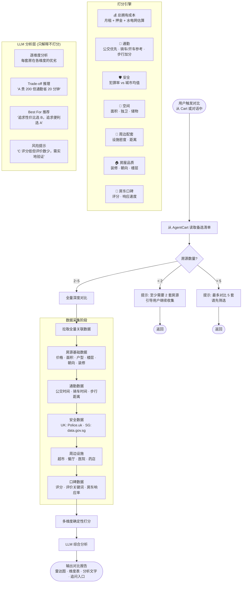
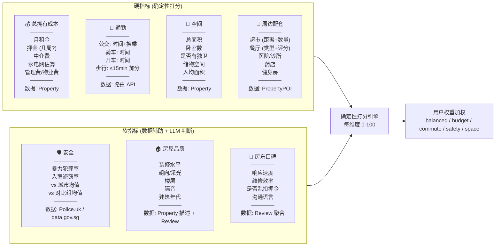
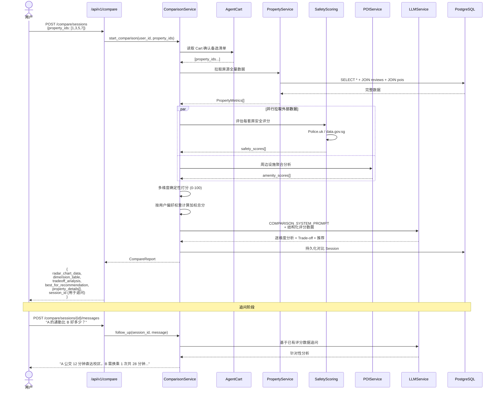
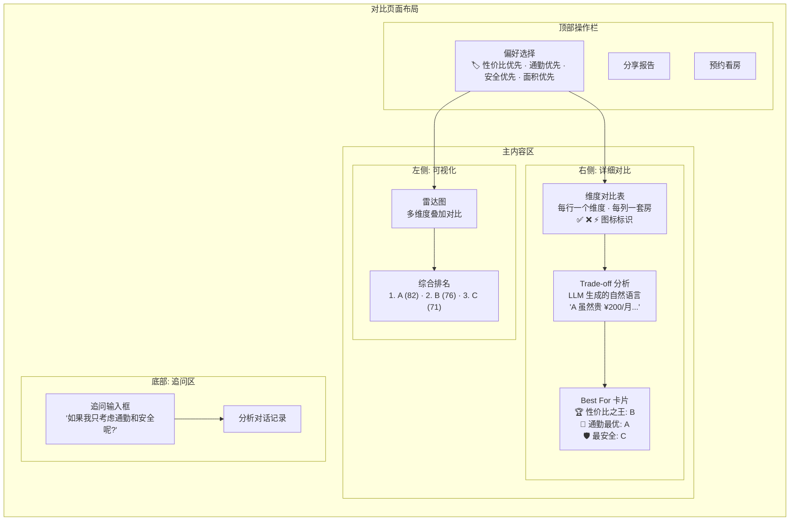

# 对比 Agent — 详细设计

> 2026-07-13 | Michael

---

## 定位

用户在备选清单中积累了 3-5 套房源后，进入深度对比。像买手机/买车一样，从多个维度系统性分析，辅助最终决策。

与发现 Agent 的本质区别：**不再探索新选项，只分析已有候选**。

---

## 整体流程

---

## 对比维度详解

---

## 对比 Agent 对话流

---

## 前端对比页面结构

---

## 与发现 Agent 的关键差异

| | 发现 Agent compare_cart (现有) | 对比 Agent (新建) |
|---|---|---|
| **维度数** | 4 (价格 · 通勤 · 空间 · 评分) | 7+ (价格 · 通勤 · 空间 · 配套 · 安全 · 品质 · 口碑) |
| **安全数据** | 无 | Police.uk + data.gov.sg |
| **通勤粒度** | 最近地铁站距离 | 公交路线时间 + 换乘次数 + 多种交通方式 |
| **评分模型** | 简单线性加权 | 加入上下文归一化 + 城市基准对比 |
| **LLM 深度** | 解释已有分数 | Trade-off 推理 + 风险提示 + 建议验证项 |
| **交互模式** | el-dialog 弹窗 | 独立页面 + 追问对话 |
| **输出** | 评分表 | 雷达图 + 维度表 + 分析报告 + 追问入口 |
| **持久化** | 无 (即抛) | 对比 Session 持久化，可回溯 |
