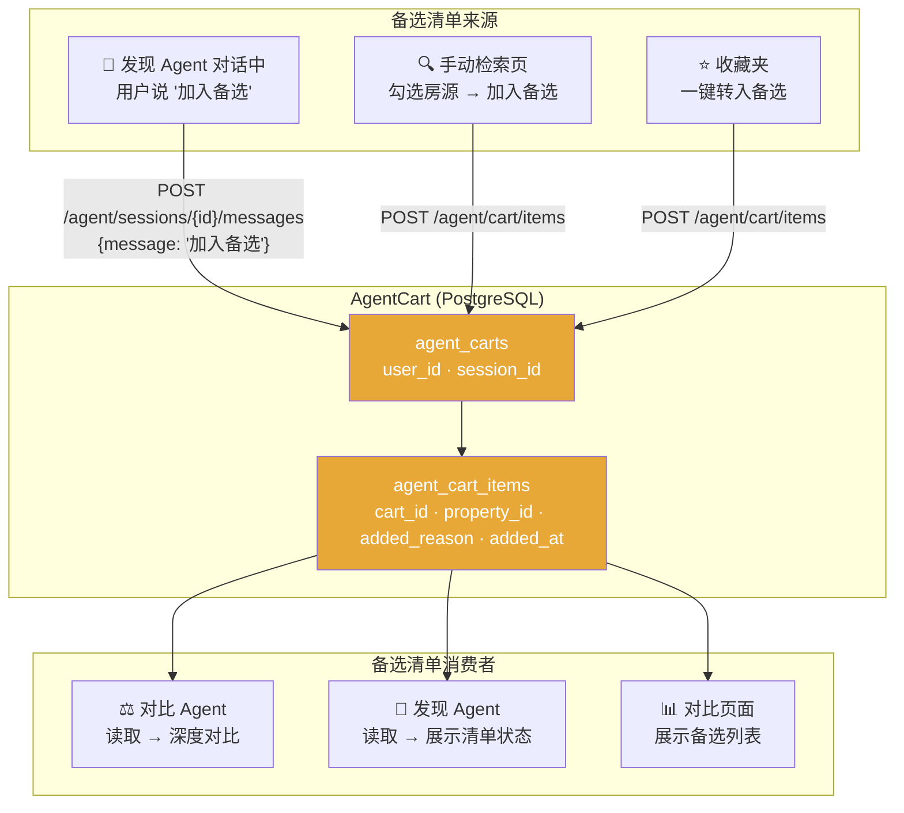
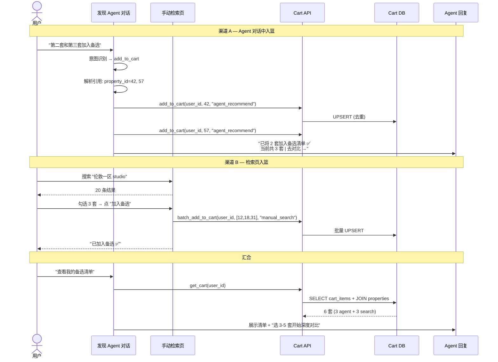
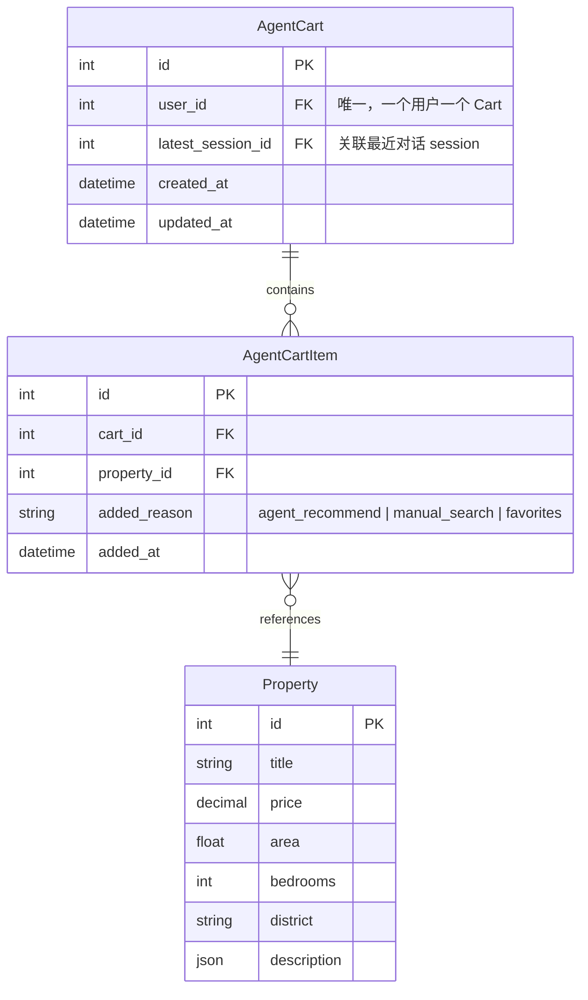
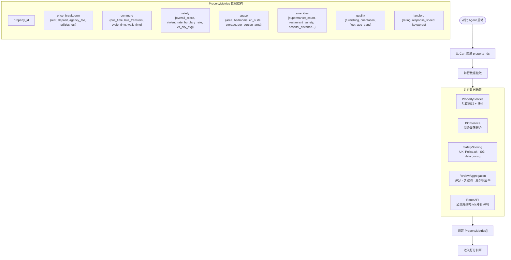
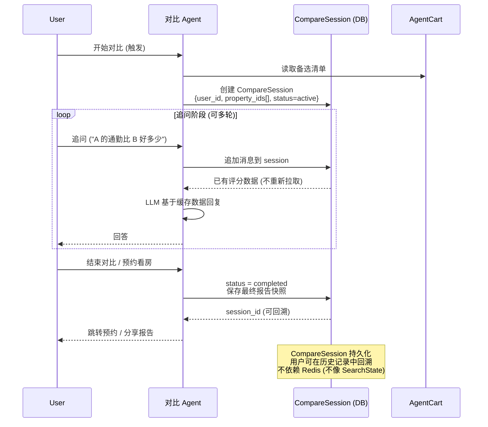

# 数据流 & Cart 桥梁机制

> 2026-07-13 | Michael

---

## Cart: 两个 Agent 的桥梁



---

## 双渠道入篮流程



---

## Cart 数据模型



UNIQUE constraint: `(cart_id, property_id)` — 同一房源不会重复入篮。

---

## 对比 Agent 的数据拉取



---

## 对比 Session 的生命周期



---

## 与前端的通信协议

### 对比请求

```json
POST /api/v1/compare/sessions
{
  "property_ids": [12, 42, 57]
}
```

### 对比响应

```json
{
  "session_id": "cs_abc123",
  "radar_chart": {
    "dimensions": ["总成本", "通勤", "安全", "空间", "配套", "品质", "口碑"],
    "series": [
      {"property_id": 12, "title": "A 公寓", "scores": [82, 88, 75, 70, 90, 65, 72]},
      {"property_id": 42, "title": "B 公寓", "scores": [70, 62, 90, 85, 72, 80, 68]},
      ...
    ]
  },
  "dimension_table": [
    {
      "dimension": "通勤",
      "rows": [
        {"property_id": 12, "value": "公交 12 分", "icon": "✅", "detail": "直达，步行 3 分到站"},
        {"property_id": 42, "value": "公交 28 分", "icon": "⚠️", "detail": "需换乘 1 次"},
      ]
    },
    ...
  ],
  "tradeoff_analysis": "A 公寓虽然月租贵 ¥200，但通勤每天省 32 分钟...",
  "best_for": [
    {"label": "🏆 综合最佳", "property_id": 12},
    {"label": "💰 性价比之王", "property_id": 42},
    {"label": "🛡️ 最安全", "property_id": 57}
  ],
  "ranking": [12, 42, 57]
}
```

### 追问

```json
POST /api/v1/compare/sessions/cs_abc123/messages
{
  "message": "如果我只考虑通勤和安全呢？"
}

→
{
  "reply": "如果只看通勤和安全两个维度...",
  "updated_ranking": [57, 12, 42],
  "updated_radar_chart": { ... }
}
```
