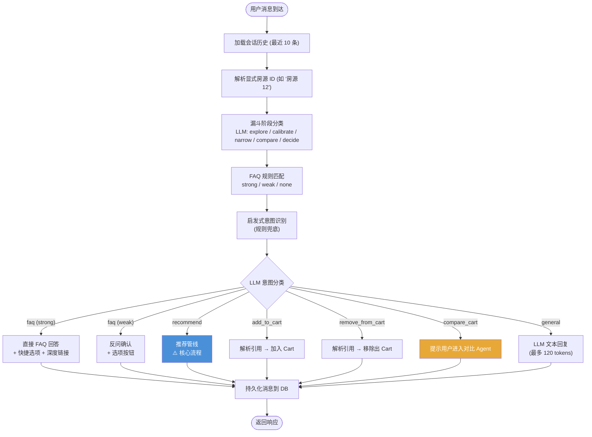
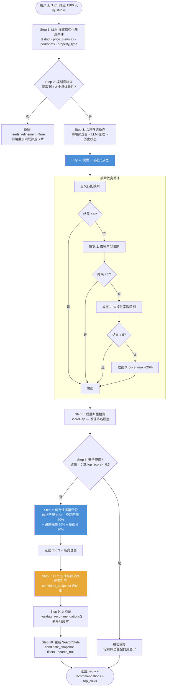
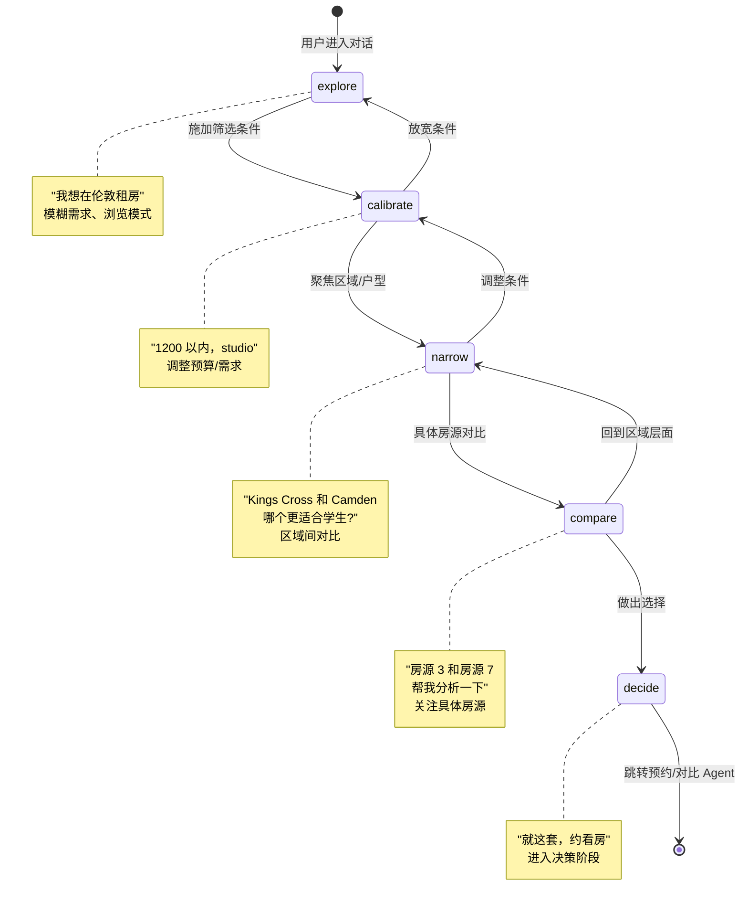
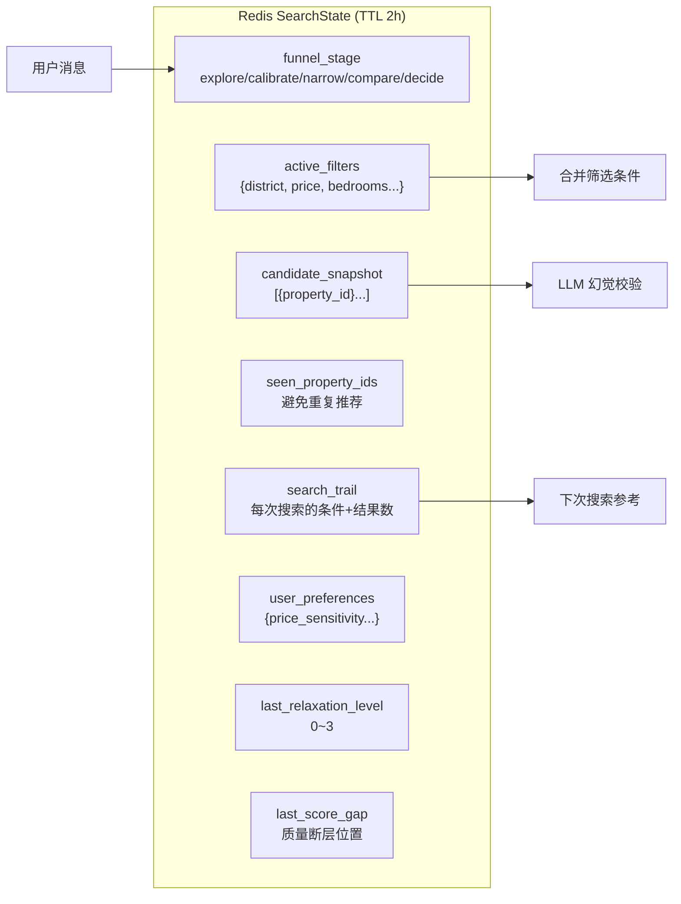

# 发现 Agent — 详细设计

> 2026-07-13 | Michael

---

## 定位

帮助用户从模糊需求逐步收敛到 3-5 个候选房源。对话式、探索式交互。

---

## 意图路由总览

---

## 推荐管线

这是发现 Agent 最复杂的路径。从用户自然语言到最终推荐结果：

---

## 漏斗阶段状态机

---

## 状态管理 (SearchState)

---

## 关键约束

| 规则 | 原因 |
|------|------|
| LLM 只能引用 `candidate_snapshot` 内的 ID | 防止幻觉房源 |
| 推荐结果后验证，丢弃无效 ID | 双重保险 |
| 每次 LLM 调用必须有确定性兜底 | LLM 不可用时系统仍可工作 |
| 模糊需求不追问，返回内联卡片 | 减少对话轮次，提升体验 |
| 优先使用前端筛选器，LLM 提取为辅 | 用户主动选择的意图最可靠 |
