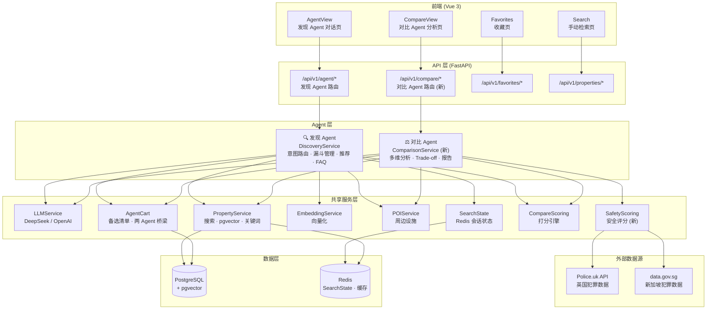
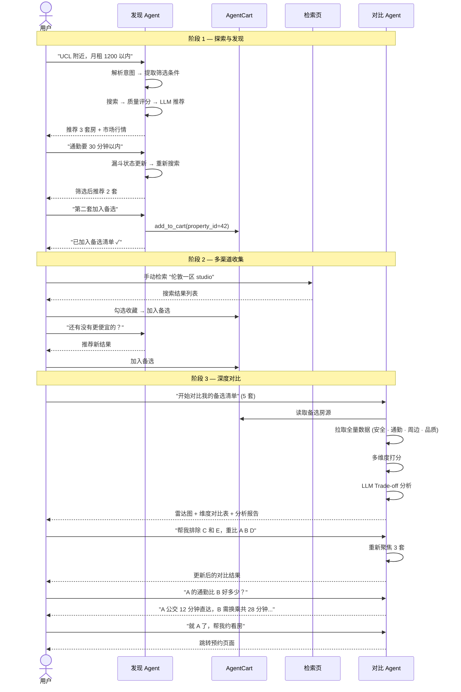

# 租房 Agent 系统整体架构

> 2026-07-13 | Michael

---

## 系统全景图



---

## 设计原则

### 双 Agent 架构

| | 发现 Agent | 对比 Agent |
|---|---|---|
| **定位** | 帮你找到候选 | 帮你从候选中决策 |
| **交互模式** | 对话式、探索式 | 分析式、决策式 |
| **数据需求** | 广度 — 搜索结果快照 | 深度 — 拉取全量关联数据 |
| **LLM 角色** | 理解意图、引导提问、推荐排序 | 多维度分析、Trade-off 推理、自然语言解释 |
| **状态管理** | 漏斗阶段 + 搜索状态 (Redis) | 对比 Session + 用户权重偏好 |
| **输入** | 用户自然语言 + 筛选器 | Cart 中的 3-5 个房源 ID |
| **输出** | 推荐卡片 + 回复文字 | 雷达图 + 维度对比表 + Trade-off 分析 + 报告 |

### 为什么分开

1. **Single Responsibility** — 发现和决策是两个不同的用户心智模式，放在一个 Agent 里会导致 Prompt 臃肿、意图路由复杂
2. **独立演进** — 对比 Agent 以后加雷达图、分享报告、what-if 分析等功能，不会影响发现 Agent
3. **数据深度不同** — 发现只需快照级别数据，对比需要拉全量（安全、通勤详情、周边、房东口碑等）
4. **可测试性** — 各自独立可单独评估，不互相干扰

### Cart 是桥梁

```
发现 Agent ──写入──→ Cart ──读取──→ 对比 Agent
                  ↑
         手动检索页 ──写入──┘
```

两个 Agent 通过共享的 AgentCart 通信，彼此不直接依赖。

---

## 用户完整旅程



---

## 目录

```
docs/agent-architecture/
├── overview.md             # 本文件 — 整体架构
├── discovery-agent.md      # 发现 Agent 详细设计
├── comparison-agent.md     # 对比 Agent 详细设计
├── data-flow.md            # 数据流 & Cart 桥梁机制
└── safety-scoring.md       # 安全评分子系统
```
