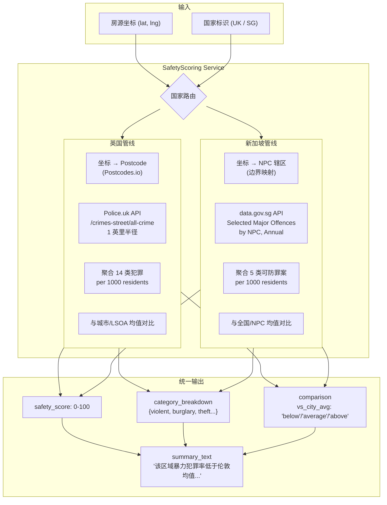
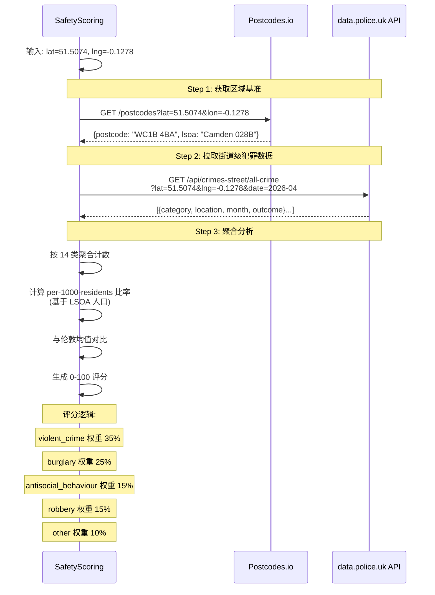
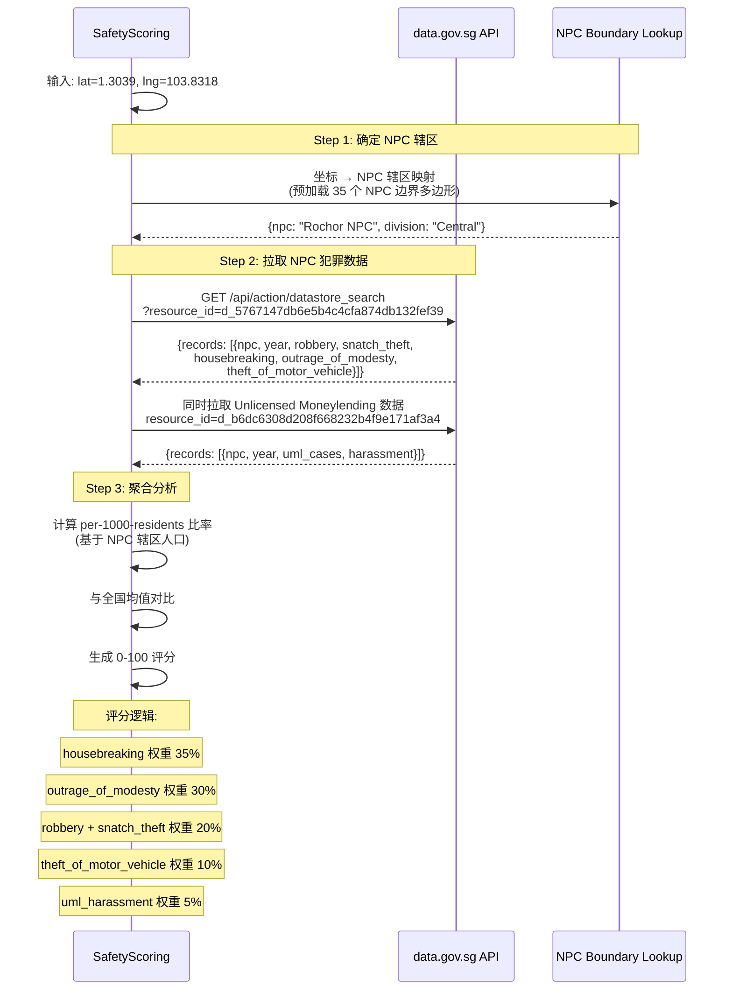
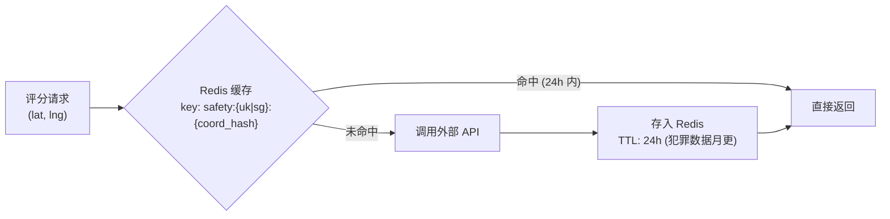

# 安全评分子系统

> 2026-07-13 | Michael

---

## 定位

为对比 Agent 提供可量化的安全评分。分别对接英国 (Police.uk) 和新加坡 (data.gov.sg) 两个数据源，统一输出 0-100 的安全评分。

---

## 整体架构



---

## 英国: Police.uk API 对接



### 英国犯罪类别 (14 类)

| 类别 | 对学生的威胁 | 评分权重 |
|------|-------------|----------|
| `violent-crime` | 🔴 高 | 35% |
| `burglary` | 🔴 高 | 25% |
| `robbery` | 🟠 中高 | 15% |
| `anti-social-behaviour` | 🟡 中 | 15% |
| `vehicle-crime` | 🟡 中 | 5% |
| `criminal-damage-arson` | 🟡 中 | 3% |
| `drugs` | 🟡 中 | 2% |
| `other-theft` | 🟢 低 | — |
| `shoplifting` | 🟢 低 | — |
| `bicycle-theft` | 🟢 低 | — |
| `theft-from-the-person` | 🟠 中高 | 归入 robbery |
| `possession-of-weapons` | 🔴 高 | 归入 violent |
| `public-order` | 🟡 中 | 归入 antisocial |
| `other-crime` | — | — |

### 评分公式

```
zone_crime_rate = Σ(category_count × weight) / lsoa_population × 1000
city_avg_rate   = Σ(city_category_count × weight) / city_population × 1000

ratio = zone_crime_rate / city_avg_rate

safety_score = clamp(100 - (ratio × 50), 10, 100)
             = ratio = 1.0 (等于均值) → 50 分
             = ratio = 0.5 (低于均值一半) → 75 分
             = ratio = 2.0 (高于均值一倍) → 0 分 → clamp 到 10
```

### 注意事项

- **苏格兰不覆盖** — 需要后续对接 SIMD (Scottish Index of Multiple Deprivation)
- **数据滞后 2-3 个月** — 标注数据月份
- **位置匿名化** — Police.uk 将犯罪位置偏移到最近街道中点，1 英里半径足够覆盖此误差

---

## 新加坡: data.gov.sg 对接



### 新加坡犯罪类别

| 类别 | 对学生的威胁 | 评分权重 |
|------|-------------|----------|
| Housebreaking (破门行窃) | 🔴 高 | 35% |
| Outrage of Modesty (非礼) | 🔴 高 | 30% |
| Robbery (抢劫) | 🔴 高 | 12% |
| Snatch Theft (抢夺) | 🟠 中高 | 8% |
| Theft of Motor Vehicle (偷车) | 🟢 低 | 10% |
| UML Harassment (非法放贷骚扰) | 🟡 中 | 5% |

### NPC 辖区映射

新加坡 35 个 NPC 的边界需要预加载。来源：
- data.gov.sg NPC 名称列表
- 可能需要手动维护 NPC → Planning Area 的映射表
- 或者用 OneMap API 的 planning area 查询来辅助定位

### 注意事项

- **数据年度更新** — 没有月度粒度，标注年份
- **新加坡整体低犯罪率** — 邻里间差异远小于英国，评分需要更细的区分度
- **NPC 边界 vs 房源坐标** — 需要预加载边界数据做 Point-in-Polygon 判断

---

## 统一评分输出

```
┌──────────────────────────────────────┐
│         SafetyScore 数据结构          │
├──────────────────────────────────────┤
│ safety_score:        78 / 100        │
│ confidence:          "high"          │
│ data_source:         "police.uk"     │
│ data_period:         "2026-04"       │
│                                      │
│ category_breakdown:                  │
│   violent_crime_rate:     8.2/1000   │
│   burglary_rate:          3.1/1000   │
│   robbery_rate:           1.5/1000   │
│   antisocial_rate:        12.4/1000  │
│                                      │
│ comparison:                          │
│   vs_city_avg:           "below"     │
│   vs_city_percentile:    32%         │
│   city_avg_rate:         15.3/1000   │
│                                      │
│ summary:                             │
│   "该区域总体犯罪率低于伦敦均值 20%，  │
│    暴力犯罪率低，入室盗窃率接近均值。  │
│    是 Camden 区内相对安全的街区。"     │
└──────────────────────────────────────┘
```

---

## 缓存策略



- 对同一区域的多次查询不会重复调 API
- 缓存 TTL 24 小时足够了（数据月更/年更）
- 超过 API 速率限制时降级使用缓存数据

---

## 对比 Agent 中的使用

安全评分在对比 Agent 中作为**一个独立维度**参与打分和展示：

```
雷达图中: 安全是一条独立的轴
维度表中: 显示各套房的安全评分 + 明细
Trade-off: "C 虽然通勤最差，但安全评分最高 (85 vs A 的 72)"
风险提示: "B 所在区域入室盗窃率高于均值 40%，建议确认门禁情况"
```
