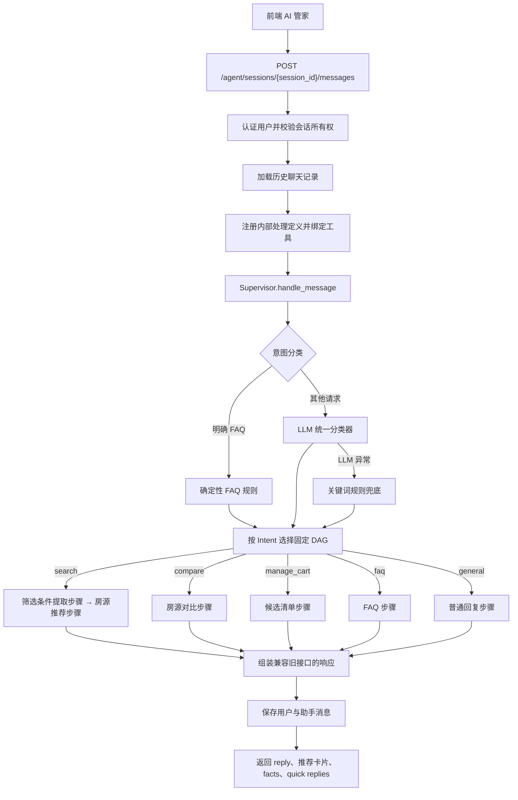
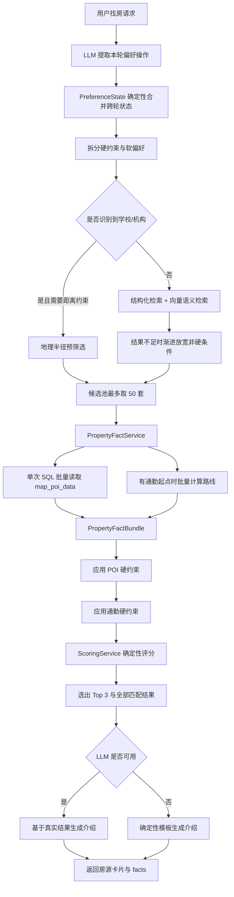
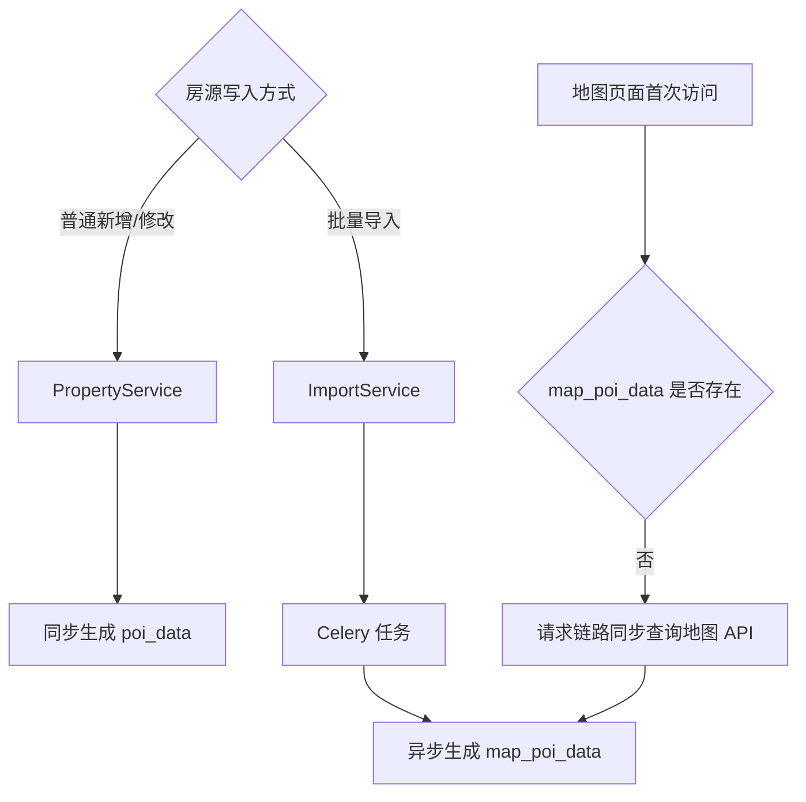
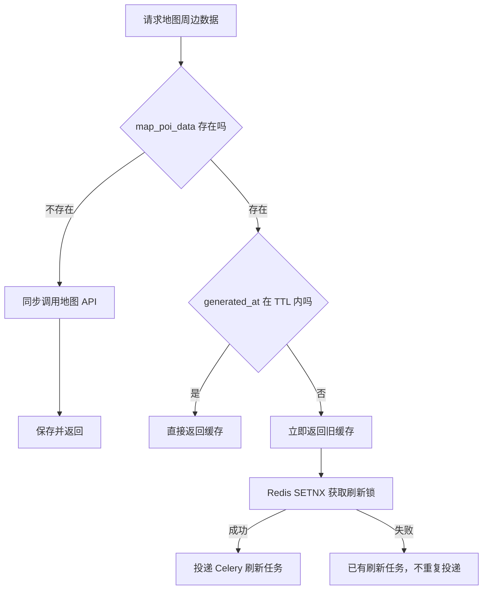
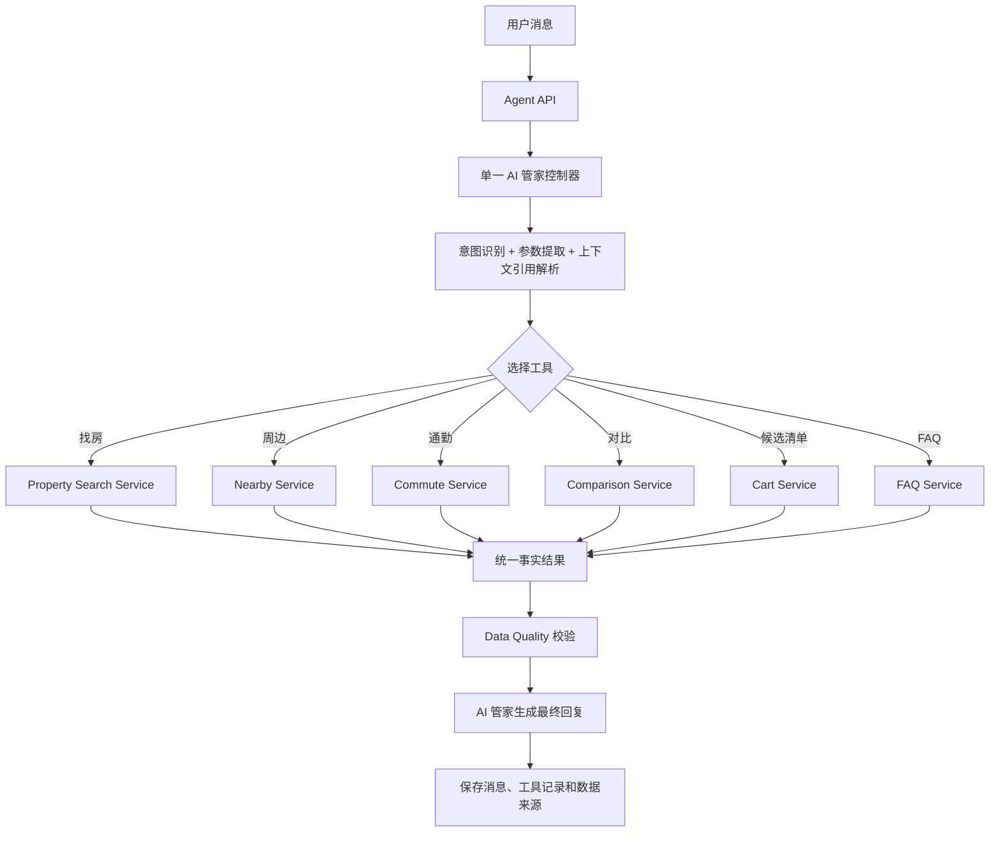
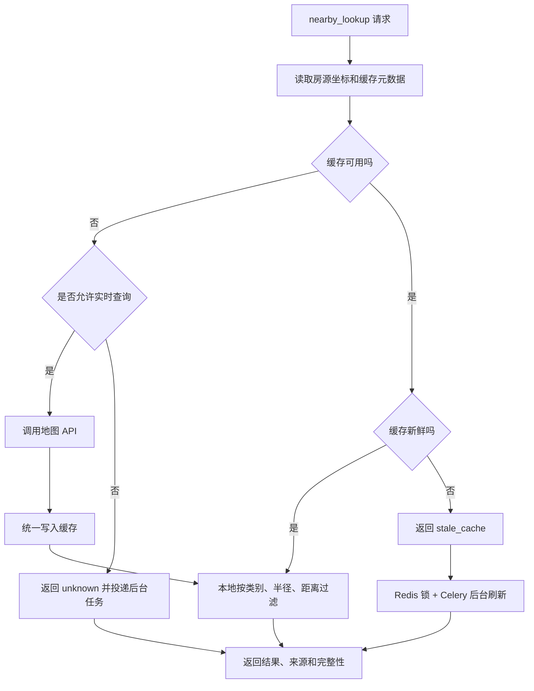

# AI 管家后端逻辑与架构复杂分析

> 文档状态：基于当前工作区代码分析
> 分析日期：2026-07-22
> 分析范围：Agent 请求入口、意图识别、房源检索、硬/软约束、向量匹配、POI、通勤、缓存、降级与目标架构

## 1. 执行摘要

当前产品对用户只展示一个“AI 管家”，但后端代码同时存在两种架构表达：

1. **产品与业务表达**：一个 AI 管家理解用户需求，并调用房源、POI、通勤、对比、候选清单等确定性服务。
2. **代码表达**：`Supervisor` 注册了 6 个内部 `AgentDefinition`，并使用固定 DAG 选择内部处理节点。

这 6 个内部对象并不是 6 个面向用户的 AI 助手。当前主请求链路中，大部分对象也没有运行独立的 ReAct 工具循环：

- `filter_agent`：执行一次 LLM JSON 提取；
- `search_agent`：直接委托 `AgentService.recommend_properties()`；
- `faq_agent`：确定性规则匹配；
- `cart_agent`：直接调用候选清单服务；
- `compare_agent`：直接调用对比服务；
- `synthesizer_agent`：用于普通回复或降级。

因此，当前系统的实质更接近：

> **一个 AI 管家入口 + 多个内部处理步骤 + 多个确定性 Service**

而不是一个真正需要 Agent 之间自主协作的多 Agent 系统。

当前最重要的技术结论如下：

- 主链路采用 `Agent API → Supervisor → 固定 DAG → Service → 响应`。
- 找房主链路已经支持硬约束、软偏好、跨轮状态、结构化检索、向量检索、POI 事实、批量通勤和确定性评分。
- POI 当前分为 `poi_data` 和 `map_poi_data` 两套数据，生成入口、读取入口和刷新策略并不统一。
- 地图页面具备 7 天 TTL、过期先返回、后台刷新和 Redis 防重锁。
- 主 Agent 请求没有真正调用 `poi_lookup` 工具；纯周边问题目前仍可能进入完整找房流程。
- `poi_lookup` 本身只读 `poi_data`，没有应用地图 POI 的完整缓存判断。
- 当前 `commute_calc` 工具与 `CommuteDestination` 数据结构不一致，并且没有真正解析用户目的地；主推荐链路的批量通勤实现相对完整。
- 目标架构建议收敛成“单 Agent 控制器 + 明确 Tool Schema + 确定性 Service”，由 Service 决定缓存、外部 API 和降级，LLM 不直接决定数据是否可信。

---

## 2. 系统边界与核心模块

### 2.1 用户可见边界

用户只与一个 AI 管家交互。前端不需要知道后端内部存在多少处理步骤，也不应把内部模块表现为多个独立助手。

AI 管家的职责应限制为：

- 理解自然语言意图；
- 提取结构化参数；
- 选择需要的业务工具；
- 基于真实数据组织自然语言回复；
- 在信息不足时提出必要的追问。

以下职责应由确定性服务承担：

- 数据库检索；
- 价格、面积、户型等硬过滤；
- POI 缓存有效性判断；
- 是否调用地图 API；
- 通勤路线计算；
- 评分与排序；
- 数据完整性判断；
- 权限校验、状态变更和事务提交。

### 2.2 当前主要代码模块

| 模块 | 当前职责 | 主要位置 |
|---|---|---|
| Agent API | 会话校验、历史加载、调用 Supervisor、持久化消息 | `backend/app/api/v1/routes/agent.py` |
| Supervisor | 意图分类、构建 DAG、执行内部步骤、合成响应 | `backend/app/services/agentic/orchestration/supervisor.py` |
| Agent Registry | 注册 6 个内部 Agent 定义 | `backend/app/services/agentic/agents/registry.py` |
| Execution DAG | 将 Intent 映射到固定内部执行节点 | `backend/app/services/agentic/orchestration/execution_dag.py` |
| Agent Service | 成熟找房、评分、推荐、对比和候选清单逻辑 | `backend/app/services/agent_service.py` |
| Property Service | 房源 CRUD、结构化/向量搜索、房源创建时触发 POI | `backend/app/services/property_service.py` |
| Property Fact Service | 批量读取 POI 缓存并批量计算通勤 | `backend/app/services/property_fact_service.py` |
| POI Service | 周边搜索、地图 POI 生成、缓存读取和刷新 | `backend/app/services/poi_service.py` |
| Commute Service | 高德/ORS 路线计算与 Haversine 降级 | `backend/app/services/commute_service.py` |
| Scoring Service | 确定性质量评分和推荐排序 | `backend/app/services/scoring_service.py` |
| Preference State | 跨轮偏好状态合并与硬/软约束视图 | `backend/app/services/preference_state.py` |

---

## 3. 当前真实 Agent 请求 Workflow

### 3.1 请求主流程



### 3.2 当前注册的内部 Agent 定义

| 内部名称 | 代码类型 | 主链路实际执行方式 | 是否独立 ReAct |
|---|---|---|---|
| `filter_agent` | LLM 参数提取器 | 单次 `complete_json`，然后确定性合并偏好 | 否 |
| `search_agent` | 搜索处理角色 | 直接调用 `AgentService.recommend_properties()` | 否 |
| `compare_agent` | 对比处理角色 | 直接调用 `AgentService.compare_cart()` | 否 |
| `cart_agent` | 清单处理角色 | 直接读写候选清单 | 否 |
| `faq_agent` | FAQ 处理角色 | 规则匹配 | 否 |
| `synthesizer_agent` | 文本生成角色 | 单次文本生成或降级 | 否 |

代码中仍保留 ReAct 和 Handoff 能力，但当前 Agent API 调用的是 `Supervisor.handle_message()`，主 DAG 路径明确绕过 ReAct。ReAct 主要保留给未接入主 API 的 Handoff 深度模式。

### 3.3 Intent 与固定 DAG 映射

| Intent | 当前内部流程 |
|---|---|
| `search` | `filter_agent → search_agent` |
| `compare` | `compare_agent` |
| `manage_cart` | `cart_agent` |
| `faq` | `faq_agent` |
| `general` | `synthesizer_agent` |

当前路由策略会计算工具数量、意图置信度、对话深度、依赖数量和歧义程度，但 `ExecutionDAG.from_intent()` 最终仍按照固定模板构建 DAG。`complexity` 和 `enable_moe` 参数目前只保留接口，没有改变实际 DAG。

---

## 4. 意图识别与对话状态

### 4.1 分类顺序

当前分类顺序为：

1. FAQ 确定性规则优先；
2. 未命中 FAQ 时调用 LLM 统一分类器；
3. LLM 不可用或异常时使用关键词规则兜底。

统一分类器输出：

- `intent`；
- `sub_intent`；
- `stage`；
- `complexity`；
- `confidence`；
- `routing`；
- FAQ 主题；
- 房源引用序号。

### 4.2 当前分类缺口

统一分类器给 `search` 声明的 `sub_intent` 包含：

- `explore`；
- `browse`；
- `filter`；
- `detail`；
- `commute`。

但没有正式声明 `poi`。Supervisor 的规则兜底却可能返回 `sub_intent=poi`，两套分类定义不一致。

另外，规则兜底先判断普通找房关键词，再判断通勤和 POI。普通找房关键词中包含“附近”和“地铁”，因此：

- “这套房附近有什么”可能先被识别为普通 `browse`；
- “离地铁站多久”可能先被识别为普通找房；
- POI/通勤专用分支在 LLM 不可用时可能无法命中。

### 4.3 跨轮偏好状态

Filter 步骤不是每轮重新生成完整筛选条件，而是让 LLM 输出本轮操作：

- `set`；
- `update`；
- `add`；
- `remove`；
- `clear`。

然后由 `PreferenceState` 确定性合并到 `chat_session.accumulated_filters`。这使以下对话可以连续生效：

```text
用户：预算 3000 以内
用户：最好有健身房
用户：预算提高到 3500
用户：健身房不重要了
```

硬约束和软偏好不会只依赖 LLM 文本描述，而会被保存为结构化状态。

---

## 5. 房源搜索与推荐 Workflow



### 5.1 硬约束

硬约束用于严格过滤，不允许自动放宽。当前可以覆盖：

- 区域；
- 价格上下限；
- 户型；
- 房源类型；
- 房内设施；
- 房型；
- 卫生间数量；
- 面积；
- 租期；
- 可入住时间；
- 学校/机构距离；
- POI 距离；
- 通勤分钟数。

POI 硬约束要求缓存中存在真实距离证据。缓存缺失不会被解释为“附近没有”，但当前过滤结果会将该房源排除。

通勤硬约束只有在识别到学校或机构起点后才应用。如果用户只说“通勤 30 分钟以内”但没有提供目的地，当前逻辑会跳过该硬约束并记录日志，避免错误地把所有房源过滤为空。

### 5.2 软偏好

软偏好不直接删除候选房源，而是参与排序。例如：

- 最好有阳台；
- 尽量靠近超市；
- 有健身房更好；
- 希望空间更大；
- 价格越低越好。

### 5.3 向量语义匹配

无明确机构地理预筛选时，搜索可以组合：

- PostgreSQL 结构化条件；
- pgvector 房源 embedding；
- 用户自然语言 query embedding；
- 渐进放宽；
- 确定性评分。

Embedding 用于召回语义相似房源，不负责决定硬约束是否成立。价格、户型、面积、租期等硬条件仍由数据库过滤完成。

正确关系是：

```text
结构化硬过滤控制“能不能进入候选”
向量相似度控制“语义上像不像用户想要的”
确定性评分控制“最终推荐顺序”
LLM 控制“如何解释真实结果”
```

---

## 6. 四类核心确定性服务

### 6.1 Property Service

职责：

- 价格；
- 面积；
- 户型；
- 房源状态；
- 租期；
- 设施；
- 结构化过滤；
- 向量语义召回；
- 搜索缓存失效。

它是候选房源事实的第一来源，LLM 不应修改或推测这些字段。

### 6.2 Commute Service

职责：

- 中国大陆优先使用高德路线 API；
- 海外优先使用 ORS；
- API 不可用时使用 Haversine 估算；
- 支持步行、骑行、驾车和公共交通；
- 对外部请求做并发限制与排队超时；
- 为多个候选房源批量计算通勤。

返回结果需要携带来源，例如：

- `amap_api`；
- `ors_api`；
- `haversine_fallback`。

公共交通还应通过 `transit_verified` 区分真实公交路线与估算结果。

### 6.3 POI Summary Service

职责：

- 从 `map_poi_data` 中计算最近交通、超市、健身房、医疗距离；
- 统计指定范围内的设施数量；
- 供硬约束判断、软偏好评分和房源介绍使用；
- 不在批量推荐链路里逐套调用地图 API。

当前固定摘要维度为：

- `nearest_transit_m`；
- `nearest_supermarket_m`；
- `supermarket_count_1km`；
- `nearest_gym_m`；
- `gym_count_1km`；
- `nearest_medical_m`；
- `medical_count_2km`。

### 6.4 Data Quality Service

当前不是一个完全独立的文件级服务，但 `PropertyFactBundle.data_completeness` 已承担核心职责：

- POI 缓存是否存在；
- 哪些 POI 分类可用；
- POI 覆盖率；
- 房源坐标是否存在；
- 通勤是否可计算；
- 通勤数据来源。

它的关键价值是区分：

- “附近确实没有”；
- “缓存没有覆盖这个类别”；
- “房源没有坐标”；
- “地图服务暂时不可用”。

---

## 7. POI 数据生命周期与缓存逻辑

### 7.1 当前两套 POI 数据

`PropertyPOI` 当前同时保存：

| 字段 | 内容 | 当前主要消费者 |
|---|---|---|
| `poi_data` | 分类后的周边摘要数据 | Agent 工具 `poi_lookup`、部分详情接口 |
| `map_poi_data` | 含经纬度和距离的地图卡片数据 | 地图页面、PropertyFactService、推荐评分 |
| `generated_at` | 生成时间 | 两套数据共用 |

两套数据共用一个 `generated_at` 是风险点。更新 `poi_data` 可能把时间更新为当前时间，即使 `map_poi_data` 仍是旧地址的数据，地图缓存也可能被误判为新鲜。

### 7.2 当前生成路径



普通房源新增会同步生成 `poi_data`，但没有在同一流程中明确投递 `map_poi_data` 生成任务。批量导入会投递地图 POI 任务。因此不同写入方式可能得到不同的缓存完整度。

### 7.3 当前地图缓存判断

默认配置：

- TTL：7 天；
- 定时扫描：每 6 小时；
- 单批刷新：200 套；
- 同一房源刷新锁：10 分钟。

查询逻辑：



这是典型的 stale-while-revalidate：过期数据仍可快速返回，同时后台刷新。

### 7.4 当前 Agent 周边查询的断点

当前 Agent API 使用主 DAG 直接调用 `AgentService.recommend_properties()`，不会进入 `SearchAgent` 的 ReAct 工具调用。因此：

- `poi_lookup` 工具已注册；
- 但主 Agent 请求不会稳定调用它；
- 纯 POI 问题可能被当成普通找房需求；
- 可能执行筛选、检索、评分整条流程后才回复；
- Agent 查询没有统一使用地图 POI 的 TTL 和后台刷新逻辑。

即使未来直接调用当前 `poi_lookup`，它也只是读取 `poi_data`，只判断数据库记录是否存在，没有判断：

- 是否过期；
- 是否覆盖请求类别；
- 缓存半径是否覆盖请求半径；
- 房源地址或坐标是否已改变；
- 是否需要调用地图 API；
- 返回的是缓存、旧缓存还是实时数据。

### 7.5 建议的缓存可用性判定

统一 Nearby Service 后，缓存可用条件建议定义为：

```text
cache_usable =
    缓存数据存在
    AND 缓存对应当前房源地址/坐标版本
    AND 请求类别在缓存覆盖范围内
    AND 请求半径不超过缓存搜索半径
    AND 缓存数据可解析
```

新鲜度与可用性分开判断：

```text
cache_fresh = cache_usable AND now - map_generated_at <= ttl
```

决策表：

| 情况 | 返回 | 外部地图 API |
|---|---|---|
| 缓存完整且新鲜 | 缓存 | 不调用 |
| 缓存完整但过期 | 旧缓存，并标记 stale | 后台刷新 |
| 请求半径比缓存小 | 按距离本地过滤 | 不调用 |
| 缓存缺少请求类别 | 无法从缓存确定 | 单套房按需调用 |
| 用户要求实时/营业状态 | 实时结果 | 调用 |
| 房源地址或坐标改变 | 缓存失效 | 后台或按需调用 |
| 多套房批量排序 | 只用缓存，缺失标 unknown | 禁止逐套实时调用 |

---

## 8. 通勤逻辑分析

### 8.1 推荐主链路

主推荐链路通过 `PropertyFactService`：

1. 将学校/机构作为通勤起点；
2. 将候选房源作为多个目的地；
3. 批量调用 `calculate_commute_batch_resilient()`；
4. 中国大陆使用高德，海外使用 ORS；
5. 外部服务失败时使用 Haversine 估算；
6. 返回每套房的步行、骑行、驾车和公交时间；
7. 将来源与是否真实公交路线写入 facts。

这条链路适合“帮我找通勤到学校 30 分钟以内的房子”。

### 8.2 `commute_calc` 工具问题

工具注册表中的单房源 `commute_calc` 当前存在两个明显问题：

1. `CommuteDestination` 定义要求 `dest_id、lat、lng`，工具却传入 `property_id、label`，调用时会产生参数错误。
2. 工具把房源坐标同时作为 origin 和 destination，没有对用户给出的目的地名称或地址进行地理编码，即使修复参数也会得到接近 0 的距离。

因此，当前单房源追问“这套房到某大学多久”不能依赖该工具，需要新增：

```text
目的地名称/地址
    → Geocoding Service
    → 目的地经纬度
    → Commute Service
    → 路线结果
```

---

## 9. 响应、降级与数据可信度

### 9.1 LLM 可用时

LLM 主要参与：

- 意图分类；
- 本轮偏好操作提取；
- 基于 Top 3 真实房源数据生成中文介绍；
- 普通闲聊回复。

### 9.2 LLM 不可用时

系统已有多层降级：

- 分类失败 → 关键词规则；
- 筛选提取失败 → 保留现有偏好状态；
- 推荐文案失败 → 确定性模板；
- 地图路线失败 → Haversine 估算；
- POI 缓存读取失败 → 标记数据缺失，继续推荐；
- DAG 执行失败 → 安全兜底回复。

### 9.3 必须在响应中保留的数据来源

建议所有房源事实统一携带：

```json
{
  "source": "cache | stale_cache | amap_api | ors_api | haversine_fallback",
  "generated_at": "2026-07-22T10:00:00Z",
  "freshness": "fresh | stale | unknown",
  "coverage": 0.75,
  "verified": true
}
```

LLM 只能根据这些字段解释结果，不能把估算描述成真实路线，也不能把数据缺失描述成“附近没有”。

---

## 10. 当前问题与风险分级

### P0：直接影响业务正确性

#### 10.1 单 Agent 产品概念与多 Agent 代码命名不一致

内部步骤被定义为多个 Agent，增加了理解成本，也容易让团队误以为系统需要多模型自治协作。实际上主链路大多是单次 LLM 或 Service 调用。

#### 10.2 纯 POI 问题没有专用主链路

当前主 API 不运行 ReAct 工具循环。用户问特定房源周边时，可能进入普通找房 DAG，而不是直接调用 Nearby Service。

#### 10.3 `commute_calc` 工具目前不可正确工作

参数结构不匹配，并且没有解析真实目的地坐标。

#### 10.4 POI 时间戳共用

`poi_data` 与 `map_poi_data` 共用 `generated_at`，可能导致旧地图缓存被误判为新鲜。

### P1：影响性能、成本或数据一致性

#### 10.5 POI 数据链分裂

Agent 工具读取 `poi_data`，推荐事实读取 `map_poi_data`，两套数据类别和更新机制不同。

#### 10.6 普通创建与批量导入的预生成行为不一致

普通创建同步生成 `poi_data`，批量导入异步生成 `map_poi_data`。同一类房源可能因写入方式不同而得到不同的数据完整性。

#### 10.7 冷缓存会阻塞请求

地图缓存完全缺失时，`get_or_generate_map_pois()` 在用户请求中同步调用地图 API。地图服务慢或不可用时会直接影响页面响应。

#### 10.8 规则分类优先级不合理

普通搜索关键词在通勤和 POI 前判断，LLM 不可用时会产生误路由。

### P2：架构复杂度与维护风险

#### 10.9 路由策略结果没有真正改变主 DAG

系统计算了 fast/agentic 复杂度，但固定 DAG 构建没有使用这些结果改变执行结构。

#### 10.10 主链路与保留的 ReAct/Handoff 链重复

代码同时维护固定 DAG、ReAct loop 和 Handoff 深度模式，但生产入口只使用固定 DAG，增加测试与维护成本。

#### 10.11 `synthesize` 当前主要是拼接结果

Supervisor 最终 `_synthesize()` 对成功内容做字符串拼接，不是真正基于多结果重新推理。当前固定 DAG 又很少产生多个有文本的结果，因此多 Agent 合成价值有限。

---

## 11. 建议的目标架构：单 Agent + 确定性 Services



### 11.1 单 Agent 控制器的职责

单 Agent 控制器只做四件事：

1. 识别意图；
2. 解析结构化参数；
3. 选择一个或多个工具；
4. 基于工具结果生成回复。

不应让 LLM 判断：

- 缓存是否过期；
- 地图 API 是否值得调用；
- 硬约束是否满足；
- 价格和距离是否真实；
- 数据缺失是否等于条件不满足。

### 11.2 建议的 `nearby_lookup` 工具协议

请求：

```json
{
  "property_id": 7,
  "categories": ["supermarket", "gym"],
  "radius_m": 1000,
  "limit": 5,
  "freshness": "normal",
  "sort": "distance"
}
```

响应：

```json
{
  "property_id": 7,
  "items": {
    "supermarket": [],
    "gym": []
  },
  "cache": {
    "source": "cache",
    "freshness": "fresh",
    "generated_at": "2026-07-22T10:00:00Z",
    "search_radius_m": 3000,
    "covered_categories": ["supermarket", "gym"]
  },
  "data_quality": {
    "coordinates_available": true,
    "coverage": 1.0,
    "complete": true
  }
}
```

### 11.3 Nearby Service 内部决策



---

## 12. 建议改造顺序

### 第一阶段：修复正确性

1. 修复 `commute_calc` 参数结构与目的地地理编码。
2. 将 POI/通勤规则判断提前到普通搜索关键词之前。
3. 给统一分类器增加正式的 `poi` sub-intent。
4. 为 `poi_data` 和 `map_poi_data` 拆分生成时间。
5. 房源地址或坐标修改时显式失效地图 POI 缓存。

### 第二阶段：统一 Nearby 数据链

1. 新增统一 `NearbyService` 或扩展 `POIService` 门面方法。
2. 让 Agent、地图页面、推荐事实读取同一份结构化缓存。
3. 普通创建、编辑和批量导入统一投递预生成任务。
4. 冷缓存默认返回 `pending/unknown` 并后台生成；只有明确实时查询才同步调用地图 API。
5. 返回 `source、freshness、coverage、generated_at`。

### 第三阶段：收敛单 Agent 架构

1. 保留一个 AI 管家控制器。
2. 将 Filter、FAQ、Cart、Compare 视为步骤或工具，不再以独立 Agent 对外描述。
3. 移除主链路不使用的多 Agent DAG/Handoff 复杂度，或者明确将其标记为实验模式。
4. 对工具调用设置最大次数、超时、审计和成本预算。

### 第四阶段：可观测性与质量

记录以下指标：

- 意图分类命中率；
- POI 缓存命中率；
- POI stale 返回率；
- 地图 API 调用次数和失败率；
- 单请求地图 API 成本；
- 通勤真实 API 与估算占比；
- 推荐候选数量；
- 硬约束过滤数量；
- LLM 降级率；
- Agent 总响应时间 P50/P95/P99。

---

## 13. 验收测试建议

### 13.1 Agent 路由

- [ ] “帮我找 3000 以内的一居室”进入房源搜索。
- [ ] “这套房附近有什么超市”进入 Nearby Service，不执行完整房源召回。
- [ ] “这套房到悉尼大学多久”进入单房源通勤流程。
- [ ] “押金什么时候退”由 FAQ 规则直接回答。
- [ ] LLM 不可用时，POI 和通勤关键词仍正确路由。

### 13.2 POI 缓存

- [ ] 新鲜缓存不调用地图 API。
- [ ] 过期缓存立即返回并只投递一个刷新任务。
- [ ] Redis 不可用时不会阻塞主请求。
- [ ] 小半径查询可以直接过滤大半径缓存。
- [ ] 缺少类别时不会返回“附近没有”。
- [ ] 房源坐标改变后旧缓存立即失效。
- [ ] 批量推荐不会对每套房调用地图 API。

### 13.3 通勤

- [ ] 目的地名称先被解析成真实坐标。
- [ ] 起点和终点不是同一个坐标。
- [ ] 高德/ORS 返回时标注真实来源。
- [ ] API 失败时标注 `haversine_fallback`。
- [ ] 估算公交时间不会被描述成“真实公交路线”。

### 13.4 硬约束与软偏好

- [ ] “必须 500 米内有超市”严格过滤。
- [ ] “最好 500 米内有超市”只影响排序。
- [ ] 缓存缺失与距离超标能够区分。
- [ ] 用户后续修改条件时只更新指定字段。
- [ ] “重新搜”可以清空跨轮偏好。

---

## 14. 最终建议

项目不需要为了“看起来智能”而保留多个内部 Agent 名称。对于租房场景，最可靠的方案是：

> **一个 AI 管家负责理解、选择工具和解释；确定性 Service 负责真实数据、缓存、计算、过滤与状态变更。**

房源搜索、POI、通勤、对比和数据质量都有清晰的输入输出，因此非常适合作为工具服务。LLM 应处在流程首尾：开头理解用户，结尾组织回复；中间的事实计算必须可复现、可测试、可追踪。

POI 改造是当前最适合率先收敛的部分。统一 Nearby Service 后，可以同时解决：

- Agent 周边追问；
- 房源卡片周边介绍；
- 地图页面 POI；
- POI 硬约束；
- POI 软偏好评分；
- 缓存过期与后台刷新；
- 地图 API 成本控制；
- 数据来源与完整性展示。

完成这一步后，Agent 的主流程可以稳定收敛为：

```text
用户消息
→ 单 Agent 识别意图和参数
→ 调用确定性 Service
→ Service 处理缓存/API/计算
→ 返回带来源的真实结果
→ 单 Agent 生成最终回复
```
