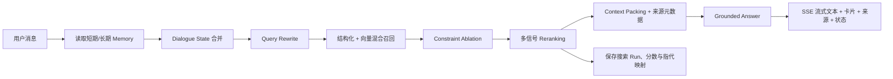

# Agent 高质量交互与检索升级改动报告

> 日期：2026-08-02
> 最终范围：Memory、Reranking、Query Rewrite、Context Packing、Grounded Answer，以及此前确认的五项能力。
> 明确排除：MCP、A2A、HyDE。

## 1. 最终范围如何合并

图片中的五项与此前五项有两组重叠，因此没有重复建设两套组件：

| 用户确认项 | 实际落地模块 | 合并关系 |
|---|---|---|
| Memory | 短期会话状态 + 跨会话长期偏好 | 与 Dialogue State Tracking 配合，但不是同一个层次 |
| Reranking | 多信号确定性重排 | 与 Hybrid Retrieval + Rerank 合并 |
| Query Rewrite | 查询理解与独立检索表达改写 | 独立实现 |
| Context Packing | 历史压缩 + 候选事实预算打包 | 与 Context Packing with Source Metadata 合并 |
| Grounded Answer | 来源约束生成 + 缺失字段规则 + 前端来源展示 | 独立实现 |
| Dialogue State Tracking | 多轮筛选条件、阶段、上轮结果状态 | Memory 的短期状态层 |
| Hybrid Retrieval + Rerank | 结构化召回 + 向量召回 + 词面/业务重排 | 包含 Reranking |
| Context Packing with Source Metadata | 候选事实、字段来源、缺失标记一起打包 | Context Packing 的增强版 |
| Reference Resolution | “第二套、最便宜、刚才那套”等指代解析 | 独立实现 |
| Query Relaxation by Constraint Ablation | 零结果时逐项试验约束并最小放宽 | 独立实现 |

最终是 **8 个不重复能力模块**，不是机械堆出 10 套互相重叠的逻辑。

## 2. 新的主链路



## 3. 每项能力如何实现

### 3.1 Memory + Dialogue State Tracking

实现内容：

1. 每个会话保存当前阶段、有效筛选条件、上轮候选、序号指代和滚动摘要。
2. 每个用户保存跨会话偏好，并为每个偏好记录置信度、证据次数和最后会话。
3. 合并优先级固定为：长期偏好 `<` 当前会话状态 `<` 本轮自然语言理解 `<` 前端显式筛选值。
4. 列表条件采用增量合并；只有用户明确说“不要独卫、取消设施”时才删除。
5. “重新开始、清空条件、重置条件”会同时清理本轮状态和对应长期偏好。
6. 稳定偏好（国家、学校、房型等）明确表达一次即可达到跨会话阈值；预算等临时条件必须在不同会话重复出现，避免一次搜索永久污染用户画像。
7. `AGENT_MEMORY_ENABLED=false` 只关闭跨会话长期偏好；当前会话状态仍保留，以免多轮对话失效。

主要文件：

- `backend/app/services/agentic/memory.py`
- `backend/app/models/agent_intelligence.py`
- `backend/app/services/agentic/dispatcher.py`
- `frontend/src/views/SmartRentView.vue`

界面表现：顶部显示“已记住”条件 chips，让用户能发现系统是否理解错了。

负责人建议：

- chips 文案、是否默认展开、提示措辞：交互/提示词负责人。
- 记忆置信度、合并优先级、清除语义、持久化：后端负责人。

### 3.2 Query Rewrite

实现内容：

1. 一次结构化调用同时完成：本轮新增条件、删除条件、删除列表值、查询改写、查询类型识别。
2. 改写后的查询必须可独立检索，可以引用已确认状态，但不能新增用户没说过的硬条件。
3. 结构化输出经过字段白名单校验，`null` 不允许静默覆盖旧状态。
4. LLM 不可用时有规则兜底，支持常见预算、币种、学校缩写、studio/合租、设施、通勤和相对预算修改。
5. 前端只展示“理解为”，不展示内部思维过程。
6. 查询理解温度固定为 `0.0`，目标是稳定和可复现，不追求表达多样性。

主要文件：

- `backend/app/services/agentic/query_understanding.py`
- `backend/app/services/agentic/dispatcher.py`
- `frontend/src/views/SmartRentView.vue`

负责人建议：

- `QUERY_UNDERSTANDING_PROMPT`、字段术语、示例和展示文案：交互/提示词负责人。
- 字段白名单、数据类型、回退解析和与搜索参数的映射：后端负责人。

### 3.3 Hybrid Retrieval + Reranking

实现内容：

1. 有 embedding 时，把候选池拆成两条召回腿：语义向量召回和结构化召回；默认总池 120，约 60/60 后去重。
2. embedding 不可用或调用失败时，自动降级到结构化召回和词面打分。
3. 严格搜索不足时再取一次宽召回池，后续所有约束试验在内存中复用，不为每个条件反复打数据库。
4. 最终重排由确定性多信号加权完成：语义、词面、预算、通勤、POI、信息完整度、约束满足度。
5. 每套候选返回总分、分项分和稳定名次；同分时按可租库存和价格稳定排序。
6. 主数据优先使用 `UnitType + Institute + available Room`；只有三层模型完全没有候选时，才兼容旧版独立 `Property` 数据。
7. 交互使用真实可租 `property_id`，检索审计同时保留 `unit_type_id`，解决了“户型 ID 能推荐但不能打开详情/加入候选”的实体错位问题。
8. 搜索只保留至少一间可租库存的户型；区域同时匹配 district、city、country、公寓中英文名。

默认权重：

| 信号 | 权重 |
|---|---:|
| semantic | 0.32 |
| lexical | 0.12 |
| price | 0.18 |
| commute | 0.14 |
| poi | 0.10 |
| quality | 0.08 |
| constraint | 0.06 |

主要文件：

- `backend/app/services/agentic/retrieval.py`
- `backend/app/services/agentic/agents/search_agent.py`
- `backend/app/services/property_service.py`

负责人建议：这一组属于后端检索逻辑，应交给后端同学 Review，特别是权重、候选池大小、地理预筛范围和线上索引表现。

### 3.4 Query Relaxation by Constraint Ablation

实现内容：

1. 先计算完全满足当前条件的严格结果。
2. 结果少于阈值时，逐个试验预算、区域、房型、卧室、面积、卫浴、设施、通勤、POI 距离、租期等条件。
3. `hard_filters` 中的条件绝不自动放宽。
4. 严格结果为 1–2 套时保留真实严格结果，只给可点击的放宽建议。
5. 严格结果为 0 时只自动应用一次最小放宽，并明确返回 `applied=true` 和放宽动作。
6. 能达到最低结果数时优先选择策略表中更温和的改动，避免为了多出大量候选而过度偏离需求。
7. 推荐卡片和自然语言都显示已经放宽的条件，不能伪装成完全命中原条件。

主要文件：

- `backend/app/services/agentic/retrieval.py`
- `backend/app/services/agentic/agents/search_agent.py`
- `frontend/src/views/SmartRentView.vue`

负责人建议：策略与硬/软约束定义需要产品、交互和后端共同确认；具体查询与性能由后端负责人维护。

### 3.5 Reference Resolution

实现内容：

1. 每轮重排完成后建立序号映射：第 1 套、第 2 套等指向真实可租房间 ID。
2. 建立语义映射：最便宜、通勤最近、面积最大、综合最好、刚才那套。
3. 如果面积或通勤数据缺失，不会把第一套随意当作“最大/最近”，而是返回 unresolved。
4. 支持后续详情、加入候选、移除、对比等动作。
5. 详情查询重新读取当前数据库字段；房源已下架时明确提示，不复用过期卡片事实。

主要文件：

- `backend/app/services/agentic/memory.py`
- `backend/app/services/agentic/dispatcher.py`

负责人建议：指代用语和失败提示由交互负责人维护；ID 映射和详情重查由后端负责人维护。

### 3.6 Context Packing with Source Metadata

实现内容：

1. 最近对话采用滑动窗口，默认最多 12 条，历史字符预算默认 8,000。
2. 单条超长消息截取开头和结尾，旧内容由确定性状态摘要替代。
3. 房源候选默认只向生成模型打包前 3 套；compare/decide 阶段最多 5 套。
4. 候选上下文预算默认 12,000 字符，超过预算停止继续加入候选。
5. 每个候选只包含允许生成模型使用的事实字段、分数、来源和缺失字段。
6. 推荐 ID 必须来自候选快照；内部表名不会直接暴露给用户。

主要文件：

- `backend/app/services/agentic/context.py`
- `backend/app/services/agentic/memory.py`
- `backend/app/services/agentic/agents/search_agent.py`

负责人建议：预算大小和模型上下文成本由后端负责人压测；摘要措辞与阶段回复长度由交互/提示词负责人维护。

### 3.7 Grounded Answer

实现内容：

1. 生成提示词明确规定只能使用 `candidates.facts`。
2. 字段为 `null` 或来源为 `missing` 时，只能说“暂无数据/建议确认”，不能正向或负向评价。
3. 推荐对象、名次、分数、优缺点由后端确定性数据生成，不让 LLM 创建新房源或修改分数。
4. 通勤硬约束遇到缺失通勤数据时判为不满足，不能把“未知”当“符合”。
5. “独立卫浴”不能仅根据“有一个卫生间”推断；设施不能从含否定语义的描述中猜测。
6. 前端删除了按价格/户型臆测“近地铁、WiFi、精装修”等标签的逻辑，只展示后端真实 amenities。
7. 每轮回复显示用户可理解的数据来源 chips：房源基础信息、实时库存、通勤、周边设施、语义匹配。
8. 学校无法定位且没有城市时停止盲目推荐，先要求补充学校全称或所在城市。

主要文件：

- `backend/app/services/agentic/context.py`
- `backend/app/services/agentic/retrieval.py`
- `backend/app/services/agentic/agents/search_agent.py`
- `backend/app/api/v1/routes/agent.py`
- `frontend/src/views/SmartRentView.vue`

负责人建议：Grounding 规则由后端保证；回答语气、段落结构、追问方式由交互/提示词负责人维护。

### 3.8 GPT 式流式交互

实现内容：

1. SmartRent 主页面改用 SSE 流式响应，token 到达即更新同一个助手气泡。
2. 状态事件先返回“读取记忆/改写/检索/生成”等可验证动作摘要，不暴露 Chain of Thought。
3. 结果事件再返回卡片、状态、来源、放宽建议和查询改写。
4. 流中断时保留已经生成的内容，并追加中断提示，不清空整条回复。
5. 推荐卡显示真实名次、匹配分、真实币种和数据库设施。
6. SmartRent 移除了原“多 Agent 深度”入口，本次没有增加 A2A 能力。

主要文件：

- `frontend/src/services/agent.ts`
- `frontend/src/types/agent.ts`
- `frontend/src/views/SmartRentView.vue`
- `backend/app/api/v1/routes/agent.py`
- `backend/app/services/agentic/dispatcher.py`

负责人建议：这一组主要由交互负责人维护；SSE 协议、异常事务和响应序列化由后端负责人维护。

## 4. 提示词与采样参数

### 已设置的 temperature

| 场景 | temperature | 原因 |
|---|---:|---|
| 意图分类 | 0.0 | 分类必须稳定 |
| Query Rewrite / 筛选提取 | 0.0 | 结构化字段必须可复现 |
| 房源推荐回答 | 0.35，可通过环境变量调整 | 保留自然表达，同时降低事实漂移 |
| 普通闲聊 | 0.6 | 不涉及具体检索事实时允许更自然 |

### 没有设置 top-k

- 当前 OpenAI-compatible Chat Completions 接口不统一支持生成采样 `top_k`。
- 同时调低 temperature、top-p、top-k 容易造成不可解释的叠加，不利于调参和 A/B 测试。
- 本次只显式控制 temperature；没有新增 top-p，也没有新增生成 top-k。
- `AGENT_RETRIEVAL_POOL_SIZE=120` 是检索候选池大小，不是语言模型采样 top-k。

提示词负责人主要需要维护两处：

1. `QUERY_UNDERSTANDING_PROMPT`：字段定义、相对说法、硬软约束、JSON 合同。
2. `RECOMMEND_SYSTEM_PROMPT`：语气、篇幅、事实边界、缺失字段表达、追问方式。

## 5. 数据库影响

结论：**有数据库影响，但没有修改任何现有业务表的列。新增 4 张 Agent 专用表。**

### 5.1 新增表

| 表名 | 用途 | 关键字段 |
|---|---|---|
| `agent_session_states` | 当前会话短期状态 | session_id、filters_json、reference_map_json、last_search_json、rolling_summary |
| `agent_user_memories` | 用户跨会话偏好 | user_id、preferences_json、profile_summary |
| `agent_search_runs` | 一次搜索的可观测记录 | original_query、rewritten_query、effective_filters_json、relaxation_trace_json、source_manifest_json、latency_ms |
| `agent_search_candidates` | 候选名次和可解释分数 | search_run_id、unit_type_id、property_id、rank、final_score、score_breakdown_json、source_metadata_json |

### 5.2 对现有表的使用

- 继续复用 `chat_sessions.accumulated_filters`，但没有改它的表结构。
- 读取 `unit_types`、`institutes`、`properties/rooms`、`property_pois`、`room_commutes` 等已有数据。
- 搜索候选现在要求存在可租房间库存。
- 没有修改已有房源数据，没有执行数据回填。

### 5.3 迁移

- 迁移文件：`backend/alembic/versions/20260802_0101_add_agent_memory_and_search_trace.py`
- `down_revision`：`20260725_0100`
- 当前 Alembic head：`20260802_0101`
- 回滚会删除上述 4 张新表，不影响已有业务表。

上线前由后端同学执行：

```bash
cd backend
alembic upgrade head
```

注意：`agent_search_runs.original_query` 会保存用户搜索原文，属于新增可观测数据；上线前应确认日志/数据保留周期和隐私策略。

## 6. API 与前端类型变化

### 推荐项新增

- `rank`
- `final_score`
- `score_breakdown`
- `source_metadata`

### Agent 回复新增

- `raw_intent`
- `stage`
- `sources`
- `relaxation_trace`
- `query_rewrite`
- `reference_resolution`
- `state_summary`

### SSE 行为

- `meta.event=status`：执行状态、查询改写等中间元数据。
- `token`：自然语言增量文本。
- `meta.event=result`：最终推荐卡片、来源、状态和建议。
- `[DONE]`：流结束。

旧页面的 `mode=null`、`mode=expert`、`mode=handoff` 仍可提交，不会触发请求校验错误；当前 Dispatcher 会把未知模式归一化为 `auto`，本次没有实现 A2A/handoff 分支。

## 7. 文件级改动清单

### 新增文件

| 文件 | 改动 | 归属 |
|---|---|---|
| `backend/app/models/agent_intelligence.py` | 4 张 Agent 表的 SQLAlchemy 模型 | 后端/数据库 |
| `backend/alembic/versions/20260802_0101_add_agent_memory_and_search_trace.py` | 数据库迁移 | 后端/数据库 |
| `backend/app/services/agentic/memory.py` | 状态、长期记忆、指代、搜索审计 | 后端 |
| `backend/app/services/agentic/query_understanding.py` | Query Rewrite 与筛选变更理解 | 提示词 + 后端 |
| `backend/app/services/agentic/retrieval.py` | 约束判断、消融、重排、来源 | 后端检索 |
| `backend/app/services/agentic/context.py` | 历史与候选 Context Packing | 后端 |
| `backend/tests/test_agent_intelligence.py` | 10 个核心规则测试 | 后端测试 |

### 修改文件

| 文件 | 怎么改 | 为什么 |
|---|---|---|
| `backend/app/services/agentic/dispatcher.py` | 重组为 Memory→分类→改写→执行→持久化；接入指代和流式状态 | 统一多轮交互主链路 |
| `backend/app/services/agentic/agents/search_agent.py` | 接入混合召回、消融、重排、Grounded Context、温度 0.35、旧数据兼容 | 提升检索准确率和回答可靠性 |
| `backend/app/services/property_service.py` | 扩展区域/房型匹配，聚合可租库存，返回真实可租 property_id | 检索实体与详情/购物车实体一致 |
| `backend/app/api/v1/routes/agent.py` | 扩展普通响应和 SSE 序列化，透传来源/状态/分数 | 支持前端新交互 |
| `backend/app/schemas/agent.py` | 扩展请求/响应模型，修正新字段默认工厂，兼容旧 mode | API 合同 |
| `backend/app/models/__init__.py` | 注册新增模型 | Alembic/ORM 发现模型 |
| `backend/app/core/config.py` | 增加 6 个 Agent 配置并做范围校验 | 可运维调参 |
| `backend/.env.example` | 增加配置示例 | 部署同步 |
| `frontend/src/services/agent.ts` | 新增统一 SSE 解析和回调 | 流式交互 |
| `frontend/src/types/agent.ts` | 增加状态、来源、重排、流式类型 | 前后端契约一致 |
| `frontend/src/views/SmartRentView.vue` | Memory chips、Query Rewrite、来源、流式气泡、名次/分数、放宽建议、真实币种和设施 | 用户可见交互升级 |
| `backend/app/services/llm_service.py` | 仅补文件末尾换行，无 LLM 调用逻辑变化 | 格式规范 |

## 8. 是否修改了 Agent 后端逻辑

结论：**是，而且属于主链路级修改。**

具体修改：

1. Dispatcher 从“分类后直接调用”升级为有状态主链路。
2. 搜索从单路查询升级为混合召回、约束消融和统一重排。
3. 回答输入从自由房源摘要升级为有预算、有来源、有缺失标记的 Grounded Context。
4. 推荐 ID 从户型 ID 修正为真实可租房间 ID。
5. 增加搜索 Run 和候选分数审计。
6. 增加旧版独立 Property 的兼容回退。

因此，以下文件应由后端同学重点 Review：

- `backend/app/services/property_service.py`
- `backend/app/services/agentic/retrieval.py`
- `backend/app/services/agentic/agents/search_agent.py`
- `backend/app/services/agentic/memory.py`
- `backend/app/services/agentic/dispatcher.py`
- 新模型和 Alembic 迁移

## 9. 你与后端同学的建议分工

| 工作 | 建议负责人 |
|---|---|
| Query Rewrite 提示词、Few-shot、术语映射 | 你（交互/提示词） |
| 推荐回答语气、篇幅、追问方式 | 你（交互/提示词） |
| Memory chips、来源 chips、流式等待态、错误文案 | 你（交互） |
| 硬/软约束产品定义 | 你主导，后端共同确认 |
| SQL 召回、pgvector、库存聚合、索引 | 后端同学 |
| Reranking 权重、候选池、延迟优化 | 后端同学，产品提供目标 |
| Constraint Ablation 执行与查询性能 | 后端同学 |
| 4 张新表、迁移、保留周期、隐私 | 后端同学 |
| API/SSE 稳定性和监控 | 后端同学 |
| 离线评测集和 A/B 指标定义 | 双方共同完成 |

## 10. 验证结果

已通过：

- 10 个核心纯函数测试：条件合并/重置、长期记忆置信度、指代、规则 Query Rewrite、硬约束缺失处理、约束消融、重排、Context Packing。
- Python `compileall`。
- 修改模块导入检查。
- 新增 4 张表在 SQLite 元数据下可创建。
- Alembic 单一 head 检查：`20260802_0101`。
- Alembic PostgreSQL 离线升级 SQL 生成成功。
- `git diff --check`。
- 本轮改动文件中未出现 MCP、A2A、HyDE。

未完成的环境级验证：

- 当前可用 Python 环境未安装 pytest/aiosqlite，因此未运行仓库完整 pytest；新增测试已用标准库 unittest 实际执行通过。
- 本地 PostgreSQL 在当前环境不可连接，因此没有对真实数据库执行 `alembic upgrade head`，只完成离线 SQL 校验。
- 前端完整 build 仍被仓库已有的 booking 模块缺失文件、缺失 `vitest/@vue/test-utils`、PropertyCard 等历史 TypeScript 错误阻断；本轮修改的 SmartRent、agent service/types，以及旧 AgentView/ChatView mode 兼容错误没有出现在最新错误列表中。

## 11. 上线与验收清单

### 后端

- [ ] Review 新迁移和 4 张表的保留周期。
- [ ] 执行 `alembic upgrade head`。
- [ ] 确认 pgvector 索引与 embedding 覆盖率。
- [ ] 用真实数据压测候选池 120 的 P50/P95 延迟。
- [ ] 验证 `property_id` 与 `unit_type_id` 映射。
- [ ] 验证可租库存、通勤和 POI 缺失时的行为。
- [ ] 为搜索 Run 配置清理任务或归档策略。

### 交互与提示词

- [ ] 用 30–50 条真实多轮对话验收 Query Rewrite。
- [ ] 检查“已记住”chips 是否符合用户心智。
- [ ] 检查零结果放宽提示是否过度打扰。
- [ ] 检查 Grounded Answer 是否明确说出缺失信息。
- [ ] 对 temperature 0.25 / 0.35 / 0.5 做盲测，先固定其他参数。

### 建议核心指标

- 筛选字段准确率（field precision/recall）。
- Recall@20、NDCG@3、首选点击率。
- 零结果率、放宽建议点击率、放宽后成功率。
- 指代解析成功率。
- 无来源事实率/事实冲突率。
- 首 token 延迟、完整回复延迟、SSE 中断率。
- 用户纠正 Memory 的比例。

## 12. 明确未加入

- 未加入 MCP。
- 未加入 A2A。
- 未加入 HyDE。
- 未加入新的多 Agent 深度模式。
- 未加入模型生成 top-k/top-p 调参。
- 项目原来已有的 supervisor/handoff 文件没有因本次范围而扩展。
