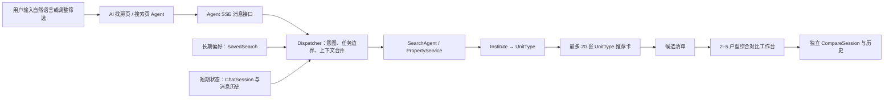

# AI 智能找房、候选清单与综合对比工作台修改报告

> 报告日期：2026-08-10
> 审查范围：当前工作区相对 `main` 的全部改动
> 当前分支：`feat/ai-search-comparison`
> 对比基线：`main` / `965e901d1f2aceca5de19d37922a07a5a08ed2bd`

## 一、报告结论

这次改动已经把 AI 找房的主要链路贯通：自然语言意图提取、结构化筛选、UnitType 户型推荐、候选清单、2–5 户型综合对比、Agent 多会话历史、短期上下文和显式长期偏好都已有可运行实现；推荐卡片上限也已统一为 20 张。

但当前版本还不适合在 PR 中写成“十项全部完成”。合并前至少要处理以下三项：

1. **删除新增的多维数值评分链路。** 当前只是前端隐藏分数，后端计算、响应协议、结果缓存、类型和测试仍完整保留。
2. **把综合对比的继续追问改成 SSE 流式。** 首次对比已经流式，追问仍是一次性 POST。
3. **收紧搜索条件同步的完成口径。** 当前能可靠同步的是普通 Building 搜索可表达的字段；卫浴、面积、租期、入住日期、性别、通勤分钟数和 POI 等还不能完整回填并驱动普通搜索。

另外，当前分支 `HEAD` 与 `main` 是同一个提交，所有改动都还在未提交工作区中。**如果现在直接基于分支创建 PR，这些工作区改动不会出现在 PR 里。**

当前分支还没有配置 upstream，名称 `main-ai-search-integration` 也不符合项目约定的 `feat/<功能简述>` 格式；提交 PR 前建议改为类似 `feat/ai-search-comparison` 的规范分支名。

## 二、改动规模与审查口径

| 项目 | 结果 |
|---|---:|
| 当前实际涉及文件 | 110 个 |
| 后端文件 | 41 个 |
| 前端文件 | 68 个 |
| 报告文件 | 1 个 |
| 已跟踪修改文件 | 83 个 |
| 新增、尚未跟踪文件 | 27 个（含本报告） |
| 已跟踪代码差异 | `+12,115 / -2,521` |
| 排除 `frontend/package-lock.json` 后 | `+9,217 / -2,405` |

说明：上述行数只统计 Git 已跟踪文件；27 个新增文件（包括本报告）尚未包含在 `git diff --stat` 的行数中。本报告创建前的业务改动为 109 个文件。

当前仓库中没有找到本次“综合对比工作台”的截图或设计源文件；现有 `.mcp/uhomes_screenshot.png` 与 `docs/uhomes-hero.png` 都是无关的首页参考图。因此本报告完成了代码、接口、数据链路和构建测试审查，但**没有宣称已经按截图完成视觉逐项比对**。建议在 PR 中补充第十四节列出的截图。

## 三、十项需求逐项验收

| # | 需求 | 当前状态 | 审查结论 |
|---:|---|---|---|
| 1 | 综合对比工作台 | ⚠️ 部分完成 | 已有复用工作台，支持 AI 页浮层和独立 `/compare` 页面、2–5 个 UnitType、综合/配置/图片三种视图、事实型优缺点和 AI 总结；首次分析流式。追问仍非流式，评分仍在后端运行。 |
| 2 | 添加房源到购物车 | ✅ 已实现 | 推荐卡、普通搜索卡、公寓详情、候选清单页和导航角标已接通；持久化实体统一为 `UnitType.id`。活跃主链路文案统一为“候选清单”。 |
| 3 | 推荐房源最多呈现 20 张 | ✅ 已实现 | 后端截断 20，前端再次去重并限制 20，真实总量通过 `recommendation_total` 单独保留，历史回放也遵守上限。 |
| 4 | 所有对话内容为流式 |  需要check一下
| AI 找房、搜索页 Agent、客服、悬浮助手代码路径和首次综合对比支持 SSE；综合对比追问仍同步，旧 `AgentView.vue`、`ChatView.vue` 也仍调用同步接口。 |
| 5 | 搜索页增加 AI 意图提取与筛选联动 | ⚠️ 核心完成、字段不完整，你需要查一下 | `filter_patch`、`cleared_filters`、任务边界、状态摘要与搜索刷新已接通；普通筛选栏只能回填其可表达字段。 |
| 6 | 独立会话、持久化、多维评分 | ⚠️ 主会话完成；评分待删除。这个你merge时候删掉吧 | Agent 会话列表、新建、切换和历史回放已实现；独立对比会话会在服务端持久化，但前端刷新不会恢复原对话。数值评分没有真正删除，必须在合并前跨前后端清理。会话删除、关闭、重命名尚未提供。 |
| 7 | 上下文、短期记忆、长期记忆、会话持久化 | ⚠️ 主要完成，这个你查一下，根据我的代码 | 短期状态、候选快照和最近消息持久化；长期偏好复用 `SavedSearch`，仅用户显式保存。检索会先读上下文；独立对比历史只用于补全追问关注点，并非完整历史都送进模型。 |
| 8 | 搜索条件同步并与数据库字段匹配 | ⚠️ 部分完成 | 国家、城市、区域、公寓、价格、户型、设施、学校附近搜索可落到现有结构；货币、通勤分钟、POI、租期语义等仍有缺口，详见第九节。 |
| 9 | 推荐理由更详细并统一到 UnitType | ✅ 已实现 | 推荐理由最多组合六项可核验事实；推荐、候选和对比 ID 全部以 UnitType 为准，所属公寓单独使用 `institute_id`。 |
| 10 | 前端 Agent UI 一致 | ⚠️ 部分完成，详见截图 | 活跃 AI 页与搜索页面板共用 `agentChat` store、`RecPropertyCard` 和同一 SSE 协议；消息元数据、输入行为和旧页面仍未完全统一。 |

## 四、总体功能链路

本次最重要的数据约束是：

- `UnitType.id`：具体可租户型，是推荐、候选清单、预订和对比的最小实体。
- `Institute.id`：公寓/楼栋实体，只用于所属公寓、地址、楼栋设施和详情路由。
- 兼容字段 `property_id`：在本次 Agent、候选和对比协议中实际表示 `UnitType.id`，不再表示旧 Property 或 Building。
- `institute_id`：始终单独表示所属公寓。

## 五、综合对比工作台

### 5.1 已实现能力

- 新增可复用 `frontend/src/components/compare/CompareWorkspace.vue`。
- 同一工作台支持两种承载方式：
  - AI 找房页中的大型浮层；
  - 登录后可访问的独立页面 `/compare?ids=1,2,...`。
- 只允许选择 2–5 个具体 UnitType，并可从候选清单增删。
- 支持三个页签：
  - 综合对比：租金、通勤、面积、最短租期、事实型优缺点、AI 总结；
  - 配置对比：支持“仅看差异”；
  - 图片对比：按具体户型分列展示图片。
- 不同币种时不会直接判定谁更便宜；只有币种完整且一致时才比较月租。
- 户型详情和首次 AI 总结并行加载，降低首字等待时间。
- 首次对比通过 `POST /compare/sessions/stream` 逐 token 展示，并持久化独立对比会话、消息和结果缓存。
- 追问会读取当前对比会话历史，用于理解“那这个呢”“更看重通勤”等省略表达。

### 5.2 当前缺口

1. **追问不是流式。** `frontend/src/stores/compare.ts` 的 `sendFollowup()` 调用普通 `POST /compare/sessions/{id}/messages`，等待完整响应后一次性替换正文。
2. **数值评分只是隐藏。** `CompareWorkspace.vue` 通过 `removeVisibleScores()` 正则清洗回答中的“得分/评分”，但网络响应、store、缓存和后端仍有 `scores`。
3. **对比会话管理不完整。** 当前可以创建和按 ID 获取，没有对比会话列表、删除或重命名。
4. **追问持久化不是原子事务。** 用户消息先提交，再运行分析；如果分析失败，可能留下没有 assistant 回复的孤立用户消息。
5. **上下文读取有限。** 历史只用于补全关注维度，没有把完整历史直接传给 CompareAgent 的模型提示。
6. **刷新不会恢复原对比会话。** 页面只根据 URL 中的 `ids` 重新创建分析，前端虽然有 `getSession()`，当前工作台没有使用会话 ID 恢复旧对话。

### 5.3 建议保留的产品方向

删除数值评分后，工作台仍可保留下列能力，不影响核心价值：

- 原始租金、面积、租期、库存、设施、评价条数、交通距离和安全资料；
- “同币种更低”“面积更大”“租期更灵活”等基于事实的标记；
- 用户关注点，如预算、通勤、空间、安全；
- 针对事实的优缺点和 AI 解释；
- 不同币种、缺字段时的明确“不比较”提示。

## 六、候选清单／购物车

### 6.1 已实现能力

- `frontend/src/stores/cart.ts` 成为全站候选清单的单一状态源。
- 支持获取、添加、删除，重复添加具有幂等语义。
- 登录态切换和退出登录时会清空本地 Agent/候选状态，避免不同账号串数据。
- 已接入以下入口：
  - AI 推荐卡 `RecPropertyCard.vue`；
  - 普通搜索 Building 卡 `PropertyCard.vue`；
  - 小型推荐卡 `MiniPropertyCard.vue`；
  - 公寓详情中的每个具体户型；
  - 候选清单页；
  - 顶部导航角标。
- Building 卡不会把 `Institute.id` 错当作候选 ID；只有后端明确返回 `representative_unit_type_id` 时才显示“+”。
- 候选清单页显示具体户型，选择 2–5 项后进入独立对比页。
- 从候选或推荐进入公寓详情时，路由携带 `unit_type_id`，页面会定位并高亮目标户型。

### 6.2 风险

- 后端添加候选时只验证 UnitType 存在且未删除，没有再次检查 `status`、`has_vacancy` 和 `available_count`；已下架或售罄户型仍可能被加购。
- 当前购物车本质是“用户级唯一候选清单”，不是“每个 Agent 会话一个清单”。创建新 Agent 会话会把同一购物车的 `session_id` 改绑到最新会话。如果产品要求每个会话完全隔离，需要重新定义语义。
- `agent_carts.user_id` 没有唯一约束，并发首次创建理论上可能产生多份购物车。
- Building 卡的代表户型符合当前筛选，但展示的 `min_rent` 仍取该公寓全部可租户型的最低租金。设置价格下限后，页面可能显示一个低于筛选条件的起价，而“+”实际加入另一套符合筛选、价格更高的 UnitType。

## 七、推荐数量、顺序与理由

### 7.1 20 张上限

- 后端常量：`MAX_RECOMMENDATION_CARDS = 20`。
- 后端返回：
  - `recommendations`：最多 20 张；
  - `top_picks`：最多 3 张；
  - `recommendation_total`：未截断真实总数。
- 前端 `agentRecommendations.ts` 会按 UnitType ID 等规则去重，并再次限制为 20。
- 会话历史恢复时同样执行去重和 20 张限制。
- 已有 25 条候选只返回 20 张卡片、但保留真实总数的回归测试。

### 7.2 推荐理由

卡片理由由真实字段确定性拼接，最多保留六项差异化事实：

- 所在区域或城市；
- 同币种条件下是否落在预算范围；
- 规范户型、面积和卫浴数；
- 用户要求且实际存在的设施；
- 学校通勤信息，并对静态查表结果标注“估算”；
- 优惠、可租库存和起租月数。

跨币种时不会写“月租在预算内”，避免用不可比金额制造错误理由。推荐卡同时展示公寓名与具体户型名，候选和对比始终使用 `UnitType.id`。

### 7.3 排序与引用风险

- 搜索流程虽然计算了 embedding 相似度，但当前没有用该相似度重新排序；`PropertyService` 返回顺序仍主要是月租升序。因此 PR 中不宜声称“已按语义相关度完成排序”。
- 页面只展示 20 张，但会话 `_candidate_ids` 目前可能保存多达 500 个候选。理论上后续“第 25 个”可能引用一个用户从未看到的户型。建议候选引用白名单与可见 20 张保持一致。

## 八、流式对话审查

本报告把“走 SSE 协议”和“模型逐 token 产生内容”分开判断：规则回复或离线降级可能通过 SSE 一次发送一个完整正文帧，协议上是流式连接，但体验上不是逐 token。

| 对话入口 | 前端状态 | 后端状态 | 结论 |
|---|---|---|---|
| `/ai-search` 主 Agent | 调用 `sendMessageStream` | `/agent/sessions/{id}/messages/stream` | ✅ SSE，模型路径逐 token |
| 搜索页 Agent 面板 | 调用 `sendMessageStream` | 同上 | ✅ SSE，模型路径逐 token |
| `AssistantBubble.vue` 悬浮助手 | 已改为 `sendMessageStream` | 同上 | ⚠️ 代码支持 SSE，但当前路由树中没有挂载该组件 |
| `SmartRentView.vue` | 使用流式接口 | 同上 | ⚠️ 文件未挂当前路由 |
| 客服 `CustomerService.vue` | 读取响应流 | `/chat/.../messages` | ✅ SSE |
| 综合对比首次分析 | `createSessionStream` | `/compare/sessions/stream` | ✅ SSE，模型路径逐 token |
| 综合对比继续追问 | `sendMessage` 普通 POST | `/compare/sessions/{id}/messages` | ⛔ 非流式 |
| 旧 `AgentView.vue` | `agentService.sendMessage` | Agent 同步消息接口 | ⛔ 非流式，且当前未挂路由 |
| 旧 `ChatView.vue` | `agentService.sendMessage` | Agent 同步消息接口 | ⛔ 非流式，且当前未挂路由 |

后端还保留以下同步入口：

- `POST /agent/sessions/{id}/messages`；
- `POST /compare/sessions`；
- `POST /compare/sessions/{id}/messages`。

如果验收口径是“所有用户可见聊天入口走 SSE”，最低修复范围是：

1. 新增 `/compare/sessions/{id}/messages/stream`；
2. 前端追问在现有气泡中逐 token 追加；
3. 删除、迁移或明确废弃 `AgentView.vue`、`ChatView.vue`；
4. 停止活跃 UI 调用同步 Agent/Compare 消息接口；
5. 为搜索、FAQ、闲聊、加购、首次对比和追问分别补 SSE 顺序与断线测试。

## 九、AI 意图、筛选联动与数据库字段核对

### 9.1 同步协议

本次把“未提供”和“明确清除”拆成了两个概念：

- `filters`：本轮新增或覆盖的条件；
- `context_filters`：搜索页当前已有条件；
- `clear_fields`：唯一合法的显式清除通道；
- `filter_patch`：服务端确认可回填的新增/更新；
- `cleared_filters`：服务端确认需要从会话和筛选栏移除的字段；
- `task_boundary`：判断本轮是继续任务、新任务还是需要澄清。

这套协议解决了“字段为 null 到底是没传还是要删除”的歧义，也支持 `NUS → UCL` 等跨市场新任务清理旧国家、城市、学校和候选状态。

### 9.2 字段矩阵

| Agent 字段 | 数据库/服务落点 | Agent 检索 | 普通搜索栏回填 | Building 搜索接口 | 结论 |
|---|---|---:|---:|---:|---|
| `country` | `Institute.country` | ✅ | ✅ | ✅ | 对齐 |
| `city` | `Institute.city` | ✅ | ✅ | ✅ | 对齐 |
| `district` | `Institute.district` | ✅ | ✅ | ✅ | 对齐 |
| `institute_id` | `UnitType.institute_id` / `Institute.id` | ✅ | ✅ 程序化 | ✅ | 对齐 |
| `price_min/max` | `UnitType.base_rent` | ✅ | ✅ | ✅ | 对齐 |
| `bedrooms` | `UnitType.bedrooms` | ✅ | ⚠️ 映射成户型 | ❌ 无独立字段 | 部分对齐 |
| `bathrooms` | `UnitType.bathrooms >=` | ✅ | ❌ | ❌ | Agent 可执行，普通页不可回填 |
| `property_type` | `UnitType.property_type` | ✅ | ✅ | ✅ | 基本对齐；缺严格枚举校验 |
| `room_type` | 同 `property_type` | ✅ | ✅ 映射 | ⚠️ 映射后执行 | 协议别名 |
| `amenities` | Institute 与 UnitType 设施并集 | ✅ | ✅ | ✅ | 对齐；使用 Python 后置过滤 |
| `area_min/max` | `UnitType.area_sqm` | ✅ | ❌ | ❌ | 仅 Agent 可执行 |
| `available_from` | `UnitType.available_from` | ✅ | ❌ | ❌ | 非法字符串会静默忽略 |
| `min/max_lease_months` | `UnitType.min_stay_months` | ⚠️ | ❌ | ❌ | 两个语义折叠为一个上限条件 |
| `female_only` | `Institute.female_only` | ✅ | ❌ | ❌ | 仅 Agent 可执行 |
| `institution` | `University` 坐标 → 附近 Institute | ⚠️ | ✅ 学校模式 | ⚠️ 经纬度半径 | 使用矩形预筛，不是严格门到门通勤 |
| `currency` | `UnitType.currency` | ❌ SQL 未过滤 | ❌ 由国家推导 | ❌ | 仅用于换算/文案，可能混入其他币种 |
| `commute_mode` | 无直接列 | ⚠️ 只调整预筛半径 | ⚠️ | ❌ | 不是实际通勤过滤 |
| `commute_minutes` | 可关联 `InstituteCommute` | ❌ | ⚠️ 近似折算半径 | ❌ | 当前没有按分钟过滤 |
| `poi_requirements` | POI 数据 | ❌ | ❌ | ❌ | 只存在于协议和状态 |

户型枚举的权威值是：

`studio`、`ensuite`、`1bed`、`2bed`、`3bed`、`4bed`、`5bed+`、`shared`。

需要修正的契约细节：后端 schema 注释仍提到 `3bed+`，但数据库没有这个值；前端已经按 `3bed`、`4bed`、`5bed+` 对齐。

### 9.3 已发现的同步缺口

1. **Agent 面板关闭期间的单项清除可能丢失。** 搜索页用 `v-if` 销毁面板；重开后面板只看到已经清空的当前值，无法推导“之前有值、现在无值”。目前只有“一键清空”会把字段放进 `pendingAgentClearedFilters`。
2. **普通搜索只能执行较小字段子集。** 即使 Agent 提取出卫浴、面积、租期、入住日期、性别或 POI，左侧控件和 `/buildings/public/search` 也不会执行这些条件。
3. **通勤分钟数不是硬筛选。** 前端把分钟数粗略换成 1–20km 半径；后端 Agent 仅解析该值，没有按 `InstituteCommute` 过滤。
4. **货币没有进入 SQL。** 价格条件可能在目标币种换算后执行，但查询没有同时约束 `UnitType.currency`。
5. **URL `bedrooms` 条件没有进入普通搜索请求。** 页面能够读入该参数，但 `doSearch()` 和当前 Building 请求序列化没有发送它。
6. **设施选项来自前端硬编码。** 数据库设施字段是自由数组，当前控件不保证覆盖已有全部真实值。

合并前应二选一：

- 补齐普通搜索栏、Building API 和 Agent 查询的字段能力；或
- 明确本次 PR 的“可同步字段白名单”，不要对外承诺所有 Agent 字段都能回填。

## 十、会话、上下文与记忆

### 10.1 Agent 独立会话

已实现：

- 创建 Agent 会话；
- Agent 会话列表和总数；
- 按用户隔离；
- 历史消息回放；
- 新建、切换会话；
- assistant 消息的推荐、来源、筛选摘要等 metadata 持久化；
- 与普通客服会话隔离。

当前隔离方式是固定标题 `AGENT_SESSION_TITLE = "租房推荐 Agent"`，数据库没有正式 `session_kind` 字段。这能工作，但属于数据模型技术债。

尚未实现：

- 删除 Agent 会话；
- 关闭/归档 Agent 会话；
- 重命名会话；

前端历史回放每次只读取 100 条，虽然 API 支持 `before_id` 和 `has_more`，store 没有继续翻页；长会话可能只显示最近 100 条。

### 10.2 短期记忆

每轮会读取并更新：

- `ChatSession.accumulated_filters`；
- 当前任务 ID；
- 候选和对比 ID 快照；
- 最近 10 条持久化消息；
- 分类时使用其中最近 6 条；
- 本轮任务边界、状态摘要和清除记录。

检索前的覆盖顺序是：

1. 用户显式保存的长期偏好；
2. 当前会话短期状态；
3. 搜索页 `context_filters`；
4. 本轮显式 `filters`；
5. 任务锚点；
6. 本轮自然语言提取结果。

越靠后的信息优先级越高，因此本轮用户明确修改可以覆盖历史偏好。

### 10.3 长期记忆

长期偏好复用现有 `saved_searches` 表，通过以下接口管理：

- `GET /agent/memory`；
- `PUT /agent/memory`；
- `DELETE /agent/memory`。

这是**显式长期记忆**：只有用户在前端点击保存后才写入，普通聊天不会自动把一次性条件沉淀为长期偏好。当前没有自动摘要、向量化长期记忆、过期策略或自动遗忘机制。

### 10.4 检索和对比如何读取上下文

- 搜索：先合并长期、短期、页面和本轮条件，再执行 UnitType 查询。
- 候选详情追问：从当前任务候选白名单解析“第一套”“刚才那个”。
- 自然语言加购：从当前候选快照解析序号后写入候选清单。
- 内嵌对比：复用当前任务候选/手选对比 ID。
- 独立对比追问：读取 CompareMessage 历史，但目前主要用于继承上一次关注点。

## 十一、数据结构、兼容层与迁移

### 11.1 Institute → UnitType 两层结构

后端 `PropertySearchResult` 和前端 `Property` 类型都扩充为 UnitType 权威字段，并保留旧 Property 展示字段作为兼容层：

- `id` / `unit_type_id`：UnitType ID；
- `name` / `base_rent`：权威户型名与月租；
- `title` / `price_monthly`：旧组件兼容字段；
- `institute_id` / `institute_name` / `institute_address`：所属公寓信息；
- `image_urls` 与旧 `images` 同时支持。

预订、合同、支付和管理页面也把旧 `property_id` / `landlord_id` 展示逐步改为 `unit_type_id` / `institute_id` / `bm_id`。

### 11.2 EmbeddingJob 外键迁移

新增 Alembic 迁移 `20260809_0036_embedding_jobs_unit_type_fk.py`：

- 保留列名 `embedding_jobs.property_id` 以兼容任务/API；
- 将新外键目标改为 `unit_types.id`；
- PostgreSQL 使用 `NOT VALID`，保留历史审计行，不阻断部署；
- 旧 `properties` 表不会在 downgrade 中重建；
- 当前 Alembic 只有一个 head：`20260809_0036`。

注意：`NOT VALID` 表示历史行可能暂时不满足新约束，后续仍需要清理/重建 embedding job 并显式验证约束。

额外迁移风险：当前迁移直接调用 `op.create_foreign_key()`，没有使用 SQLite batch mode；如果某个 SQLite 环境真实存在这些表，普通 `ADD CONSTRAINT` 可能不受支持。另有 `agent_cart_items` 模型唯一约束名与历史迁移约束名不一致的问题，后续 Alembic autogenerate 可能产生无意义漂移。

### 11.3 Embedding 任务

- 从旧 Property 改为读取 UnitType 及所属 Institute。
- 仅发送去标识化户型特征到外部向量服务：卧室、卫浴、户型类型和国家级位置。
- 不发送名称、描述、区域或精确地址。
- 全量重建改为扫描 `UnitType.embedding IS NULL`。

### 11.4 SQLite 测试兼容

为使测试数据库和 PostgreSQL 行为更接近，本次给多处 JSONB/ARRAY 字段增加 SQLite JSON variant，并把 Tenant 时间默认值改为 `CURRENT_TIMESTAMP`。涉及 Booking、Contract、Notification、Payment、UnitType 和 University 模型。

### 11.5 代码规范问题

新迁移和 `backend/app/models/embedding_job.py` 仍含英文文档字符串/注释，不符合项目“注释和文档必须使用中文”的约定，合并前应改为中文。

此外，少数后端文件顶部说明仍写“三层架构”，与当前 `Institute → UnitType` 两层权威结构不一致，应顺手更新，避免 reviewer 继续按旧 Property/Room 模型理解代码。

## 十二、多维评分移除清单

用户已经明确表示这块不应保留。当前状态不是“已删除”，而是“后端仍计算、前端尽量不显示”。合并前应按下面边界一次性处理。

### 12.1 后端

- `backend/app/services/compare_scoring.py`
  - 删除权重、维度分、`PropertyMetrics` 和 `compute_scores()`；
  - 将币种可比、距离解析、最近交通站、通勤格式化等纯事实工具迁到独立工具文件。
- `backend/app/services/agentic/agents/compare_agent.py`
  - 删除 `score`、`score_breakdown`、按总分选 winner 和数值评分提示；
  - 改为基于原始字段输出事实与取舍。
- `backend/app/services/comparison_service.py`
  - 删除 `scores` 组装与返回；
  - “重新计算权重”文案改为“按当前关注点整理”。
- `backend/app/services/comparison_data.py`
  - 与 `PropertyMetrics` 解耦；保留租金、面积、交通、评价和安全等事实数据；
  - 当前运行时没有调用方，应决定删除重复实现，或让对比主链路真正复用它。
- `backend/app/schemas/agent.py`
  - 删除 `CompareItem.score` 和 `score_breakdown`。
- `backend/app/schemas/compare.py`
  - 删除 `CompareMessageResponse.scores`。
- `backend/app/api/v1/routes/agent.py`、`backend/app/api/v1/routes/compare.py`
  - 删除响应映射和三个 `result_cache["scores"]` 写入点。
- `backend/app/services/agentic/shared.py`
  - 删除仅依赖 scores、且当前运行时无调用的维度分析死代码。
- 测试
  - 删除数值分断言；改测同币种比较、缺字段降级、原始事实、关注点回答和响应中不再出现 score 字段。

### 12.2 前端

- `frontend/src/types/compare.ts`
  - 删除 `CompareResultCache.scores`、`CompareMessageResponse.scores` 和 `DimensionScores`。
- `frontend/src/stores/compare.ts`
  - 删除 `scores`、`dimensionKeys` 及相关赋值/reset。
- `frontend/src/types/agent.ts`
  - 删除旧 `CompareItem.score` / `score_breakdown` 兼容字段。
- `frontend/src/components/compare/CompareWorkspace.vue`
  - 删除 `removeVisibleScores()`；后端应直接返回无评分的事实文本，不能依赖正则兜底。
- `frontend/src/services/__tests__/compare.test.ts`
  - 更新最终结果契约，不再构造 `scores`。

### 12.3 数据库与历史兼容

- 数值评分只保存在 JSON `result_cache`，没有独立数据库列；删除评分本身不需要新迁移。
- `CompareSession.priority` 可以保留为“用户关注点”，不再代表权重。
- 历史缓存可能仍带 `scores`；新前端应忽略未知旧字段，避免历史会话读取失败。
- 不要误删安全原始数据、评价或语义相关度。要删除的是“把多维事实压成一个加权总分”的新增逻辑。

## 十三、Agent UI 一致性

### 13.1 已统一部分

- `/ai-search` 和搜索页 Agent 共用：
  - `agentChat` Pinia store；
  - Agent 会话及历史；
  - SSE 消息协议；
  - `RecPropertyCard`；
  - 推荐数量去重/20 张上限；
  - UnitType 详情路由；
  - 候选清单；
  - 任务边界和筛选清除协议。
- AI 页浮层与独立页共用 `CompareWorkspace`。
- 图片 URL 统一兼容完整 URL、协议相对 URL、`data:`、`blob:`、绝对路径和上传文件名。

### 13.2 未统一部分

- AI 独立页会展示查询改写、数据来源、降级提示等信息，搜索页面板没有完整呈现同一组 metadata。
- 两个页面仍各自实现一套消息气泡、欢迎态、输入和快捷项 UI。
- 搜索面板、AI 独立页和全局品牌色仍不是同一套视觉 token：前两者以不同蓝色为主，全局主题主色是橙色。
- 输入长度限制不一致，搜索面板 Enter 发送缺少中文输入法 `isComposing` 防护。
- `AssistantBubble.vue` 已迁移到共享 store/SSE，但当前没有挂在路由布局中。
- `AgentView.vue`、`ChatView.vue`、`SmartRentView.vue` 仍保留旧 UI；前两者还有同步消息路径，三者当前都未挂路由。
- 旧页面仍出现“购物车”“加入对比”等与“候选清单/综合对比”不一致的文案。

建议以 `/ai-search` 和 `SearchAgentPanel.vue` 为唯一活跃设计基线，删除孤儿页面或迁移为薄壳，避免后续出现四套 Agent UI。

## 十四、建议补充到 PR 的截图

由于当前仓库没有本次截图，建议 PR 至少放入：

1. AI 找房页：20 张推荐卡区域、候选勾选和“打开综合对比”入口；
2. AI 页综合对比浮层：综合对比页签；
3. 独立 `/compare` 页面：配置对比“仅看差异”和图片对比；
4. 搜索页：AI 条件同步横幅、左侧回填条件和右侧 Agent 面板；
5. 公寓详情：目标 UnitType 高亮与“加入候选清单”；
6. 候选清单：2–5 项选择后进入对比；
7. 320px、768px、1440px 三种宽度的视觉回归。

截图旁应标注使用的 UnitType ID、所属 Institute 和筛选条件，方便 reviewer 判断是否发生实体混用。

## 十五、API 变化摘要

### 15.1 Agent

| 方法 | 路径 | 用途 |
|---|---|---|
| `GET` | `/agent/sessions` | 获取当前用户 Agent 会话列表 |
| `POST` | `/agent/sessions` | 创建 Agent 会话并关联用户候选清单 |
| `GET` | `/agent/sessions/{id}/messages` | 分页读取会话历史 |
| `POST` | `/agent/sessions/{id}/messages` | 同步消息兼容入口 |
| `POST` | `/agent/sessions/{id}/messages/stream` | Agent SSE：状态、token、最终 metadata、`[DONE]` |
| `GET/PUT/DELETE` | `/agent/memory` | 读取、保存、清除显式长期偏好 |
| `GET` | `/agent/cart` | 获取候选清单 |
| `POST` | `/agent/cart/items` | 以 UnitType ID 添加候选 |
| `DELETE` | `/agent/cart/items/{property_id}` | 移除候选 |
| `POST` | `/agent/cart/compare` | 对候选执行内嵌对比 |

### 15.2 独立综合对比

| 方法 | 路径 | 用途 |
|---|---|---|
| `POST` | `/compare/sessions` | 同步创建并分析，兼容入口 |
| `POST` | `/compare/sessions/stream` | 流式创建、分析并持久化 |
| `GET` | `/compare/sessions/{id}` | 获取对比会话及历史 |
| `POST` | `/compare/sessions/{id}/messages` | 非流式追问，当前主要缺口 |

### 15.3 Building 搜索

`GET /buildings/public/search` 新增/完善：`country`、`city`、`institute_id`、`price_min`、`price_max`、`property_type`、重复 `amenities` 参数、半径搜索、排序和分页。价格、户型和真实库存通过同一个 UnitType `EXISTS` 约束，避免不同户型分别满足不同条件。

## 十六、验证结果

### 16.1 已通过

| 验证项 | 结果 |
|---|---|
| 前端单元/组件测试 | 18 个文件，90 项全部通过 |
| 前端类型检查与生产构建 | 通过 |
| 后端本次相关定向测试 | 171 项全部通过，3 条非阻塞 warning |
| Python 编译检查 | 通过 |
| Alembic head | `20260809_0036`，唯一 head |
| `git diff --check` | 通过 |

后端定向测试覆盖 Agent、FAQ、客服、对比、任务边界、Building 筛选、embedding 任务、推荐理由和搜索任务边界。

### 16.2 警告与未通过项

- 前端主包压缩前约 1.31 MB，Vite 给出大于 500 kB 的 chunk 警告；不阻断构建，但建议后续拆分。
- 后端 warning 包括 `python_multipart` 的待弃用提示和 `datetime.utcnow()` 的弃用提示。
- 后端直接运行全量 `pytest -q` 在测试收集阶段失败：`ValueError: I/O operation on closed file`。
  - 不是业务断言失败；
  - 直接原因是 `pytest.ini` 没有限定 `testpaths`，会收集 `backend/scripts/test_notification_scenarios.py`；
  - 该脚本在 import 时替换 `sys.stdout = io.TextIOWrapper(...)`，关闭了 pytest 捕获流；
  - 该脚本不是本次改动，但在修复 test discovery 前不能宣称“后端全量测试通过”。
- 本次多数数据库测试使用 SQLite；迁移、PostgreSQL ARRAY/JSON 和 `NOT VALID` 外键仍应在真实 PostgreSQL 环境验证。

## 十七、合并前问题清单

### P0：必须处理

- [ ] 把综合对比追问改成 SSE 流式，并补逐 token、断线和持久化测试。
- [ ] 按第十二节真正删除多维数值评分，而不是仅前端隐藏。
- [ ] 明确可同步筛选字段白名单，或补齐普通搜索栏、Building API 与 Agent 查询能力。
- [ ] 修复 Agent 面板关闭期间单项清除无法形成 `clear_fields` 的问题。
- [ ] 将 27 个新增文件（含本报告）和 83 个修改文件纳入正确提交；当前分支提交本身与 `main` 完全相同。
- [ ] 使用符合 `feat/...` 规范的分支名并配置 upstream；当前分支尚无 upstream。

### P1：建议在本 PR 处理

- [ ] 修正 Building 卡 `min_rent` 与“+”实际加入代表 UnitType 的价格不一致。
- [ ] 候选添加时校验可租状态、空置标记和库存。
- [ ] 把可引用候选白名单限制到用户实际看到的 20 张。
- [ ] 明确推荐排序是价格顺序还是语义相关度；若要语义排序，实际应用 embedding score。
- [ ] 删除或迁移未挂路由的旧 Agent 页面，统一元数据、文案和输入行为。
- [ ] 把新迁移和 embedding 模型中的英文注释改为中文。
- [ ] 给独立对比的消息写入与结果缓存增加事务边界，避免失败时半条历史。
- [ ] 如果要宣称“对比会话可持久恢复”，在路由中携带会话 ID，并让工作台调用 `getSession()` 恢复原历史。
- [ ] 补 Agent 历史翻页或明确只展示最近 100 条。
- [ ] 在 PostgreSQL 上执行迁移、设施 ARRAY/JSON 过滤和回滚验证。

### P2：后续优化

- [ ] 给 Agent 会话提供重命名、关闭/归档和删除。
- [ ] 给对比会话提供列表和删除。
- [ ] 用正式 `session_kind` 替代固定标题隔离 Agent/客服会话。
- [ ] 给 `agent_carts.user_id` 增加符合产品语义的唯一约束。
- [ ] 拆分前端主 chunk。
- [ ] 修复 pytest 全量收集范围。

## 十八、建议 reviewer 审查顺序

1. **先确认实体语义**：所有推荐、候选、预订、对比是否都以 `UnitType.id` 为准，详情是否用 `Institute.id + unit_type_id query`。
2. **再看搜索正确性**：意图提取 → 上下文合并 → SQL 字段 → 普通筛选回填是否一致。
3. **检查候选清单**：各入口增删、登录隔离、Building 代表户型和库存状态。
4. **检查综合对比**：2–5 限制、三页签、不同币种、缺字段、首次流式和追问。
5. **检查会话/记忆**：多会话切换、历史恢复、短期任务边界、长期偏好显式保存与清除。
6. **最后检查外围兼容**：预订/合同字段、旧路由、图片地址、SQLite 兼容和 embedding 迁移。

## 十九、建议手工验收场景

- [ ] 输入“UCL 附近、预算 1800 英镑、Ensuite、独卫”，核对 Agent 摘要、左侧筛选、Building 请求和 UnitType 推荐。
- [ ] 将搜索 Agent 面板关闭，逐个清除城市、学校和预算，再打开继续问，确认 `clear_fields` 发送正确。
- [ ] 从 `NUS` 切换到 `UCL`，确认旧国家、城市、学校、候选和对比引用被清理。
- [ ] 准备 25 个以上匹配户型，确认页面只显示 20 张，真实总数正确，刷新历史后仍一致。
- [ ] 设置最低预算，确认 Building 卡显示价格与“+”加入的代表 UnitType 一致。
- [ ] 在首页、搜索页、公寓详情、AI 页和候选页交叉增删，核对角标和账号切换。
- [ ] 测试 SSE 任意分块、CRLF、中途断线、重复发送、切换会话和关闭面板。
- [ ] 验证首次综合对比和继续追问都出现首 token 并逐步更新。
- [ ] 对比 2–5 个 UnitType，并覆盖缺图片、缺面积、缺通勤和不同币种。
- [ ] 删除评分后检查 API、缓存、历史和页面均不再出现 `score`、`scores`、`score_breakdown`。

## 二十、全部变更文件附录

以下清单覆盖当前工作区的 110 个实际文件，其中 109 个是业务/测试改动，1 个是本报告。

### 20.1 后端：路由、模型、Schema 与服务（32 个）

- `backend/alembic/versions/20260809_0036_embedding_jobs_unit_type_fk.py` — 新增 EmbeddingJob → UnitType 外键迁移。
- `backend/app/api/v1/router.py` — 注册 `/compare` 路由。
- `backend/app/api/v1/routes/agent.py` — 会话列表/历史、记忆、SSE、候选和 UnitType 响应适配。
- `backend/app/api/v1/routes/buildings.py` — Building 搜索联合筛选、代表 UnitType 与分页排序。
- `backend/app/api/v1/routes/chat.py` — 普通客服与 Agent 会话隔离。
- `backend/app/api/v1/routes/compare.py` — 独立对比 REST、首次 SSE、历史追问和缓存。
- `backend/app/models/booking.py` — JSONB 的 SQLite JSON 兼容。
- `backend/app/models/chat.py` — Agent 会话标题常量和隔离说明。
- `backend/app/models/contract.py` — JSONB 的 SQLite JSON 兼容。
- `backend/app/models/embedding_job.py` — 外键目标改为 UnitType。
- `backend/app/models/notification.py` — JSONB 的 SQLite JSON 兼容。
- `backend/app/models/payment.py` — JSONB 的 SQLite JSON 兼容。
- `backend/app/models/tenant.py` — 时间默认值改为跨数据库的 `CURRENT_TIMESTAMP`。
- `backend/app/models/unit_type.py` — ARRAY/JSONB 增加 SQLite JSON variant。
- `backend/app/models/university.py` — aliases ARRAY 增加 SQLite JSON variant。
- `backend/app/schemas/agent.py` — 筛选、任务边界、记忆、推荐总数、UnitType 候选与对比协议。
- `backend/app/schemas/compare.py` — 独立对比会话和消息协议。
- `backend/app/schemas/property.py` — UnitType 卡片 schema 与旧 Property 兼容字段。
- `backend/app/services/agent_memory.py` — 新增显式长期偏好服务。
- `backend/app/services/agentic/agents/cart_agent.py` — UnitType 候选增删与幂等处理。
- `backend/app/services/agentic/agents/compare_agent.py` — 2–5 户型对比、流式总结与当前待删评分。
- `backend/app/services/agentic/agents/search_agent.py` — 意图筛选、UnitType 检索、理由、20 张上限、embedding 和流式回复。
- `backend/app/services/agentic/dispatcher.py` — 上下文合并、任务边界、候选引用、持久化和 SSE 编排。
- `backend/app/services/agentic/router.py` — 意图路由上下文调整。
- `backend/app/services/agentic/shared.py` — 对比说明与评分相关共享逻辑。
- `backend/app/services/compare_scoring.py` — 当前待删除的确定性多维评分及事实工具。
- `backend/app/services/comparison_data.py` — UnitType/Institute/POI/评价/安全事实聚合。
- `backend/app/services/comparison_service.py` — 独立对比分析、追问关注点和结果组装。
- `backend/app/services/comparison_session_service.py` — 对比会话历史、优先级和缓存管理。
- `backend/app/services/property_service.py` — UnitType 真实库存与结构化字段筛选。
- `backend/app/services/search_task_boundary.py` — 新增继续/新任务/澄清的确定性判断。
- `backend/app/tasks/embedding_tasks.py` — UnitType embedding 生成、去标识化和全量重建。

### 20.2 后端测试（9 个）

- `backend/tests/test_agent.py` — 会话、SSE、20 张、记忆、候选、对比、UnitType 语义等集成覆盖。
- `backend/tests/test_agent_faq.py` — FAQ 匹配和流式回复覆盖。
- `backend/tests/test_agent_task_boundary.py` — 新增 Agent 层任务边界与副作用隔离测试。
- `backend/tests/test_building_search_filters.py` — 新增联合筛选、代表户型、分页和排序测试。
- `backend/tests/test_chat.py` — 客服/Agent 会话隔离覆盖。
- `backend/tests/test_compare_scoring.py` — 当前多维评分、跨币种、缺字段和流式对比测试；评分移除后需重写。
- `backend/tests/test_embedding_tasks.py` — 新增 UnitType embedding 去标识化测试。
- `backend/tests/test_search_recommendation_reason.py` — 新增详细理由与跨币种保护测试。
- `backend/tests/test_search_task_boundary.py` — 新增任务切换、否定、撤回、模糊引用和多语言规则测试。

### 20.3 前端：核心 Agent、搜索、候选与对比（29 个）

- `frontend/src/components/AssistantBubble.vue` — 共享会话 store、SSE、记忆上下文和 UnitType 详情。
- `frontend/src/components/MiniPropertyCard.vue` — UnitType 候选能力和详情路由。
- `frontend/src/components/PropertyCard.vue` — Building/UnitType 实体区分、代表户型候选按钮和价格展示。
- `frontend/src/components/RecPropertyCard.vue` — 新增统一 AI 推荐卡。
- `frontend/src/components/compare/CompareWorkspace.vue` — 新增综合对比工作台。
- `frontend/src/components/search/SearchAgentPanel.vue` — 新增搜索页 Agent 面板和筛选联动。
- `frontend/src/layouts/DefaultLayout.vue` — 搜索建议字段兼容和候选角标/用户状态配套。
- `frontend/src/router/index.ts` — `/compare`、AI 登录要求和旧路由 query 保留。
- `frontend/src/services/agent.ts` — 会话、历史、记忆、SSE 和候选 API。
- `frontend/src/services/compare.ts` — 新增独立对比 API 与 SSE 解析。
- `frontend/src/services/property.ts` — Building 搜索参数、UnitType 详情和查询序列化。
- `frontend/src/services/university.ts` — 新增学校搜索服务。
- `frontend/src/stores/agentChat.ts` — 多会话、历史、长期偏好和异步竞态隔离。
- `frontend/src/stores/auth.ts` — 退出登录时清理 Agent 与候选用户态。
- `frontend/src/stores/cart.ts` — 全站候选清单单一状态源。
- `frontend/src/stores/compare.ts` — 首次流式对比和当前非流式追问状态。
- `frontend/src/stores/property.ts` — 移除把 Agent UnitType 推荐注入 Building 搜索结果的旧入口。
- `frontend/src/types/agent.ts` — Agent 会话、筛选、任务、SSE、推荐和候选类型。
- `frontend/src/types/property.ts` — UnitType 权威字段、Institute 字段及旧 Property 兼容类型。
- `frontend/src/utils/agentFilterSync.ts` — 新增筛选压缩、清除差异和快照合并工具。
- `frontend/src/utils/agentRecommendations.ts` — 新增推荐去重和 20 张限制工具。
- `frontend/src/utils/image.ts` — 图片 URL 兼容。
- `frontend/src/views/AgentView.vue` — 旧页面筛选清除兼容；仍非流式。
- `frontend/src/views/AiSearch.vue` — AI 主页面、多会话、记忆、20 张推荐、候选和对比浮层。
- `frontend/src/views/CartView.vue` — 候选清单重构为具体户型并支持 2–5 项对比。
- `frontend/src/views/ChatView.vue` — 旧页面户型类型兼容；仍非流式。
- `frontend/src/views/CompareView.vue` — 独立对比页薄壳。
- `frontend/src/views/Search.vue` — AI 意图/筛选联动、Building 搜索、学校/半径和 Agent dock。
- `frontend/src/views/SmartRentView.vue` — 旧页面户型类型兼容。

### 20.4 前端：实体迁移、预订与外围类型修正（23 个）

- `frontend/src/components/RoomTypeCard.vue` — 可空户型类型的类型安全修正。
- `frontend/src/components/SmartSearch.vue` — 搜索建议增加所属公寓 ID。
- `frontend/src/main.ts` — 引入预订控件样式并修复全局错误处理参数。
- `frontend/src/services/auth.ts` — 补齐忘记/重置密码 API。
- `frontend/src/types/auth.ts` — 补齐密码重置类型。
- `frontend/src/types/booking.ts` — `application_data` 从 `any` 收紧为结构化对象。
- `frontend/src/views/BookingFlow.vue` — 预订提交改用 `unit_type_id` 和 `institute_id`。
- `frontend/src/views/BuildingDetail.vue` — 户型候选、目标定位、路由变化和地图清理。
- `frontend/src/views/BuildingRedirect.vue` — 旧 `/room/:id` 优先按 UnitType 解析，避免碰号误跳。
- `frontend/src/views/BuildingStaff.vue` — 员工类型安全。
- `frontend/src/views/ContractView.vue` — 合同展示改为 UnitType 与运营方语义。
- `frontend/src/views/Home.vue` — 首页 AI 搜索入口配套调整。
- `frontend/src/views/LandlordBookings.vue` — 展示 `unit_type_id`。
- `frontend/src/views/PendingPayment.vue` — 支付详情改用 UnitType/Institute 语义。
- `frontend/src/views/Profile.vue` — 报修房源改用可用 `unit_type_id`。
- `frontend/src/views/PropertyHistory.vue` — 审计回滚 ID 类型收紧。
- `frontend/src/views/admin/AdminProperties.vue` — 可空区域和类型兼容。
- `frontend/src/views/admin/AdminWorkspace.vue` — 管理员资料不再伪造未返回字段。
- `frontend/src/views/booking/ContractPlaceholder.vue` — 订单与户型一致性校验。
- `frontend/src/views/booking/MoveInDate.vue` — 首次日历月份按房源所在地日期初始化。
- `frontend/src/styles/booking-form-controls.css` — 新增预订表单控件统一样式。
- `frontend/tsconfig.json` — 构建类型检查排除测试文件。
- `frontend/vitest.config.ts` — jsdom、CSS 与 setup 配置。

### 20.5 前端依赖与测试（16 个）

- `frontend/package.json` — 增加 Vitest、Vue Test Utils、jsdom 和覆盖率依赖。
- `frontend/package-lock.json` — 同步测试依赖锁文件。
- `frontend/vitest.setup.ts` — 新增统一测试环境补丁。
- `frontend/src/__tests__/PropertyCard.test.ts` — Building/UnitType 路由和候选 ID 回归测试。
- `frontend/src/__tests__/stores/auth.test.ts` — 退出登录清理用户级 Agent/候选状态测试。
- `frontend/src/__tests__/stores/property.test.ts` — 分页响应契约更新。
- `frontend/src/components/search/__tests__/SearchAgentPanel.test.ts` — 新增任务边界与筛选同步测试。
- `frontend/src/services/__tests__/agent.test.ts` — 新增 Agent SSE 解析和协议测试。
- `frontend/src/services/__tests__/compare.test.ts` — 新增 Compare SSE 解析测试。
- `frontend/src/services/__tests__/property.test.ts` — 新增 Building 查询参数序列化测试。
- `frontend/src/services/__tests__/university.test.ts` — 新增学校服务测试。
- `frontend/src/stores/__tests__/agentChat.test.ts` — 新增历史恢复、竞态和 20 张上限测试。
- `frontend/src/stores/__tests__/cart.test.ts` — 新增候选幂等和账号竞态测试。
- `frontend/src/utils/__tests__/agentFilterSync.test.ts` — 新增显式清除协议测试。
- `frontend/src/utils/__tests__/agentRecommendations.test.ts` — 新增去重和 20 张上限测试。
- `frontend/src/views/__tests__/AiSearchCompareWorkspace.test.ts` — 新增大型对比浮层和任务切换测试。

### 20.6 报告（1 个）

- `docs/pr-ai-search-comparison-change-report.md` — 本次全部改动、验收状态、风险、测试和 reviewer 指引。

## 二十一、给 reviewer 的最终判断

这次改动的主干方向是正确的，尤其是 `Institute → UnitType` 语义统一、候选清单、20 张推荐上限、Agent 多会话和任务边界已经形成完整链路。PR Review 不应只看页面是否能打开，还应重点确认：

1. 数值评分是否已经从计算、协议、缓存和测试中真正消失；
2. 综合对比追问是否也变成流式；
3. 对外宣称可同步的筛选字段是否都能真实落到数据库查询；
4. 任何候选、推荐、预订和对比操作是否始终使用 UnitType ID；
5. 工作区全部文件是否已被正确提交，并在 PostgreSQL 环境完成最后验证。

完成 P0 清单后，这份改动才适合以“AI 搜索、候选清单和综合对比工作台完整集成”的口径进入合并审查。
