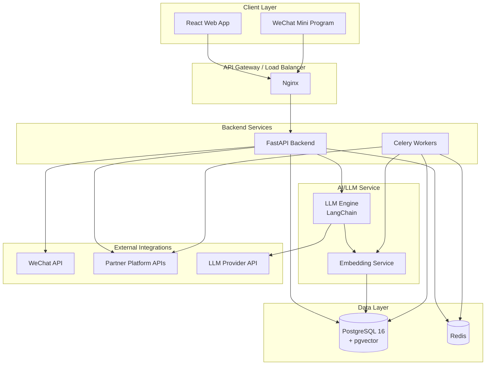
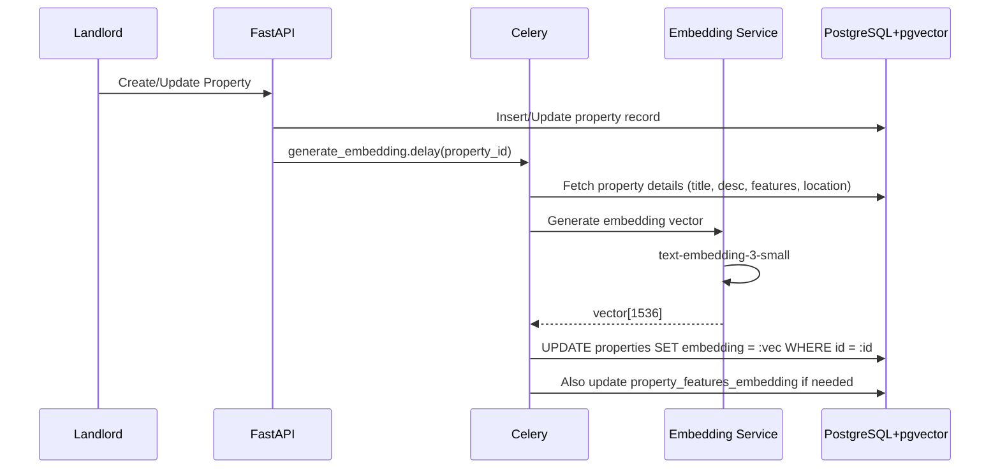
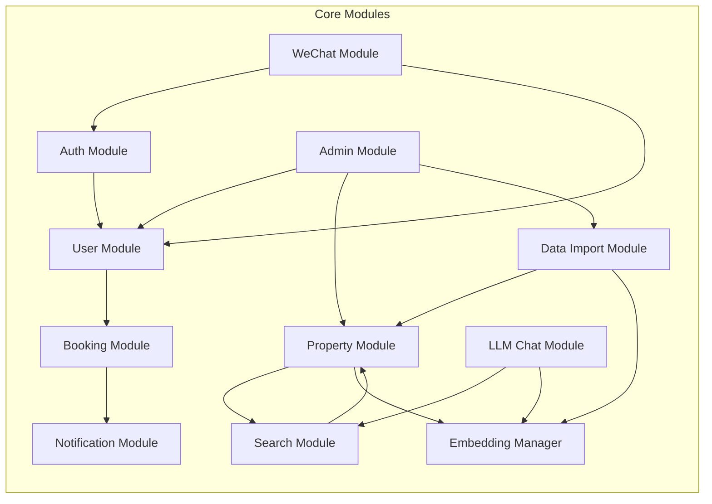
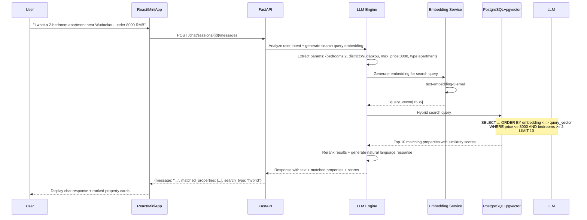
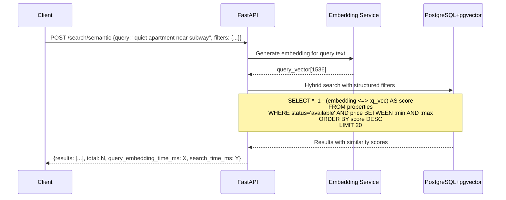
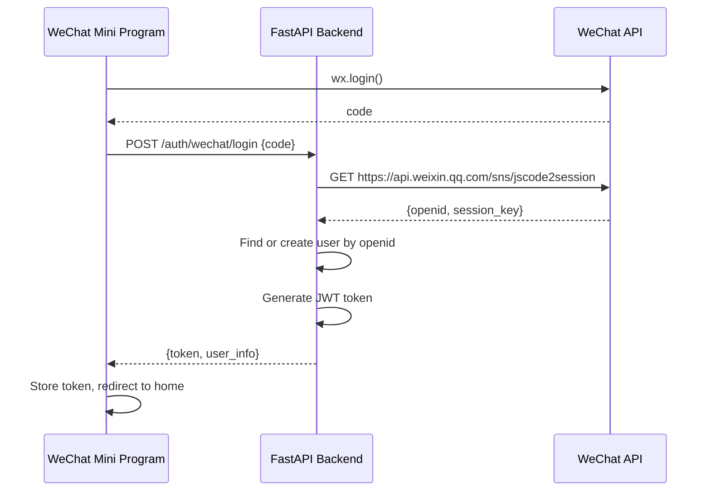
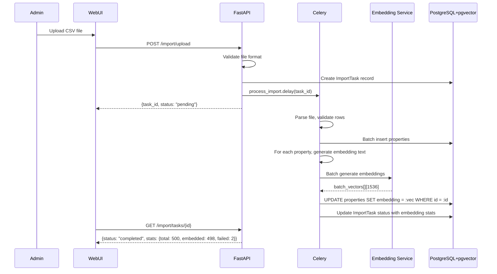
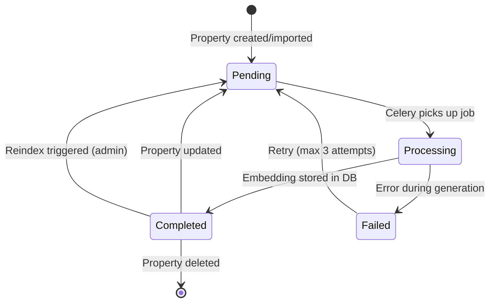

# Rental Housing Matching System - Architecture Plan

## 1. Tech Stack Recommendation

| Layer | Technology | Rationale |
|-------|-----------|-----------|
| **Backend** | Python FastAPI | Async support, automatic OpenAPI docs, Pydantic validation, great for AI/LLM integration |
| **Frontend Web** | Vue 3 + TypeScript + Element Plus | Beginner-friendly, excellent Chinese docs, simpler learning curve, great component library for admin panels |
| **WeChat** | WeChat Mini Program (小程序) | Native WeChat experience, better user retention, supports payments, location, etc. |
| **Database** | PostgreSQL 16 + pgvector | Vector similarity search + relational data in one DB, eliminates need for Elasticsearch |
| **ORM** | SQLAlchemy 2.0 + Alembic | Async support, mature, great migration tooling, pgvector extension support |
| **LLM Integration** | LangChain + OpenAI API / local model | Flexible LLM orchestration, supports multiple providers |
| **Cache** | Redis | Session management, rate limiting, LLM response caching |
| **Task Queue** | Celery + Redis | Async tasks like embedding generation, data import, notification sending |
| **Embedding Model** | text-embedding-3-small (OpenAI) / BGE-M3 (local) | Generate property & query embeddings for semantic search |
| **Deployment** | Docker + Docker Compose | Easy deployment, consistent environments |

### Why PostgreSQL + pgvector over MySQL + Elasticsearch?

| Capability | MySQL + Elasticsearch | PostgreSQL + pgvector |
|------------|----------------------|----------------------|
| **Vector search** | Requires separate ES cluster | Native via pgvector extension |
| **Hybrid search** | Complex coordination between two systems | Single SQL query with `ORDER BY embedding <=> :query_vec` + structured filters |
| **Operational complexity** | Two databases to manage, sync, backup | Single database, simpler ops |
| **ACID compliance** | MySQL yes, ES no | Full ACID across vectors + relational data |
| **LLM context retrieval** | Requires separate pipeline | Direct SQL with vector similarity for RAG |
| **Full-text search** | ES is superior for full-text | PostgreSQL `tsvector`/`tsquery` is adequate for this scale |
| **Cost** | Two systems to run | One system, lower infrastructure cost |

## 2. System Architecture Overview



### Key Data Flow: Property Embedding Generation



## 3. System Modules



### 3.1 Module Descriptions

| Module | Responsibility | Key Features |
|--------|---------------|--------------|
| **Auth Module** | Authentication & Authorization | JWT token auth, WeChat OAuth, role-based access control (RBAC) |
| **User Module** | User management | Tenant profiles, landlord profiles, admin profiles |
| **Property Module** | Property CRUD | Listing management, images, pricing, availability, location |
| **Search Module** | Property search | Hybrid search: vector similarity + structured filters + full-text |
| **LLM Chat Module** | AI-powered conversation | Natural language understanding, intent parsing, property recommendation via vector search |
| **Booking Module** | Appointment/booking | Viewing requests, booking management, status tracking |
| **Admin Module** | System administration | User management, content moderation, system config, audit logs |
| **Data Import Module** | Partner integration | CSV/Excel import, API-based import, data mapping, validation, auto-embedding |
| **WeChat Module** | WeChat integration | Mini Program auth, template messages, payment, customer service |
| **Notification Module** | Notifications | In-app notifications, SMS, email, WeChat template messages |
| **Embedding Manager** | Vector embedding lifecycle | Generate, update, and manage property embeddings; embedding versioning |

## 4. Database Schema Design

### 4.1 Entity Relationship Diagram

```mermaid
erDiagram
    User ||--o{ Property : owns
    User ||--o{ Booking : makes
    User {
        bigint id PK
        string username
        string password_hash
        string phone
        string wechat_openid
        string email
        enum role "tenant|landlord|admin"
        enum status "active|disabled|deleted"
        datetime created_at
        datetime updated_at
    }

    Property ||--o{ PropertyImage : has
    Property ||--o{ Booking : receives
    Property ||--o{ PropertyFeature : has
    Property {
        bigint id PK
        bigint landlord_id FK
        string title
        string description
        string address
        string district
        decimal price_monthly
        decimal area_sqm
        tinyint bedrooms
        tinyint bathrooms
        enum property_type "apartment|house|studio|shared"
        enum status "available|rented|maintenance|offline"
        decimal latitude
        decimal longitude
        vector embedding 1536 "pgvector: property text embedding"
        datetime embedding_updated_at "track embedding freshness"
        datetime created_at
        datetime updated_at
    }

    PropertyImage {
        bigint id PK
        bigint property_id FK
        string url
        int sort_order
        enum type "interior|exterior|floor_plan"
    }

    PropertyFeature {
        bigint id PK
        bigint property_id FK
        string feature_name "e.g., elevator, parking, ac, pet_friendly"
        string feature_value
    }

    Booking {
        bigint id PK
        bigint property_id FK
        bigint tenant_id FK
        datetime viewing_time
        enum status "pending|confirmed|cancelled|completed"
        string message
        datetime created_at
        datetime updated_at
    }

    ChatSession ||--o{ ChatMessage : contains
    ChatSession {
        bigint id PK
        bigint user_id FK
        string session_id
        enum status "active|closed"
        datetime created_at
        datetime updated_at
    }

    ChatMessage {
        bigint id PK
        bigint session_id FK
        enum role "user|assistant|system"
        text content
        json metadata "matched_properties, search_params, vector_search_results"
        datetime created_at
    }

    DataImport {
        bigint id PK
        bigint admin_id FK
        string source_name
        enum source_type "csv|excel|api"
        enum status "pending|processing|completed|failed"
        int total_records
        int success_records
        int failed_records
        text error_log
        datetime created_at
        datetime updated_at
    }

    SystemConfig {
        bigint id PK
        string config_key
        text config_value
        string description
        datetime updated_at
    }

    AuditLog {
        bigint id PK
        bigint user_id FK
        string action
        string entity_type
        bigint entity_id
        text detail
        string ip_address
        datetime created_at
    }

    EmbeddingJob {
        bigint id PK
        bigint property_id FK "nullable for batch jobs"
        enum status "pending|processing|completed|failed"
        enum job_type "single|batch|reindex"
        int batch_size
        text error_message
        datetime created_at
        datetime completed_at
    }
```

### 4.2 pgvector Setup & Indexes

```sql
-- Enable pgvector extension
CREATE EXTENSION IF NOT EXISTS vector;

-- Property embedding column (1536 dimensions for text-embedding-3-small)
ALTER TABLE properties ADD COLUMN embedding vector(1536);
ALTER TABLE properties ADD COLUMN embedding_updated_at TIMESTAMP;

-- Create IVFFlat index for approximate nearest neighbor search
-- (faster than exact search at scale, good for thousands of properties)
CREATE INDEX idx_property_embedding ON properties 
    USING ivfflat (embedding vector_cosine_ops)
    WITH (lists = 100);

-- Alternative: HNSW index for better recall at higher cost
-- CREATE INDEX idx_property_embedding_hnsw ON properties 
--     USING hnsw (embedding vector_cosine_ops);

-- Full-text search index for hybrid search
ALTER TABLE properties ADD COLUMN search_vector tsvector
    GENERATED ALWAYS AS (
        to_tsvector('simple', coalesce(title, '') || ' ' || coalesce(description, ''))
    ) STORED;
CREATE INDEX idx_property_fts ON properties USING GIN (search_vector);

-- Structured query indexes
CREATE INDEX idx_property_status ON properties(status);
CREATE INDEX idx_property_district ON properties(district);
CREATE INDEX idx_property_price ON properties(price_monthly);
CREATE INDEX idx_property_type_status ON properties(property_type, status);
CREATE INDEX idx_property_location ON properties(latitude, longitude);

-- User indexes
CREATE INDEX idx_user_phone ON users(phone);
CREATE INDEX idx_user_wechat ON users(wechat_openid);
CREATE INDEX idx_user_role ON users(role);

-- Booking indexes
CREATE INDEX idx_booking_tenant ON bookings(tenant_id);
CREATE INDEX idx_booking_property ON bookings(property_id);
CREATE INDEX idx_booking_status ON bookings(status);

-- Embedding job indexes
CREATE INDEX idx_embedding_job_status ON embedding_jobs(status);
CREATE INDEX idx_embedding_job_property ON embedding_jobs(property_id);
```

### 4.3 Hybrid Search Query Example

```sql
-- Hybrid search: vector similarity + structured filters + full-text
SELECT 
    p.id,
    p.title,
    p.description,
    p.price_monthly,
    p.district,
    p.bedrooms,
    -- Cosine similarity score (lower = more similar)
    1 - (p.embedding <=> :query_embedding) AS vector_score,
    -- Full-text search rank
    ts_rank(p.search_vector, plainto_tsquery('simple', :query_text)) AS fts_score,
    -- Combined score (weighted)
    (0.7 * (1 - (p.embedding <=> :query_embedding)) + 
     0.3 * ts_rank(p.search_vector, plainto_tsquery('simple', :query_text))) AS combined_score
FROM properties p
WHERE 
    p.status = 'available'
    AND p.price_monthly BETWEEN :min_price AND :max_price
    AND p.district = ANY(:districts)
    AND p.bedrooms >= :min_bedrooms
    AND p.embedding IS NOT NULL
ORDER BY combined_score DESC
LIMIT 20;
```

## 5. API Structure Design

### 5.1 RESTful API Endpoints

```
# Authentication
POST   /api/v1/auth/login                    # Login
POST   /api/v1/auth/register                 # Register
POST   /api/v1/auth/refresh                  # Refresh token
POST   /api/v1/auth/wechat/login             # WeChat Mini Program login

# Users
GET    /api/v1/users/me                      # Get current user profile
PUT    /api/v1/users/me                      # Update profile
GET    /api/v1/users/{id}                    # Get user (admin)
GET    /api/v1/users                         # List users (admin)
PUT    /api/v1/users/{id}/status             # Update user status (admin)

# Properties
GET    /api/v1/properties                    # List properties (with filters)
POST   /api/v1/properties                    # Create property (landlord)
GET    /api/v1/properties/{id}               # Get property detail
PUT    /api/v1/properties/{id}               # Update property (landlord)
DELETE /api/v1/properties/{id}               # Delete property (landlord/admin)
POST   /api/v1/properties/{id}/images        # Upload images
DELETE /api/v1/properties/{id}/images/{img}  # Delete image
PUT    /api/v1/properties/{id}/status        # Update status (landlord/admin)
POST   /api/v1/properties/{id}/reindex       # Regenerate embedding for property

# LLM Chat
POST   /api/v1/chat/sessions                 # Create chat session
POST   /api/v1/chat/sessions/{id}/messages   # Send message & get response
GET    /api/v1/chat/sessions                 # List user's chat sessions
GET    /api/v1/chat/sessions/{id}/messages   # Get chat history
DELETE /api/v1/chat/sessions/{id}            # Close session

# Search
GET    /api/v1/search                        # Search properties (traditional)
GET    /api/v1/search/suggestions            # Search suggestions
POST   /api/v1/search/semantic               # Semantic/vector search
POST   /api/v1/search/hybrid                 # Hybrid search (vector + structured + FTS)
POST   /api/v1/search/llm                    # LLM-powered search

# Bookings
POST   /api/v1/bookings                      # Create booking request
GET    /api/v1/bookings                      # List user's bookings
GET    /api/v1/bookings/{id}                 # Get booking detail
PUT    /api/v1/bookings/{id}/status          # Update booking status
DELETE /api/v1/bookings/{id}                 # Cancel booking

# Data Import
POST   /api/v1/import/upload                 # Upload import file
POST   /api/v1/import/api                    # Configure API import
GET    /api/v1/import/tasks                  # List import tasks
GET    /api/v1/import/tasks/{id}             # Get import task detail

# Embedding Management (Admin)
POST   /api/v1/admin/embeddings/reindex      # Reindex all property embeddings
GET    /api/v1/admin/embeddings/status       # Get embedding job status
POST   /api/v1/admin/embeddings/version      # Switch embedding model version

# Admin
GET    /api/v1/admin/dashboard               # Dashboard stats
GET    /api/v1/admin/audit-logs              # Audit logs
GET    /api/v1/admin/config                  # Get system config
PUT    /api/v1/admin/config                  # Update system config

# Notifications
GET    /api/v1/notifications                 # List notifications
PUT    /api/v1/notifications/{id}/read       # Mark as read
GET    /api/v1/notifications/unread-count    # Unread count
```

### 5.2 LLM Chat + pgvector Integration - Detailed Design

The core AI interaction flow now uses pgvector for semantic property retrieval:



### 5.3 Semantic Search API - Detailed Design



## 6. Frontend Architecture

### 6.1 Web Frontend (Vue 3 + TypeScript + Element Plus)

```
src/
├── components/              # Shared components (.vue files)
│   ├── layout/             # App layout, sidebar, header (Element Plus Container)
│   ├── property/           # Property card, detail, form
│   ├── chat/               # Chat bubble, input, session list
│   ├── search/             # Semantic search bar, filter panel, similarity badge
│   ├── common/             # Loading, error, empty states
│   └── admin/              # Admin-specific components
├── views/                   # Page views (Vue Router pages)
│   ├── home/               # Landing page
│   ├── search/             # Traditional + semantic search page
│   ├── chat/               # LLM chat page
│   ├── property/           # Property detail, create, edit
│   ├── booking/            # Booking management
│   ├── auth/               # Login, register
│   ├── admin/              # Admin dashboard, user mgmt, config, embedding mgmt
│   └── import/             # Data import pages
├── composables/            # Vue composables (reusable stateful logic, like React hooks)
├── services/               # API client (axios)
├── stores/                 # Pinia stores (state management, simpler than Vuex)
├── types/                  # TypeScript type definitions
├── utils/                  # Utility functions
├── router/                 # Vue Router configuration
└── assets/                 # Static assets (images, styles)
```

### 6.2 Route Design

```typescript
// Vue Router with lazy loading and route meta for auth/roles
import { createRouter, createWebHistory } from 'vue-router'

const routes = [
  { path: '/', name: 'home', component: () => import('@/views/home/HomePage.vue') },
  { path: '/login', name: 'login', component: () => import('@/views/auth/LoginPage.vue') },
  { path: '/register', name: 'register', component: () => import('@/views/auth/RegisterPage.vue') },
  { path: '/chat', name: 'chat', component: () => import('@/views/chat/ChatPage.vue'), meta: { requiresAuth: true } },
  { path: '/properties', name: 'property-list', component: () => import('@/views/property/PropertyListPage.vue') },
  { path: '/properties/:id', name: 'property-detail', component: () => import('@/views/property/PropertyDetailPage.vue') },
  { path: '/properties/create', name: 'property-create', component: () => import('@/views/property/PropertyCreatePage.vue'), meta: { roles: ['landlord'] } },
  { path: '/properties/:id/edit', name: 'property-edit', component: () => import('@/views/property/PropertyEditPage.vue'), meta: { roles: ['landlord'] } },
  { path: '/bookings', name: 'booking-list', component: () => import('@/views/booking/BookingListPage.vue'), meta: { requiresAuth: true } },
  { path: '/bookings/:id', name: 'booking-detail', component: () => import('@/views/booking/BookingDetailPage.vue'), meta: { requiresAuth: true } },
  { path: '/admin', name: 'admin-dashboard', component: () => import('@/views/admin/AdminDashboard.vue'), meta: { roles: ['admin'] } },
  { path: '/admin/users', name: 'admin-users', component: () => import('@/views/admin/AdminUserList.vue'), meta: { roles: ['admin'] } },
  { path: '/admin/properties', name: 'admin-properties', component: () => import('@/views/admin/AdminPropertyList.vue'), meta: { roles: ['admin'] } },
  { path: '/admin/import', name: 'admin-import', component: () => import('@/views/admin/AdminImportPage.vue'), meta: { roles: ['admin'] } },
  { path: '/admin/config', name: 'admin-config', component: () => import('@/views/admin/AdminConfigPage.vue'), meta: { roles: ['admin'] } },
  { path: '/admin/logs', name: 'admin-logs', component: () => import('@/views/admin/AdminAuditLogs.vue'), meta: { roles: ['admin'] } },
  { path: '/admin/embeddings', name: 'admin-embeddings', component: () => import('@/views/admin/AdminEmbeddingPage.vue'), meta: { roles: ['admin'] } },
];
```

### 6.3 WeChat Mini Program Pages

```
pages/
├── index/                  # Home page
├── chat/                   # LLM chat page
├── search/                 # Search results (semantic + filters)
├── property/               # Property detail
├── property/create/        # Create listing
├── property/edit/          # Edit listing
├── booking/                # My bookings
├── profile/                # User profile
└── admin/                  # Admin pages (if needed)
```

## 7. WeChat Integration Design

### 7.1 WeChat Mini Program Features

| Feature | Description |
|---------|-------------|
| **WeChat Login** | Use `wx.login()` to get code, exchange for openid/session_key |
| **Property Browsing** | Browse listings with map integration + semantic search |
| **LLM Chat** | AI-powered rental assistant with pgvector-powered recommendations |
| **Booking** | Schedule property viewings |
| **Template Messages** | Booking confirmation, reminder notifications |
| **Customer Service** | WeChat customer service message integration |
| **Location** | Get user location for nearby property search |
| **Payment** | Optional: deposit/rent payment via WeChat Pay |

### 7.2 Authentication Flow



## 8. Data Import Module Design

### 8.1 Import Sources

| Source Type | Method | Description |
|-------------|--------|-------------|
| **CSV/Excel** | File upload | Upload structured files with property data |
| **API Integration** | REST API | Partner platforms push data via API |
| **Manual Entry** | Web form | Landlord enters property details manually |

### 8.2 Import Flow with Auto-Embedding



## 9. Embedding Strategy

### 9.1 What Gets Embedded

| Entity | Embedding Source Text | Dimensions | Model |
|--------|----------------------|------------|-------|
| **Property** | `title + description + features + district + property_type` | 1536 | text-embedding-3-small |
| **Search Query** | User's natural language query | 1536 | text-embedding-3-small |
| **Chat Message** | User's message in LLM chat | 1536 | text-embedding-3-small |

### 9.2 Embedding Text Construction

```python
def build_property_embedding_text(property: Property) -> str:
    """Construct the text to be embedded for a property."""
    parts = [
        property.title,
        property.description,
        f"Location: {property.district}, {property.address}",
        f"Type: {property.property_type}",
        f"Size: {property.area_sqm} sqm, {property.bedrooms} bed, {property.bathrooms} bath",
        f"Price: {property.price_monthly} RMB/month",
    ]
    # Add features
    features = [f.feature_name.replace("_", " ") + ": " + f.feature_value 
                for f in property.features]
    if features:
        parts.append("Features: " + ", ".join(features))
    
    return ". ".join(parts)
```

### 9.3 Embedding Lifecycle



## 10. Implementation Roadmap

### Phase 1: Foundation (Weeks 1-2)
- [ ] Project scaffolding (FastAPI project structure, Vue 3 app with Vite, Docker setup)
- [ ] PostgreSQL 16 setup with pgvector extension
- [ ] Alembic migrations with pgvector support
- [ ] User authentication (JWT + WeChat OAuth)
- [ ] User CRUD (register, login, profile)

### Phase 2: Core Features (Weeks 3-4)
- [ ] Property CRUD (create, read, update, delete)
- [ ] Property image upload (local/CDN storage)
- [ ] Property search (basic filters: price, location, type, bedrooms)
- [ ] Property detail page
- [ ] **pgvector column + IVFFlat index setup**

### Phase 3: Embedding Pipeline (Week 5)
- [ ] Embedding service integration (OpenAI text-embedding-3-small)
- [ ] Celery task: auto-generate embedding on property create/update
- [ ] Celery task: batch reindex all properties
- [ ] Embedding job tracking (EmbeddingJob model)
- [ ] Admin embedding management page (status, reindex trigger)

### Phase 4: Semantic & Hybrid Search (Week 6)
- [ ] Semantic search endpoint (`POST /search/semantic`)
- [ ] Hybrid search endpoint (`POST /search/hybrid`) - vector + structured + FTS
- [ ] Search result ranking with combined scores
- [ ] Frontend search UI with semantic toggle
- [ ] Similarity score display on property cards

### Phase 5: LLM Chat with pgvector (Weeks 7-8)
- [ ] LLM integration setup (LangChain + OpenAI API)
- [ ] Chat session management
- [ ] Natural language to search query conversion
- [ ] **pgvector-powered property recommendation in chat**
- [ ] RAG: retrieve similar properties as LLM context
- [ ] Chat history with embedding metadata
- [ ] Property recommendation display in chat

### Phase 6: Booking & Notifications (Week 9)
- [ ] Booking request flow
- [ ] Booking status management
- [ ] Notification system (in-app + WeChat template messages)

### Phase 7: Admin Panel (Week 10)
- [ ] Admin dashboard with statistics
- [ ] User management
- [ ] Property moderation
- [ ] Embedding management (reindex, status, versioning)
- [ ] System configuration
- [ ] Audit logs

### Phase 8: Data Import (Week 11)
- [ ] CSV/Excel import
- [ ] API-based import for partner platforms
- [ ] Import validation and error handling
- [ ] **Auto-embedding generation during import**
- [ ] Import history and reporting

### Phase 9: WeChat Mini Program (Week 12)
- [ ] Mini Program project setup
- [ ] WeChat login integration
- [ ] Property browsing pages
- [ ] LLM chat page with semantic search
- [ ] Booking pages
- [ ] Template messages

### Phase 10: Polish & Deployment (Week 13)
- [ ] Error handling and logging
- [ ] Performance optimization (pgvector index tuning)
- [ ] Security audit
- [ ] Docker deployment configuration
- [ ] CI/CD pipeline setup
- [ ] Documentation

## 11. Project Directory Structure

```
rental-housing-system/
├── backend/
│   ├── app/
│   │   ├── api/
│   │   │   ├── v1/
│   │   │   │   ├── auth.py
│   │   │   │   ├── users.py
│   │   │   │   ├── properties.py
│   │   │   │   ├── chat.py
│   │   │   │   ├── search.py
│   │   │   │   ├── bookings.py
│   │   │   │   ├── import.py
│   │   │   │   └── admin.py
│   │   │   └── deps.py
│   │   ├── core/
│   │   │   ├── config.py
│   │   │   ├── security.py
│   │   │   └── database.py
│   │   ├── models/
│   │   │   ├── user.py
│   │   │   ├── property.py
│   │   │   ├── chat.py
│   │   │   ├── booking.py
│   │   │   ├── import.py
│   │   │   └── embedding.py        # NEW: EmbeddingJob model
│   │   ├── schemas/
│   │   │   ├── user.py
│   │   │   ├── property.py
│   │   │   ├── chat.py
│   │   │   ├── search.py           # NEW: Search request/response schemas
│   │   │   ├── booking.py
│   │   │   └── import.py
│   │   ├── services/
│   │   │   ├── auth_service.py
│   │   │   ├── property_service.py
│   │   │   ├── chat_service.py
│   │   │   ├── llm_service.py
│   │   │   ├── search_service.py   # UPDATED: Hybrid search with pgvector
│   │   │   ├── embedding_service.py # NEW: Embedding generation & management
│   │   │   ├── booking_service.py
│   │   │   ├── import_service.py
│   │   │   ├── wechat_service.py
│   │   │   └── notification_service.py
│   │   └── tasks/
│   │       ├── import_tasks.py
│   │       ├── notification_tasks.py
│   │       └── embedding_tasks.py  # NEW: Celery tasks for embedding generation
│   ├── alembic/
│   │   └── versions/
│   │       └── 001_initial_pgvector.py  # NEW: pgvector migration
│   ├── tests/
│   │   ├── test_search.py          # NEW: Test hybrid search
│   │   └── test_embedding.py       # NEW: Test embedding pipeline
│   ├── requirements.txt
│   ├── Dockerfile
│   └── docker-compose.yml
├── frontend/
│   ├── src/
│   │   ├── components/          # Vue SFC components
│   │   ├── views/               # Page views
│   │   ├── composables/         # Vue composables
│   │   ├── services/            # API client (axios)
│   │   ├── stores/              # Pinia stores
│   │   ├── types/               # TypeScript type definitions
│   │   ├── utils/               # Utility functions
│   │   ├── router/              # Vue Router config
│   │   ├── assets/              # Static assets
│   │   ├── App.vue              # Root component
│   │   └── main.ts              # Entry point
│   ├── public/
│   ├── index.html
│   ├── package.json
│   ├── tsconfig.json
│   ├── vite.config.ts           # Vite config
│   └── Dockerfile
├── wechat-miniprogram/
│   ├── pages/
│   ├── components/
│   ├── utils/
│   ├── app.js
│   ├── app.json
│   └── project.config.json
├── docs/
│   ├── api.md
│   ├── database.md
│   └── deployment.md
└── README.md
```

## 12. Key Technical Decisions

### Why PostgreSQL + pgvector over MySQL + Elasticsearch?
- **Single database** - simpler operations, backups, and consistency
- **Hybrid search in one query** - combine vector similarity with structured SQL filters
- **ACID for embeddings** - property updates and embedding generation are transactional
- **Lower infrastructure cost** - no separate ES cluster to maintain
- **Sufficient for this scale** - pgvector handles thousands to millions of vectors efficiently

### Why text-embedding-3-small (1536 dimensions)?
- **Cost-effective** - 1/10th the cost of text-embedding-3-large
- **Good quality** - sufficient for property matching use case
- **Standard dimensionality** - well-supported by pgvector
- **Fallback option** - BGE-M3 (local, free) can be used for development/testing

### Why IVFFlat index over HNSW?
- **Faster index creation** - IVFFlat builds much faster than HNSW
- **Good enough recall** - with proper `lists` tuning, recall > 99% is achievable
- **Lower memory usage** - IVFFlat uses less RAM
- **HNSW as upgrade path** - can switch to HNSW when dataset grows beyond 100K properties

### Why Celery for embedding tasks?
- **Embedding generation is I/O-bound** - calling external LLM APIs is slow, should not block API responses
- **Batch processing** - can batch multiple embedding requests for efficiency
- **Retry logic** - failed embeddings can be retried automatically
- **Reindex operations** - full reindex of all properties can run as background job

### Why Vue 3 + Element Plus over React?
- **Beginner-friendly** - Vue's template syntax with `v-if`, `v-for`, `v-model` is more intuitive than JSX for new learners
- **Excellent Chinese documentation** - Vue 3, Element Plus, and Pinia all have comprehensive Chinese docs and active Chinese community
- **Element Plus** - mature Vue 3 component library with ready-made admin layouts, tables, forms, dialogs, and pagination
- **Composition API with `<script setup>`** - clean, concise component code with less boilerplate than React hooks
- **Single-File Components** - template, script, and CSS in one `.vue` file reduces context switching
- **Pinia** - official Vue state management, simpler API than Redux/Zustand, with full TypeScript support
- **Vite** - fast HMR dev server, Vue is the primary target framework for Vite
- **Lower learning curve** - Vue's reactivity system is more transparent, easier to debug for beginners

## 13. Security Considerations

- **JWT tokens** with refresh token rotation
- **Rate limiting** on API endpoints (especially LLM chat and embedding generation)
- **Input sanitization** for all user inputs
- **File upload validation** (type, size, virus scanning)
- **RBAC** - role-based access control for all endpoints
- **HTTPS** enforced in production
- **SQL injection prevention** via ORM
- **XSS protection** via Vue's built-in template escaping (mustache syntax auto-escapes)
- **CORS** configured for specific origins only
- **Audit logging** for all admin actions
- **Embedding API key management** - secure storage of OpenAI/LLM API keys
